# 一、

在磁盘上存储数据的排列方式会影响I/O服务的总时间。假设每磁道划分成10个物理块，每块存放1个逻辑记录。逻辑记录R1，R2，…，R10存放在同一个磁道上，记录的安排顺序如下表所示：

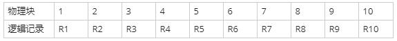

假定磁盘的旋转速度为30ms/周，磁头当前处在R1的开始处。若系统顺序处理这些记录，使用单缓冲区，每个记录处理时间为6ms，则处理这10个记录的最长时间为（  ）；若对信息存储进行优化分布后，处理10个记录的最少时间为（  ）。

问题1选项
A.189ms
B.208ms
C.289ms
D.306ms

问题2选项
A.60ms
B.90ms
C.109ms
D.180ms

## 答案

第1题:D

第2题:B

## 解析

第1题:本题是一个较为复杂的磁盘原理问题，我们可以通过模拟磁盘的运行来进行分析求解。运作过程为：
1、读取R1：耗时3ms。读取完，磁头位于R2的开始位置。
2、处理R1：耗时6ms。处理完，磁头位于R4的开始位置。
3、旋转定位到R2开始位置：耗时24ms。
4、读取R2：耗时3ms。读取完，磁头位于R3的开始位置。
5、处理R2：耗时6ms。处理完，磁头位于R5的开始位置。
6、旋转定位到R3开始位置：耗时24ms。
……
从以上分析可以得知，读取并处理R1一共需要9毫秒。而从R2开始，多了一个旋转定位时间，R2旋转定位到读取并处理一共需要33毫秒，后面的R3至R10与R2的情况一致。所以一共耗时：
9+33×9=306毫秒。
本题后面一问要求计算处理10个记录的最少时间。其实只要把记录间隔存放，就能达到这个目标。在物理块1中存放R1，在物理块4中存放R2，在物理块7中存放R3，依此类推，这样可以做到每条记录的读取与处理时间之和均为9ms，所以处理10条记录一共为90ms。

## 视频讲解

https://dpv.videocc.net/060fd1513e/1/060fd1513e6a5b3ae9d114886b1333d1_1.mp4?pid=1692280642414X1467521

# 二

## 题目

某计算机系统输入/输出采用双缓冲工作方式，其工作过程如下图所示，假设磁盘块与缓冲区大小相同，每个盘块读入缓冲区的时间T为10μs，由缓冲区送至用户区的时间M为6μs，系统对每个磁盘块数据的处理时间C为2μs。若用户需要将大小为10个磁盘块的Doc1文件逐块从磁盘读入缓冲区，并送至用户区进行处理，那么采用双缓冲需要花费的时间为（  ）μs，比使用单缓冲节约了（  ）μs时间。

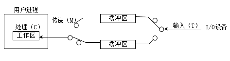

问题1选项
A.100
B.108
C.162
D.180

问题2选项
A.0
B.8
C.54
D.62

## 答案

第1题:B

第2题:C

## 解析

单缓冲区和双缓冲区都使用的是流水线技术，所以用流水线计算公式算就可以。计算流水线执行时间的理论公式是：第一条指令顺序执行时间+（指令条数-1）*周期，而周期是取各节点的最大处理时长。在本题中，单缓冲区的传送数据和输入数据是绑定在一起的，所以需要把它们结合起来视为流水线周期，构造成流水线后，整个过程划分为2个阶段，分别是16μs，2μs，根据流水线执行公式，流水线执行时间为：16μs+2μs+（10-1）*16μs=162μs。 而对于双缓冲区来说，它们有多余的缓冲区可以进行单独的传送和输入数据。读入缓冲区和由缓冲区送至用户区可以并行处理，对于这里构造成流水线后，整个过程划分为3个阶段，1、从磁盘读入到缓冲区（10μs）；2、从缓冲区读入到（内存）用户区（6μs）；3、处理（内存）用户区数据（2μs）。根据流水线执行公式，流水线执行时间为：10μs+6μs+2μs+（10-1）*10μs=108μs。

## 视频讲解

https://hls.videocc.net/060fd1513e/2/060fd1513ebbbf7411ecd405842c25a2_1.m3u8?pid=1692281028498X1445144&device=desktop

# 三、

某计算机系统页面大小为4K ，进程的页面变换表如下所示。若进程的逻辑地址为2D16H。该地址经过变换后，其物理地址应为（  ）。

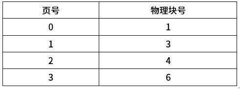

选项
A.2048H
B.4096H
C.4D16H
D.6D16H

## 答案

C

## 解析

2D16H中，H表示是16进制。

页面大小为4K，4K=2^12，说明页内地址有12位，也就是3位16进制数，所以16进制数中的D16H是页内地址，逻辑页号则为2。查表可知物理块号为4，所以物理地址为4D16H。

## 视频解析

https://hls.videocc.net/060fd1513e/1/060fd1513e2196cdd62ed15fea4872b1_2.m3u8?pid=1692283021296X1034737&device=desktop

# 四

## 题目

以下关于计算机内存管理的描述中，（）属于段页式内存管理的描述。

A.一个程序就是一段，使用基址极限对来进行管理
B.一个程序分为许多固定大小的页面，使用页表进行管理
C.程序按逻辑分为多段，每一段内又进行分页，使用段页表来进行管理
D.程序按逻辑分成多段，用一组基址极限对来进行管理。 基址极限对存放在段表里

## 答案

C

## 解析

本题考查的是段页式存储的基本概念。

段页式存储管理方式即先将用户程序分成若干个段，再把每个段分成若干个页，并为每一个段赋予一个段名，使用段页表来进行管理。所以正确答案为C选项。选项A的管理方法属于段式管理；选项B的管理方法属于页式管理；选项D 描述错误，用一组基址极限对来进行管理是对段的管理

## 视频解析

https://hls.videocc.net/060fd1513e/f/060fd1513e9fa4523bae2a274c58b99f_1.m3u8?pid=1692284486511X1945736&device=desktop

# 五

## 题目

进程P有8个页面，页号分别为0～7，页面大小为4K ，假设系统给进程P分配了4个存储块，进程P的页面变换表如下所示。表中状态位等于1和0分别表示页面在内存和不在内存。若进程P要访问的逻辑地址为十六进制 5148H，则该地址经过变换后， 其物理地址应为十六进制（  ）；如果进程P要访问的页面6不在内存，那么应该淘汰页号为（  ）的页面。

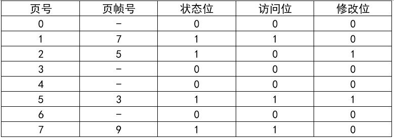

问题1选项
A.3148H
B.5148H
C.7148H
D.9148H

问题2选项
A.1
B.2
C.5
D.9

## 答案

第1题:A

第2题:B

## 解析

本题考查操作系统存储管理方面的基础知识。
试题第一空的正确选项为A。
根据题意，页面大小为4K，逻辑地址为十六进制5148H其页号为5，页内地址为148H，查页表后可知页帧号（物理块号）为3，该地址经过变换后，其物理地址应为页帧号3拼上页内地址148H，即十六进制3148H。
试题第二空的正确选项为B。根据题意，首先，查看表格，没有页号为9的页面，排除D选项，

然后，因为页面变换表中状态位等于1和0分别表示页面在内存或不在内存，所以1、2、5和7号页面在内存。当访问的页面6不在内存时，

系统应该首先淘汰未被访问的页面，因为根据程序的局部性原理，最近未被访问的页面下次被访问的概率更小；

如果页面最近都被访问过，应该先淘汰未修改过的页面，因为未修改过的页面内存与辅存一致，故淘汰时无须写回辅存，使系统页面置换代价更小。

经上述分析，1、5和7号页面都是最近被访问过的，但2号页面最近未被访问过，故应该淘汰2号页面。

## 视频解析

https://hls.videocc.net/060fd1513e/8/060fd1513e6ff829cd324b908b205188_1.m3u8?pid=1692627120630X1140145&device=desktop

# 六

## 题目

假设系统采用段式存储管理方法，进程P的段表如下所示。逻辑地址（）不能转换为对应的物理地址；不能转换为对应的物理地址的原因是进行（）。

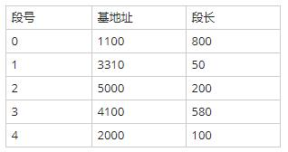

（1）

A．(0,790)和(2,88)
B．(1,30)和(3,290)
C．(2,88)和(4,98)
D．(0,810)和(4,120)
（2）

A．除法运算时除数为零
B．算术运算时有溢出
C．逻辑地址到物理地址转换时地址越界
D．物理地址到逻辑地址转换时地址越界

## 答案

1:D

2:C

## 解析

在段式存储中，逻辑地址和物理地址的转换方式：通过逻辑地址段号，找到基地址，然后加上逻辑地址的偏移量得到最终的物理地址。

逻辑地址（0，810）不能转换成对应的物理地址，原因是：0号段的段长为800，而此逻辑地址偏移量为810，已超出段长，所以越界。逻辑地址（4，120）存在同样的问题。

## 视频解析

https://hls.videocc.net/060fd1513e/1/060fd1513e420ccc67beb4764128cb41_1.m3u8?pid=1692626833281X1179117&device=desktop

# 七

## 题目

某操作系统采用分页存储管理方式，下图给出了进程A和进程B的页表结构。如果物理页的大小为512字节，那么进程A逻辑地址为1111（十进制）的变量存放在（  ）号物理内存页中。假设进程A的逻辑页4与进程B的逻辑页5要共享物理页8，那么应该在进程A页表的逻辑页4和进程B页表的逻辑页5对应的物理页处分别填（  ）。

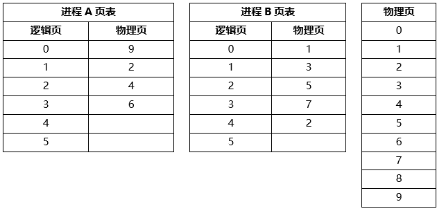

问题1选项
A.9
B.2
C.4
D.6

问题2选项
A.4、5
B.5、4
C.5、8
D.8、8

## 答案

第1题:C

第2题:D

## 解析

第1题:

十进制数1111转化为二进制数为：10001010111。物理页的大小为512字节（512=2^9），这说明页内地址为9个二进制位，进程A的逻辑地址中，右边的9位是页内地址，左边的2位是页号，即：10 001010111。页号为二进制的10，即十进制的2，对应的物理页号为4。

第2题:

 若进程A页表的逻辑页4和进程B页表的逻辑页5要共享物理页8，则说明它们都对应物理页8，所以均填8。

## 视频解析

https://hls.videocc.net/060fd1513e/b/060fd1513e09727188caf58189e6700b_1.m3u8?pid=1692627367491X1081633&device=desktop

# 八

## 题目

以下关于鸿蒙操作系统的叙述中，不正确的是（  ）。

问题1选项
A.鸿蒙操作系统整体架构采用分层的层次化设计，从下向上依次为：内核层、系统服务层、框架层和应用层
B.鸿蒙操作系统内核层采用宏内核设计，拥有更强的安全特性和低时延特点
C.鸿蒙操作系统架构采用了分布式设计理念，实现了分布式软总线、分布式设备虚拟化、分布式数据管理和分布式任务调度等四种分布式能力
D.架构的系统安全性主要体现在搭载HarmonyOS的分布式终端上，可以保证“正确的人，通过正确的设备，正确地使用数据”

## 答案

HarmonyOS系统架构整体上遵从分层设计，从下向上分为内核层、系统服务层、框架层和应用层。

HarmonyOS系统功能按照“系统->子系统->功能/模块”逐步逐级展开，在多设备部署场景下，支持根据实际需求裁剪或增加子系统或功能/模块。

内核层：鸿蒙系统分为内核子系统和驱动子系统。在内核子系统中鸿蒙系统采用多内核设计，支持针对不同资源受限设备选用合适的OS内核；鸿蒙系统驱动框架是鸿蒙系统硬件生态开放的基础，它提供统一外设访问能力和驱动开发、管理框架。
系统服务层：系统服务层是鸿蒙系统的核心能力集合，通过框架层对应用程序提供服务。包含了系统基本能力子系统集、基础软件服务子系统集、增强软件服务子系统集、硬件服务子系统四个部分。
框架层：框架层为鸿蒙系统应用程序提供Java/C/C++/JS等多语言用户程序框架和Ability框架，及各种软硬件服务对外开放的多语言框架API，也为搭载鸿蒙系统的电子设备提供C/C++/JS等多语言框架API。
应用层：应用层包括系统应用和第三方非系统应用，鸿蒙系统应用由一个或多个FA或PA组成。

系统安全：在搭载鸿蒙系统的分布式终端上可保证正确的人通过正确的电子设备，正确地使用数据。通过分布式多段协同身份认证保证“正确的人”通过在分布式终端构筑可信运行环境保证“正确的电子设备”通过分布式数据在跨终端流动的过程中，对数据进行分类分级管理来保证“正确地使用数据”。
综上，B选项说法错误。

# 九

## 题目

**实时操作系统主要用于有实时要求的过程控制等领域..实时系统对于来自外部的事件必须在 （）**

A.  一个时间片内进行处理

B.  一个周转时间内进行处理

C.  一个机器周期内进行处理

D.  被控对象规定的时间内做出及时响应并对其进行处理

## 答案

D

## 解析

实时操作系统是保证在一定时间限制内完成特定功能的操作系统。

实时操作系统有硬实时和软实时之分，硬实时要求在规定的时间内必须完成操作，这是在操作系统设计时保证的；软实时则只要按照任务的优先级，尽可能的完成操作即可。

# 十

## 题目

某嵌入式实时操作系统采用了某种调度算法，当某任务执行接近自己的截止期(deadline)时，调度算法将把该任务的优先级调整到系统最高优先级，让该任务获取CPU资源运行。请问此类调度算法是（  ）。

A.优先级调度算法        B.抢占式优先级调度算法

C.最晚截止期调度算法    D.最早截止期调度算法

## 答案

C

## 解析

实时系统存在多种调度算法：

选项优先级调度算法：系统为每个任务分配一个相对固定的优先顺序，然后调度程序根据优先级的高低排序，按时间顺序进行高优先级任务优先调度

选项抢占式优先级调度算法：是在优先级算法基础上，允许高优先级任务抢占低优先级任务运行。

最晚截止期调度算法：指调度程序按每个任务的最接近其截止期末端的时间进行调度

最早截止期调度算法：指调度程序按每个任务的截止期时间，选择最早到截止期的头端时间的任务进行调度

# 十一

## 题目

混成系统是嵌入式实时系统的一种重要的子类。以下关于混成系统的说法中，正确的是（  ）。 

问题1选项
A.混成系统一般由离散分离组件并行组成，组件之间的行为由计算模型进行控制
B.混成系统一般由离散分离组件和连续组件并行或串行组成 ，组件之间的行为由计算模型进行控制
C.混成系统一般由连续组件串行组成，组件之间的行为由计算模型进行控制
D.混成系统一般由离散分离组件和连续组件并行或串行组成，组件之间的行为由同步/异步事件进行管理

## 答案

B

## 解析

混成系统：一般由离散分离组件和连续组件并行或串行组成，组件之间的行为由计算模型进行控制。

## 视频解析

https://hls.videocc.net/060fd1513e/2/060fd1513edf09269acc1299df68fb22_1.m3u8?pid=1693138678698X1802694&device=desktop

# 十二

## 题目

嵌入式系统设计一般要考虑低功耗， 软件设计也要考虑低功耗设计，软件低功耗设计一般采用（ ）。

问题1选项
A.结构优化、编译优化和代码优化
B.软硬件协同设计、开发过程优化和环境设计优化
C.轻量级操作系统、算法优化和仿真实验
D.编译优化技术、软硬件协同设计和算法优化

## 答案

D

## 解析

软件设计层面的功耗控制主要可以从以下方面展开：
1、软硬件协同设计，即软件的设计要与硬件匹配，考虑硬件因素。
2、编译优化，采用低功耗优化的编译技术。
3、减少系统的持续运行时间，可从算法角度进行优化。
4、用“中断”代替“查询”。
5、进行电源的有效管理。

# 十三

## 题目

以下关于 RTOS （实时操作系统）的叙述中，不正确的是（）

A.RTOS 不能针对硬件变化进行结构与功能上的配置及裁剪

B.RTOS 可以根据应用环境的要求对内核进行裁剪和重配

C.RTOS 的首要任务是调度一切可利用的资源来完成实时控制任务

D.RTOS 实质上就是一个计算机资源管理程序，需要及时响应实时事件和中断

## 答案

A

## 解析

实时操作系统（RTOS）是指**当外界事件或数据产生时**，能够接受并以足够快的速度予以处理，其处理的结果又能在规定的时间之内来控制生产过程或对处理系 统作出快速响应，并**控制所有实时任务协调一致运行的操作系统**。主要特点如下：

1）高精度计时系统

**计时精度**是影响实时性的一个重要因素。在实时应用系统中，经常需要精确确定实时地操作**某个设备或执行某个任务**，或精确的计算一个时间函数。这些不仅依赖于一些硬件提供的时钟精度，也依赖于实时操作系统实现的高精度计时功能。

2）多级中断机制

一个实时应用系统通常需要**处理多种外部信息或事件**，但处理的紧迫程度有轻重缓急之分。有的必须立即作出反应，有的则可以延后处理。因此，需要建立多级中断嵌套处理机制，以确保对紧迫程度较高的实时事件进行及时响应和处理。

3）实时调度机制

实时操作系统不仅要**及时响应实时事件中断**，同时也要**及时调度运行实时任务**。

# 十四

## 题目

实时操作系统（RTOS）内核与应用程序之间的接口称为（        ）

- A. I/O
- B. Cache
- C. API
- D. GUI

## 答案

C

# 十五

## 题目

在嵌入式操作系统中，板级支持包BSP作为对硬件的抽象，实现了（ ）。

A.硬件无关性，操作系统无关性

B.硬件有关性，操作系统有关性

C.硬件无关性，操作系统有关性

D.硬件有关性，操作系统无关性

## 答案

B

## 解析

BSP指的是Board Support Package，即*板级支持包*

板级支持包（BSP）是介于主板硬件和操作系统中驱动层程序之间的一层，一般认为它属于操作系统一部分，主要是实现对操作系统的支持，为上层的驱动程序提供访问硬件设备寄存器的函数包，使之能够更好的运行于硬件主板。BSP同时具有硬件相关性和操作系统相关性，不同的操作系统对应着不同定义形式的BSP。

# 十六

## 题目

以下描述中，（）不是嵌入式操作系统的特点。

A．面向应用，可以进行裁剪和移植
B．用于特定领域，不需要支持多任务
C．可靠性高，无需人工干预独立运行，并处理各类事件和故障
D．要求编码体积小，能够在嵌入式系统的有效存储空间内运行

## 答案

B

## 解析

嵌入式操作系统的特点包括系统内核小、专用性强、系统精简、高实时性、多任务的操作系统和需要开发工具和环境。

由于嵌入式系统应用于小型电子装置，其内核较传统操作系统要小的多。

其个性化较强，软件系统和硬件的结合非常紧密，需要针对硬件进行系统移植和不断进行修改。

其要求实时性，需要高质量和高可靠的软件来支持多任务的操作系统。

# 十七

## 题目

嵌入式软件设计需要考虑（）以保障软件良好的可移植性。

A先进性

B易用性

C硬件无关性

D可靠性

## 答案

C

## 解析

选择答案中，只有硬件无关性和可移植性相关。

# 十八

## 题目

在嵌入式系统设计中，用来进行CPU调试的常用接口是（）

A．PCI接口
B．USB接口
C．网络接口
D．JTAG接口

## 答案

D

## 解析

JTAG是一种国际标准测试协议，主要用于芯片内部测试。现在多数的高级器件都支持JTAG协议，如DSP、FPGA器件。

# 十九

## 题目

看门狗是嵌入式系统中一种常用的保证系统可靠性的技术，（）会产生看门狗中断。

A．软件喂狗
B．处理器温度过高
C．外部中断
D．看门狗定时器超时

## 答案

D

## 解析

嵌入式系统必须具备系统恢复能力。看门狗电路的基本功能是在系统发生软件问题和程序跑飞后使系统重新启动。其基本原理是看门狗计数器正常工作时自动计数程序流程定期将其复位，如果系统在某处卡死或者跑飞，该定时器将溢出，并将进入中断处理在设定时间间隔内，系统可保留关键数据，然后系统复位重启。因此看门狗定时器超市会产生看门狗中断。

# 二十

## 题目

以下关于实时操作系统(RTOS)任务调度器的叙述中，正确的是（）

A．任务之间的公平性是最重要的调度目标
B．大多数RTOS调度算法都是抢占方式（可剥夺方式）
C．RTOS调度器都采用了基于时间片轮转的调度算法
D．大多数RTOS调度算法只采用一种静态优先级调度算法

## 答案

B

## 解析

实时操作系统（RTOS）是能够快速处理外界事件或数据，保证在规定时间内控制生产过程或对处理系统作出快速响应的操作系统。实时调度技术是对任务进行调度和可调度性分析，包括任务使用系统资源的策略和机制，以及提供预测系统性能的方法和手段。实时调度技术有多种划分方法，其中抢占式调度是优先级驱动的，高优先级的任务可以在任何时候抢占低优先级任务的执行。在RTOS中，大多数的RTOS调度算法都是抢占式的。

# 二十一

## 题目

前趋图是一个有向无环图，记为：→={(Pi，Pj)|Pi完成时间先于Pj开始时间}。假设系统中进程P={P1，P2，P3，P4，P5，P6，P7，P8}，且进程的前趋图如下。那么该前趋图可记为（）

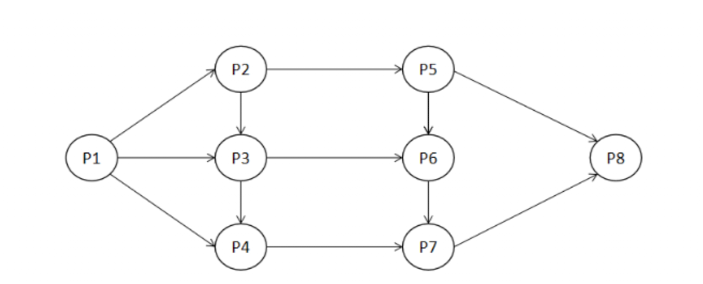

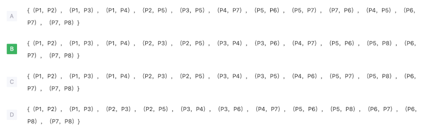

## 答案

B

## 解析

找出图中所有有向线段即可。

前趋图：

① 结点表示进程、程序段、语句

    a. 初始结点：没有前趋的结点

    b. 终止结点：没有后继的结点

    c. 结点的权：程序的量/程序的执行时间

② 有向边表示结点之间存在的偏序关系/前趋关系

③ 若进程Pi与Pj存在前趋关系，记为 (Pi,Pj) 或 Pi -> Pj，Pi是Pj的直接前趋，Pj是Pi的直接后继

# 二十二

## 题目

假设某计算机系统中只有一个 CPU、一台输入设备和一台输出设备，若系统中有四个作业 T1.T2.T3 和 T4，系统采用优先级调度，且 T1 的优先级>T2 的优先级>T3 的优先级>T4的优先级。。若每个作业具有三个程序段：输入Ii、计算Ci和输出Pi（i=1，2，3，4），执行顺序为Iì、Cì、Pì，则这四个作业各程序段并发执行的前驱图如下所示。图中①、②、③分别为（），④、⑤、⑥分别为（）

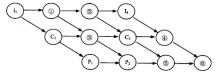

## 答案

B

D

## 解析

根据前趋图的定义，找出图中所有有向线段即可。在本题中，实际上是用了前趋图来表现流水线作业的情况。前趋图中表达了两种依赖关系。第一种是一个作业中要完成的活动有先后顺序关系，前一个活动完成，后一个活动才能开始，比如I1->C1->P1。第二种是由于资源受限只有一个CPU，那么第一个任务使用完CPU，第二个任务才能用；同样只有一个输入设备，那么第一个任务使用完输入设备，第二个任务才能用，这是用横向的箭头来展示的。所以有I1指向I2。

# 二十三

## 题目

若系统正在将（ ）文件修改的结果写回磁盘时系统发生掉电，则对系统影响相对较大。
A、目录
B、空闲块
C、用户程序
D、用户数据

## 答案

A

## 解析

在文件管理系统中，文件在“未打开”状态下需要占用三种资源，包括一个目录项，一个磁盘索引节点项，和若干个盘块。

当文件被“打开”时，需要增加三种资源，包括一个内存索引节点项，一个文件表的登记项，以及一个用户文件描述符表的登记项。

文件的读写管理与这些资源的管理密切相关，因此可以从资源管理的角度来介绍文件系统。

具体来说，文件的管理需要涉及对索引节点、空间盘块、目录文件、文件表和描述符的管理，同时还需要对文件的使用进行管理。

若目录文件在写回磁盘时出现异常，将对系统产生较大的影响，而空闲块对系统几乎没有影响，用户程序、用户数据丢失对用户影响较大。

**「目录文件」**：目录相当于一个容器，将多个文件或其它目录存储在一起，文件控制块的有序集合构成文件目录，每个目录项即是一个文件控制块。
 **「空闲块」**：还未分配出去的内存区。
 **「用户程序」**：为满足用户不同领域、不同问题的应用需求而提供的软件，例如开发软件，Office 等。
 **「用户数据」**：用户的数据，比如用户账号密码，照片，文档等。

# 二十四

## 题目

某文件系统文件存储采用文件索引节点法，每个文件索引结点中有8个地址项，每个地址项大小为4字节，其中5个地址项为直接地址索引，2个地址项是一级间接地址索引，1个地址项是二级间接地址索引，磁盘索引块和磁盘数据块大小均为1KB。若要访问iclsClient.dll文件的逻辑块号分别为1、518，则系统应分别采用（）。

A 直接地址访问和直接地址访问

B 直接地址访问和一级间接地址访问

C 直接地址访问和二级间接地址访问

D 一级间接地址访问和二级间接地址访问

## 答案

C

## 解析

在操作系统管理的磁盘中，分为索引块和数据块两种磁盘。

索引块中，存放指向数据块的地址（索引）。数据块中，存放数据。（题目中磁盘索引块和磁盘数据块大小均为1KB）

在一个索引块中，可以存放多个索引节点，题目描述有8个地址项（0-7）。每个地址项指向一个数据块，因为每个地址项是4字节大小。

索引可以得到如下推算：

一个索引节点 8X4=32 个字节，一个索引块可以存放 1KB/32b = 1024/32 = 32个索引节点。

一个索引块可以存放 1KB /4b = 256个地址项。即一个索引块可以指向256个数据块

直接地址索引：直接指向数据块

一级间接索引：指向存放在索引块中，由它在指向数据块

二级间接索引：存放指向一级索引块的节点地址

https://www.aliyundrive.com/drive/file/backup/64ef5251128b75dc728f4ff9b71d98ee0525cc8a

# 二十五

## 题目

假设某计算机的字长为 32 位，该计算机文件管理系统磁盘空间管理采用位示图，记录磁盘的使用情况，若磁盘的容量位 300GB ，物理块的大小为 4MB ，那么位示图的大小为（）字。

A 2400

B 3200

C 6400

D 9600

## 答案

A

## 解析

位示图是利用二进制的一位来表示磁盘中的一个盘块的使用情况。一般把“1”作为磁盘已经分配的标记，把“0”作为空闲标志。

根据题意计算机字长为32位，即一个字可以记录32个物理块的使用情况。

若磁盘容量300GB，一个物理块大小为4MB，那么该磁盘有 300 X 1024 / 4 = 76800个物理块。所以位示图需要 76800 / 32 = 2400 个字。

# 二十六

## 题目

假设系统中互斥资源R的可用数为25。T0时刻进程P1、P2、P3、P4对资源R的最大需求数、已分配资源数和尚需资源数的情况如表a所示，若P1和P3分别申请资源R数为1和2，则系统()

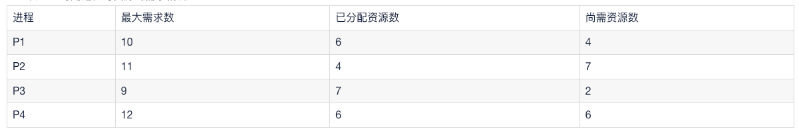

A.只能先给P1进行分配，因为分配后系统状态是安全的

B.只能先给P3进行分配，因为分配后系统状态是安全的

C.可以同时给P1、P3进行分配，因为分配后系统状态是安全的

D.不能给P3进行分配，因为分配后系统状态是不安全的

## 答案

C

## 解析

本题考查进程管理中死锁相关概念 - 银行家算法。

由于系统一种25个可用资源，P1，P2，P3，P4当前分别分配的资源数为6，4，7，6。那么这个时候还剩余2个可用资源。如果分配给P1、P2、P4则还是不能满足需求数量，还会继续等待即死锁。所以分配给P3是安全的。

# 二十七

## 题目

在支持多线程的操作系统中，假设进程P创建了线程TI、T2和T3， 那么以下叙述中正确的是（ ）。
A.该进程中已打开的文件是不能被T1，T2和T3共享的
B.该进程中T1的栈指针是不能被T2共享，但可被T3共享
C.该进程中T1的栈指针是不能被T2和T3共享的
D.该进程中某线程的栈指针是可以被T1，T2和T3共享的

## 答案

C

## 解析

本题考查线程进程相关概念。

在同一进程中的各个线程可以共享该进程所拥有的的资源，如访问进程地址空间中的每一个虚拟地址、已打开文件、定时器、信号量等，但不能共享进程中某线程的栈指针，因为栈指针属于线程。

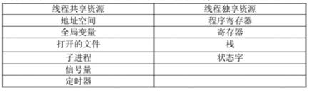

# 二十八

## 题目

某计算机系统中的进程管理采用三态模型，那么下图所示的 PCB（进程控制块）的组织方式采用（ ），图中（）。

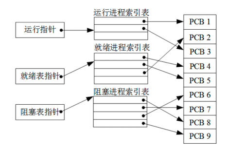

（1）

A.顺序方式     B. 链接方式
C. 索引方式     D. Hash
（2）

A.有 1 个运行进程，2 个就绪进程，4 个阻塞进程
B.有 2 个运行进程，3 个就绪进程，3 个阻塞进程
C.有 2 个运行进程，3 个就绪进程，4 个阻塞进程
D.有 3 个运行进程，2 个就绪进程，4 个阻塞进程

## 答案

C

C

## 解析

本地考察进程控制块PCB的相关概念。PCB组织方式主要有线性表方式、索引表方式、链接表方式。

- 线性表方式将所有的PCB连续地存放在内存的系统区。适用于系统中数目不多的情况。

- 索引表是线性表的改进，系统按照进程的状态分别就绪索引表、阻塞索引表等，适用于系统中进程数目较多的情况。

题目中采用了索引表方式，且根据索引表可以看出有有 2 个运行进程，3 个就绪进程，4 个阻塞进程

- 链接表方式则是系统按照进程的状态将进程的PCB组成队列，从而形成就绪队列、阻塞队列、运行队列等

# 二十九

## 题目

某航空公司机票销售系统有n个售票点，该系统为每个售票点创建一个进程Pi（i=1，2，…，n）管理机票销售。假设Tj（j=1，2，…，m）单元存放某日某航班的机票剩余票数，Temp为Pi进程的临时工作单元，x为某用户的订票张数。初始化时系统应将信号量S赋值为（1）。Pi进程的工作流程如下图所示，若用P操作和V操作实现进程间的同步与互斥，则图中空(a)，空(b)和空(c)处应分别填入（2）。

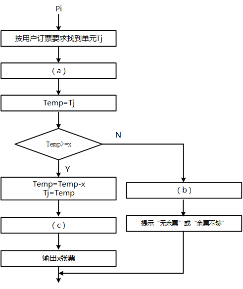

（1）

A．0

B．1

C．2

D．3

（2）

A．P(S),V(S)和V(S)

B．P(S),P(S)和V(S)

C．V(S),P(S)和P(S)

D．V(S),V(S)和P(S)

## 答案

**B A**

## 解析

试题(1)的正确答案是B，因为公共数据单元是一个临界资源，最多允许1个终端进程使用，因此需要设置一个互斥信号量S，初值等于1。

试题(2)的正确答案是A，因为进入临界区时执行P操作（P操作是对临界资源加锁申请），退出临界区时执行V操作（V操作是对临界资源释放锁操作）。

https://www.aliyundrive.com/drive/file/backup/64ef5251128b75dc728f4ff9b71d98ee0525cc8a

# 三十

## 题目

进程P1、P2、P3和P4的前趋图如下所示：

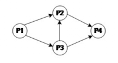

若用PV操作控制进程P1~P4并发执行的过程，则需要设置5个信号量S1、S2、S3、S4和S5，且信号量S4-S5的初值都等于0。下图中a、b和c处应分别填写（1）；d、e和f处应分别填写（2）。

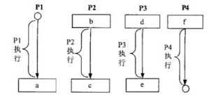

(1)

A．V(S1)V(S2)、P(S1)V(S3)和V(S4)
B．P(S1)V(S2)、P(S1)P(S2)和V(S1)
C．V(S1)V(S2)、P(S1)P(S3)和V(S4)
D．P(S1)P(S2)、V(S1)P(S3)和V(S2)
(2)

A．P(S2)、V(S3)V(S5)和P(S4)P(S5)
B．V(S2)、P(S3)V(S5)和V(S4)P(S5)
C．P(S2)、V(S3)P(S5)和P(S4)V(S5)
D．V(S2)、V(S3)P(S5)和P(S4)V(S5)

## 答案

C

A

## 解析

需要将信号量在前趋图中标识出来。

在前趋图中，每个箭头对应一个信号量，编号从左至右，从上至下，由小到大。所以在该前趋图中信号量标识如下所示：

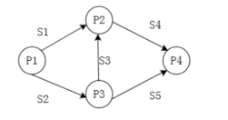

P1执行完会会唤醒S1和S2，即a处是V（S1）和V（S2），

b处即P2执行需要什么，有前趋图可知，需要S1和S3，即b处是P（S1）和P（S3）

c处是P2执行完毕会唤醒S4即c处是V（S4）

d处是执行P3需要什么，即P（S2）

e处是P3执行完毕时唤醒操作即唤醒V（S3）和V（S5）

f处P4执行需要什么即需要P(S4)P(S5)

# 三十一

## 题目

在实时操作系统中，两个任务并发执行，一个任务要等待另一个任务发来消息，或建立某个条件后再向前执行，这种制约性合作关系被称为任务的（）。

A．同步
B．互斥
C．调度
D．执行

## 答案

A

## 解析

同步是指多个进程间的执行顺序，互斥是指多个进程间对某个共享资源的访问。
