# 一

## 题目

假设系统中有正在运行的事务，若要转存全部数据块，则应采用（）方法

A. 静态全局转储

B.动态增量转储

C.静态增量转储

D.动态全局转储

## 答案

D

## 解析

数据转储可以分为动态转储和静态转储两种方式。

静态转储在转储期间不允许对数据库进行任何存取、修改操作。

而动态转储则允许在转储期间对数据库进行存取、修改操作，因此转储和用户事务可以并发执行。

如果系统中有正在运行的事务，并要对数据库进行全部转储，则应该使用动态全局转储方式，以允许转储和用户事务可以并发执行。

**知识点总结：**

**如果**碰到这种题目：

1）系统有事务在运行（动态）；

2）需要转储全部数据（全局）；

# 二

## 题目

某企业开发信息管理系统平台进行 E-R 图设计，人力部门定义的是员工实体具有属性：员工号、姓名、性别、出生日期、联系方式和部门，培训部门定义的培训师实体具有属性：培训师号，姓名和职称，其中职称={初级培训师，中级培训师，高级培训师}，这种情况属于（）。 在合并 E-R 图时，解决这一冲突的方法是（）。

（1）

 A.属性冲突
 B.结构冲突
 C.命名冲突
 D.实体冲突

（2）
 A.员工实体和培训师实体均保持不变
 B.保留员工实体、删除培训师实体
 C.员工实体中加入职称属性，剔除培训师实体
 D.将培训师实体所有属性并入员工实体，删除培训师实体

## 答案

B

C

## 解析

属性冲突包括：属性域和属性取值的冲突

命名冲突包括：同名异义和异名同义

结构冲突包括：同一对象在不同应用中具有不同的抽象，以及统一实体在不同的局部E-R图中所包含的属性个数和属性排列次序不完全相同。

本题中培训师属于员工的一种。

# 三

## 题目

采用三级模式结构的数据库系统中，如果对一个表创建聚簇索引，那么改变的是数据库的（）。

A.外模式

B.模式

C.内模式

D.用户模式

## 答案

C

## 解析

三级模式包括外模式、模式、内模式，分别对应视图级别、表级别和文件级别。

外模式是用户与数据库系统的接口，

模式是数据库中全部数据的逻辑结构和特征的描述，

内模式是数据物理结构和存储方式的描述

对于内模式而言是定义所有内部的记录类型，索引和文件的组织方式，以及数据控制方面的细节。

# 四

## 题目

给定关系模式R<U,F>，其中U为属性集，F是U上的一组函数依赖，那么函数依赖的公理系统（Armstrong）的分解规则是指( )。

A.若X→Y，Y→Z为F所蕴涵，则X→Z

B.若Y⊆X⊆U，则X→Y

C.若X→Y，Z⊆Y，则X→Z

D.若X→Y，Y→Z，则X→YZ

## 答案

C

## 解析

给定关系模式R<U,F>，其中U为属性集，F是U上的一组函数依赖，则有：

### 推导过程

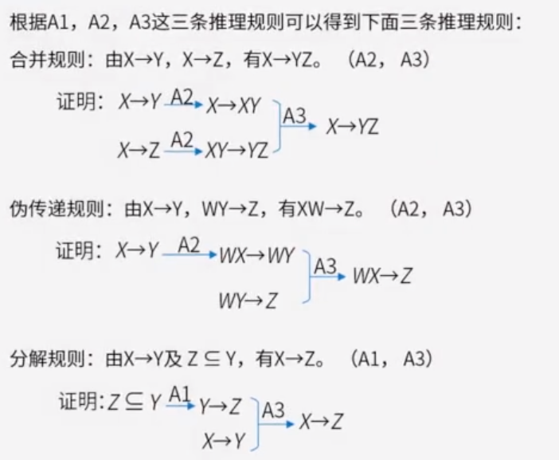

https://www.aliyundrive.com/drive/file/backup/64ef524ce9f29fb7bf4b450a9cf31eb9d9d90a89

52-Armstrong公理系统.mp4

## 补充1

给出关系R(U，F)，U={A，B，C，D，E}， F={A→B，D→C，BC→E，AC→B}，求属性闭包的等式成立的是（） 。R的候选关键字为（）。

问题1选项
A. 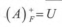
B. 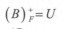
C. 
D. 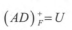

问题2选项
A.AD
B.AB
C.AC
D.BC

## 答案

第1题:D

第2题:A

## 解析

https://www.educity.cn/tiku/60008693.html

(X) + F =Y闭包求法：
第一步：设最终将成为闭包的属性集是Y，把Y初始化为X；
第二步：检查F中的每一个函数依赖A→B，如果属性集A中所有属性均在Y中，而B中有的属性不在Y中，则将其加入到Y中；
第三步：重复第二步，直到没有属性可以添加到属性集Y中为止。最后得到的Y就是X＋
A选项（A）+ F根据A→B可得（A）+ F ={A，B} ，B选项（B）+ F因为不存在B为左侧决定因素的函数依赖，所以（B）+ F ={B} ，C选项（AC）+ F根据A→B，BC→E，AC→B可得（A）+ F ={A，B，C，E} ，D选项（AD）+ F根据A→B，D→C， BC→E可得（A）+ F ={A，B，C，D，E} =U。所以选D选项。
 如果有属性或属性组能唯一标识元组，则它就是候选码，也就是说，通过函数依赖所求出的候选码的闭包中，能够包含所有的属性。从第一问可以得出属性集AD包含候选码，且（A）+ F ={A，B}，（D）+ F ={C，D}，所以属性集AD中不存在一个真子集能决定全属性，故AD为R的候选码。答案选A。这里直接画图也可得出候选码。

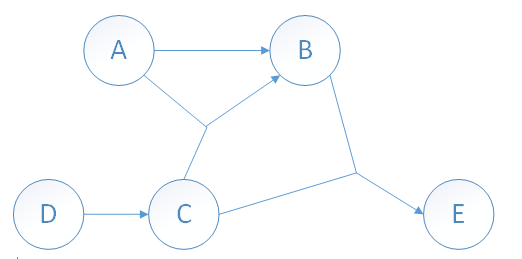

## 题目2

给定关系R（A1，A2，A3，A4）上的函数依赖集F={A1→A2A5，A2→A3A4，A3→A2}，函数依赖（）∈F+。 

A. A5→A1A2

B. A4→A1A2

C. A3→A2A4

D. A2→A1A5

## 答案2

C

## 解析

F+是代表F函数依赖集的闭包，通俗一点，就是从F函数依赖集能推到出来的依赖关系

# 五

## 题目1

## 答案1

D，C

## 题目2

## 答案2

D。坑 ，这4个运算关系并不等价，

通用原则：存在连接操作和选择操作的，尽可能的完成选择操作，降低参与连接操作的数据量，提升运算效率。

由于E2和E4不是等价的，虽然自然连接比笛卡尔效率高（仅仅高一点），但是由于E4少了一次等值比较，所以效率更高一些。

## 题目3

## 答案3

B，C

## 解析

关系代数知识点

^ 表示 and 

select 语句 两个表用 ',' 连接 表示笛卡尔乘积

性能上

- 自然连接稍优于笛卡尔乘积，注意相等条件个数
- 小表驱动大表（先过滤数据）

https://www.cnblogs.com/jackion5/p/17216435.html

https://www.aliyundrive.com/drive/file/backup/64ef524ce9f29fb7bf4b450a9cf31eb9d9d90a89

# 六

规范化理论-候选键

https://www.aliyundrive.com/drive/file/backup/64ef524ce9f29fb7bf4b450a9cf31eb9d9d90a89

候选键：唯一标识元组，且无冗余（可以理解为定义的唯一主键，也可能是组合的唯一主键）

主属性和非主属性：组成候选码的属性就是主属性，其他的就是非主属性

求候选码：

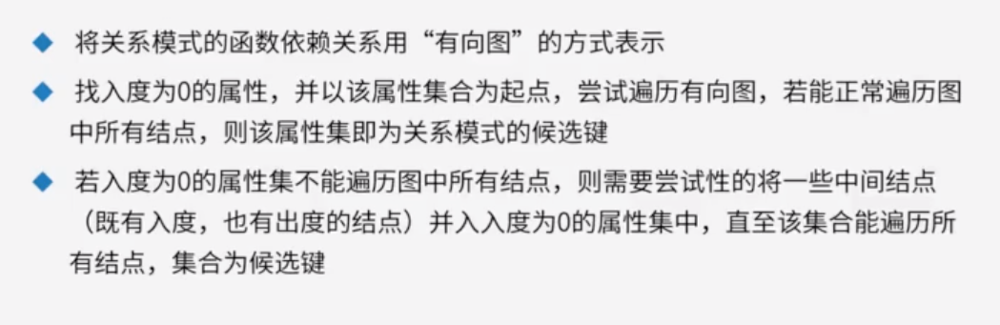

## 题目1

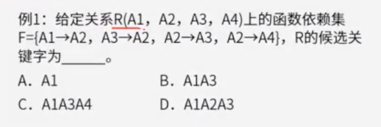

## 答案1

A

## 解析

先画出有向图，然后找入度为0的属性，尝试遍历有向图。

即从A1出发尝试遍历有向图，发现可以正常遍历图中所有节点，那么该A1就是候选键

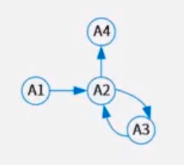

## 题目2

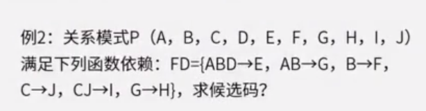

## 答案2

候选码：ABCD

## 解析

先画出有向图，找入度为0的属性，尝试遍历有向图

ABCD是入度都为0，从A看不能访问全部，B也不能访问全部，C也不能访问全部，那么开始组合，只有ABCD组合才能访问全部，所以候选码是ABCD

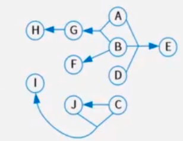

## 题目3

## 答案2

B

## 解析

画出有向图，发现没有入度为0的节点。看到C只有入度没有出度，所以带C的都不对。

然后尝试A可以访问全部，尝试B可以访问全部。所以A和B都能访问全部节点，是候选键

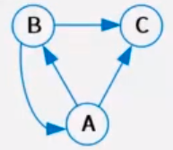

# 七

## 题目

数据库的安全机制中，通过提供（）供第三方开发人员调用进行数据更新，从而保证数据库的关系模式不被第三方所获取。

A、索引

B、视图

C、存储过程

D、触发器

## 答案

C

## 解析

索引是提高数据库查询效率的机制，但不能进行数据更新。

视图具有一定的安全机制，但也不能更新数据。

触发器可以作为更新机制，但无法完全保证数据库安全性。

存储过程可以定义一段代码来提供给用户程序调用，通过代码来实现更新，避免了向第三方提供系统表结构的过程，从而更好的保证了数据库的安全性。

# 八

规范化理论 - 模式分解 （是否保持函数依赖 ）

https://www.aliyundrive.com/drive/file/backup/64ef524ce9f29fb7bf4b450a9cf31eb9d9d90a89

## 题目1

有关系模式R(A,B,C)，F={A->B, B->C}，将其拆分为R1(A,B),R2(B,C) 是否保持函数依赖。

## 答案1

是

## 解析

将拆分后的关系模式所蕴含的函数依赖进行合并，然后与拆分前的函数依赖对比。

拆分后的关系模式R1存在函数依赖 F1={A->B}

拆分后的关系模式R2存在函数依赖 F2={B->C}

因此拆分前后函数依赖一致，保持函数依赖

## 题目2

有关系模式R(A,B,C)，F={A->B, B->C,B->C}，将其拆分为R1(A,B),R2(B,C) 是否保持函数依赖。

## 答案2

是

## 解析

将拆分后的关系模式所蕴含的函数依赖进行合并，然后与拆分前的函数依赖对比。

拆分后的关系模式R1存在函数依赖 F1={A->B}

拆分后的关系模式R1存在函数依赖 F2={B->C}

根据F1和F2 可以推导出F3={A->C}

因此拆分前后函数依赖一致，保持函数依赖

## 题目3

有关系模式R(A,B,C,D,E)，F={A->B,D->E}，将其拆分为R1(A,B,C),R2(D,E) 是否保持函数依赖。

## 答案3

是

## 解析

将拆分后的关系模式所蕴含的函数依赖进行合并，然后与拆分前的函数依赖对比。

拆分后的关闭模式R1存在函数依赖 F1={A->B}

拆分后的关闭模式R1存在函数依赖 F2={D->E}

因此拆分前后函数依赖一致，保持函数依赖

虽然少了很多字段（连接和无损概念），但是函数依赖保持了。

# 九

规范化理论 - 无损分解 （是否无损）

什么是有损：不能还原

什么是无损：可以还原

无损连接分解：指将一个关系模式分解成若干个关系模式后，通过自然连接和投影等运算还能还原到原来的关系模式。

https://www.aliyundrive.com/drive/file/backup/64ef524ce9f29fb7bf4b450a9cf31eb9d9d90a89 54-模式分解.mp4

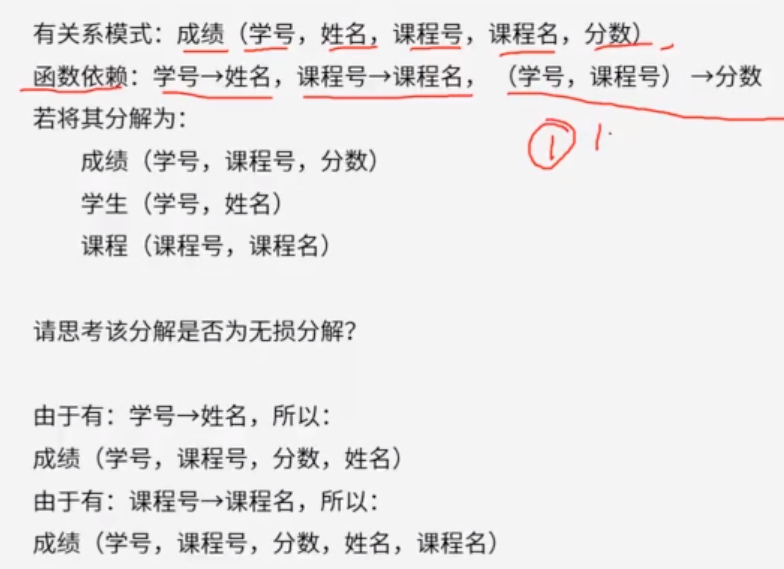

## 分析 - 表格法

- 根据分解后的关系集合初始化表格

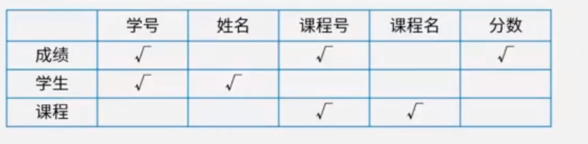

## 分析 - 公式法

公式法只能适用于分解为两个关系模式的场景，超过两个无法使用公式法。

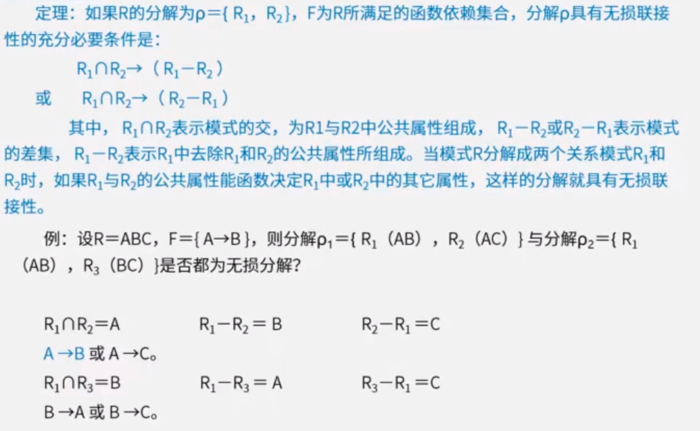

例题中

p1的两个分解R1(AB),R2(AC) ，根据R1交R2 的到的是A，R1与R2的差是B，R2与R1的差是C。

公共属性决定其他属性 A->B 或 A->C。F中存在A->B 所以是无损分解

p2中分解后计算交集和差集得到 B->A 或者 B->C，F中不存在 B->A 或者 B->C ，就是有损分解

使用表格法来分析这个题

针对p1初始化表格如下

|      | A    | B    | C    |
| ---- | ---- | ---- | ---- |
| R1   | ✅    | ✅    |      |
| R2   | ✅    |      | ✅    |

根据决定关系进行填充

因为存在依赖关系F={A->B}，所以存在A的B都可以决定，进行填充操作，所以R2中的B可以勾选，得到如下结果

|      | A    | B    | C    |
| ---- | ---- | ---- | ---- |
| R1   | ✅    | ✅    |      |
| R2   | ✅    | ✅    | ✅    |

此时R2中三个属性都全了，所以是无损分解

---

针对p2，初始化表格如下

|      | A    | B    | C    |
| ---- | ---- | ---- | ---- |
| R1   | ✅    | ✅    |      |
| R2   |      | ✅    | ✅    |

因为只存在依赖关系F={A->B}，所以没有可填充的操作

# 十

### 元组演算

https://cwlrin.wiki/cs-base/ruankaozhongjiguanxishujukushang/

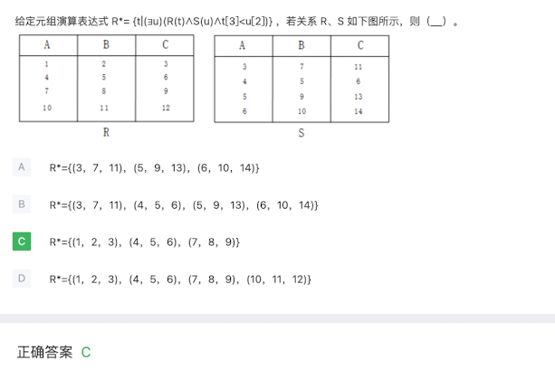

# 十一

## 题目

假设关系模式R(U，F)，属性集U={A，B，C），函数依赖集F={A→B，B→C）。若将其分解为p={R1(U1，F1)，R2(U2，F2))，其中U1={A，B），U2={A，C}。那么，关系模式R、R1、R2分别达到了 （1）；分解ρ （2）。

(1)

A．1NF、2NF、3NF
B．1NF、3NF、3NF
C．2 NF、2NF、3NF
D．2NF、3NF、3NF
(2)

A．有损连接但保持函数依赖
B．既无损连接又保持函数依赖
C．有损连接且不保持函数依赖
D．无损连接但不保持函数依赖

## 答案

C

D

## 解析

https://www.aliyundrive.com/drive/file/backup/64ef524ce9f29fb7bf4b450a9cf31eb9d9d90a89

53-范式判断.mp4

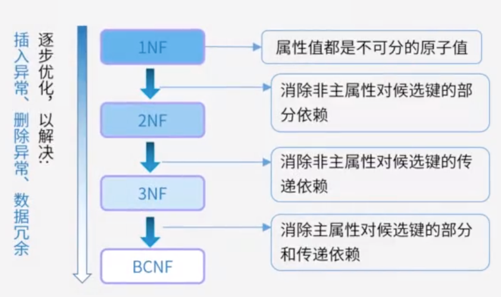

BC范式：设R是一个关系模式，F是它的依赖集，R属于BCNF当且仅当其F中每个依赖的决定因素必定包含R的某个候选码。

步骤：

- 列出函数依赖
- 找出候选键
- 函数依赖的决定项是否包含某个候选键，包含则满足BC范式，不包含则不满足

# 十二

## 题目

基于网络的数据库系统(NetwareDatabaseSystem,NDB)是基于 4G/5G 的移动通信之上，在逻辑上可以把嵌入式设备看作远程服务器的一个客户端。以下有关 NDB 的叙述中，不正确的是（）

A.NDB 主要由客户端、通信协议和远程服务器等三部分组成
 B.NDB 的客户端主要负责提供接口给嵌入式程序，通信协议负责规范客户端与远程服务器之间的通信，远程服务器负责维护服务器上的数据库数据
 C.NDB 具有客户端小、无需支持可剪裁性、代码可重用等特点
 D.NDB 是以文件方式存储数据库数据。即数据按照一定格式储存在磁盘中，使用时由应用程序通过相应的驱动程序甚至直接对数据文件进行读写

## 答案

D

## 解析

基于网络的数据库系统主要由客户端、通信协议、远程服务器三部分组成。

其中客户端提供接口给嵌入式程序，在逻辑上看作远程服务器的一个客户端。

通信协议规范客户端与远程服务器之间的通信

远程服务器维护服务器上的数据库系统。

基于文件的数据库系统一般采用文件方式存储数据库数据，按照一定格式存储在磁盘中。

# 十三

## 题目

在分布式数据库中有分片透明、复制透明、位置透明和逻辑透明等基本概念。其中（） 是指用户无需知道数据存放的物理位置。

 A.分片透明

B.逻辑透明

C：位置透明

D：复制透明

## 答案

C

## 解析

分布式数据库有四种透明分片透明、复制透明、位置透明和逻辑透明

分片透明：是指用户对数据操作时不必关新 数据是如何分片的，对于应用程序而言，所有操作在全局关系层面上进行，因此分片对用户来说是透明的，当分片改变时应用程序可以保持不变。

它们对数据的操作在全局关系上进行，即关系如何分片对用户是透明的，因此，当分片改变时应用程序可以不变。分片透明性是最高层次的透明性，如果用户能在全局关系一级操作，则数据如何分布，如何存储等细节自不必关系，其应用程序的编写与集中式数据库相同。

复制透明：用户不用关心数据库在网络中各个节点的复制情况，被复制的数据的更新都由系统自动完成。

在分布式数据库系统中，可以把一个场地的数据复制到其他场地存放，应用程序可以使用复制到本地的数据在本地完成分布式操作，避免通过网络传输数据，提高了系统的运行和查询效率。但是对于复制数据的更新操作，就要涉及到对所有复制数据的更新。

位置透明：是指用户不必知道所操作的数据放在何处，即数据分配到哪个或哪些站点存储对用户是透明的。

局部映像透明性（逻辑透明）：是最低层次的透明性，该透明性提供数据到局部数据库的映像，即用户不必关系局部DBMS支持哪种数据模型、使用哪种数据操纵语言，数据模型和操纵语言的转换是由系统完成的。因此，局部映像透明性对异构型和同构异质的分布式数据库系统是非常重要的。

# 十四

## 题目

分布式数据库系统除了包含集中式数据库系统的模式结构之外,还增加了几个模式级别，其中（ ）定义分布式数据库中数据的整体逻辑结构,使得数据如同没有分布一样。

A：分片模式

B：全局外模式

C：分布模式

D：全局概念模式

## 答案

D

## 解析

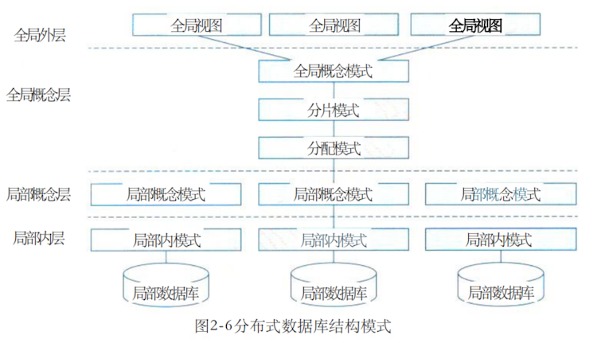

- 全局外模式是对分布式数据库最高层的抽象
- 全局概念模式是分布式数据库整体抽象，描述了全部数据的特性和逻辑结构，是全局数据的逻辑视图，使得数据使用方便，如同没有分布一样。
- 分片模式描述了全局数据逻辑划分的视图，是全局数据根据条件进行的逻辑划分。
- 分配模式描述了局部逻辑的局部物理结构，是划分后的片段的物理分配视图，属于全局概念层的内容。
- 局部概念层由局部概念模式描述，是全局概念模式的子集，并被分配在各个局部场地上。

# 十五

## 题目

数据仓库中数据（）的特点是指数据一旦进入数据仓库后，将被长期保留并定期加载和刷新，可以进行各种查询操作，但很少对数据进行修改和删除操作。

A.面向主题 

B.集成性 

C.相对稳定性 

D.反映历史变化

## 答案

C

## 解析

数据仓库是一个**面向主题的、集成的、非易失的、且随时间变化**的数据集合，用于支持管理决策。

**面向主题**：按照一定的主题域进行组织的。

**集成的**：数据仓库中的数据是在对原有分散的数据库数据抽取、清理的基础上经过系统加工、汇总和整理得到的，必须消除源数据中的不一致性，以保证数据仓库内的信息是关于整个企业的一致的全局信息。

**相对稳定的**：数据仓库的数据主要供企业决策分析之用，所涉及的数据操作主要是数据查询，一旦某个数据进入数据仓库以后，一般情况下将被长期保留，也就是数据仓库中一般有大量的查询操作，但修改和删除操作很少，通常只需要定期的加载、刷新。

**反映历史变化**：数据仓库中的数据通常包含历史信息，系统记录了企业从过去某一时点（如开始应用数据仓库的时点）到目前的各个阶段的信息，通过这些信息，可以对企业的发展历程和未来趋势做出定量分析和预测。

# 十六

## 题目

分布式数据库两阶段提交协议中的两个阶段是指（）

A：加锁阶段、解锁阶段

B：获取阶段、运行阶段

C：表决阶段、执行阶段

D：扩展阶段、收缩阶段

## 答案

C

## 解析

二阶段提交算法或协议，是为了保持分布式系统架构下事务提交时的一致性而设计的。在分布式系统中，每个节点无法知道其他节点的操作结果，为了保持ACID特性，需要一个协调者组件来掌控所有参与节点的操作结果并做出统一的提交或终止操作的决策。

二阶段提交算法包括准备阶段和提交阶段，其中准备阶段被称为表决阶段，提交阶段根据协调者的指令执行提交或回滚操作。

# 十七

## 题目

以下关于嵌入式数据库管理系统的描述不正确的是：（）

A：嵌入式数据库管理系统一般只为前端应用提供基本的数据支持

B：嵌入式数据库管理系统一般支持实时数据的管理

C：嵌入式数据库管理系统一般不支持多线程并发操作

D：嵌入式数据库管理系统一般只提供本机服务接口

## 答案

C

## 解析

嵌入式数据库管理系统（EDBMS）就是在嵌入式设备上使用的DBMS。EDBMS的作用主要是解决移动计算环境下数据的管理问题，移动数据库是移动计算环境中的分布式数据库。

嵌入式数据库管理系统一般只提供本机服务接口，且只为前端应用提供基本的数据支持，支持多线程并发操作
