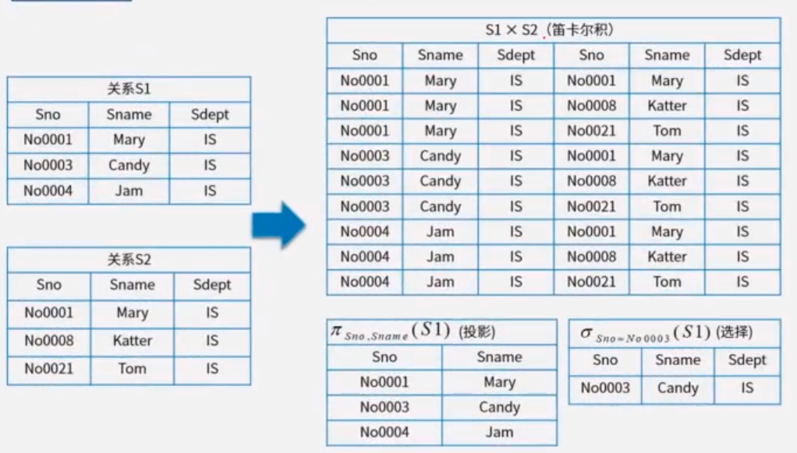

# 一

## 题目

假设系统中有正在运行的事务，若要转存全部数据块，则应采用（）方法

A. 静态全局转储

B.动态增量转储

C.静态增量转储

D.动态全局转储

## 答案

D

## 解析

数据转储可以分为动态转储和静态转储两种方式。

静态转储在转储期间不允许对数据库进行任何存取、修改操作。

而动态转储则允许在转储期间对数据库进行存取、修改操作，因此转储和用户事务可以并发执行。

如果系统中有正在运行的事务，并要对数据库进行全部转储，则应该使用动态全局转储方式，以允许转储和用户事务可以并发执行。

**知识点总结：**

**如果**碰到这种题目：

1）系统**有事务在运行（动态）**；

2）**需要转储\**全部数据（全局）\****；

# 二

## 题目

某企业开发信息管理系统平台进行 E-R 图设计，人力部门定义的是员工实体具有属性：员工号、姓名、性别、出生日期、联系方式和部门，培训部门定义的培训师实体具有属性：培训师号，姓名和职称，其中职称={初级培训师，中级培训师，高级培训师}，这种情况属于（）。 在合并 E-R 图时，解决这一冲突的方法是（）。

（1）

 A.属性冲突
 B.结构冲突
 C.命名冲突
 D.实体冲突

（2）
 A.员工实体和培训师实体均保持不变
 B.保留员工实体、删除培训师实体
 C.员工实体中加入职称属性，剔除培训师实体
 D.将培训师实体所有属性并入员工实体，删除培训师实体

## 答案

B

C

## 解析

属性冲突包括：属性域和属性取值的冲突

命名冲突包括：同名异义和异名同义

结构冲突包括：同一对象在不同应用中具有不同的抽象，以及统一实体在不同的局部E-R图中所包含的属性个数和属性排列次序不完全相同。

本题中培训师属于员工的一种。

# 三

## 题目

采用三级模式结构的数据库系统中，如果对一个表创建聚簇索引，那么改变的是数据库的（）。

A.外模式

B.模式

C.内模式

D.用户模式

## 答案

C

## 解析

三级模式包括外模式、模式、内模式，分别对应视图级别、表级别和文件级别。

外模式是用户与数据库系统的接口，

模式是数据库中全部数据的逻辑结构和特征的描述，

内模式是数据物理结构和存储方式的描述

对于内模式而言是定义所有内部的记录类型，索引和文件的组织方式，以及数据控制方面的细节。

# 四

## 题目

给定关系模式R<U,F>，其中U为属性集，F是U上的一组函数依赖，那么函数依赖的公理系统（Armstrong）的分解规则是指( )。

A.若X→Y，Y→Z为F所蕴涵，则X→Z

B.若Y⊆X⊆U，则X→Y

C.若X→Y，Z⊆Y，则X→Z

D.若X→Y，Y→Z，则X→YZ

## 答案

C

## 解析

给定关系模式R<U,F>，其中U为属性集，F是U上的一组函数依赖，则有：

https://www.aliyundrive.com/drive/file/backup/64ef524ce9f29fb7bf4b450a9cf31eb9d9d90a89

# 五

## 题目1

## 答案1

D，C

## 题目2

## 答案2

D。坑 ，这4个运算关系并不等价，

## 题目3

## 答案3

B，C

## 解析

关系代数知识点

^ 表示 and 

select 语句 两个表用 ',' 连接 表示笛卡尔乘积

性能上

- 自然连接稍优于笛卡尔乘积，注意相等条件个数
- 小表驱动大表（先过滤数据）

https://www.cnblogs.com/jackion5/p/17216435.html

https://www.aliyundrive.com/drive/file/backup/64ef524ce9f29fb7bf4b450a9cf31eb9d9d90a89
