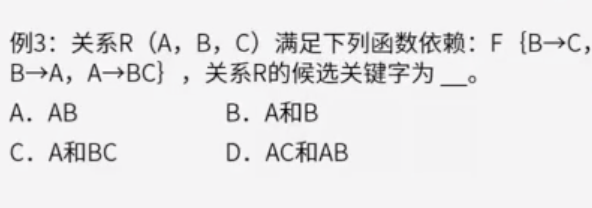

# 一

## 题目

假设系统中有正在运行的事务，若要转存全部数据块，则应采用（）方法

A. 静态全局转储

B.动态增量转储

C.静态增量转储

D.动态全局转储

## 答案

D

## 解析

数据转储可以分为动态转储和静态转储两种方式。

静态转储在转储期间不允许对数据库进行任何存取、修改操作。

而动态转储则允许在转储期间对数据库进行存取、修改操作，因此转储和用户事务可以并发执行。

如果系统中有正在运行的事务，并要对数据库进行全部转储，则应该使用动态全局转储方式，以允许转储和用户事务可以并发执行。

**知识点总结：**

**如果**碰到这种题目：

1）系统**有事务在运行（动态）**；

2）**需要转储\**全部数据（全局）\****；

# 二

## 题目

某企业开发信息管理系统平台进行 E-R 图设计，人力部门定义的是员工实体具有属性：员工号、姓名、性别、出生日期、联系方式和部门，培训部门定义的培训师实体具有属性：培训师号，姓名和职称，其中职称={初级培训师，中级培训师，高级培训师}，这种情况属于（）。 在合并 E-R 图时，解决这一冲突的方法是（）。

（1）

 A.属性冲突
 B.结构冲突
 C.命名冲突
 D.实体冲突

（2）
 A.员工实体和培训师实体均保持不变
 B.保留员工实体、删除培训师实体
 C.员工实体中加入职称属性，剔除培训师实体
 D.将培训师实体所有属性并入员工实体，删除培训师实体

## 答案

B

C

## 解析

属性冲突包括：属性域和属性取值的冲突

命名冲突包括：同名异义和异名同义

结构冲突包括：同一对象在不同应用中具有不同的抽象，以及统一实体在不同的局部E-R图中所包含的属性个数和属性排列次序不完全相同。

本题中培训师属于员工的一种。

# 三

## 题目

采用三级模式结构的数据库系统中，如果对一个表创建聚簇索引，那么改变的是数据库的（）。

A.外模式

B.模式

C.内模式

D.用户模式

## 答案

C

## 解析

三级模式包括外模式、模式、内模式，分别对应视图级别、表级别和文件级别。

外模式是用户与数据库系统的接口，

模式是数据库中全部数据的逻辑结构和特征的描述，

内模式是数据物理结构和存储方式的描述

对于内模式而言是定义所有内部的记录类型，索引和文件的组织方式，以及数据控制方面的细节。

# 四

## 题目

给定关系模式R<U,F>，其中U为属性集，F是U上的一组函数依赖，那么函数依赖的公理系统（Armstrong）的分解规则是指( )。

A.若X→Y，Y→Z为F所蕴涵，则X→Z

B.若Y⊆X⊆U，则X→Y

C.若X→Y，Z⊆Y，则X→Z

D.若X→Y，Y→Z，则X→YZ

## 答案

C

## 解析

给定关系模式R<U,F>，其中U为属性集，F是U上的一组函数依赖，则有：

https://www.aliyundrive.com/drive/file/backup/64ef524ce9f29fb7bf4b450a9cf31eb9d9d90a89

# 五

## 题目1

## 答案1

D，C

## 题目2

## 答案2

D。坑 ，这4个运算关系并不等价，

## 题目3

## 答案3

B，C

## 解析

关系代数知识点

^ 表示 and 

select 语句 两个表用 ',' 连接 表示笛卡尔乘积

性能上

- 自然连接稍优于笛卡尔乘积，注意相等条件个数
- 小表驱动大表（先过滤数据）

https://www.cnblogs.com/jackion5/p/17216435.html

https://www.aliyundrive.com/drive/file/backup/64ef524ce9f29fb7bf4b450a9cf31eb9d9d90a89

# 六

规范化理论-候选键

https://www.aliyundrive.com/drive/file/backup/64ef524ce9f29fb7bf4b450a9cf31eb9d9d90a89

候选键：唯一标识元组，且无冗余（可以理解为定义的唯一主键，也可能是组合的唯一主键）

主属性和非主属性：组成候选码的属性就是主属性，其他的就是非主属性

求候选码：

## 题目1

## 答案1

A

## 解析

先画出有向图，然后找入度为0的属性，尝试遍历有向图。

即从A1出发尝试遍历有向图，发现可以正常遍历图中所有节点，那么该A1就是候选键

## 题目2

## 答案2

候选码：ABCD

## 解析

先画出有向图，找入度为0的属性，尝试遍历有向图

ABCD是入度都为0，从A看不能访问全部，B也不能访问全部，C也不能访问全部，那么开始组合，只有ABCD组合才能访问全部，所以候选码是ABCD

## 题目3

## 答案2

B

## 解析

画出有向图，发现没有入度为0的节点。看到C只有入度没有出度，所以带C的都不对。

然后尝试A可以访问全部，尝试B可以访问全部。所以A和B都能访问全部节点，是候选键

# 七

## 题目

数据库的安全机制中，通过提供（）供第三方开发人员调用进行数据更新，从而保证数据库的关系模式不被第三方所获取。

A、索引

B、视图

C、存储过程

D、触发器

## 答案

C

## 解析

索引是提高数据库查询效率的机制，但不能进行数据更新。

视图具有一定的安全机制，但也不能更新数据。

触发器可以作为更新机制，但无法完全保证数据库安全性。

存储过程可以定义一段代码来提供给用户程序调用，通过代码来实现更新，避免了向第三方提供系统表结构的过程，从而更好的保证了数据库的安全性。

# 八

规范化理论 - 模式分解 （是否保持函数依赖 ）

https://www.aliyundrive.com/drive/file/backup/64ef524ce9f29fb7bf4b450a9cf31eb9d9d90a89

## 题目1

有关系模式R(A,B,C)，F={A->B, B->C}，将其拆分为R1(A,B),R2(B,C) 是否保持函数依赖。

## 答案1

是

## 解析

将拆分后的关系模式所蕴含的函数依赖进行合并，然后与拆分前的函数依赖对比。

拆分后的关闭模式R1存在函数依赖 F1={A->B}

拆分后的关闭模式R1存在函数依赖 F2={B->C}

因此拆分前后函数依赖一致，保持函数依赖

## 题目2

有关系模式R(A,B,C)，F={A->B, B->C,B->C}，将其拆分为R1(A,B),R2(B,C) 是否保持函数依赖。

## 答案2

是

## 解析

将拆分后的关系模式所蕴含的函数依赖进行合并，然后与拆分前的函数依赖对比。

拆分后的关闭模式R1存在函数依赖 F1={A->B}

拆分后的关闭模式R1存在函数依赖 F2={B->C}

根据F1和F2 可以推导出F3={A->C}

因此拆分前后函数依赖一致，保持函数依赖

## 题目3

有关系模式R(A,B,C,D,E)，F={A->B,D->E}，将其拆分为R1(A,B,C),R2(D,E) 是否保持函数依赖。

## 答案3

是

## 解析

将拆分后的关系模式所蕴含的函数依赖进行合并，然后与拆分前的函数依赖对比。

拆分后的关闭模式R1存在函数依赖 F1={A->B}

拆分后的关闭模式R1存在函数依赖 F2={D->E}

因此拆分前后函数依赖一致，保持函数依赖

虽然少了很多字段（连接和无损概念），但是函数依赖保持了。

# 九

规范化理论 - 无损分解 （是否无损）

什么是有损：不能还原

什么是无损：可以还原

无损连接分解：指将一个关系模式分解成若干个关系模式后，通过自然连接和投影等运算还能还原到原来的关系模式。

https://www.aliyundrive.com/drive/file/backup/64ef524ce9f29fb7bf4b450a9cf31eb9d9d90a89

## 分析 - 表格法

- 根据分解后的关系集合初始化表格

## 分析 - 公式法

公式法只能适用于分解为两个关系模式的场景，超过两个无法使用公式法。

例题中

p1的两个分解R1(AB),R2(AC) ，根据R1交R2 的到的是A，R1与R2的差是B，R2与R1的差是C。

公共属性决定其他属性 A->B 或 A->C。F中存在A->B 所以是无损分解

p2中分解后计算交集和差集得到 B->A 或者 B->C，F中不存在 B->A 或者 B->C ，就是有损分解

使用表格法来分析这个题

针对p1初始化表格如下

|      | A    | B    | C    |
| ---- | ---- | ---- | ---- |
| R1   | ✅    | ✅    |      |
| R2   | ✅    |      | ✅    |

根据决定关系进行填充

因为存在依赖关系F={A->B}，所以存在A的B都可以决定，进行填充操作，所以R2中的B可以勾选，得到如下结果

|      | A    | B    | C    |
| ---- | ---- | ---- | ---- |
| R1   | ✅    | ✅    |      |
| R2   | ✅    | ✅    | ✅    |

此时R2中三个属性都全了，所以是无损分解

---

针对p2，初始化表格如下

|      | A    | B    | C    |
| ---- | ---- | ---- | ---- |
| R1   | ✅    | ✅    |      |
| R2   |      | ✅    | ✅    |

因为只存在依赖关系F={A->B}，所以没有可填充的操作
