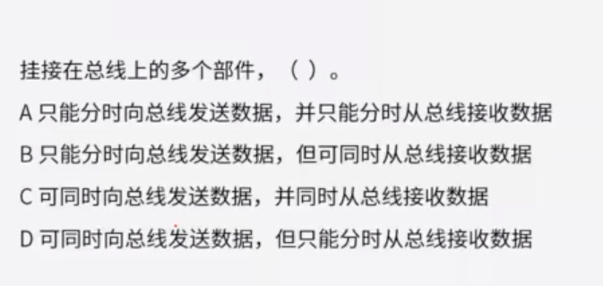
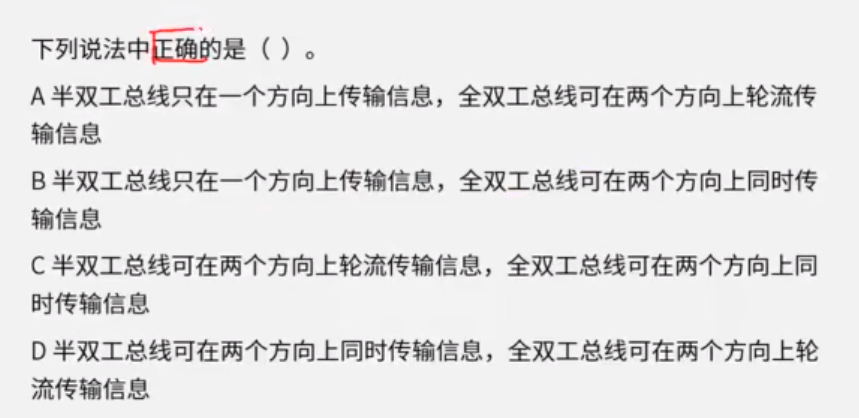
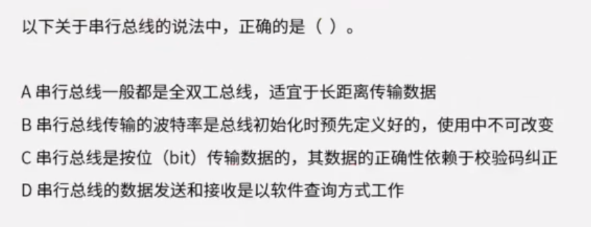
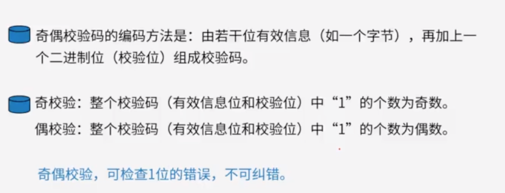
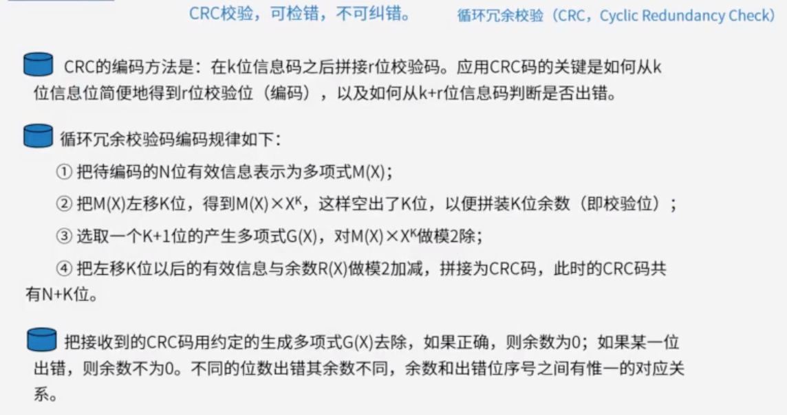
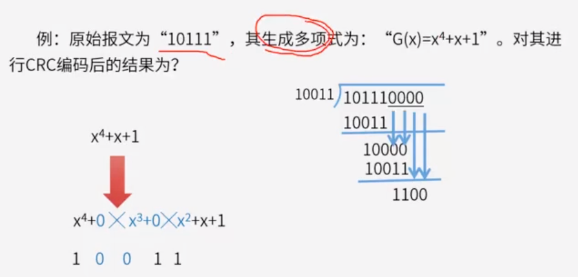
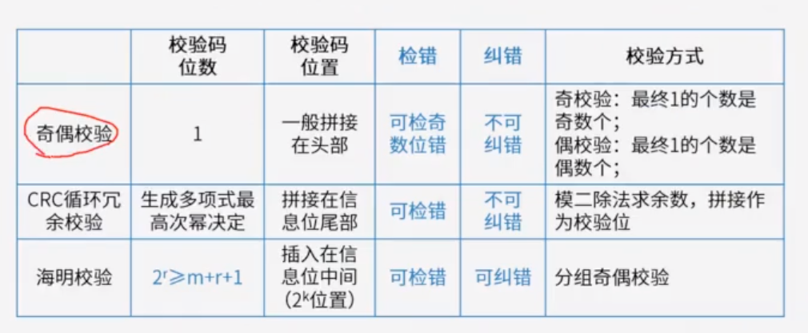
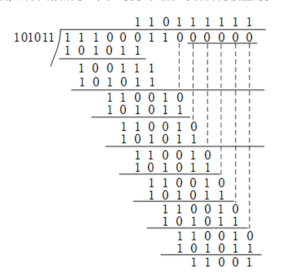

# 一

## 题目

GPU目前已广泛应用于各行各业，最新的GPU峰值性能可高达（）以上。

A:100TFlops

B:50TFlops

C:10TFlops

D:1TFlops

## 答案

A

## 解析

GPU峰值性能可以用FLOPS描述。即每秒浮点运算次数。例如一个GPU的峰值性能为10TFlops，表示它每秒能够执行10万亿次浮点数运算。最新的英伟达GeForce RTX4090 GPU达到100TFlops的算力。

# 二

## 题目

AI芯片是当前人工智能技术发展的核心技术，其能力要支持训练和推理。通常，AI芯片的技术架构包括（）等三种

A：GPU、FPGA、ASIC

B：CPU、PPGA、DSP

C：GPU、CPU、ASIC

D：GPU、FPGA、SOC

## 答案

A

## 解析

GPU是一种通用的高效支持AI应用的芯片；

FPGA可以对芯片硬件层进行编程和配置，实现半定制化，功耗相对较低

ASIC是专门为特定的AI产品或服务而设计的芯片，主要用于加速机器学习，特别是神经网络和深度学习，具有非常高的能效比。

# 三

## 解析

在计算机内部是可以通过总线来传输信息的。总线是一组能为多个部件**分时** **共享**的公共信息传送线路。

- 共享：多个部件共享线路
- 分时：同一个时刻，仅允许一个部件向总线发送信息，但是允许多个部件同时从总线上接收相同的信息

串行总线：适合长距离传输，效率低

并行总线：适合近距离传输，效率高

单工：只能发送或者接受

半双工：轮流实现发送和接收，切换发送和接收功能

全双工：既能发送也能接收

总线宽度：由线的宽度决定，一个脉冲下能通过的比特位的数量

总线带宽：总线宽度 X 总线频率

##### 总线的分类

如果传输的是数据则是数据总线（Data Bus，DB）：在CPU和RAM之间来回传送需要处理或是需要存储的数据。

如果传输的是地址则是地址总线（Address Bus，AB）：用来指定在RAM之中储存的数据的地址。

如果传输的是控制信号则是控制总线（Control Bus，CB）：将微处理器控制单元的信号，传送到周边设备

## 题目1

## 答案1

B

## 题目2

## 答案2

C

## 题目3

## 答案3

C

- 全双工总线适用于长距离没错，但是串行总线是全双工，半双工都常用的只是场景不同
- 串行总线传输的波特率可以在使用中进行改变
- 串行总线的数据发送和接收可以使用多种方式，包括程序查询和终端方式等

# 四

## 题目

CPU的频率有主频、倍频和外频。某处理器外频是200MHz，倍频是13，该处理器的主频是（）

A：2.6GHz

B：1300MHz

C：15.38MHz

D：200MHz

## 答案

A

## 解析

CPU的工作频率又称主频。

工作频率由外频和倍频两部分组成，其中外频指的是系统总线的频率

倍频系数是CPU主频与外频的比例关系。倍频的作用是使系统总线以相对较低的频率工作，而通过倍频来提升CPU的工作频率。

# 五

### 奇偶校验

### CRC循环冗余校验

## 题目

若信息码字为111000110，生成多项式 G(X)=x^5+x^3+x+1 , 则计算出的CRC校验码为（ ）。

A.01101

B. 11001

C. 001101

D. 011001

参考答案：B

