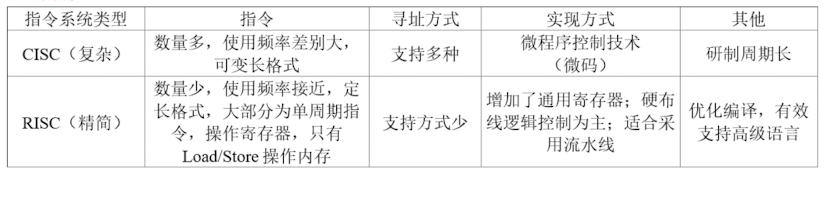
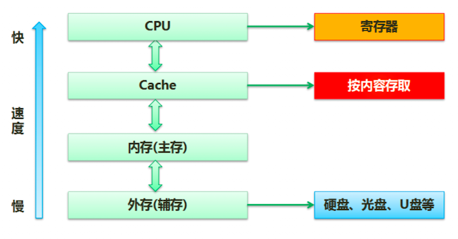
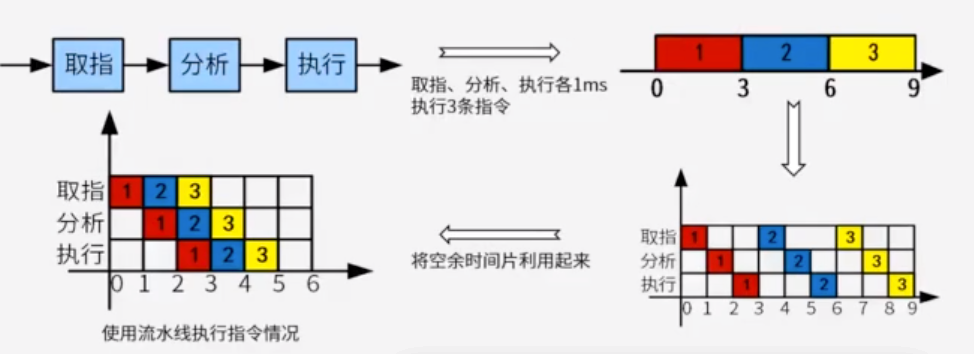
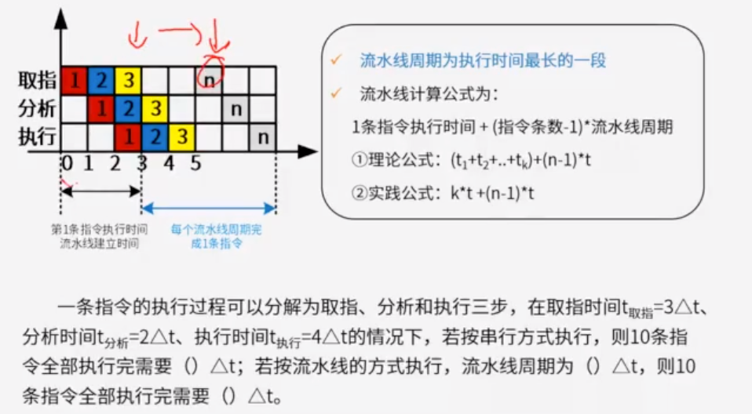
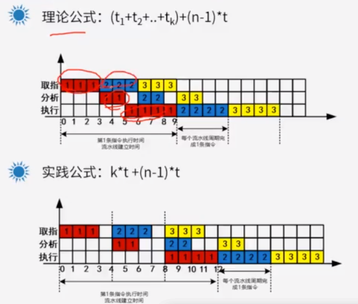
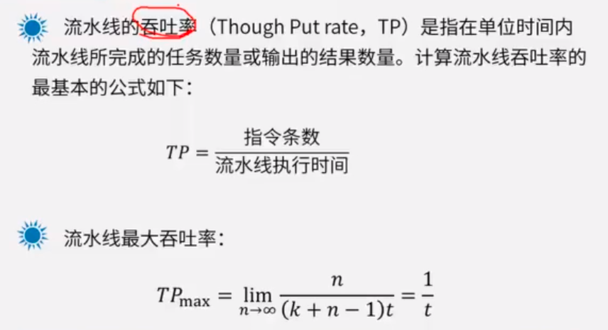
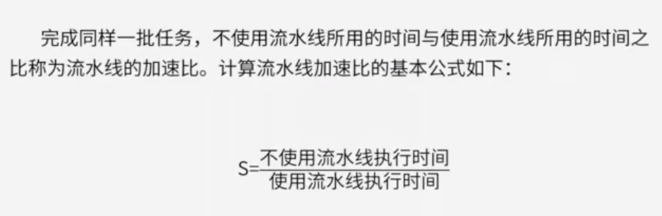

# 一

## 题目

GPU目前已广泛应用于各行各业，最新的GPU峰值性能可高达（）以上。

A:100TFlops

B:50TFlops

C:10TFlops

D:1TFlops

## 答案

A

## 解析

GPU峰值性能可以用FLOPS描述。即每秒浮点运算次数。例如一个GPU的峰值性能为10TFlops，表示它每秒能够执行10万亿次浮点数运算。最新的英伟达GeForce RTX4090 GPU达到100TFlops的算力。

# 二

## 题目

AI芯片是当前人工智能技术发展的核心技术，其能力要支持训练和推理。通常，AI芯片的技术架构包括（）等三种

A：GPU、FPGA、ASIC

B：CPU、PPGA、DSP

C：GPU、CPU、ASIC

D：GPU、FPGA、SOC

## 答案

A

## 解析

GPU是一种通用的高效支持AI应用的芯片；

FPGA可以对芯片硬件层进行编程和配置，实现半定制化，功耗相对较低

ASIC是专门为特定的AI产品或服务而设计的芯片，主要用于加速机器学习，特别是神经网络和深度学习，具有非常高的能效比。

# 三

## 解析

在计算机内部是可以通过总线来传输信息的。总线是一组能为多个部件**分时** **共享**的公共信息传送线路。

- 共享：多个部件共享线路
- 分时：同一个时刻，仅允许一个部件向总线发送信息，但是允许多个部件同时从总线上接收相同的信息

串行总线：适合长距离传输，效率低

并行总线：适合近距离传输，效率高

单工：只能发送或者接受

半双工：轮流实现发送和接收，切换发送和接收功能

全双工：既能发送也能接收

总线宽度：由线的宽度决定，一个脉冲下能通过的比特位的数量

总线带宽：总线宽度 X 总线频率

##### 总线的分类

如果传输的是数据则是数据总线（Data Bus，DB）：在CPU和RAM之间来回传送需要处理或是需要存储的数据。

如果传输的是地址则是地址总线（Address Bus，AB）：用来指定在RAM之中储存的数据的地址。

如果传输的是控制信号则是控制总线（Control Bus，CB）：将微处理器控制单元的信号，传送到周边设备

## 题目1

## 答案1

B

## 题目2

## 答案2

C

## 题目3

## 答案3

C

- 全双工总线适用于长距离没错，但是串行总线是全双工，半双工都常用的只是场景不同
- 串行总线传输的波特率可以在使用中进行改变
- 串行总线的数据发送和接收可以使用多种方式，包括程序查询和终端方式等

# 四题目

CPU的频率有主频、倍频和外频。某处理器外频是200MHz，倍频是13，该处理器的主频是（）

A：2.6GHz

B：1300MHz

C：15.38MHz

D：200MHz

## 答案

A

## 解析

CPU的工作频率又称主频。

工作频率由外频和倍频两部分组成，其中外频指的是系统总线的频率

倍频系数是CPU主频与外频的比例关系。倍频的作用是使系统总线以相对较低的频率工作，而通过倍频来提升CPU的工作频率。

# 五

### 奇偶校验

### CRC循环冗余校验

## 题目

若信息码字为111000110，生成多项式 G(X)=x^5+x^3+x+1 , 则计算出的CRC校验码为（ ）。

A.01101

B. 11001

C. 001101

D. 011001

参考答案：B

# 六

## 题目

DMA（直接存储器访问）工作方式是在（）之间建立起直接的数据通路

A：CPU与外设

B：CPU与主存

C：主存与外设

D：外设与外设

## 答案

C

## 解析

直接存储器访问（DMA）是指数据在主存与IO设备间的直接成块传输。即在主存与IO设置间传送数据块的过程中，不需要CPU做任何干涉。

# 七

https://www.aliyundrive.com/drive/file/backup/64ef5251886e5071c33e46c4b5b8cc4568050207

23-CISC与RISC.mp4

## 题目1

RISC(精简指令系统计算机）的特点不包括：（  ）。

- A , 指令长度固定，指令种类尽量少
- B , 寻址方式尽量丰富，指令功能尽可能强
- C , 增加寄存器数目，以减少访存次数
- D , 用硬布线电路实现指令解码，以尽快完成指令译码

## 答案1

B

## 题目2

以下关于CISC（Complex Instruction Set Computer，复杂指令集计算机）和RISC（Reduced Instruction Set Computer，精简指令集计算机）的叙述中，错误的是（  ）。

A , 在CISC中，复杂指令都采用硬布线逻辑来执行

B , 一般而言，采用CISC技术的CPU，其芯片设计复杂度更高

C , 在RISC中，更适合采用硬布线逻辑执行指令

D , 采用RISC技术，指令系统中的指令种类和寻址方式更少

## 答案2

A

# 八

## 题目

在嵌入式系统的存储部件中，存取速度最快的是（）

A：内存

B：寄存器组

C：Flash

D：Cache

## 答案

B

## 解析

# 九

## 题目

一般说来，SoC 称为系统级芯片，也称片上系统，它是一个有专用且标的集成电路产品：以下关于 SoC 不正确的说法是（）。
 A.SoC 是一种技术，是以实际的、确定的系统功能开始，到软/硬件划分，并完成设计的整个过程
 B.SoC 是一款具有运算能力的处理器芯片，可面向特定用途进行定制的标准产品
 C.SoC 是信息系统核心的芯片集成，是将系统关键部件集成在一块芯片上，完成信息系统的核心功能
 D.SoC 是将微处理器、模拟 IP 核、数字 IP 核和存储器(或片外存储控制接口)集成在单一芯片上，是面向特定用途的标准产品

## 答案

B

## 解析

SoC是一个具有专用目标的集成电路，包含了完整的系统并嵌入了软件。从狭义角度来讲，SoC是信息系统核心的芯片集成，将系统关键部件集成在一块芯片上。从广义角度来讲，SoC是一个微型系统，可以将大脑、心脏、眼睛和手能组成部分理解为一个整体。国内外学术界一般将SoC定义为将微处理器、模拟IP核、数字IP核和存储器集成在单一芯片上的定制或面向特定用途的标准产品。

SoC不是处理器芯片

# 十

## 题目

人工智能技术已成为当前国际科技竞争的核心技术之一，AI芯片是占据人工智能市场的法宝。AI芯片有别于通常处理器芯片，它应具备四种关键特征。（ ）是AI芯片的关键特点。

 A.  新型的计算范式、信号处理能力、低精度设计、专用开发工具

  B.  新型的计算范式、训练和推断、大数据处理能力、可重构的能力

  C.  训练和推断、大数据处理能力、可定制性，专用开发工具

  D.  训练和推断、低精度设计、新型的计算范式、图像处理能力

## 答案

B

## 解析

AI芯片的关键特征：
1.新型的计算范式

AI 计算既不脱离传统计算，也具有新的计算特质，如处理的内容往往是非结构化数据（视频、图片等）。处理的过程通常需要很大的计算量，基本的计算主要是线性代数运算（如张量处理），而控制流程则相对简单。处理的过程参数量大。

2. 训练和推断

AI 系统通常涉及训练（Training）和推断（Inference）过程。简单来说，训 练过程是指在已有数据中学习，获得某些能力的过程；而推断过程则是指对新的数据，使用这些能力完成特定任务（比如分类、识别等）。

3. 大数据处理能力

人工智能的发展高度依赖海量的数据。满足高效能机器学习的数据处理要求是AI 芯片需要考虑的最重要因素。

4. 数据精度

低精度设计是AI 芯片的一个趋势，在针对推断的芯片中更加明显。对一些应用来说，降低精度的设计不仅加速了机器学习算法的推断（也可能是训练），甚至可能更符合神经形态计算的特征。

5. 可重构的能力

针对特定领域（包括具有类似需求的多种应用）而不针对特定应用的设计，将是AI 芯片设计的一个指导原则，具有可重构能力的AI 芯片可以在更多应用中大显身手，并且可以通过重新配置，适应新的AI 算法、架构和任务。

6. 开发工具

就像传统的CPU 需要编译工具的支持， AI 芯片也需要软件工具链的支持，才能将不同的机器学习任务和神经网络转换为可以在AI 芯片上高效执行的指令代码，如NVIDIA GPU 通过CUDA 工具获得成功。

# 十一

## 题目

目前处理器市场中存在CPU和DSP两种类型处理器，分别用于不同场景，这两种处理器具有不同体系结构，DSP采用（）。

A：冯.诺伊曼结构

B：哈佛结构

C：FPGA结构

D：与GPU相同结构

## 答案

B

## 解析

哈佛结构：数据程序分开。

冯.诺伊曼结构：数据程序在一起。

GPU：冯.诺伊曼升级版本。

DSP芯片作为一种具有特殊结构的微处理器，其设计采用哈佛结构、流水线操作、独立的硬件乘法器、特殊的DSP指令、独立的DMA总线和控制器，使得其指令周期可以在10ns以下，从而实现实时处理许多数字信号处理应用。DSP芯片还具有多处理器接口和JTAG标准测试接口等功能，以提高处理速度和便于测试。DSP芯片被广泛应用于各种计算密集型的应用，如多媒体功能和数字滤波

# 十二

## 题目

嵌入式处理器是嵌入式系统的核心部件，一般可分为嵌入式微处理器（MPU）、微控制器（MCU），数字信号处理器（DSP）和片上系统（SOC）。以下叙述中，错误的是（）

A. MPU在安全性和可靠性等方面进行增强，适用于运算量较大的智能系统。

B. MCU典型代表是单片机，体积小从而使功耗和成本下降。

C. DSP处理器对系统结构和指令进行了特殊设计，适合数字信号处理。

D. SOC是一个专用目标的集成电路，其中包括完整系统并有嵌入式软件的全部内容。

## 答案

A

## 解析

MPU采用增强型通用微处理器。虽然在工作温度、电磁兼容性、可靠性等方面要求较高，但在功能方面与通用的微处理器基本相同。

MCU是将CPU、RAM、ROM定时计数器和多种IO接口集成在一片芯片上的芯片级计算机，主要用于不同应用场合的组合控制。

DSP是一种独特的微处理器，是以数字信号来处理大量信息的器件，有着强大的数据处理能力和高运行速度。

SOC是一个集成电路产品，包含了完整的系统和嵌入的软件。

# 十三

## 题目

以下嵌入式处理器类型中不具备内存管理单元(MMU)的是（1），嵌入式操作系统（2）可以运行在它上面。
(1)

A．PowerPC750
B．ARM920T
C．Cortex-M3
D．MIPS32 24K
(2)

A．Linux
B．VxWorks653
C．UC/OS-II
D．Windows CE

## 答案

C

C

## 解析

Cortex-M3处理器不带MMU，UC/OS-II是一种典型的嵌入式操作系统

# 十四

流水线

流水线执行时间计算、流水线吞吐率、流水线加速比

流水线是指在程序执行时多条指令重叠进行操作的一种准并行处理实现技术。各种部件同时处理是针对不同指令而言的，他们可同时为多条指令的不同部分进行工作，以提高各部件的利用率和指令的平均执行速度

## 题目1

一条指令的执行过程可以分解为取指、分析和执行三步，在取指时间t取指= 3Δt、分析时间t执行= 2Δt 、执行时间t执行= 4Δt的情况下，若按串行方式执行，则10条指令全部执行完需要（90） Δt ；若按流水线的方式执行，流水线周期为（4） Δt ，则10条指令全部执行完需要 （45） Δt 。

## 解析

串行执行：（3+2+4）x10=90

流水线执行：

- 流水线周期：是执行时间最长的一段所以为4
- 十条指令执行完：按照理论公式（3+2+4）+（10-1）x4=45，按照实践公示：（4+4+4）+（10-1）x4=48

## 题目2

吞吐率

流水线的吞吐率(Though Put rate，TP)是指在单位时间内流水线所完成的任务数量或输出的结果数量。计算流水线吞吐率的最基本的公式如下:

一条指令的执行过程可以分解为取指、分析和执行三步，在取指时间t取指= 3Δt、分析时间t执行= 2Δt 、执行时间t执行= 4Δt的情况下，

10条指令的吞吐率？最大吞吐率？

## 解析

10条指令的吞吐率：10/45

最大吞吐率：1/4

## 题目3

流水线加速比

完成同样一批任务，不使用流水线所用的时间与使用流水线所用的时间之比称为流水线的加速比。计算流水线加速比的基本公式如下：

某计算机系统采用5级流水线结构执行指令,设每条指令的执行由取指令(2Δt),分析指令(1Δt),取数操作(3Δt),运算(1Δt)和写回结果(2Δt)组成,并分别用5个子部件完成,该流水线的最大吞吐量(?);若连续向流水线输入10条指令,则该流水线的加速比为(?);

## 解析

最大吞吐量：1/t即1/3

流水线的加速比：（2+1+3+1+2）x10 ：（2+1+3+1+2）+（10-1）x3即5:2