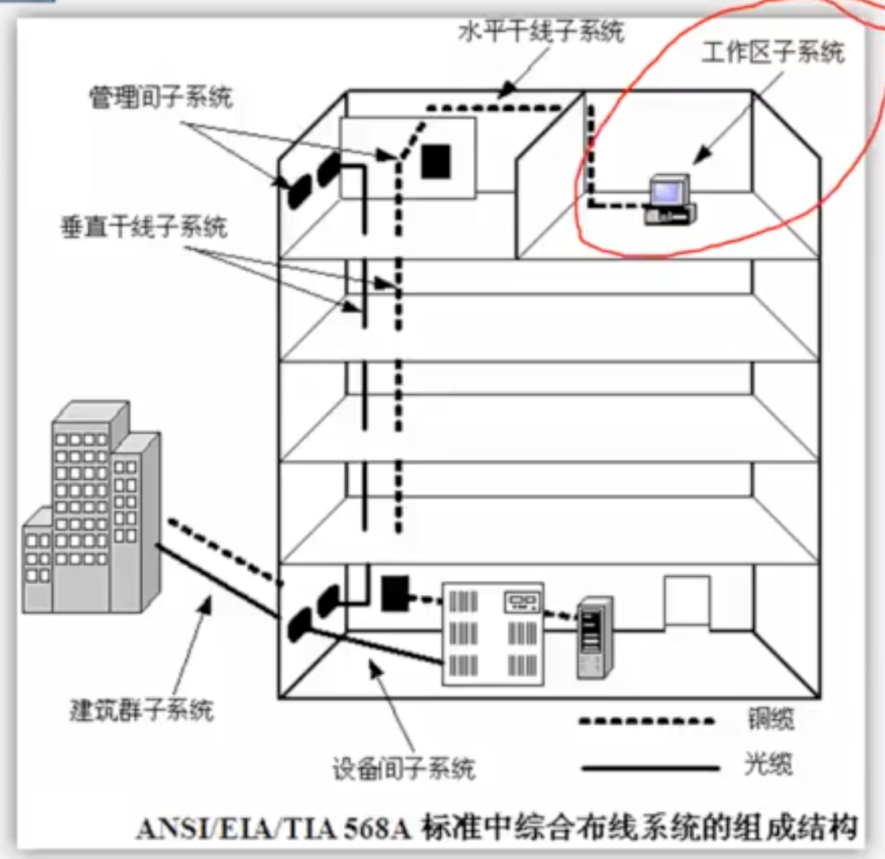
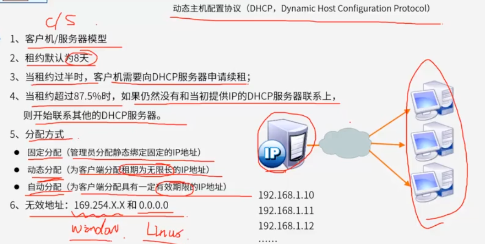
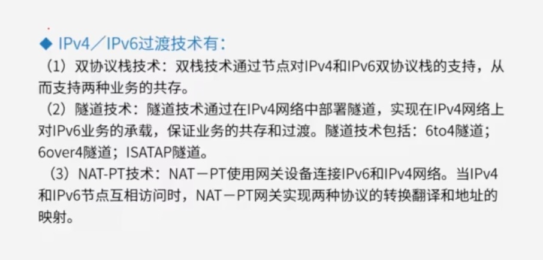
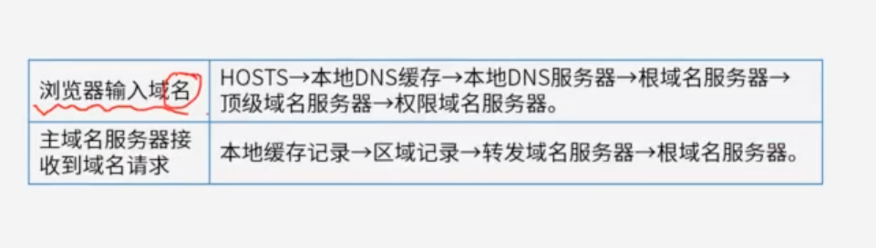

# 一题目

SDN(SoftwareDefinedNetwok)的网络架构中不包含（）。
 A.逻辑层
 B.控制层
 C.转发层
 D.应用层

## 答案

A

## 解析

SDN本质是将网络软件化，这样就可以像升级、安装软件一样对网络进行修改，方便更多的应用程序能快速部署到网络上。

SDN网络架构有三层，分别是应用层、控制层和数据转发层

- 应用层：对应用户不同的业务和应用
- 控制层：主要负责处理数据平面资源的编排、维护网络拓扑、状态信息等
- 数据转发层：负责用户数据的转发

# 二题目

下面关于网络延迟的说法中，正确的是（） 。

问题1选项
A.在对等网络中，网络的延迟大小与网络中的终端数量无关
B.使用路由器进行数据转发所带来的延迟小于交换机
C.使用Internet服务能够最大限度地减小网络延迟
D.服务器延迟的主要影响因素是队列延迟和磁盘IO延迟

## 答案

D

## 解析

https://hls.videocc.net/060fd1513e/8/060fd1513e9bc982403c13954e432db8.m3u8?device=desktop&pid=1694555324085X1780147

对等网络，即对等计算机网络，是一种在对等者(Peer)之间分配任务和工作负载的分布式应用架构，是对等计算模型在应用层形成的一种组网或网络形式。在对等网络中，由于采用总线式的连接，因此网络中的终端数量越多，终端所能够分配到的转发时隙就越小，所带来的延迟也就越大。A选项错误。
路由器一般采取存储转发方式，而交换机采取的是直接转发方式，相比存储转发方式，直接转发方式转发时延更小。因为存储转发方式需要对待转发的数据包进行重新拆包，分析其源地址和目的地址，再根据路由表对其进行路由和转发，而直接转发方式不对数据包的三层地址进行分析，因此路由器转发所带来的延迟要大于交换机。B选项错误。
数据在Internet中传输时，由于互联网中的转发数据量大且所需经过的节点多，势必会带来更大的延迟。C选项错误。
网络延迟=处理延迟+排队延迟+发送延迟+传播延迟。如果不考虑网络环境，服务器的延迟的主要因素是队列延迟和磁盘IO延迟。D选项正确。

# 三题目

以下关于网络冗余设计的叙述中，错误的是（ ）。

A.网络冗余设计避免网络组件单点失效造成应用失效
B.备用路径与主路径同时投入使用，分担主路径流量
C.负载分担是通过并行链路提供流量分担来提高性能的
D.网络中存在备用链路时，可以考虑加入负载分担设计

## 答案

B

## 解析

https://hls.videocc.net/060fd1513e/6/060fd1513e213876e0d3322374a352e6.m3u8?device=desktop&pid=1694556092420X1810564

https://www.aliyundrive.com/drive/file/backup/64ef5258de3d0a235a734d7b9170de5a5dedc51a （65-网络冗余设计.mp4）

对网络进行冗余设计的目的是提高网络的可用性，避免网络组件单点失效造成应用不可用，A选项描述正确。

备用路径也就是在主路径失效的时候开始启用，和主路径承担的是不同的网络负载，B选项同时投入使用的说法是错误的。本题选择B选项。

负载分担是网络冗余设计的一种设计方式，可以通过并行链路提供流量分担，从而提高整体性能，C选项描述正确。

网络中有备用链路时，可以增加负载分担设计从而减轻主路径负担，D选项说法正确。

# 四题目

网络逻辑结构设计的内容不包括（ ）。

A.逻辑网络设计图
B.IP地址方案
C.具体的软硬件、广域网连接和基本服务
D.用户培训计划

## 答案

D

## 解析

https://hls.videocc.net/060fd1513e/9/060fd1513e4bbbdcada968fc687da4f9.m3u8?device=desktop&pid=1694556887733X1618103

https://www.aliyundrive.com/drive/file/backup/64ef5258de3d0a235a734d7b9170de5a5dedc51a （63-网络规划与设计.mp4）

**逻辑网络设计**利用需求分析和现有网络体系分析的结果来设计逻辑网络结构，最后得到一份逻辑网络设计文档，输出内容包括以下几点： 1、逻辑网络设计图 2、IP地址方案 3、安全方案 4、招聘和培训网络员工的具体说明 5、对软硬件、服务、员工和培训的费用初步估计。

**物理网络设计**是对逻辑网络设计的物理实现，通过对设备的具体物理分布、运行环境等确定，确保网络的物理连接符合逻辑连接的要求。输出如下内容： 1、网络物理结构图和布线方案 2、设备和部件的详细列表清单 3、软硬件和安装费用的估算 4、安装日程表，详细说明服务的时间以及期限 5、安装后的测试计划 6、用户的培训计划 由此可以看出D选项的工作是物理网络设计阶段的任务。

##### 网络规划与设计的步骤

##### 逻辑网络设计

##### 物理网络设计

## 题目2

网络系统设计过程中，物理网络设计阶段的任务是（  ）。

A.依据逻辑网络设计的要求，确定设备的具体物理分布和运行环境
B.分析现有网络和新网络的各类资源分布，掌握网络所处的状态
C.根据需求规范和通信规范，实施资源分配和网络规划
D.理解网络应该具有的功能和性能，最终设计出符合用户需求的网络

## 答案2

A

物理网络设计包含了物理设备选型、网络中心机房设计、综合布线系统设计、物理网络设计文档等内容。B答案是需求分析阶段，C和D都是逻辑网络设计的内容。

## 题目3

网络系统生命周期可以划分为5个阶段，实施这5个阶段的合理顺序是（）。

A. 需求规范、通信规范、逻辑网络设计、物理网络设计、实施阶段
B. 需求规范、逻辑网络设计、通信规范、物理网络设计、实施阶段
C. 通信规范、物理网络设计、需求规范、逻辑网络设计、实施阶段
D. 通信规范、需求规范、逻辑网络设计、物理网络设计、实施阶段

## 答案3

A

## 题目4

网络设计过程包括逻辑网络设计和物理网络设计两个阶段，下面的选项中， （ ）应该属于逻辑网络设计阶段的任务。

A.选择路由协议
B.设备选型
C.结构化布线
D.机房设计

## 答案4

A

逻辑网络设计的内容包括：网络结构设计、物理层技术选择、局域网技术选择与应用、广域网技术选择与应用、地址设计与命名模型、路由协议选择、网络管理、网络安全、逻辑网络设计文档。
物理网络设计的内容包括：设备选型、结构化布线、机房设计及物理网络设计相关的文档规范（如：软硬件清单，费用清单）。

# 五

## 题目

某企业通过一台路由器上联总部，下联4个分支机构，设计人员分配给下级机构一个连续的地址空间，采用一个子网或者超网段表示。这样做的主要作用是（）

A.层次化路由选择
B.易于管理和性能优化
C.基于故障排查
D.使用较少的资源

## 答案

A

## 解析

https://hls.videocc.net/060fd1513e/6/060fd1513e34e65bbf8be0ae56d29326.m3u8?device=desktop&pid=1694613421050X1559362

层次化路由的含义是指对网络拓扑结构和配置的了解是局部的，一台路由器不需要知道所有的路由信息，只需要了解其管辖的路由信息，层次化路由选择需要配合层次化的地址编码。而子网或超网就属于层次化地址编码行为。

https://www.aliyundrive.com/drive/file/backup/64ef5258de3d0a235a734d7b9170de5a5dedc51a （64-层次化网络设计.mp4）

## 题目2

大型局域网通常划分为核心层、汇聚层和接入层。以下关于各个网络层次的描述中，不正确的是______。 

A．核心层承担访问控制列表检查

B．汇聚层定义了网络的访问策略

C．接入层提供局域网络接入功能

D．接入层可以使用集线器代替交换机

## 答案2

A

## 题目3

核心层交换机应该实现多种功能，下面选项中，不属于核心层特性的是（ ）。
A.高速连接
B.冗余设计
C.策略路由
D.较少的设备连接

## 答案3

C

## 题目4

某高校欲构建财务系统，使得用户可通过校园网访问该系统。根据需求，公司给出如下2套方案。
方案一：
1）出口设备采用一台配置防火墙板卡的核心交换机，并且使用防火墙策略将需要对校园网做应用的服务器进行地址映射；
2）采用4台高性能服务器实现整体架构，其中3台作为财务应用服务器、1台作为数据备份管理服务器；
3）通过备份管理软件的备份策略将3台财务应用服务器的数据进行定期备份。
方案二：
1）出口设备采用一台配置防火墙板卡的核心交换机，并且使用防火墙策略将需要对校园网做应用的服务器进行地址映射；
2）采用2台高性能服务器实现整体架构，服务器采用虚拟化技术，建多个虚拟机满足财务系统业务需求。当一台服务器出现物理故障时将业务迁移到另外一台物理服务器上。
与方案一相比，方案二的优点是（ ）。方案二还有一些缺点，下列不属于其缺点的是（ ）。

问题1选项
A.网络的安全性得到保障
B.数据的安全性得到保障
C.业务的连续性得到保障
D.业务的可用性得到保障

问题2选项
A.缺少企业级磁盘阵列，不能将数据进行统一的存储与管理
B.缺少网闸，不能实现财务系统与Internet的物理隔离
C.缺少安全审计，不便于相关行为的记录、存储与分析
D.缺少内部财务用户接口，不便于快速管理与维护

## 答案4

第1题:C

第2题:B

## 解析

本题考查网络规划与设计案例。
与方案一相比，方案二服务器采用虚拟化技术，当一台服务器出现物理故障时将业务迁移到另外一台物理服务器上，保障了业务的连续性。网络的安全性、数据的安全性、业务的可用性都没有发生实质性变化。
当然方案二还有一些缺陷。首先缺少将数据进行统一的存储与管理的企业级磁盘阵列；其次缺少安全审计，不便于相关行为的记录、存储与分析；而且缺少内部财务用户接口，不便于快速管理与维护。但是如果加网闸，就不能实现对财务系统的访问。不能实现用户可通过校园网对财务系统的访问。

# 六

## 题目

IETF定义的集成服务（IntServ）把Internet服务分成了三种服务质量不同的类型，这三种服务不包括（  ）。

A.保证质量的服务：对带宽、时延、抖动和丢包率提供定量的保证
B.尽力而为的服务：这是一般的Internet服务，不保证服务质量
C.负载受控的服务：提供类似于网络欠载时的服务，定性地提供质量保证
D.突发式服务：如果有富余的带宽，网络保证满足服务质量的需求

## 答案

D

## 解析

https://hls.videocc.net/060fd1513e/3/060fd1513eb25e77c257f9ee95f41573.m3u8?device=desktop&pid=1694643275988X1924091

IETF集成服务（IntServ）工作组根据服务质量的不同，把Internet服务分成了三种类型。

保证质量的服务（Guaranteed Services）：对带宽、时延、抖动和丢包率提供定量的保证。

负载受控的服务（Controlled—load Services）：提供一种类似于网络欠载情况下的服务，这是一种定性的指标。

尽力而为的服务（Best-Effort）：这是Internet提供的一般服务，基本上无任何质量保证。

# 七

## 题目

以下关于层次化网络设计原则的叙述中，错误的是（ ）。

A.一般将网络划分为核心层、汇聚层、接入层三个层次
B.应当首先设计核心层，再根据必要的分析完成其他层次设计
C.为了保证网络的层次性，不能在设计中随意加入额外连接
D.除去接入层，其他层次应尽量采用模块化方式，模块间边界应非常清晰

## 答案

B

## 解析

https://hls.videocc.net/060fd1513e/e/060fd1513e35f9cf11f95ffcaa75136e.m3u8?device=desktop&pid=1694643910814X1031662

进行网络层次化设计时，一般分为核心层、汇聚层、接入层三个层次。

为了保证网络的层次性，不能在设计中随意加入额外连接、

除去接入层，其他层次应尽量采用模块化方式，模块间的边界应非常清晰。

进行层次化网络设计时，应是先从接入层开始设计，然后逐级往核心层走。原因是接入层其实代表了需求，是因为有大量终端设备要接入，并有速度上的要求，才有了汇聚层要达到什么要求，核心层得怎么设计。选项B的说法，本末倒置了。

# 八

## 题目

在网络需求详细分析中除包括网络总体需求分析、综合布线需求分析、网络可用性与可靠性分析、网络安全性分析，还需要做的工作是（）。
A．网络工程造价评估
B．网络工程进度安排
C．网络硬件设备选型
D．网络宽带接入需求分析

## 答案

A

# 九

## 题目

假如有3块容量是80G的硬盘做RAID 5阵列，则这个RAID 5的容量是（）。而如果有2块80G的盘和1块40G的盘，此时RAID 5的容量是（）。

第一问答案：

A.240G

B.160G

C.80G

D.40G

第二问答案

A.40G

B.80G

C.160G

D.200G

## 答案

B

B

## 解析

RAID5的存储机制是两块存数据，一块存另外两块硬盘的交易校验结果。RAID5的建立后，坏掉一块硬盘，可以通过另外两块硬盘的数据算出第三块的，所以至少要3块。RAID5是一种旋转奇偶校验独立存取的阵列方式，它与RAID3，RAID4不同的是没有固定的校验盘，而是按某种规则把奇偶校验信息均匀地分布在阵列所属的硬盘上。

所以在每块硬盘上，既有数据信息也有校验信息。这一改变解决了争用校验盘的问题，使得在同一组内并发进行多个写操作。所以RAID5既适用于大数据量的操作，也适用于各种事务处理，它是一种快速、大容量和容错分布合理的磁盘阵列。当有N块阵列盘时，用户空间为N-1块盘容量。

根据以上原理，共有3块80G的硬盘做RAID5，则总容量为(3-1)×80=160G;如果有2块80G的盘和1块40G的盘，则以较小的盘的容量为计算方式，总容量为(3-1)×40=80G。

https://www.aliyundrive.com/drive/file/backup/64ef5258de3d0a235a734d7b9170de5a5dedc51a 67-磁盘阵列Raid.mp4

# 十

综合布线

## 题目1

建筑物综合布线系统中的垂直子系统是指______。

 A．由终端到信息插座之间的连线系统

B．楼层接线间的配线架和线缆系统

C．各楼层设备之间的互连系统

D．连接各个建筑物的通信系统

## 答案1

C

## 题目2

结构化布线系统分为六个子系统，其中水平子系统的作用是 （）

A.由各种交叉连接设备以及集线器和交换机等设备组成

B.连接了干线子系统和工作区子系统

C.由终端设备到信息插座的整个区域组成

D.实现各楼层设备间子系统之间的互连

## 答案2

B

# 十一

## 题目

电子邮件客户端通过发起对（ ）服务器的（ ）端口的TCP连接来进行邮件发送。

问题1选项
A.POP3
B.SMTP
C.HTTP
D.IMAP

问题2选项
A.23
B.25
C.110
D.143

## 答案

第1题:B

第2题:B

## 解析

https://hls.videocc.net/060fd1513e/1/060fd1513e185654479bcef98d2430c1.m3u8?device=desktop&pid=1694842742115X1935101

IMAP是POP3的升级

# 十二

## 题目

5G网络采用（ ）可将5G网络分割成多张虚拟网络，每个虚拟网络的接入，传输和核心网是逻辑独立的，任何一个虚拟网络发生故障都不会影响到其它虚拟网络。

A.网络切片技术
B.边缘计算技术
C.网络隔离技术
D.软件定义网络技术

## 答案

A

## 解析

https://hls.videocc.net/060fd1513e/c/060fd1513ed15a232713badc85ff2e5c.m3u8?device=desktop&pid=1694843125091X1814987

5G网络的切片技术是将5G网络分割成多张虚拟网络，从而支持更多的应用。就是将一个物理网络切割成多个虚拟的端到端的网络，每个虚拟网络之间，包括网络内的设备、接入、传输和核心网，是逻辑独立的，任何一个虚拟网络发生故障都不会影响到其它虚拟网络。在一个网络切片中，至少可分为无线网子切片、承载网子切片和核心网子切片三部分。答案为A选项。

# 十三

## 题目

以下 wifi 认证方式中，（ ）使用了AES加密算法，安全性更高。

A.开放式
B.WPA
C.WPA2
D.WEP

## 答案

C

## 解析

- 开放式认证方式：完全不认证也不加密。
- WEP:最基本的加密技术，全称为有线等效保密，是一种数据加密算法，它的安全技术源自于名为RC4的RSA数据加密技术，是无线局域网WLAN的必要的安全防护层。
- WPA：WiFi Protected Access，全称为WiFi网络安全存取。WPA协议是在前一代有线等效加密（WEP）的基础上产生的，解决了前任WEP的缺陷问题，它使用TKIP（临时密钥完整性）协议，是IEEE802.11i标准中的过渡方案。在安全的防护上比WEP更为周密，主要体现在身份认证、加密机制和数据包检查等方面，而且它还提升了无线网络的管理能力。RC4
- WPA2:是WPA加密的升级版。它是WiFi联盟验证过的IEEE802.11i标准的认证形式，WPA2实现了802.11i的强制性元素，特别是Michael算法被公认彻底安全的CCMP（计数器模式密码块链消息完整码协议）讯息认证码所取代、而RC4加密算法也被AES（高级加密）所取代
- WPA-PSK/WPA2-PSK:是WPA与WPA2两种加密算法的混合体，是目前安全性最好的WiFi加密模式。WPA-PSK也叫做WPA-Personal（WPA个人）。WPA-PSK使用TKIP加密方法把无线设备和接入点联系起来。WPA2-PSK使用AES加密方法把无线设备和接入点联系起来。使用AES加密算法不仅安全性能更高，而且由于其采用的是最新技术，因此，在无线网络传输速率上面也要比TKIP更快。

# 十四

## 题目

以下关于以太网交换机转发表的叙述中，正确的是（）。

A.交换机的初始MAC地址表为空
B.交换机接收到数据帧后，如果没有相应的表项则不转发该帧
C.交换机通过读取输入帧中的目的地址添加相应的MAC地址表项
D.交换机的MAC地址表项是静态增长的，重启时地址表清空

## 答案

A

## 解析

https://hls.videocc.net/060fd1513e/d/060fd1513e271bde4050dedf0446422d.m3u8?device=desktop&pid=1694868750222X1314514

交换机是一种基于MAC地址，能完成封装转发数据帧功能的网络设备。

交换机的初始MAC地址表为空，

可以通过读取进入端口的帧的源MAC地址学习。

交换机接收到数据顿后，如果没有相应的表项则广播转发该帧。

交换机的MAC地址表项是动态增长的。

# 十五

## 题目

Internet网络核心采取的交换方式为（ ）。
A.分组交换
B.电路交换
C.虚电路交换
D.消息交换

## 答案

A

## 解析

https://hls.videocc.net/060fd1513e/d/060fd1513ea2883c9503397ddd0362cd.m3u8?device=desktop&pid=1694869039011X1159071

Internet网的网络层核心协议是IP协议，而IP协议是一种分组交换的协议，所以应选A。

分组交换是将用户的消息划分为一定长度的数据分组，然后在分组数据上加上控制信息和地址，然后经过分组交换机发送到目的地址。

# 十六

## 题目

在Linux中，负责配置DNS的文件是( )，它包含了主机的域名搜索顺序和DNS服务器的地址。

A./etc/hostname

B./dev/host.conf

C./etc/resolv.conf

D./dev/name.conf

## 答案

C

在Linux等大部分unix系统中，dns服务器的IP地址一般保存在/etc/resolv.conf文件中。

在这个文件中，每一行都包含一个关键字和对应的参数，其中常用的关键字包括nameserver、domain和search

nameserver用于指向dns服务器的IP地址，可以有多行

domain用于定义默认的域名

search表示要查询的域名的顺序

# 十七

## 题目

下面关于Kerberos认证的说法中，错误的是（）。

A.Kerberos 是在开放的网络中为用户提供身份认证的一种方式
B.系统中的用户要相互访问必须首先向CA申请票据
C.KDC中保存着所有用户的账号和密码
D.Kerberos 使用时间戳来防止重放攻击

## 答案

B

## 解析

https://hls.videocc.net/060fd1513e/2/060fd1513ea98f72507d417a7de3ce32.m3u8?device=desktop&pid=1694869728930X1584002

Kerberos是一种网络认证协议，其设计目标是通过密钥系统为客户端和服务器提供强大的认证服务。

Kerberos作为可信赖的第三方认证服务，通过传统的密码技术（如共享密钥）执行认证服务，可以实现单点登录的效果。

Kerberos使用两个服务器。认证服务器AS和票据服务器TGS

- 用户首先向认证服务器AS申请初始票据，然后票据授权服务器（TGS）获得会话密码，所以B错误不是向CA申请
- Kerberos可以防止偷听和重放攻击，保护数据的完整性。当客户向票据授予服务器（TGS）请求会话票据时会发送用于会话密钥加密的时间戳，以防止重放攻击；当客户使用从票据授予服务器获取的会话票据请求登录时，要附上用该会话票据加密的时间戳，以防止重放攻击

# 十八

## 题目

TCP端口号的作用是（ ）。

A.流量控制
B.ACL过滤
C.建立连接
D.对应用层进程的寻址

## 答案

D

## 解析

TCP协议是可靠的传输层协议，会建立连接，并且可以进行流量控制，但这些不是TCP端口号的作用。因此A、C选项描述错误。
ACL过滤：访问控制列表（Access Control List，ACL） 是路由器和交换机接口的指令列表，用来控制端口进出的数据包。ACL适用于所有的被路由协议，如IP、IPX、AppleTalk等。与TCP端口无直接关联。因此B选项错误。
TCP协议可以依据端口号将报文交付给上层的某一进程，可以对应用层进程进行寻址。

# 十九

## 题目

Web 页面访问过程中，在浏览器发出HTTP请求报文之前不可能执行的操作是（ ）。

A.查询本机DNS缓存，获取主机名对应的IP地址
B.发起DNS请求，获取主机名对应的IP地址
C.使用查询到的IP地址向目标服务器发起TCP连接
D.发送请求信息，获取将要访问的Web应用

## 答案

D

## 解析

https://hls.videocc.net/060fd1513e/c/060fd1513e97483d0bb0976c973850dc.m3u8?device=desktop&pid=1694909770005X1156268

HTTP的访问步骤如下：
（1）浏览器分析超链指向WEB服务器的 URL。
（2）浏览器向 DNS 请求解析URL中域名对应的 IP 地址。
（3）域名系统 DNS 解析出服务器IP 地址。
（4）浏览器与服务器建立 TCP 连接。
（5）浏览器发出取文件请求，如：GET /chn/yxsz/index.htm。
（6）服务器给出响应，把文件 index.htm 发给浏览器。
（7）TCP 连接释放。
（8）浏览器显示网页内容。

# 二十

## 题目

以下关于DHCP服务的说法中，正确的是（ ）。

A.在一个园区网中可以存在多台DHCP服务器
B.默认情况下，客户端要使用DHCP服务需指定DHCP服务器地址
C.默认情况下，客户端选择DHCP服务器所在网段的IP地址作为本地地址
D.在DHCP服务器上，只能使用同一网段的地址作为地址池

## 答案

A

## 解析

DHCP服务可以服务于一个网段，也可以通过DHCP中继服务多个子网，所以不一定在同一个网段，所以C和D选项有误。

因为客户端要自动获取IP，此时并不知道DHCP服务器在哪，刚开始以广播形式发送DHCP请求，所以B选项有误。

在一个网段中可以配置多台DHCP服务器，答案选A。

https://hls.videocc.net/060fd1513e/6/060fd1513ea7fa4e7690bc8b54ee0f46.m3u8?device=desktop&pid=1694910649940X1590760

https://www.aliyundrive.com/drive/file/backup/64ef5258de3d0a235a734d7b9170de5a5dedc51a （62-DHCP服务应用.mp4）

# 二十一

## 题目

下列协议中与电子邮件安全无关的是（ ）。

A.SSL
B.HTTPS
C.MIME
D.PGP

## 答案

C

## 解析

- 传输层安全性协议TLS及其前身安全套接层SSL是一种安全协议，目的是为互联网通信提供安全及数据完整性保障。
- 超文本传输安全协议HTTPS是一种通过计算机网络进行安全通信的传输协议。
- PGP一般在企业资源规划（即ERP）软件连接到银行系统时使用，防止信息在传输过程中被删改或盗取，从而减少商业秘密泄露和遭遇诈骗的风险。同时电子邮件也支持支持PGP加密。
- MIME(Multipurpose Internet Mail Extensions)多用途互联网邮件扩展类型，和安全无关。

# 二十二

## 题目

在客户机上运行nslookup查询某服务器名称时能解析出IP地址，查询IP地址时却不能解析出服务器名称，解决这一问题的方法是（ ）。

A.清除DNS缓存
B.刷新DNS缓存
C.为该服务器创建PTR记录
D.重启DNS服务

## 答案

C

## 解析

PTR记录是反向记录，通过IP查询域名。

# 二十三

## 题目

如果发送给DHCP客户端的地址已经被其他DHCP客户端使用，客户端会向服务器发送（ ）信息包拒绝接受已经分配的地址信息。

A.DhcpAck
B.DhcpOffer
C.DhcpDecline
D.DhcpNack

## 答案

C

## 解析

DhcpDecline：DHCP客户端收到DHCP服务器回应的DhcpAck报文后，通过地址冲突检测发现服务器分配的地址冲突或者由于其他原因导致不能使用，则发送DhcpDecline报文，通知服务器所分配的IP地址不可用。

# 二十四

## 题目1

下面安全协议中，用于安全电子邮件的是（）。

A.PGP
B.SET
C.SSL
D.TLS

## 答案1

A

## 解析

PGP(Pretty Good Privacy)，是一个基于RSA公匙加密体系的邮件加密软件。可以用它对邮件保密以防止非授权者阅读，它还能对邮件加上数字签名从而使收信人可以确认邮件的发送者，并能确信邮件没有被篡改。
SET协议，是专为在因特网上进行安全信用卡交易的协议。
SSL协议，对万维网客户与服务器之间传送的数据进行加密和鉴别。
安全传输层协议（TLS）用于在两个通信应用程序之间提供保密性和数据完整性。

## 题目2

下面可提供安全电子邮件服务的是（）

A.RSA
B.SSL
C.SET
D.S/MIME

## 答案2

D

## 解析

MIME是一种针对邮件主题的扩展描述机制，可用于指定文件打开方式，用于指定客户端自定义文件名和媒体文件的打开方式。

S/MIME是对MIME在安全方面的扩展，可以把MIME实体封装成安全对象，增强安全服务。使其具有接收方确认签收的功能、提供数据保密、完整性保护、认证和坚定服务等功能。S/MIME只保护邮件的主体，对头部信息不进行加密，以便邮件成功地在发送者和接受者的网关之间传递。

# 二十五

## 题目

IETF定义的区分服务（DiffServ）模型要求每个IP分组都要根据IPv4协议头中的（ ）字段加上一个DS码点，然后内部路由器根据DS码点的值对分组进行调度和转发。

A.数据报生存期
B.服务类型
C.段偏置值
D.源地址

## 答案

B

## 解析

https://hls.videocc.net/060fd1513e/a/060fd1513e173f26cc0a6d41524e091a.m3u8?device=desktop&pid=1694913215373X1966566

区分服务是为解决服务质量问题在网络上将用户发送的数据流按照它对服务质量的要求划分等级的一种协议。
区分服务将具有相同特性的若干业务流汇聚起来，为整个汇聚流提供服务，而不是面向单个业务流来提供服务。每个IP分组都要根据其QoS需求打上一个标记，这种标记称为DS码点，可以利用IPv4协议头中的服务类型字段，或者IPv6协议头中的通信类别字段来实现，这样就维持了现有的IP分组格式不变。

# 二十六

https://www.aliyundrive.com/drive/file/backup/64ef5258de3d0a235a734d7b9170de5a5dedc51a (68-IPv6.mp4)

## 题目1

在IPv6地址无状态自动配置过程中，主机将其（  ） 附加在地址前缀1111 1110 10之后,产生一个链路本地地址。

A.IPv4地址
B.MAC地址
C.主机名
D.任意字符串

## 答案1

B

## 解析

IPv6 把自动IP地址配置作为标准功能，只要计算机连接上网络便可自动分配 IP地址。

IPv6有两种自动配置功能，一种是"全状态自动配置"，另一种是"无状态自动配置"。

- 在无状态自动配置过程中，主机通过两个阶段分别获得链路本地地址和可聚合全球单播地址。
  - 首先主机将其网卡 MAC地址附加在链路本地地址前缀1111 1110 10 之后，产生一个链路本地地址，并发出一个 ICMPv6邻居发现（Neighbor Discovery）请求，以验证该地址的唯一性。如果请求没有得到响应 ，则表明主机自我配置的链路本地地址 是唯一的。否则，主机将使用一个随机产生的接口 ID组成一个新的链路本地地址。
  - 获得链路本地地址后，主机以该地址为源地址，向本地链路中所有路由器组播 ICMPv6路由器请求（Router Solicitation）报文，收到请求的路由器以一个包含可聚合全球单播地址前缀的路由器公告（Router Advertisement）报文响应。主机用从路由器得到的地址前缀加上自己的接口ID，自动配置成一个全球单播地址，这样就可以与Internet中的任何主机进行通信了。使用无状态自动配置，无需手工干预就可以改变主机的IPv6 地址。

## 题目2

以下关于IPv6地址配置的说法中，不正确的是（ ）。

A.IPv6地址只能手工配置
B.IPv6支持DHCPv6的形式进行地址配置
C.IPv6支持无状态自动配置
D.IPv6地址支持多种方式的自动配置

## 答案2

A

## 解析

IPv6主机可以使用无状态地址自动配置（SLAAC）或DHCPv6来获得IP地址或手动配置IPV6地址。DHCPv6是一个用来配置工作在IPv6网络上的IPv6主机所需的IP地址、IP前缀和/或其他配置的网络协议。一般被用在需要集中管理主机的站点，而无状态自动配置不需要任何集中管理，因此后者更多地被用在典型家庭网络这样的场景下。

## 题目3

IPv6地址长度为（ ）比特。

A.32
B.48
C.64
D.128

## 答案3

D

## 解析

IPV6地址长度为128bit，IPV4的地址长度为32位。

## 题目4

IPv6地址 3001:0DB8:0000:0346:0000:ABFD:62BC:8D58的缩写形式是（ ）。

A.3001:0DB8:0346:ABFD:62BC:8D58
B.3001:0DB8::0346:0000:ABFD:62BC:8D58
C.3001:DB8::0346:ABFD:62BC:8D58
D.3001:0DB8::346::ABFD:62BC:8D58

## 答案4

B

## 解析

IPv6 的 128 位地址每 16 位划分为一段，总共8段，每段用冒号隔开，这种表示方法叫作“冒号十六进制表示法”。IPV6地址表示中，可以使用前导0省略，及连续0压缩成双冒号：：来表示，以此简化IPV6地址书写。

前导0省略是指的一组16进制数中，前面的0可以省略。

连续0压缩是指的，一组连续的0可以直接压缩成双冒号，但是要注意，双冒号只能出现一次。

## 题目5

IPv6的地址空间是IPv4的(  ）倍。

A.4
B.96
C.128
D.2^96

## 答案5

D

## 解析

IPv6的地址为128位，地址空间为2^128; IPv4的地址为32位，地址空间为2^32。

故IPv6地址空间是IPv4地址空间的2^128/2^32=2^96倍。

## 题目6

以下关于IPv6的论述中，正确的是（ ）。

A.IPv6数据包的首部比IPv4复杂
B.IPv6的地址分为单播、广播和任意播3种
C.IPv6的地址长度为128比特
D.每个主机拥有唯一的IPv6地址

## 答案6

C

## 解析

IPv6数据包的首部比IPv4简单

IPv6寻址模式分为三种，即单播地址、组播地址和泛播地址。

通常一台IPv6主机有三个IPv6地址

# 二十七

## 题目

主机PC对某个域名进行查询，最终由该域名的授权域名服务器解析并返回结果，查询过程如下图所示。这种查询方式中不合理的是（ ）。

A.根域名服务器采用递归查询，影响了性能
B.根域名服务器采用迭代查询，影响了性能
C.中介域名服务器采用迭代查询，加重了根域名服务器负担
D.中介域名服务器采用递归查询，加重了根域名服务器负担

## 答案

A

## 解析

https://hls.videocc.net/060fd1513e/9/060fd1513e478c830f6dd93af697ab49.m3u8?device=desktop&pid=1694915522474X1918142

https://www.aliyundrive.com/drive/file/backup/64ef5258de3d0a235a734d7b9170de5a5dedc51a  61-DNS服务应用.mp4

在域名解析过程中，一般有两种查询方式：递归查询和迭代查询。

- 递归查询：服务器必须回答目标IP与域名的映射关系。

- 迭代查询：服务器收到一次迭代查询回复一次结果，这个结果不一定是目标IP与域名的映射关系，也可以是其他DNS服务器的地址。

递归查询会向下探索，最终返回答案，迭代查询不会向下探索，会立即返回消息，可以只返回线索。

在本题中，本地域名服务器向根域名服务器发出查询请求后，根域名服务器会一层一层的进行查询，将最终结果告诉本地域名服务器，这种方式属于递归查询，这种方式增加了根域名服务器的负担，影响了性能。
