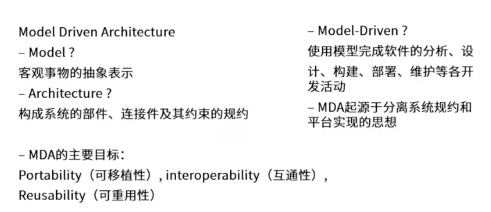

# 软件架构风格

## 五大架构风格

### 数据流风格

##### 特点

- 数据的一步一步流动，以这个为导向的风格
- 把数据的处理分步骤进行，第一步的输出做为第二步的输入，以此类推完成数据处理
- 类似C语言的编译过程，词法分析、语法分析、语义分析，一步步完成任务
- 由于前一步的处理结果是后一步的输入，数据起到推动流程运转的作用，所以又称为数据驱动

##### 优点

- 数据和处理是分开的，通过顺序衔接起来，所以这种结构是高内聚低耦合的
- 同时每一个职能都是分块处理的，所以有良好的重用性/可维护性
- 可扩展性
- 良好的隐蔽性
- 支持并行

##### 缺点

- 用户交互性差
- 复杂性较高
- 性能较差（每个过滤器都需要解析与合成数据）

##### 典型应用

- 传统编译器（现在的集成开发环境已经不是数据流风格了）
- 网络报文处理

##### 子风格

- 批处理序列：大量整体数据、无需用户交互
  - 数据量大
  - 数据是以整体、整块形式传输
- 管道过滤器：流式数据、弱用户交互
  - 流式数据，不用等到所有处理完才进入到下一步

### 调用返回风格

- 主函数调用子函数
- 子函数执行计算
- 子函数将计算结果返回给主函数

##### 思想

一个完整的系统过于繁杂，将其分成多个层级，每个层级各司其职的去处理它们层次该处理的问题。层与层之间进行调用返回的机制来完成相应的职能。

这样把系统分成多个部分，而且每一个部分有独立的职能，这样每个构件利于达到高内聚低耦合的效果。同时有良好的复用和维护扩展。

严格的分层只允许两个层次间交互，不严格的分层允许跨层次交互。

##### 优点

- 良好的重用性
- 可维护性好
- 可扩展性好

##### 缺点

- 不是每个系统都方便分层
- 很难找到一个合适的、正确的层次抽象方法
  - 层次分多咯，影响效率
  - 层次分少咯，逻辑结构划分不清晰，耦合性高
- 不同层次之间耦合度高的系统很难实现

##### 特点

- 每个层次的组建形成不同功能级别的虚拟机，即每个层级都能独立的完成标准化的数据处理职能
- 多层级相互协同工作，而且实现透明（层与层之间不需要知道对方是如何实现的）

##### 子风格

- 主程序/子程序：结构化时代面向过程的开发，像C语言
- 面向对象：对象的方法调用
- 分层：层与层之间的方法调用
  - 比如业务逻辑层 调用数据库层
  - ISO七层模型

### 独立构件风格

每一个构件都是独立的。每一个构件都不直接关联。和调用返回风格有着明显的区别，独立构件风格，构件构件之间不直接交互是一种松耦合的风格。

比如：点击事件的监听，接口回调。

##### 优点

- 松耦合：整个风格架构是松耦合的
- 良好的重用性/可修改性/可扩展性：构件与构件是独立的

##### 缺点

- 不直接关联的特点，使构件放弃了对系统计算的控制

##### 特点

- 系统由若干子系统构成且称为一个整体
- 系统有统一的目标
- 子系统之间有主从之分
- 每一个子系统有自己的事件收集和处理机制

##### 子风格

- 事件驱动
- 隐式调用

### 虚拟机风格

虚拟机的用途去解释和执行特定的代码，保证灵活性。有自定义特点，在自己设计的规则下运行。

能灵活应对自定义场景，复杂度较高。

##### 子风格

- 解释器
  - 适用于需要"自定义规则"的场合
- 规则为中心
  - 适用于专家系统
  - 在解释器的基础上增加经验规则

### 仓库风格

仓库风格会有用来存储数据的中央部件。各个构件从数据库获取或写入数据。

仓库风格又叫做以数据为中心的风格。

现代的程序开发IDE使用的是仓库风格同时也应用了事件风格，诸多构件（断点、变量查看）都是围绕中间的语法树。

操作系统的注册表、剪切板 是一种仓库风格

##### 子风格

- 数据库系统：
  - 以数据为中心
- 黑板系统：语音识别、知识推理
  - 特点
    - 在以数据为中心的基础上，使用中心数据触发业务逻辑部件
  - 典型实例
    - 语音识别
    - 模式识别
    - 图像处理
    - 知识推理
  - 优点
    - 可更改性和可维护性
    - 可重用的知识源
    - 容错性和健壮性
  - 缺点
    - 测试困难
    - 不能保证有好的解决方案
    - 难以建立好的控制策略
    - 低效
    - 开发困难
    - 缺少并行机制
- 超文本系统：

黑板是中央数据源，是交换数据、共享数据的机制。黑板系统是在数据库系统的基础上增加了触发机制。

### 闭环控制风格

也叫过程控制风格。

开环控制系统的特点是：数据发出后没有闭环回来

闭环系统：执行后会有反馈信息，将反馈信息进行比较看是否符合需求。典型应用：空调温控

### C2风格

## 应用层次的架构风格

### 两层CS架构

胖客户端

### 三层CS架构

瘦客户端

### BS

0客户端

### 混合架构风格

### 三层BS

#### MVC架构风格

在MVC风格中，View层和Model层有一定的耦合性

#### MVP架构风格

解除了View层和Model层的耦合关系

#### MVVM架构风格

和MVP变化不大

#### RIA架构风格

富互联网架构

## 基于服务的架构SOA

#### SOA的实现方式  -（web service）

#### SOA的实现方式  -（ESB）企业服务总线

### SOA相关的协议

## 微服务架构

原则上属于SOA的一种。

#### 微服务的优势

#### 微服务的挑战

#### 微服务与SOA

## MDA 模型驱动架构

## ADL 架构描述语言

## DSSA 特定领域软件架构

#### 领域软件架构需要的人员

#### 领域软件架构建立过程

#### 领域软件架构的三层次模型

# 基于架构的软件开发方法

#### 架构需求和架构设计

#### 架构文档化

**输出结果**

- 架构规格说明书
- 质量设计说明书

**注意事项**

- 从使用者的角度进行编写
- 必须分发给所有与系统有关的开发人员
- 必须保证开发者手上的文档是最新的

#### 架构复审

目的是标识潜在的风险，及早发现架构设计中的缺陷和错误

#### 架构实现和结构演化

# 软件架构评估

- 为什么要进行架构评估
  - 架构设计是高层次记得设计，确保架构设计没问题，可以满足需求
- 架构评估到底评什么
  - 评估设计的架构对需求的满足情况
- 架构评估怎么评
  - 常用基于场景的架构评估方式

## 软件架构评估 - 质量属性

### 软件架构评估 - 质量属性 - 性能

性能：是指系统的响应能力，即要经过多长时间才能对某个事件作出响应，或者在某段时间内系统所能出力的事件的个数。

### 软件架构评估 - 质量属性 - 可用性

可用性：系统能够正常运行的事件比例。经常用两次故障之间的时间长度或在出现故障时系统能够恢复正常的速度来表示。

### 软件架构评估 - 质量属性 - 安全性

安全性：指系统在向合法用户提供服务的同时能够阻止非授权用户使用的企图或拒绝服务的能力。

### 软件架构评估 - 质量属性 - 可修改性

可修改性：是指能够快速地以较高的性能价格比对系统进行变更的能力。通常以某些具体的变更为基准，通过考察这些变更的代价衡量可修改性。

### 软件架构评估 - 质量属性 - 易用性和可测试性

## 架构评估的敏感点、权衡点、风险点、非风险点

敏感点：是一个或多个构件（构件之间的关系）的特性

权衡点：是影响多个质量属性的特性，是多个质量属性的敏感点

风险点：是指架构设计中潜在的、存在问题的架构决策所带来的隐患

非风险点：是指不会带来隐患，一般以“xxx要求是可以实现（或接受）的”方式表达

## 软件架构评估 - 架构评估方法

- 基于场景的方式使用比较广泛、多
  - 软件架构分析法（SAAM）
  - 软件架构权衡分析法（ATAM）
  - 成本效益分析法（CBAM）

### 架构评估方法 - 软件架构分析法（SAAM）

### 架构评估方法 - 软件架构权衡分析法（ATAM）

