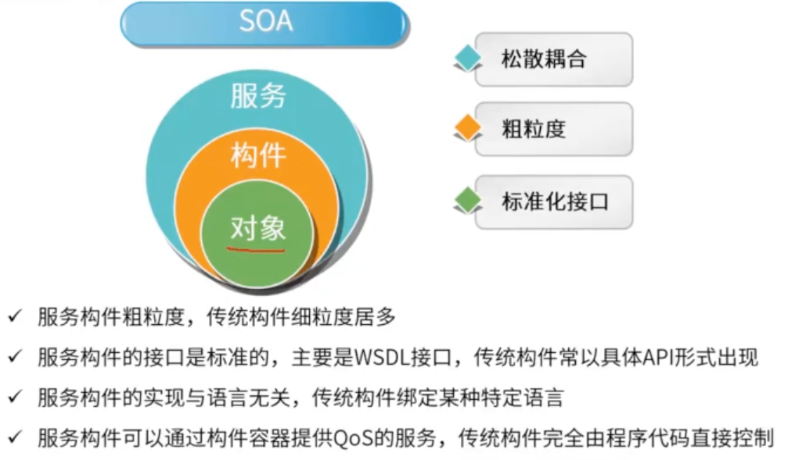
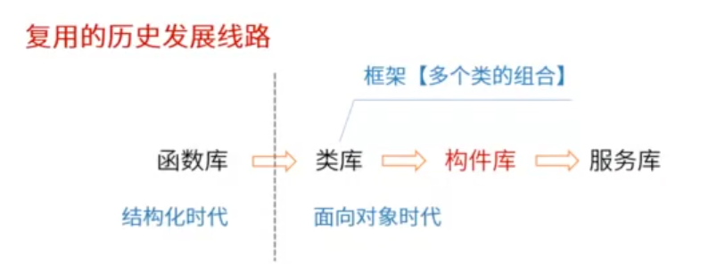

# 软件架构风格

## 五大架构风格

- 数据流风格 （Data Flow）
  - 批处理（Batch Sequential）
  - 管道-过滤器（Pipes and Filters）
- 调用/返回风格
  - 主程序/子程序（Main Program and Subroutine）
  - 面向对象（Object-oriented）
  - 层次结构（Layered System）
- 独立构件风格（）
  - 进程通信（）
  - 事件驱动系统（隐式调用）

### 数据流风格

##### 特点

- 数据的一步一步流动，以这个为导向的风格
- 把数据的处理分步骤进行，第一步的输出做为第二步的输入，以此类推完成数据处理
- 类似C语言的编译过程，词法分析、语法分析、语义分析，一步步完成任务
- 由于前一步的处理结果是后一步的输入，数据起到推动流程运转的作用，所以又称为数据驱动

##### 优点

- 数据和处理是分开的，通过顺序衔接起来，所以这种结构是高内聚低耦合的
- 同时每一个职能都是分块处理的，所以有良好的重用性/可维护性
- 可扩展性
- 良好的隐蔽性
- 支持并行

##### 缺点

- 用户交互性差
- 复杂性较高
- 性能较差（每个过滤器都需要解析与合成数据）

##### 典型应用

- 传统编译器（现在的集成开发环境已经不是数据流风格了）
- 网络报文处理

##### 子风格

- 批处理序列：大量整体数据、无需用户交互
  - 数据量大
  - 数据是以整体、整块形式传输
- 管道过滤器：流式数据、弱用户交互
  - 流式数据，不用等到所有处理完才进入到下一步

### 调用返回风格

- 主函数调用子函数
- 子函数执行计算
- 子函数将计算结果返回给主函数

##### 思想

一个完整的系统过于繁杂，将其分成多个层级，每个层级各司其职的去处理它们层次该处理的问题。层与层之间进行调用返回的机制来完成相应的职能。

这样把系统分成多个部分，而且每一个部分有独立的职能，这样每个构件利于达到高内聚低耦合的效果。同时有良好的复用和维护扩展。

严格的分层只允许两个层次间交互，不严格的分层允许跨层次交互。

##### 优点

- 良好的重用性
- 可维护性好
- 可扩展性好

##### 缺点

- 不是每个系统都方便分层
- 很难找到一个合适的、正确的层次抽象方法
  - 层次分多咯，影响效率
  - 层次分少咯，逻辑结构划分不清晰，耦合性高
- 不同层次之间耦合度高的系统很难实现

##### 特点

- 每个层次的组建形成不同功能级别的虚拟机，即每个层级都能独立的完成标准化的数据处理职能
- 多层级相互协同工作，而且实现透明（层与层之间不需要知道对方是如何实现的）

##### 子风格

- 主程序/子程序：结构化时代面向过程的开发，像C语言
- 面向对象：对象的方法调用
- 分层：层与层之间的方法调用
  - 比如业务逻辑层 调用数据库层
  - ISO七层模型

### 独立构件风格

每一个构件都是独立的。每一个构件都不直接关联。和调用返回风格有着明显的区别，独立构件风格，构件构件之间不直接交互是一种松耦合的风格。

比如：点击事件的监听，接口回调。

##### 优点

- 松耦合：整个风格架构是松耦合的
- 良好的重用性/可修改性/可扩展性：构件与构件是独立的

##### 缺点

- 不直接关联的特点，使构件放弃了对系统计算的控制

##### 特点

- 系统由若干子系统构成且称为一个整体
- 系统有统一的目标
- 子系统之间有主从之分
- 每一个子系统有自己的事件收集和处理机制

##### 子风格

- 事件驱动
- 隐式调用

### 虚拟机风格

虚拟机的用途去解释和执行特定的代码，保证灵活性。有自定义特点，在自己设计的规则下运行。

能灵活应对自定义场景，复杂度较高。

##### 子风格

- 解释器
  - 适用于需要"自定义规则"的场合
- 规则为中心
  - 适用于专家系统
  - 在解释器的基础上增加经验规则

### 仓库风格

仓库风格会有用来存储数据的中央部件。各个构件从数据库获取或写入数据。

仓库风格又叫做以数据为中心的风格。

现代的程序开发IDE使用的是仓库风格同时也应用了事件风格，诸多构件（断点、变量查看）都是围绕中间的语法树。

操作系统的注册表、剪切板 是一种仓库风格

##### 子风格

- 数据仓库系统：
  - 以数据为中心
- 黑板系统：语音识别、知识推理
  - 特点
    - 在以数据为中心的基础上，使用中心数据触发业务逻辑部件
  - 典型实例
    - 语音识别
    - 模式识别
    - 图像处理
    - 知识推理
  - 优点
    - 可更改性和可维护性
    - 可重用的知识源
    - 容错性和健壮性
  - 缺点
    - 测试困难
    - 不能保证有好的解决方案
    - 难以建立好的控制策略
    - 低效
    - 开发困难
    - 缺少并行机制
- 超文本系统：

黑板是中央数据源，是交换数据、共享数据的机制。黑板系统是在数据库系统的基础上增加了触发机制。

### 闭环控制风格

也叫过程控制风格。

开环控制系统的特点是：数据发出后没有闭环回来

闭环系统：执行后会有反馈信息，将反馈信息进行比较看是否符合需求。典型应用：空调温控

过程控制又称闭环风格，该风格最大特点是设定参数，并不断测量现有的实际数据，将实际值与设定值进行比较，以确定接下来的操作。

### C2风格

C2体系结构风格可以概括为：通过连接件绑定在一起按照一组规则运作的并行构件网络。C2风格中的系统规则如下：

①系统中的构件和连接件都有一个顶部和一个底部。
②构件的顶部应连接到某连接件的底部，构件的底部则应连接到某连接件的顶部。而构件与构件之间的直接连接是不允许的。
③一个连接件可以和任意数目的其他构件和连接件连接。
④当两个连接件进行直接连接时，必须由其中一个的底部连接到另一个的顶部。

## 应用层次的架构风格

### 两层CS架构

胖客户端

分为表示层和数据层两部分。

### 三层CS架构

瘦客户端

分为表示层、数据层、功能层三部分

### BS

0客户端

### 混合架构风格

### 三层BS

#### MVC架构风格

在MVC风格中，View层和Model层有一定的耦合性

#### MVP架构风格

解除了View层和Model层的耦合关系

#### MVVM架构风格

和MVP变化不大

#### RIA架构风格

富互联网架构

## 基于服务的架构SOA

SOA常用的设计模式是服务注册模式和企业服务总线ESB模式。

企业服务总线（ESB）技术，其思想是提供一种标准的软件底层架构，各种程序组件能够以服务单元的方式“插入”到该平台上运行，并且组件之间能够以标准的消息通信方式来进行交互。

#### SOA的实现方式  -（web service）

#### SOA的实现方式  -（ESB）企业服务总线

### SOA相关的协议

## 微服务架构

原则上属于SOA的一种。

#### 微服务的优势

#### 微服务的挑战

#### 微服务与SOA

## MDA 模型驱动架构

## ADL 架构描述语言

架构描述语言（ADL）是为说明软件系统的概念架构和对这些概念架构建模提供功能的语言。

ADL主要包括以下组成部分：

- 组件（构件）：计算或数据存储单元
- 组件接口
- 连接件：建立组件间的交互和规则
- 架构配置：架构配置描述了组件和连接件的连接图

## DSSA 特定领域软件架构

DSSA是以一个特定问题领域为对象，形成由 **领域参考模型**、**参考需求**、**参考架构**等组成的开发基础架构。旨在支持一个特定领域中多个应用的生成。

DSSA基本活动包括：

- 领域分析：目的是获得领域模型，描述领域中系统之间共同的需求，即领域需求
- 领域设计：目的是获得DSSA，描述领域模型中表示需求的解决方案
- 领域实现：主要目标是根据领域模型和DSSA 开发和组织可重用信息，并对基础软件架构进行实现

从功能覆盖的范围角度理解DSSA中领域的含义有两种方法：

- 垂直域：定义一个特定的系统族，导出在该领域中可作为系统的可行解决方案的一个通用软件架构
- 水平域：定义了在多个系统和多个系统族中功能区域的共有部分，在子系统级上涵盖多个系统的特定部分功能。

在特定领域架构中，垂直域关注的是与行业相关的，聚焦于行业特性的内容，而水平域关注的是各行业共性部分的内容。

#### 领域软件架构需要的人员

参与DSSA的人员可以划分为4中角色：

- 领域专家：提供有关领域中系统需求规格和实现知识、维护领域字典和复审领域模型和DSSA
- 领域分析人员：负责整个领域分析过程控制以及将从领域专家处获得的知识组织到领域模型中
- 领域设计人员：需要根据领域模型和现有系统开发出DSSA以及建立领域模型和DSSA之间的联系
- 领域实现人员：根据领域模型和DSSA进行软件实现以及对可重用构件进行验证

#### 领域软件架构建立过程

#### 领域软件架构的三层次模型

DSSA的三层次模型：

- 领域架构师在领域开发环境工作
- 应用工程师在领域特定应用开发环境工作
- 操作员在应用执行环境工作

特定领域软件架构是在一个特定应用领域中，为一组应用提供组织结构参考的标准软件体系结构。DSSA通常是一个具有三个层次的系统模型，包括领域开发环境（领域架构师），领域特定应用开发环境（应用工程师）和应用执行环境（操作员）。 

# 基于架构的软件开发方法 - ABSD（Architecture-Based Software Design）

### 特点

- ABSD方法强调由业务、质量和功能需求的组合驱动架构设计
- 强调采用视角和视图来描述软件架构
- 采用用例来描述功能需求
- 质量场景来描述质量需求
- ABSD是一个自顶向下、递归细化的软件开发方法，软件系统的体系结构通过该方法得到细化，直到能产生软件构件和类

### 过程

ABSD把整个基于体系结构的软件过程划分为：

- 架构需求：获取用户需求和标识系统中所需要的构件
- 架构设计：这个过程是一个迭代过程
- 架构文档化：主要输出物包括体系结构规格说明书和体系结构质量设计说明书，软件架构文档应该从使用者的角度进行书写，针对不同背景的人员采用不同的书写方式，并将文档分发给相关人员。架构文档要保持较新，但不要随时保证文档最新，要保持文档的稳定性。
- 架构复审：其目的是早期发现设计中的缺陷和错误。在一个主版本的软件架构分析后，要安排一次由外部人员（用户代表和领域专家）参加的复审。
- 架构实现：以体系结构说明书为基础，并且每个构件必须满足其责任
- 架构演化：使用系统演化步骤对应用程序进行修改，以适应新的需求情况

### 架构需求和架构设计

### 架构文档化

**输出结果**

- 架构规格说明书
- 质量设计说明书

**注意事项**

- 从使用者的角度进行编写
- 必须分发给所有与系统有关的开发人员
- 必须保证开发者手上的文档是最新的

### 架构复审

目的是标识潜在的风险，及早发现架构设计中的缺陷和错误

在一个主版本的软件架构分析之后，要安排一次由外部人员（用户代表和领域专家）参加的复审。

### 架构实现和结构演化

# 软件架构评估

- 为什么要进行架构评估
  - 架构设计是高层次记得设计，确保架构设计没问题，可以满足需求
- 架构评估到底评什么
  - 评估设计的架构对需求的满足情况
- 架构评估怎么评
  - 常用基于场景的架构评估方式

## 软件架构评估 - 质量属性

运行期质量属性：

- 性能：指软件系统及时提供相应服务的能力。（速度、吞吐量、持续高速性）
  - 设计策略：优先级队列、资源调度
- 安全性：指软件系统同时兼顾向合法用户提供服务，以及阻止非授权使用的能力。
  - 设计策略：追踪审计
- 易用性：指软件系统易于被使用的程度
- 可伸缩性：指当用户数和数据量增加时，软件系统维持高服务质量的能力。例如，通过增加 服务器来提高能力。
- 互操作性：与其他系统交换数据和相互调用服务的难易程度。
- 可靠性：在一定的时间内无故障运行的能力。
  - 代表参数：MTTF、MTBF
  - 设计策略：冗余、心跳线
- 持续可用性：指系统长时间无故障运行的能力。与可靠性相关联，常将其纳入可靠性中。
  - 设计策略：冗余、心跳线
- 鲁棒性：是指软件系统在一些非正常情况（如用户进行了非法操作、相关的软硬件系统发生了故障等）下仍能够正常运行的能力。也称健壮性或容错性。

开发期质量属性：

- 易理解性：指设计被开发人员理解的难易程度。
- 可扩展性：软件因适应需求变化而增加新功能的能力。也称为灵活性。
- 可重用性：指重用软件系统或某一部分的难易程度。
- 可测试性：对软件测试以证明其满足需求规范的难易程度。
- 可维护性：当需要修改缺陷、增加功能、提高质量属性时，定位修改点并实施修改的难易程度。
- 可移植性：将软件系统从一个运行环境转移到另一个不同的运行环境的难易程度。

### 软件架构评估 - 质量属性 - 性能

性能：是指系统的响应能力，即要经过多长时间才能对某个事件作出响应，或者在某段时间内系统所能出力的事件的个数。

设计策略：优先级队列、资源调度

### 软件架构评估 - 质量属性 - 可用性

可用性：系统能够正常运行的事件比例。经常用两次故障之间的时间长度或在出现故障时系统能够恢复正常的速度来表示。

设计策略：冗余、心跳

### 软件架构评估 - 质量属性 - 安全性

安全性：指系统在向合法用户提供服务的同时能够阻止非授权用户使用的企图或拒绝服务的能力。

设计策略：追踪审计，入侵检测

### 软件架构评估 - 质量属性 - 可修改性

可修改性：是指能够快速地以较高的性能价格比对系统进行变更的能力。通常以某些具体的变更为基准，通过考察这些变更的代价衡量可修改性。

主要策略：接口-实现分离、抽象、信息隐藏

它包含四个方面：

- 可维护性：关注问题修复，需要准备的软件体系结构和局部修改
- 可扩展性：关注新特性的使用和构件的替换，需要松散耦合的构件和体系结构的支持
- 结构重构：关注构件和构件间的关系的重新组织
- 可移植性：使软件系统适用于多种环境，需要按照硬件无关的方式组织软件系统

### 软件架构评估 - 质量属性 - 易用性和可测试性

## 架构评估的敏感点、权衡点、风险点、非风险点

敏感点：是一个或多个构件（构件之间的关系）的特性

权衡点：是影响多个质量属性的特性，是多个质量属性的敏感点

风险点：是指架构设计中潜在的、存在问题的架构决策所带来的隐患

非风险点：是指不会带来隐患，一般以“xxx要求是可以实现（或接受）的”方式表达

## 软件架构评估 - 架构评估方法

- 基于场景的方式使用比较广泛、多
  - 软件架构分析法（SAAM）
  - 软件架构权衡分析法（ATAM）
  - 成本效益分析法（CBAM）

在进行体系结构评估时，一般首先要精确地得出具体的质量目标，并以之作为判定该体系结构优劣的标准。为得出这些目标而采用的机制叫做场景

场景是从风险承担者的角度对与系统的交互的简短描述。

在体系结构评估中，一般采用刺激（stimulus）、环境（environment）和响应（response）三方面来对场景进行描述。

又可以描述为六个部分：刺激源、刺激、环境、制品、响应、响应度量

### 架构评估方法 - 软件架构分析法（SAAM）

基于场景的软件架构分析法的过程包括五个步骤：

- 场景开发
- 体系结构描述
- 单个场景评估
- 场景交互评估
- 总体评估

基于场景的架构分析方法的主要输入：

- 问题描述
- 需求说明
- 架构描述

### 架构评估方法 - 软件架构权衡分析法（ATAM）

架构权衡分析方法（Architecture Tradeoff Analysis Method, ATAM）是一种系统架构评估方法，关注系统的**需求说明**，主要在系统开发之前，针对性能、实用性、安全性和可修改性等质量属性进行评价和折中。分为四个主要的活动阶段：

- 场景和需求收集
- 架构视图和场景实现
- 属性模型构造和分析
- 折中

整个评估过程强调以 **属性** 作为架构评估的核心概念。

#### 软件架构评估 - 质量效用树

非常直观的展示项目

## 软件产品线

- 双生命周期模型

### 软件产品线 - 建立方式

### 软件产品线 - 组织结构

## 构件与中间件

### 构件的定义和特性

### 中间件的定义和特点

分布式系统中 中间件的两种不同类型的支持：

- 交互支持：指协调不同组件之间的交互
- 提供公共服务：提供服务可复用的实现，被不同组件需要的服务。公共服务可以在中间件容器中提供。

### 构件的复用

#### 检索与提取构件

#### 理解与评价构件

#### 修改构件

#### 组装构件

### 构件的标准

# 软件架构建模

软件架构建模即4+1视图。多视图是指从不同角度和视角描述系统体系结构，以获得多个视图，并将其组合在一起以描述整体模型。多视图反映了关注点分离的思想，每个视图只关注系统的一个侧面。

4+1视图有两个版本：

## 4+1视图 - 版本1

逻辑视图、进程视图、开发视图、物理视图和场景视图

## 4+1视图 - 版本2

# EIA 系统应用集成

EIA可以建立统一标准的基础平台，连接各种具有不同功能和目的的企业内部应用系统，以达到信息和流程的共享。

EIA的基本原则是集成多个系统并保证系统独立性，实施EIA必须遵循应用程序独立性、面向商业流程、独立于技术和平台无关等原则。

EIA提供四个层次的服务：从下到上依次为：通信服务、信息传递与转化服务、应用连接服务、流程控制服务

# 一

## 题目

软件体系结构风格是描述某一特定应用领域中系统组织方式的惯用模式，其中，在批处理风格软件体系结构中，每个处理步骤是一个单独的程序，每一步必须在前一步结束后才能开始，并且数据必须是完整的，以（ ）的方式传递。基于规则的系统包括规则集、规则解释器、规则/数据选择器及（ ）。

问题1选项
A.迭代
B.整体
C.统一格式
D.递增

问题2选项
A.解释引擎
B.虚拟机
C.数据
D.工作内存

## 答案

第1题:B

第2题:D

## 解析

软件体系风格是描述某一特定应用领域中系统组织方式的惯用方式。体系结构风格反映了领域中众多系统所共有的结构和语义特性，并指导如何将各个模块和子系统有效的组织成一个完整的系统。

其中，批处理风格的每一步处理都是独立的，并且每一步是顺序执行的。只有当前一步处理完，后一步处理才开始。数据传送在步与步之间作为一个整体。

批处理的典型应用

- 经典数据处理
- 程序开发
- windows下BAT程序

基于规则的系统大类是虚拟机风格。虚拟机风格的基本思想是人为构建一个运行环境，在这个环境之上，可以解析与运行自定义的一些语言，这样来增加架构的灵活性，虚拟机风格主要包括解释器和规则为中心两种架构风格。

其中基于规则的系统包括：

- 规则集
- 规则解释器
- 规则/数据选择器
- 工作内存

# 二

## 题目

某公司拟开发一个个人社保管理系统，该系统的主要功能需求是根据个人收入、家庭负担、身体状态等情况，预估计算个人每年应支付的社保金，该社保金的计算方式可能随着国家经济的变化而动态改变，针对上述需求描述，该软件系统适宜采用（ ）架构风格设计，该风格的主要特点是（ ）。

问题1选项
A.Layered system
B.Data flow
C.Event system
D.Rule-based system

问题2选项
A.将业务逻辑中频繁变化的部分定义为规则
B.各构件间相互独立
C.支持并发
D.无数据不工作

## 答案

D

A

## 解析

https://hls.videocc.net/060fd1513e/8/060fd1513e3b1cd7a645479890219d48.m3u8?device=desktop&pid=1695767573780X1816522

根据题目描述，最核心的业务特点是变化大，变化之后要能及时响应变化。此时，可以理解为，可以自行定义计算的方式与规则，所以使用虚拟机风格比较合适。其中规则系统（Rule-based system）属于虚拟机风格，该风格最显著的特点是会把变化的内容定义为规则。

# 三、

## 题目

在三层C/S架构中，（ ）是应用的用户接口部分，负责与应用逻辑间的对话功能；（ ）是应用的本体，负责具体的业务处理逻辑。

问题1选项
A.表示层
B.感知层
C.设备层
D.业务逻辑层

问题2选项
A.数据层
B.分发层
C.功能层
D.算法层

## 答案

第1题:A

第2题:C

## 解析

三层C/S体系结构是将应用功能分成表示层、数据层和功能层三个部分。三层C/S的解决方案对这三层进行明确分割，不同层构件相互独立，层间的接口简洁，适合复杂事务处理。

- 表示层
  - 是应用的用户接口部分担负与应用逻辑间的对话功能
- 功能层
  - 是应用的主体，负责具体的业务处理逻辑。表示层和功能层之间的数据交互要尽可能简洁。
- 数据层
  - 数据层通常是数据库管理系统，负责管理对数据库数据的读写。

# 四 题目

软件脆弱性是软件中存在的弱点（或缺陷），利用它可以危害系统安全策略，导致信息丢失、系统价值和可用性降低。嵌入式系统软件架构通常采用分层架构，它可以将问题分解为一系列相对独立的子问题，局部化在每一层中， 从而有效地降低单个问题的规模和复杂性，实现复杂系统的分解。但是，分层架构仍然存在脆弱性。常见的分层架构的脆弱性包括（）等两个方面。

A.底层发生错误会导致整个系统无法正常运行、层与层之间功能引用可能导致功能失效
B.底层发生错误会导致整个系统无法正常运行、层与层之间引入通信机制势必造成性能下降
C.上层发生错误会导致整个系统无法正常运行、层与层之间引入通信机制势必造成性能下降
D.上层发生错误会导致整个系统无法正常运行、层与层之间功能引用可能导致功能失效

## 答案

B

## 解析

本题考察的是分层结构的特点。首先分层架构是低耦合的，依赖关系简单，上层只能依赖于下层，没有循环依赖。所以底层错误将导致系统无法运行，而上层错误一般影响的是错误的这一部分，对整个系统的影响并不是完全的。

系统的风险可以看作是利用了脆弱性而引起的。其中，威胁可以看成从系统外部对系统产生的作用而导致系统功能及目标受阻的现象。脆弱性可以看成是系统内部的薄弱点。脆弱性是客观存在的，但它本身没有实际伤害。

后半句来看，引入新的分层会导致系统性能下降有道理。

# 五题目

针对二层c/s软件架构的缺点，三层c/s架构应运而生，在三层c/s架构中，增加了一个（ ），三层c/s架构是将应用功能分成表示层，功能层和（ ）三个部分，其中（ ）是应用的用户接口部分，担负与应用逻辑间的对话功能。

问题1选项
A.应用服务器
B.分布式数据库
C.内容分发
D.镜像

问题2选项
A.硬件层
B.数据层
C.设备层
D.通信层

问题3选项
A.表示层
B.数据层
C.应用层
D.功能层

## 答案

第1题:A

第2题:B

第3题:A

## 解析

三层C/S架构，增加了应用服务器处理功能逻辑。

# 六题目

（ ）是由中间件技术实现并支持SOA的一组基础架构，它提供了一种基础设施，其优势在于（ ） 。

问题1选项
A.ESB
B.微服务
C.云计算
D.Multi-Agent System

问题2选项
A.支持了服务请求者与服务提供者之间的直接链接
B.支持了服务请求者与服务提供者之间的紧密耦合
C.消除了服务请求者与服务提供者之间的直接链接
D.消除了服务请求者与服务提供者之间的关系

## 答案

第1题:A

第2题:C

## 解析

微服务是SOA的一种变体

云计算是网络云服务的一种技术

Multi-Agent System多智能系统是人工智能技术的一种应用。

# 七题目

在仓库风格中，有两种不同的构件，其中，（ ）说明当前状态，（ ）在中央数据存储上执行。

问题1选项
A.注册表
B.中央数据结构
C.事件
D.数据库

问题2选项
A.独立构件
B.数据结构
C.知识源
D.共享数据

## 答案

第1题:B

第2题:A

## 解析

仓库风格软件架构中，有两种不通的构件：中央数据结构说明当前状态，独立构件在中央数据存储上执行

# 八题目

某公司欲开发一个大型多人即时战略游戏，游戏设计的目标之一是能够支持玩家自行创建战役地图，定义游戏对象的行为和对象之间的关系。针对该需求，公司应该采用（ ）架构风格最为合适。在架构设计阶段，公司的架构师识别出两个核心质量属性场景。其中，“在并发用户数量为10000人时，用户的请求需要在1秒内得到响应”主要与（ ）质量属性相关；“对游戏系统进行二次开发的时间不超过3个月”主要与（ ）质量属性相关。

问题1选项
A.层次系统
B.解释器
C.黑板
D.事件驱动系统

问题2选项
A.性能
B.吞吐量
C.可靠性
D.可修改性

问题3选项
A.可测试性
B.可移植性
C.互操作性
D.可修改性

## 答案

B A D

## 解析

题目中提及“支持玩家自行创建战役地图”说明系统要能应对“自定义”内容的解析，这需要用到解释器架构风格。

“并发用户数量10000人时用户请求要在1秒内得到响应”属于典型的性能质量属性。吞吐量是性能的一个指标

“对游戏系统进行二次开发的时间不超过3个月”属于可修改性质量属性。

# 九题目

软件架构风格描述某一特定领域中的系统组织方式和惯用模式，反映了领域中众多系统所共有的（  ）特征。对于语音识别、知识推理等问题复杂、解空间很大、求解过程不确定的这一类软件系统，通常会采用（  ）架构风格。对于因数据输入某个构件，经过内部处理，产生数据输出的系统，通常会采用（  ）架构风格。

问题1选项
A.语法和语义
B.结构和语义
C.静态和动态
D.行为和约束

问题2选项
A.管道-过滤器
B.解释器
C.黑板
D.过程控制

问题3选项
A.事件驱动系统
B.黑板
C.管道-过滤器
D.分层系统

## 答案

第1题:B

第2题:C

第3题:C

## 解析

软件体系结构反映了领域中众多系统所共有的结构和语义特性，并指导如何将各个模块和子系统有效的组织成一个完整的系统。对软件体系结构风格的研究和实践促进对设计的重用，一些经过实践证明的解决方案也可以可靠的用于解决新问题。

语音识别是黑板风格的经典应用场景。

输入某个构件，经过内部处理，产生数据输出的系统，正是管道-过滤器中过滤器的职能，把多个过滤器使用管道相联的风格为管道-过滤器风格。

# 十题目

某公司拟开发一个VIP管理系统，系统需要根据不同商场活动，不定期更新VIP会员的审核标准和VIP折扣系统。针对上述需求，采用（  ）架构风格最为合适。

问题1选项
A.规则系统
B.过程控制
C.分层
D.管道-过滤器

## 答案

A

## 解析

根据题目的意思，拟开发的VIP管理系统中VIP会员审核标准要能随时改变，灵活定义。在这方面虚拟机风格最为擅长，而属于虚拟机风格的只有A选项。

# 十一题目

某公司拟开发一个新闻系统，该系统可根据用户的注册兴趣，向用户推送其感兴趣的新闻内容，该系统应该采用（ ）架构风格最为合适。

A.事件驱动系统
B.主程序-子程序
C.黑板
D.管道-过滤器

## 答案

A

## 解析

根据题目的意思，用户会注册自己的兴趣，然后系统也会把新闻按兴趣分类，如果某个新闻事件发生，可以通过事件来触发推送动作，将新闻推送给对其感兴趣的用户。这是典型的事件驱动系统应用场景。

# 十二题目

系统中的构件和连接件都有一个顶部和一个底部，构件的顶部应连接到某连接件的底部，构件的底部则应连接到某连接件的顶部，构件和构件之间不允许直接连接，连接件直接连接时，必须由其中一个的底部连接到另一个的顶部。上述构件和连接件的组织规则描述的是（  ）架构风格。

问题1选项
A.管道-过滤器
B.分层系统
C.C2
D.面向对象

## 答案

C

# 十三题目

某公司拟为某种新型可编程机器人开发相应的编译器。该编译过程包括词法分析、语法分析、语义分析和代码生成四个阶段，每个阶段产生的结果作为下一个阶段的输入，且需独立存储。针对上述描述，该集成开发环境应采用（ ）架构风格最为合适。

问题1选项
A.管道-过滤器
B.数据仓储
C.主程序-子程序
D.解释器

## 答案

A

## 解析

每个阶段产生的结果作为下一阶段的输入 是典型的数据流架构风格的特点。

选项中仅有 管道-过滤器 属于这种风格

# 十四题目

软件架构风格是描述某一特定应用领域中系统组织方式的惯用模式。一个体系结构定义了一个词汇表和一组（  ）。架构风格反映领域中众多系统所共有的结构和（ ）。

问题1选项
A.约束
B.连接件
C.拓扑结构
D.规则

问题2选项
A.语义特征
B.功能需求
C.质量属性
D.业务规则

## 答案

第1题:A

第2题:A

## 解析

体系结构风格反映了众多系统共有的结构和语义特性。

体系风格定义了一个系统家族，即一个体系结构定义一个词汇表和一组约束。

词汇表中包含一些构件和连接件类型，而这组约束指出系统是如何将这些构件和连接件组合起来的。

# 十五题目

某公司拟开发一个扫地机器人。机器人的控制者首先定义清洁流程和流程中任务之间的关系，机器人接受任务后，需要响应外界环境中触发的一些突发事件，根据自身状态进行动态调整，最终自动完成任务。针对上述需求，该机器人应该采用（  ）架构风格最为合适。

问题1选项
A.面向对象
B.主程序-子程序
C.规则系统
D.管道-过滤器

## 答案

C

## 解析

题目中强调了自定义流程，然后按照自定义流程来执行，这属于虚拟机风格的特征。在选项中只有规则系统属于虚拟机风格。

# 十六题目

某企业内部现有的主要业务功能已封装成为Web服务。为了拓展业务范围，需要将现有的业务功能进行多种组合，形成新的业务功能。针对业务灵活组合这一要求，采用（  ）架构风格最为合适。

问题1选项
A.规则系统
B.面向对象
C.黑板
D.解释器

## 答案

D

## 解析

要求对业务功能灵活组合形成新的业务功能，就是自定义类型的业务。自定义的业务能够正常执行，需要有虚拟机架构的支持。

其中规则系统和解释器都是虚拟机风格，而规则系统适合于专家系统。所以选择D

# 十七题目

某公司拟开发一个语音搜索系统，其语音搜索系统的主要工作过程包括分割原始语音信号、识别音素、产生候选词、判定语法片断、提供搜索关键词等，每个过程都需要进行基于先验知识的条件判断并进行相应的识别动作。针对该系统的特点，采用（ ）架构风格最为合适。

问题1选项
A.分层系统
B.面向对象
C.黑板
D.隐式调用

## 答案

C

## 解析

语音识别是黑板风格的经典应用。

# 十八题目

以下关于软件架构风格和系统性能的关系叙述中，错误的是（）
A.采用层次化架构风格的系统，划分的层次越多，系统的性能越差。
B.对于隐式调用架构风格的系统，可以通过引入对象管理层提高系统性能。
C.采用面向对象风格的架构系统，可以通过引入对象管理层，提高系统性能。
D.对于采用解释器架构风格的系统，可以通过部分解释代码预先编译的方式，提高系统性能。

## 答案

C

## 解析

引入对象管理层其实就是增加层次，这样是无法提高性能的。

# 十九题目

软件架构风格是描述某一特定应用领域中系统组织方式的惯用模式。架构风格反映领域中众多系统所共有的结构和（  ），强调对架构（  ）的重用。

问题1选项
A.语义特性
B.功能需求
C.质量属性
D.业务规则

问题2选项
A.分析
B.设计
C.实现
D.评估

## 答案

A

B

## 解析

对软件架构风格的研究和实践促进了对设计的复用，一些经过实践证实的解决方案也可以可靠的用于解决新问题。

# 二十题目

某公司拟开发一个轿车巡航定速系统，系统需要持续测量车辆当前的实时速度，并根据设定的期望速度自动控制轿车的油门和刹车。针对上述需求，采用（  ）架构风格最为合适

问题1选项
A.解释器
B.过程控制
C.分层
D.管道-过滤器

## 答案

B

## 解析

过程控制又称闭环风格，该风格最大特点是设定参数，并不断测量现有的实际数据，将实际值与设定值进行比较，以确定接下来的操作。

# 二十一题目

某公司为其研发的硬件产品设计实现了一种特定的编程语言，为了方便开发者进行软件开发，公司拟开发一套针对该编程语言的集成开发环境，包括代码编辑、语法高亮、代码编译、运行调试等功能。针对上述描述，该集成开发环境应采用（  ）架构风格最为合适。

问题1选项
A.管道-过滤器
B.数据仓储
C.主程序-子程序
D.解释器

## 答案

B

## 解析

现代编译器的集成开发环境一般采用数据仓储（即以数据为中心的架构风格）架构风格进行开发，其中心数据就是程序的语法树。

# 二十二题目

软件架构是降低成本、改进质量、按时和按需交付产品的关键因素。软件架构设计需要满足系统的（  ），如性能、安全性和可修改性等，并能够指导设计人员和实现人员的工作。

问题1选项
A.功能需求
B.性能需求
C.质量属性
D.业务属性

## 答案

C

## 解析

软件架构评估的质量属性包括：性能、可用性、安全性、可修改性、易用性

# 二十三题目

架构描述语言（Architecture Description Language, ADL）是一种为明确说明软件系统的概念架构和对这些概念架构建模提供功能的语言。ADL主要包括以下组成部分：组件、组件接口、（  ）和架构配置。

问题1选项
A.架构风格
B.架构实现
C.连接件
D.组件约束

## 答案

C

## 解析

ADL即架构描述语言，其基本构成要素包括：组件、组件接口、连接件、架构配置。

# 二十四题目

软件架构设计包括提出架构模型，产生架构设计和进行设计评审等活动，是一个迭代的过程。架构设计主要关注软件组件的结构、属性和（51），并通过多种（52）全面描述特定系统的架构。

（51）A．实现方式

B．交互作用

C．设计方案

D．测试方式

（52）A．对象

B．代码

C．文档

D．视图

## 答案

B

D

## 解析

架构设计主要关注软件组件的结构、属性和交互作用，并通过多种视图全面描述特定系统的架构。

# 二十五题目

以下叙述中，（ ）不属于可行性分析的范畴。

问题1选项
A.对系统开发的各种候选方案进行成本/效益分析
B.分析现有系统存在的运行问题
C.评价该项目实施后可能取得的无形收益
D.评估现有技术能力和信息技术是否足以支持系统目标的实现

## 答案

B

## 解析

”对系统开发的各种候选方案进行成本/效益分析“和”评价该项目实施后可能取得的无形收益“是从成本效益的角度来看一个项目的可行性，是从经济角度出发的分析，这属于可行性分析的范畴。

“评估现有技术能力和信息技术是否足以支持系统目标的实现”是典型的技术可行性分析。

“分析现有系统存在的运行问题”与可行性分析没直接关系。

# 二十六题目

软件系统架构是关于软件系统的结构、（40）和属性的高级抽象。在描述阶段，主要描述直接构成系统的抽象组件以及各个组件之间的连接规则，特别是相对细致地描述组件的（41）。在实现阶段，这些抽象组件被细化为实际的组件，比如具体类或者对象。软件系统架构不仅指定了软件系统的组织和（42）结构，而且显示了系统需求和组件之间的对应关系，包括设计决策的基本方法和基本原理。

（40）A．行为

B．组织

C．性能

D．功能

（41）A．交互关系

B．实现关系

C．数据依赖

D．功能依赖

（42）A．进程

B．拓扑

C．处理

D．数据

## 答案

A A B

# 二十七题目

以下叙述，（ ）不是软件架构的主要作用。

问题1选项
A.在设计变更相对容易的阶段，考虑系统结构的可选方案
B.便于技术人员与非技术人员就软件设计进行交互
C.展现软件的结构、属性与内部交互关系
D.表达系统是否满足用户的功能性需求

## 答案

D

## 解析

- 能够在设计变更相对容易的阶段，考虑系统结构的可选方案
- 便于技术人员与非技术人员就软件设计进行交互
- 能够展现软件的结构、属性与内部交互关系

软件架构与用户对系统的功能性需求没有直接的对应关系

# 二十八题目

以下关于软件架构设计重要性的描述，（  ）是错误的。

问题1选项
A.软件架构设计能够满足系统的性能、安全性、可维护性等品质
B.软件架构设计能够帮助项目干系人（Stakeholder）更好地理解软件结构
C.软件架构设计能够帮助架构师更好地捕获和细化系统需求
D.软件架构设计能够有效地管理系统的复杂性，并降低系统维护费用

## 答案

C

## 解析

https://hls.videocc.net/060fd1513e/5/060fd1513eae7582b7e71f8b0e020ce5.m3u8?device=desktop&pid=1696147442726X1139404

软件架构设计不能捕获需求，软件架构设计是在需求捕获并进行分析之后开展的工作。

# 二十九题目

基于体系结构的软件设计（Architecture-Based Software Design，ABSD）方法是体系结构驱动，即指构成体系结构的（ ）的组合驱动的。ABSD方法是一个自顶向下、递归细化的方法，软件系统的体系结构通过该方法得到细化，直到能产生（ ）。

问题1选项
A.产品、功能需求和设计活动
B.商业、质量和功能需求
C.商业、产品和功能需求
D.商业、质量和设计活动

问题2选项
A.软件产品和代码
B.软件构件和类
C.软件构件和连接件
D.类和软件代码

## 答案

B B

# 三十题目

考虑软件架构时，重要的是从不同的视角(perspective) 来检查，这促使软件设计师考虑架构的不同属性。例如，展示功能组织的（）能判断质量特性， 展示并发行为的（）能判断系统行为特性。选择的特定视角或视图也就是逻辑视图、进程视图、实现视图和（）。 使用（）来记录设计元素的功能和概念接口，设计元素的功能定义了它本身在系统中的角色，这些角色包括功能、性能等。

问题1选项
A.静态视角
B.动态视角
C.多维视角
D.功能视角

问题2选项
A.开发视角
B.动态视角
C.部署视角
D.功能视角

问题3选项
A.开发视图
B.配置视图
C.部署视图
D.物理视图

问题4选项
A.逻辑视图
B.物理视图
C.部署视图
D.用例视图

## 答案

第1题:A

第2题:B

第3题:B

第4题:A

## 解析

https://hls.videocc.net/060fd1513e/b/060fd1513e1e0f2037d21283f930815b.m3u8?device=desktop&pid=1696148702721X1893879

在ABSD方法中，使用不同的视角来观察设计元素，一个子系统并不总是一个静态的架构元素，而是可以从动态和静态视角观察的架构元素。

静态视角：展示功能组织，判断质量特性

动态视角：展示并发行为，判断系统行为特性。

又可以分为：逻辑视图、进程视图、实现视图和配置视图

- 逻辑视图：记录设计元素的功能和概念接口，设计元素的功能定义了它本身在系统中的角色，这个角色包括功能性能等。
- 进程视图：也称为并发视图，检查系统多用户的并发行为。
- 
- 配置视图：代表了计算机网络中的节点，也就是系统的物理结构

# 三十一题目

 某公司采用基于架构的软件设计（Architecture-Based Software Design, ABSD）方法进行软件设计与开发。ABSD方法有三个基础，分别是对系统进行功能分解、采用（ ）实现质量属性与商业需求、采用软件模板设计软件结构。
ABSD方法主要包括架构需求等6个主要活动，其中（ ）活动的目标是标识潜在的风险，及早发现架构设计中的缺陷和错误；（ ）活动针对用户的需求变化，修改应用架构，满足新的需求。
小王是该公司的一位新任架构师，在某项目中主要负责架构文档化方面的工作。小王（ ）的做法不符合架构文档化的原则。架构文档化的主要输出结果是架构规格说明书和（ ）。

问题1选项
A.架构风格
B.设计模式
C.架构策略
D.架构描述

问题2选项
A.架构设计
B.架构实现
C.架构复审
D.架构演化

问题3选项
A.架构设计
B.架构实现
C.架构复审
D.架构演化

问题4选项
A.从使用者的角度书写文档
B.随时保证文档都是最新的
C.将文档分发给相关人员
D.针对不同背景的人员书写文档的方式不同

问题5选项
A.架构需求说明书
B.架构实现说明书
C.架构质量说明书
D.架构评审说明书

## 答案

第1题:A

第2题:C

第3题:D

第4题:B

第5题:C

## 解析

https://www.educity.cn/tiku/74378.html

ABSD方法有3个基础：

- 第一个基础是功能的分解：在功能分解中，ABSD方法使用已有的基于模块的内聚和耦合技术
- 第二个基础是通过选择体系结构风格来实现质量和业务需求
- 第三个基础是软件模板的使用

ABSDM模型把整个基于体系结构的软件过程划分为六个子过程

- 体系结构需求
- 体系结构设计
- 体系结构文档化
- 体系结构复审
- 体系结构实现
- 体系结构演化

# 三十二题目

效用树是采用架构权衡分析方法（Architecture Tradeoff Analysis Method，ATAM）进行架构评估的工具之一，其树形结构从根部到叶子节点依次为（ ）。

问题1选项
A.树根、属性分类、优先级、质量属性场景
B.树根、质量属性、属性分类、质量属性场景
C.树根、优先级、质量属性、质量属性场景
D.树根、质量属性、属性分类、优先级

## 答案

B

## 解析

生成质量属性效用树的过程：树根（效用）---质量属性---属性分类（细分）---质量属性场景（叶子）

# 三十三题目

在进行架构评估时，首先要明确具体的质量目标，并以之作为判定该架构优劣的标准。为得出这些目标而采用的机制叫作场景，场景是从（ ）的角度对与系统的交互的简短描述。

问题1选项
A.用户
B.系统架构师
C.项目管理者
D.风险承担者

## 答案

D

# 三十四题目

在架构评估中，场景是从（ ）的角度对与系统交互的描述，一般采用（ ）三方面来对场景进行描述。

问题1选项
A.系统设计者
B.系统开发者
C.风险承担者
D.系统测试者

问题2选项
A.刺激源，制品，响应
B.刺激，制品，响应
C.刺激，环境，响应
D.参与者，制品，环境

## 答案

第1题:C

第2题:C

# 三十五题目

在架构评估中,（)是一个或多个构件(和或构件之间的关系的特性。改变加密级别的设计决策属于() ，因为它可能会对安全性和性能产生非常重要的影响。

单选题问题1

A 敏感点

B 非风险点

C 权衡点

D 风险点

单选题问题2

A 敏感点

B 非风险点

C 权衡点

D 风险点

## 答案

A C

## 解析

在架构评估中：

- 敏感点是是一个或多个构件(和或构件之间的关系的特性
- 权衡点事影响多个质量属性的特性，是多个质量属性的敏感点

# 三十六题目

架构权衡分析方法（Architecture Tradeoff Analysis Method, ATAM）是一种系统架构评估方法，主要在系统开发之前，针对性能、（ ）、安全性和可修改性等质量属性进行评价和折中。ATAM可以分为4个主要的活动阶段，包括需求收集、（ ）描述、属性模型构造和分析、架构决策与折中，整个评估过程强调以（ ）作为架构评估的核心概念。
某软件公司采用ATAM进行软件架构评估，在评估过程中识别出了多个关于质量属性的描述。其中，“系统在进行文件保存操作时，应该与Windows系统的操作方式保持一致，主要与（ ）质量属性相关。”系统应该提供一个开放的API接口，支持远程对系统的行为进行控制与调试，主要与（ ）质量属性相关。在识别出上述描述后，通常采用（ ）对质量属性的描述进行刻画与排序。在评估过程中，（ ）是一个会影响多个质量属性的架构设计决策。

问题1选项
A.可测试性
B.可移植性
**C.可用性**
D.易用性

问题2选项
**A.架构视图**
B.架构排序
C.架构风格
D.架构策略

问题3选项
A.用例
B.视图
**C.属性**
D.模型

问题4选项
A.可测试性
B.互操作性
C.可移植性
**D.易用性**

问题5选项
**A.可测试性**
B.互操作性
C.可移植性
D.易用性

问题6选项
A.期望管理矩阵
B.决策表
C.优先队列
**D.效用树**

问题7选项
A.风险点
B.决策点
**C.权衡点**
D.敏感点

## 答案

第1题:C

第2题:A

第3题:C

第4题:D

第5题:A

第6题:D

第7题:C

## 解析

题目中提到“某软件公司采用ATAM进行软件架构评估，在评估过程中识别出了多个关于质量属性的描述。其中，系统在进行文件保存操作时，应该与Windows系统的操作方式保持一致。”与用户所熟悉的操作方式，操作界面保持一致，这是一种减轻用户记忆负担，降低学习成本的做法，这有利于提高系统的易用性。

“系统应该提供一个开放的API接口，支持远程对系统的行为进行控制与调试”，在此处，我们注意到描述的核心落在“支持远程对系统的行为进行控制与调试”上了，而调试是在测试之后精确定位系统错误的一种机制，所以这种做法有利于提高系统的可测试性。

# 三十七题目

在软件体系结构的建模与描述中，多视图是一种描述软件体系结构的重要途径，其体现了（ ）的思想，其中，4+1模型是描述软件体系结构的常用模型，在该模型中，“1”指的是（ ）。

问题1选项
A.关注点分离
B.面向对象
C.模型驱动
D.UML

问题2选项
A.统一场景
B.开发视图
C.逻辑视图
D.物理视图

## 答案

A A

## 解析

多视图表示从不同的视角描述特定系统的体系结构，从而得到多个视图，并将这些视图组织起来以描述整体模型。系统的每一个不同侧面的视图反映了一组系统相关人员所关注的系统的特定方面，多视图体现了关注点分离的思想。

其中4+1模型是描述软件体系结构的常用模型。4+1模型从逻辑视图、进程视图、开发视图、物理视图和场景来描述软件架构。每个视图只关心系统的一个侧面，结合在一起才能反映系统软件架构的全部内容。

在该模型中1指的是统一场景。

逻辑视图：最终用户、功能需求，采用面向对象的风格

开发视图：编程人员、软件管理

进程视图：系统集成人员，性能、可扩充性、吞吐量

物理视图：系统工程人员，系统拓扑、安装、通信

4+1模型还有另一个版本，该版本四个视图的名称和范畴描述存在差异。

# 三十八题目

“4+1”视图主要用于描述系统逻辑架构，最早由Philippe Kruchten于1995年提出。其中（  ）视图用于描述对象模型，并说明系统应该为用户提供哪些服务。当采用面向对象的设计方法描述对象模型时，通常使用（  ）表达类的内部属性和行为，以及类集合之间的交互关系；采用（  ）定义对象的内部行为。

问题1选项
A.逻辑
B.过程
C.开发
D.物理

问题2选项
A.对象图
B.活动图
C.状态图
D.类图

问题3选项
A.对象图
B.活动图
C.状态图
D.类图

## 答案

A

D

C

## 解析

场景视图对应UML中的用例视图。场景可以用文本表示，也可以用图形表示。几种UML图：

- 对象图（object diagram）：对象图描述一组对象及他们之间的关系。对象图描述了类图中所建立的事物实例的静态快找。和类图一样，这些图给出系统的静态设计视图或静态进程视图，单它们是从真实案例或原型案例的角度建立的
- 活动图（activity diagram）：活动图将进程或其他计算结构展示为计算内部一步步的控制流和数据流。活动图专注于系统的动态视图。它对系统的功能建模和业务流程建模特别重要，并强调对象间的控制流程
- 状态图（state diagram）：状态图描述一个状态机，它由状态、转移、事件和活动组成。状态图给出了对象的动态视图。它对于接口、类或协作的行为建模尤为重要，而且它强调事件导致对象行为，这非常有助于对反应式系统建模
- 类图（class diagram）：类图描述一组类、接口、协作和它们之间的关系。在OO系统的建模中，最常见的就是类图。类图给出了系统的静态设计视图，活动类的类图给出了系统的静态进程视图。

# 三十九题目

DSSA（Domain Specific Software Architecture）就是在一个特定应用领域中为一组应用提供组织结构参考的标准软件体系结构，实施DSSA的过程中包含了一些基本的活动。其中，领域模型是（ ）阶段的主要目标。

问题1选项
A.领域设计
B.领域实现
C.领域分析
D.领域工程

## 答案

C

# 四十题目

特定领域软件架构(Domain Specific Software Architecture，DSSA)是指特定应用领域中为一组应用提供组织结构参考的标准软件架构。从功能覆盖的范围角度，（ ）定义了一个特定的系统族，包含整个系统族内的多个系统，可作为该领域系统的可行解决方案的一个通用软件架构；（ ）定义了在多个系统和多个系统族中功能区域的共有部分，在子系统级上涵盖多个系统族的特定部分功能。

问题1选项
A.垂直域
B.水平域
C.功能域
D.属性域

问题2选项
A.垂直域
B.水平域
C.功能域
D.属性域

## 答案

第1题:A

第2题:B

# 四十一题目

DSSA是在一个特定应用领域中为一组应用提供组织结构参考的软件体系结构，参与DSSA的人员可以划分为4种角色，包括领域专家、领域设计人员、领域实现人员和（ ），其基本活动包括领域分析、领域设计和（ ）。

问题1选项
A.领域测试人员
B.领域顾问
C.领域分析师
D.领域经理

问题2选项
A.领域建模
B.架构设计
C.领域实现
D.领域评估

## 答案

第1题:C

第2题:C

# 四十二题目

软件系统质量属性（Quality Attribute）是一个系统的可测量或者可测试的属性，它被用来描述系统满足利益相关者需求的程度，其中，（ ）关注的是当需要修改缺陷、增加功能、提高质量属性时，定位修改点并实施修改的难易程度；（ ）关注的是当用户数和数据量增加时，软件系统维持高服务质量的能力。

问题1选项
A.可靠性
B.可测试性
C.可维护性
D.可重用性

问题2选项
A.可用性
B.可扩展性
C.可伸缩性
D.可移植性

## 答案

第1题:C

第2题:C

## 解析

# 四十三题目

信息隐蔽是开发整体程序结构时使用的法则，通过信息隐蔽可以提高软件的（）、可测试性和（）。

问题1选项
A.可修改性
B.可扩充性
C.可靠性
D.耦合性

问题2选项
A.封装性
B.安全性
C.可移植性
D.可交互性

## 答案

A

C

## 解析

信息隐藏是提高可修改性的典型设计策略，又因为信息隐藏可以有一定保密作用，所以也可以提高安全性。

不过信息隐蔽从一定程度上说可以提升安全性，但是相对提升可修改性、可测试性和可移植性来说没有那么显著，这里第二空选择可移植性会更合适。

信息隐蔽是开发整体程序结构时使用的法则，即将每个程序的成分隐蔽或封装在一个单一的设计模块中，并且尽可能少地暴露其内部的处理过程。通常会将困难的决策、可能修改的决策、数据结构的内部连接，以及对它们所做的操作细节、内部特征码、与计算机硬件有关的细节等隐蔽起来。通过信息隐蔽可以提高软件的可修改性、可测试性和可移植性，它也是现代软件设计的一个关键性原则。

# 四十四题目

某公司欲开发一个在线教育平台，在架构设计阶段，公司的架构师识别出3个核心质量属性场景，其中，“网站在并发数量10万的负载情况下，用户请求的平均响应时间应小于3秒”，这一场景主要与（ ）质量属性相关，通常可采用（ ）架构策略实现该属性；“主站宕机后系统能够在10秒内自动切换至备用站点并恢复正常运行”主要与（ ）质量属性相关，通常可采用（ ）架构策略实现该属性；“系统完成上线后少量的外围业务功能和界面的调整与修改不超过10人日”主要与（ ）质量属性相关。

问题1选项
A.性能
B.可用性
C.易用性
D.可修改性

问题2选项
A.抽象接口
B.信息隐藏
C.主动冗余
D.资源调度

问题3选项
A.性能
B.可用性
C.易用性
D.可修改性

问题4选项
A.记录/回放
B.操作串行化
C.心跳
D.增加计算资源

问题5选项
A.性能
B.可用性
C.易用性
D.可修改性

## 答案

第1题:A

第2题:D

第3题:B

第4题:C

第5题:D

## 解析

“网站在并发数量10万的负载情况下，用户请求的平均响应时间应小于3秒”描述的是性能，常用设计策略优先级队列、资源调度；

“主站宕机后系统能够在10秒内自动切换至备用站点并恢复正常运行”描述的是可用性，常用的设计策略是冗余、心跳线。

“系统完成上线后少量的外围业务功能和界面的调整与修改不超过10人日”描述的是可修改性，常用的设计策略是信息隐藏。

# 四十五题目

某公司欲开发一个电子交易清算系统，在架构设计阶段，公司的架构师识别出3个核心质量属性场景。其中“数据传递时延不大于1s ，并提供相应的优先级管理”主要与（ ）质量属性相关，通常可采用（ ）架构策略实现该属性；“系统采用双机热备，主备机必须实时监测对方状态，以便完成系统的实时切换”主要与（ ）质量属性相关，通常可采用（ ）架构策略实现该属性；“系统应能够防止99%的黑客攻击”主要与（ ）质量属性相关，通常可采用（ ）架构策略实现该属性。

问题1选项
A.可用性
B.性能
C.安全性
D.可修改性

问题2选项
A.限制资源
B.引入并发
C.资源仲裁
D.限制访问

问题3选项
A.可用性
B.性能
C.安全性
D.可修改性

问题4选项
A.记录/回放
B.操作串行化
C.心跳
D.资源调度

问题5选项
A.可用性
B.性能
C.安全性
D.可修改性

问题6选项
A.检测攻击
B.Ping/Echo
C.选举
D.权限控制

## 答案

第1题:B

第2题:C

第3题:A

第4题:C

第5题:C

第6题:A

## 解析

“数据传递时延不大于1s ，并提供相应的优先级管理”描述的是性能相关属性，一般采用的架构设计策略：优先级队列、资源调度。

“系统采用双机热备，主备机必须实时监测对方状态，以便完成系统的实时切换”描述的是可用性，一般采用的架构设计策略：冗余、心跳线。

“系统应能够防止99%的黑客攻击”描述的是安全性，一般采用的架构设计策略：追踪审计、抵抗攻击、检测攻击和从攻击中恢复

# 四十六题目

（  ）不属于可修改性考虑的内容。

问题1选项
A.可维护性
B.可扩展性
C.结构重构
D.可变性

## 答案

D

# 四十七题目

某公司欲开发一个在线交易系统，在架构设计阶段，公司的架构师识别出3个核心质量属性场景。其中“当系统面临断电故障后，需要在1小时内切换至备份站点并恢复正常运行”主要与（ ）质量属性相关，通常可采用（ ）架构策略实现该属性；“在并发用户数量为1000人时，用户的交易请求需要在0.5秒内得到响应”主要与（ ）质量属性相关，通常可采用（ ）架构策略实现该属性；“对系统的消息中间件进行替换时，替换工作需要在5人/月内完成”主要与（ ）质量属性相关，通常可采用（ ）架构策略实现该属性。   

问题1选项
A.性能
B.安全性
C.可用性
D.可修改性

问题2选项
A.操作隔离
B.资源调度
C.心跳
D.内置监控器

问题3选项
A.性能
B.易用性
C.可用性
D.互操作性

问题4选项
A.主动冗余
B.资源调度
C.抽象接口
D.记录/回放

问题5选项
A.可用性
B.安全性
C.可测试性
D.可修改性

问题6选项
A.接口-实现分离
B.记录/回放
C.内置监控器
D.追踪审计

## 答案

第1题:C

第2题:C

第3题:A

第4题:B

第5题:D

第6题:A

## 解析

“当系统面临断电故障后，需要在1小时内切换至备份站点并恢复正常运行”主要与可用性质量属性相关，通常可采用心跳、Ping/Echo、主动冗余、被动冗余、选举等架构策略实现该属性；

“在并发用户数量为1000人时，用户的交易请求需要在0.5秒内得到响应”主要与性能这一质量属性相关，实现该属性的常见架构策略包括：增加计算资源、减少计算开销、引入并发机制、采用资源调度等。

“对系统的消息中间件进行替换时，替换工作需要在5人/月内完成”主要与可修改性质量属性相关，通常可采用接口-实现分离、抽象、信息隐藏等架构策略实现该属性。

# 四十八题目

云计算服务体系结构如下图所示，图中①、②、③分别与SaaS、PaaS、Iaas相对应，图中①、②、③应为（ ）。

问题1选项
A.应用层、基础设施层、平台层
B.应用层、平台层、基础设施层
C.平台层、应用层、基础设施层
D.平台层、基础设施层、应用层

## 答案

B

## 解析

云计算包括三种基本类型：

- 软件即服务（Software-as-a-Service，SaaS）是基于互联网提供软件服务的软件应用模式。SaaS提供商为企业搭建信息化所需要的所有网络基础设施及软件、硬件运作平台，并负责所有前期的实施、后期的维护等一系列服务，企业无须购买软硬件、建设机房、招聘IT人员，即可通过互联网使用信息系统。就像打开自来水龙头就能用水一样，企业根据实际需要，从SaaS提供商租赁软件服务。
- 平台即服务（Platform-as-a-Service,PaaS）是把服务器平台或者开发环境作为一种服务提供的商业模式。
- 基础设置即服务（lnfrastructure as a Service，laaS）是指消费者通过lnternet 可以从完善的计算机基础设施获得服务。

# 四十九题目

https://www.educity.cn/tiku/60098214.html?cid=131

通常，嵌入式中间件没有统一的架构风格，根据应用对象的不同可存在多种类型，比较常见的是消息中间件和分布式对象中间件，以下有关消息中间件的描述中，不正确的是（ ）。

问题1选项
A.消息中间件是消息传输过程中保存消息的一种容器
B.消息中间件具有两个基本特点：采用异步处理模式、应用程序和应用程序调用关系为松耦合关系
C.消息中间件主要由一组对象来提供系统服务，对象间能够跨平台通信
D.消息中间件的消息传递服务模型有点对点模型和发布-订阅模型之分

## 答案

C

# 五十题目

在分布式系统中，中间件通常提供两种不同类型的支持，即（ ）。

问题1选项
A.数据支持和交互支持
B.交互支持和提供公共服务
C.安全支持和提供公共服务
D.数据支持和提供公共服务

## 答案

B

## 解析

在一个分布式系统中，中间件通常提供两种不同类型的支持：

1、交互支持，中间件协调系统中的不同组件之间的交互。 

2、提供公共服务，即中间件提供对服务的可复用的实现。

# 五十一题目

以下关于微服务架构与面向服务架构的描述中，正确的是（ ）。

问题1选项
A.两者均采用去中心化管理
B.两者均采用集中式管理
C.微服务架构采用去中心化管理，面向服务架构采用集中式管理
D.微服务架构采用集中式管理，面向服务架构采用去中心化管理

## 答案

C

## 解析

微服务架构使用去中心化的扁平化管理方式，每个服务都是一个独立的应用程序，独立管理、使用独立的数据库、独立部署和独立运行。 SOA 是一种整体式架构，使用集中式的管理方式和统一的数据中心。

# 五十二题目

软件架构风格是描述某一特定应用领域中系统组织方式的惯用模式，按照软件架构风格，物联网系统属于（ ）软件架构风格。

问题1选项
A.层次型
B.事件系统
C.数据流
D.C2

## 答案

A

## 解析

由于物联网从架构角度来看，是分三层的：

感知层：识别物体、采集信息。如：二维码、RFID、摄像头、传感器（温度、湿度）。

网络层：传递信息和处理信息。通信网与互联网的融合网络、网络管理中心、信息中心和智能处理中心等。

应用层：解决信息处理和人机交互的问题。

所以应属于层次型架构风格。

# 五十三题目

系统应用集成构建统一标准的基础平台，在各个应用系统的接口之间共享数据和功能，基本原则是保证应用程序的（ ）。系统应用集成提供了4 个不同层次的服务， 最上层服务是（ ）服务
A.独立性
B.相关性
C.互操作性
D.排他性
》
A.通信
B.信息传递与转化
C.应用连接
D.流程控制

## 答案

A

D

## 解析

系统应用集成：（Enterprise Application Integration）EAI

- EAI构建统一标准的基础平台，将进程、软件、标准和硬件联合起来，连接具有不同功能和目的而又独自运行的企业内部的应用系统，以达到信息和流程的共享，使企业相关应用整合在一起。
- EAI就是在各个应用系统的接口之间共享数据和功能。EAI的基本原则就是集成多个系统并保证系统互不干扰，也就是独立性。
- EAI的终极目标就是将多个企业和企业内部的多个应用集成到一个虚拟的、统一的应用系统中。因此实施EAI必须遵循如下原则：应用程序的独立性；面向商业流程；独立于技术；平台无关
- EAI提供4个层次的服务，从下至上依次为通讯服务、信息传递与转化服务、应用连接服务、流程控制服务，最上层是流程控制服务

# 五十四题目

在软件架构复用中，（ ）是指开发过程中，只要发现有可复用的资产，就对其进行复用。（ ）是指在开发之前，就要进行规划，以决定哪些需要复用。

问题1选项
A.发现复用
B.机会复用
C.资产复用
D.过程复用

问题2选项
A.预期复用
B.计划复用
C.资产复用
D.系统复用

## 答案

第1题:B

第2题:D

## 解析

软件架构复用的类型包括机会复用和系统复用

- 机会复用是指开发过程中，只要发现有可复用的资产，就对其进行复用。
- 系统复用是指在开发之前，就要进行规划，以决定哪些需要复用。

# 五十五题目

软件复用过程的主要阶段包括（ ）。

问题1选项
A.分析可复用的软件资产、管理可复用资产和使用可复用资产
B.构造/获取可复用的软件资产、管理可复用资产和使用可复用资产
C.构造/获取可复用的软件资产和管理可复用资产
D.分析可复用的软件资产和使用可复用资产

## 答案

B

## 解析

软件复用是指在软件开发过程中重复使用相同或相似软件元素的过程。是在软件开发中避免重复劳动的解决方案，它使得应用系统的开发不再采用一切从零开始的模式，而是以已有的工作模式为基础，充分利用过去应用系统开发中积累的知识和经验，从而将开发的重点集中于应用的特有构成成分。

软件复用过程的主要阶段包括：

- 构造/获取可复用的软件资产
- 管理可复用资产
- 使用可复用资产
