# 系统性能-性能指标

- 硬件
  - 计算机
    - 时钟频率（主频）
    - 内存大小
    - 存储器的存取周期
    - 数据处理速率（PDR）
    - 吞吐率
  - 路由器
    - 端口吞吐量
    - 丢包率
    - 时延
  - 交换机
  - 网络
- 软件
  - 操作系统
    - 系统的可靠性
    - 系统的吞吐量（率）
    - 系统响应时间
  - 数据库管理系统
  - web服务器
    - 最大并发连接数
    - 响应延迟
    - 吞吐量

主频：单位时间脉冲，比如有2.4GHz 

CPU时钟周期：主频的倒数，每两次脉冲之间的相隔时间

主频=外频 * 倍频

CPI：平均每条指令的平均时钟周期个数（clock per instruction）

IPC：每周期运行指令条数（Instruction per clock）

CPI = 1 / IPC

MIPS：百万条指令每秒（Million Instructions Per Second）

MFLOPS：每秒百万个浮点数操作（Million Flotation-point Operations per second）

MIPS = 指令条数 /（执行时间 * 10^6）= 主频 / CPI =主频 * IPC

MFLOPS = 浮点数操作次数 / （执行时间 * 10^6）

### 可靠性

可靠性是指在规定的时间内和规定条件下能有效地实现规定功能的能力。强调软件系统在应用或系统错误面前，在意外或错误使用的情况下维持系统的功能特性。

常用的度量指标有：故障率、平均失效时间（平均无故障时间 MTTF）、平均失效间隔时间（平均故障间隔时间 MTBF）和可靠度等

平均无故障时间（MTTF）=1/（失效率）

平均故障修复时间（MTTR）=1/（修复率）

平均故障间隔时间（MTBF）=MTTR+MTTF

系统可用性=MTTF/（MTTF+MTTR）

### 可用性

可用性是系统能够正常运行时间的比例。通常用两次故障之间的时间长度或出现故障时系统能够回复正常的速度来表示

### 可测试性

是指验证软件程序正确性的难易程度

### 可理解性

是指通过阅读源代码和相关文档，了解程序功能及运行过程的容易成都

## 性能指标

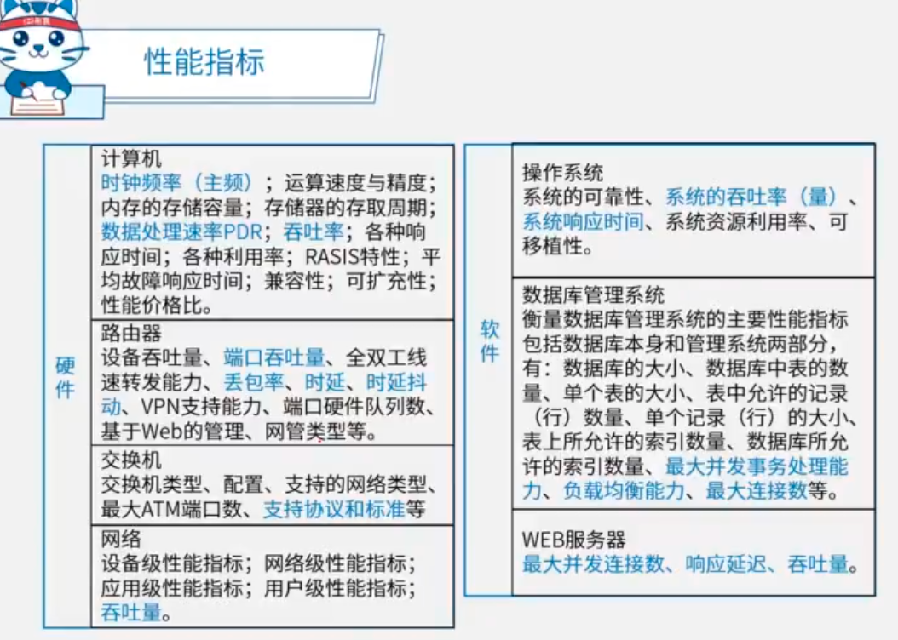

## 性能计算

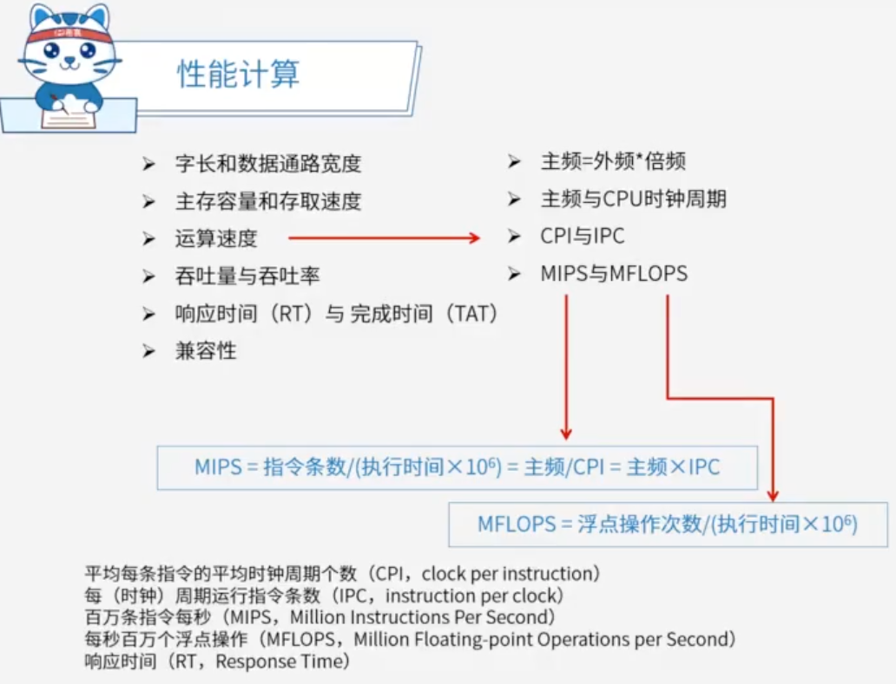

## 性能调整

性能调整从短板解决入手，由查找 和 消除瓶颈组成。

数据库系统：

- CPU/内存使用状况
- 优化数据库设计
  - 表结构设计
  - 查询语句优化
- 优化数据库管理以及进程/线程状态
- 磁盘剩余空间
- 日志文件大小

应用系统：

- 系统可用性
- 响应时间
- 用户并发数
- 特定应用的系统资源占用

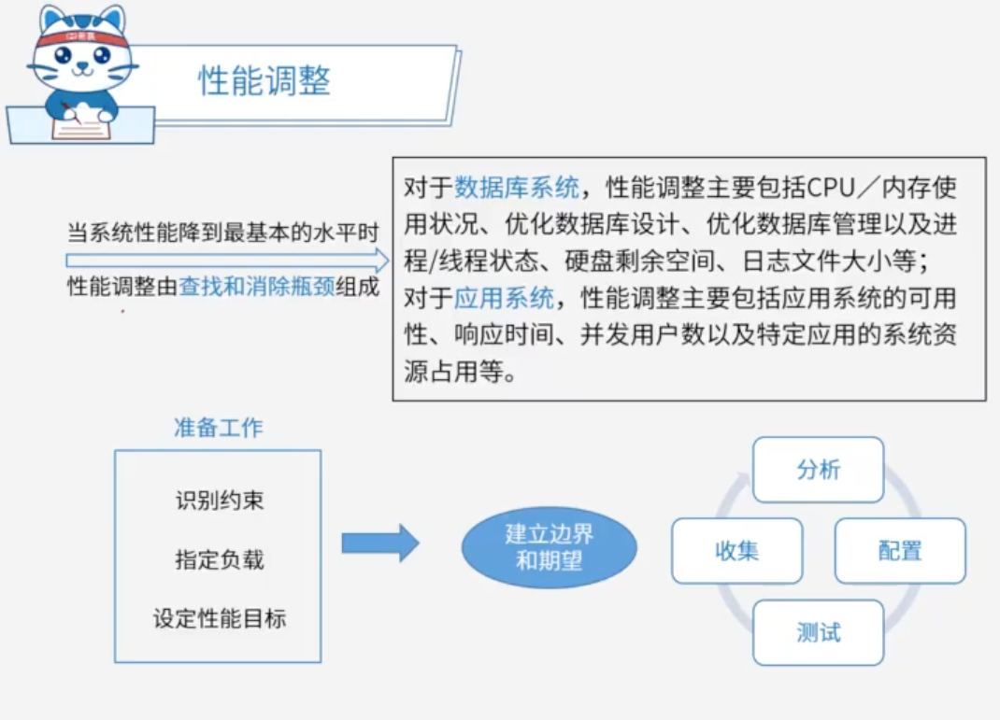

# 阿姆达尔解决方案

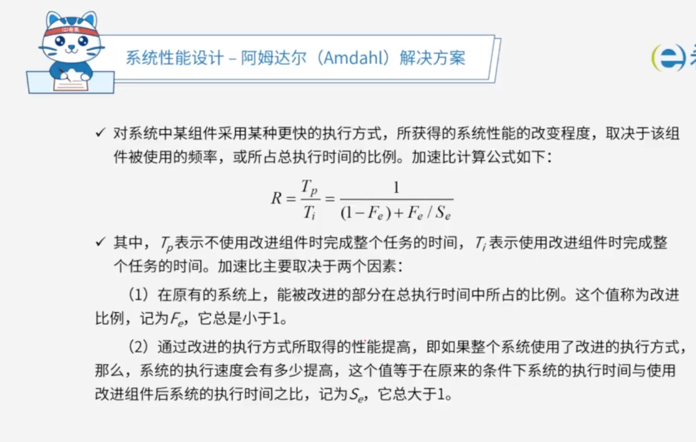

# 性能评价方法

基准程序法：是目前一致承认的测试系统性能的较好方法。

把程序中用的最多、最频繁的核心程序作为评估计算机系统性能的标准程序。

还有其他的一些测试对应排名：

- 真实的程序
- 核心程序
- 小型基准程序
- 合成基准程序

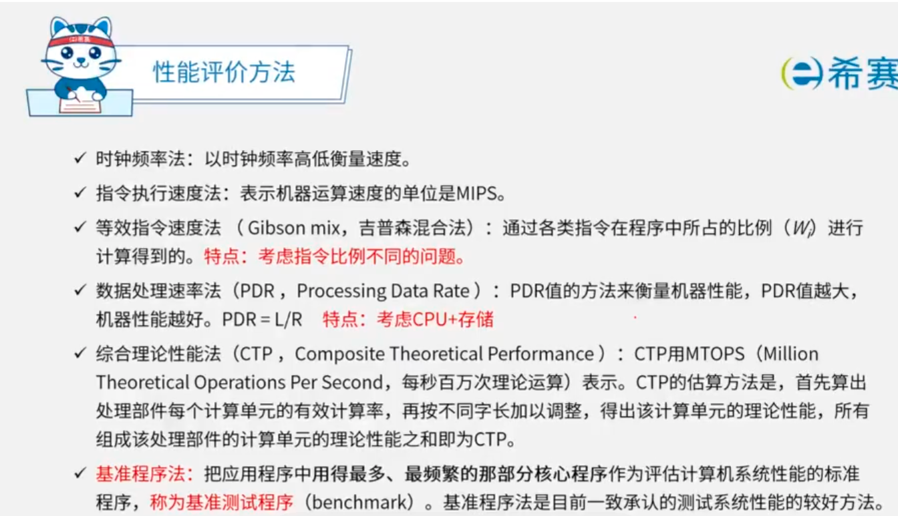

### TPC基准程序

TPC基准程序主要用于评测计算机在事务、数据库处理、企业管理与决策支持系统等方面的性能。

其评测结果用每秒完成事务处理数TPC来表示。不同的测试标准有不同的应用场景。

- TPC-A：用于评估OLTP环境下数据库和硬件性能
- TPC-B：测试的是不包括网络的纯事务处理量
- TPC-C：专门针对OLTP系统的测试标准
- TPC-D、TPC-H、TPC-R：测试的是决策支持系统
- TPC-W：基于web应用，用于测试通过Internet进行市场服务和销售的商业行为

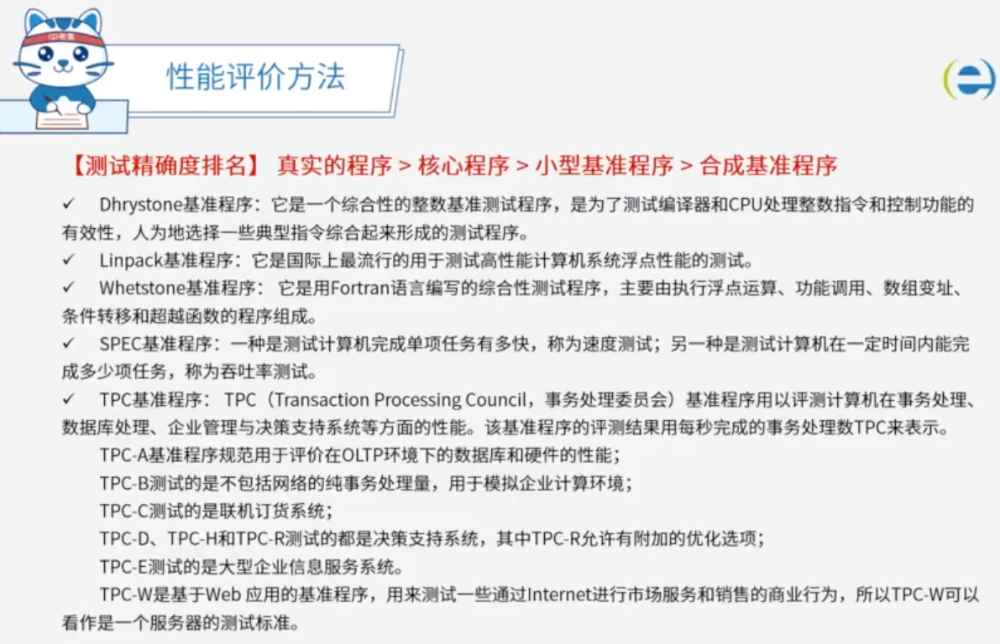

# 一题目

软件复杂性度量中，（ ）可以反映源代码结构的复杂度。

问题1选项
A.模块数
B.环路数
C.用户数
D.对象数

## 答案

B

## 解析

程序图的环路数是源代码复杂程度的度量。

环路复杂度是一种代码复杂度的衡量表尊，目标是为了指导程序员写出更具可测性和可维护性的代码

# 二题目

进行系统监视通常有三种方式：一是通过（），如UNIX/Linux系统中的ps、last等；二是通过系统记录文件查阅系统在特定时间内的运行状态；三是集成命令、文件记录和可视化技术的监控工具，如（） 。

问题1选项
A.系统命令
B.系统调用
C.系统接口
D.系统功能

问题2选项
A.Windows 的netstat
B.Linux 的iptables
C.Windows的Perfmon
D.Linux 的top

## 答案

A

C

## 解析

https://hls.videocc.net/060fd1513e/c/060fd1513e1cf448bc029f37278093bc.m3u8?device=desktop&pid=1696230976040X1320423

系统监视的目标是为了评估系统性能。要监视系统性能，需要收集某个时间段内的3种不同类型的性能数据：

1. 常规性能数据
   - 该信息可帮助识别短期趋势（如内存泄漏）
2. 比较基准的性能数据
   - 该信息可帮助人们发现缓慢、历经长时间才发生的变化
3. 服务水平报告数据
   - 该信息可帮助人们确保系统能满足一定的服务或性能水平，也可能会将该信息提供给并不是性能分析人员的决策者

进行系统监视通常有3种方式

- 通过系统本身提供的命令，如 UNIX/Liunx 中的 w、ps、last，Windows 中的netstat 等
- 通过系统记录文件查阅系统在特定时间内的运行状态
- 集成命令、文件记录和可视化技术的监控工具，提供直观的界面，操作人员只需要进行一些可视化的设置，而不需要记忆繁杂的命令行参数，即可完成监视操作，如Windows的Perfmon应用程序

# 三题目

通常用户采用评价程序来评价系统的性能，评测准确度最高的评价程序是（ ）。在计算机性能评估中，通常将评价程序中用得最多、最频繁的（ ）作为评价计算机性能的标准程序，称其为基准测试程序。

问题1选项
A.真实程序
B.核心程序
C.小型基准程序
D.核心基准程序

问题2选项
A.真实程序
B.核心程序
C.小型基准程序
D.核心基准程序

## 答案

第1题:A

第2题:B

## 解析

真实程序、核心程序、小型基准程序和合成基准程序，其评测准确程度依次递减。

# 四题目

把应用程序中应用最频繁的那部分核心程序作为评价计算机性能的标准程序，称为（）程序。（）不是对Web服务器进行性能评估的主要指标。

A.仿真测试B.核心测试C.基准测试D.标准测试 

A.丢包率B.最大并发连接数C.响应延迟D.吞吐量

## 答案

B

A

## 解析

在web服务器的测试中，反映其性能的指标主要有：

- 最大并发连接数
- 响应延迟
- 吞吐量

常见的web服务器性能评测方法有：

- 基准性能测试
- 压力测试
- 可靠性测试

# 五题目

在实际应用中，用户通常依靠评价程序来测试系统的性能。以下评价程序中，（  ）的评测准确程度最低。事务处理性能委员会（Transaction Processing Performance Council, TPC）是制定商务应用基准程序（benchmark）标准规范、性能和价格度量，并管理测试结果发布的非营利组织，其发布的TPC-C是（  ）的基准程序。

问题1选项
A.核心程序
B.真实程序
C.合成基准程序
D.小型基准程序

问题2选项
A.决策支持
B.在线事务处理
C.企业信息服务
D.联机分析处理

## 答案

C

B

## 解析

https://hls.videocc.net/060fd1513e/b/060fd1513ea42d4edd82769fb111da8b.m3u8?device=desktop&pid=1696232163158X1533682

TPC（Transaction Processing Performance Council，事务处理性能委员会）基准程序用以评测计算机在线事务处理、数据库处理、企业管理与决策支持系统等方面的性能。

该基准程序的评测结果用每秒完成的事务处理数TPC来表示

- TPC-A基准程序规范用于评价在OLTP环境下的数据库和硬件的性能，不同系统之间用性能/价格比进行比较
- TPC-B测试的是不包括网络的纯事务处理量，用于模拟企业计算环境
- TPC-C是专门针对联机事务处理系统（OLTP）的测试标准
- TPC-D、TPC-H和TPC-R测试的都是决策支持系统
- 其中TPC-R允许有附加的优化选项
- TPC-E测试的是大型企业信息服务系统
- TPC-W是基于Web 应用的基准程序，用来测试一些通过Internet进行市场服务和销售的商业行为，所以TPC-W可以看作是一个服务器的测试标准

# 六题目

系统（ ）是指在规定的时间内和规定条件下能有效地实现规定功能的能力。它不仅取决于规定的使用条件等因素，还与设计技术有关。常用的度量指标主要有故障率（或失效率）、平均失效等待时间、平均失效间隔时间和可靠度等。其中，（ ）是系统在规定工作时间内无故障的概率。

问题1选项
A.可靠性
B.可用性
C.可理解性
D.可测试性

问题2选项
A.失效率
B.平均失效等待时间
C.平均失效间隔时间
D.可靠度

## 答案

第1题:A

第2题:D

## 解析

可靠性：指在规定的时间内和规定条件下能有效地实现规定功能的能力。

常用的性能度量指标主要有：故障率（或失效率）、平均失效等待时间、平均失效间隔时间、可靠度

可用性指以用户角度考虑，程序方便、使用、易用的程度，一个可使用的程序应当是易于使用的、能允许用户出错和改变，并尽可能不使用户陷入混乱状态

可测试性：是指验证软件程序正确的难易程度。可测试性好的软件，通常意味着软件设计简单，复杂性低。因为软件的复杂性越大，测试的难度也就越大。

程序正确的难易程度。可测试性好的软件，通常意味着软件设计简单，复杂性低。因为软件的复杂性越大，测试的难度也就越大。 可理解性：通过阅读源代码和相关文档，了解程序功能及其如何运行的容易程度。

# 七题目

软件可靠性是指系统在给定的时间间隔内、在给定条件下无失效运行的概率。若MTTF和MTTR分别表示平均无故障时间和平均修复时间，则公式（ ）可用于计算软件可靠性。

问题1选项
A.MTTF/(1+MTTF)
B.1/(1+MTTF)
C.MTTR/(1+MTTR)
D.1/(1+MTTR)

## 答案

A

## 解析

MTTF/(1+MTTF)可以用来度量可靠性

MTBF/(1+MTBF)可以用来度量可用性。

1/(1+MTTR)可以用来度量可维护性

可靠性通常用平均失效等待时间（mean time to failure,MTTF）和平均失效间隔时间（mean time between failure,MTBF）来衡量。在失效率为常数和修复时间很短的情况下，MTTF和MTBF几乎相等

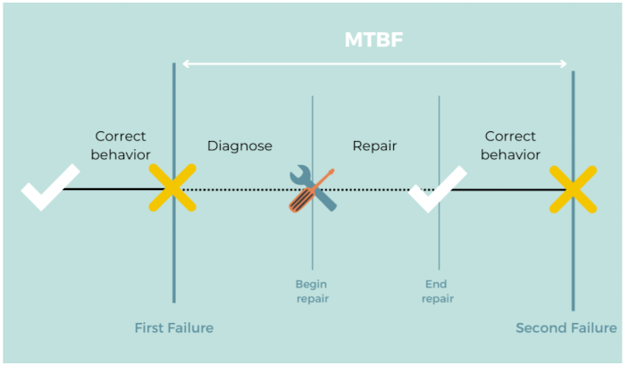

# 八题目

为了优化系统的性能，有时需要对系统进行调整。对于不同的系统，其调整参数也不尽相同。例如，对于数据库系统，主要包括CPU/内存使用状况、（ ）、进程/线程状态、日志文件大小等。对于应用系统，主要包括应用系统的可用性、响应时间、（ ）、特定应用的系统资源占用等。

问题1选项
A.数据丢包率
B.端口吞吐量
C.数据处理速率
D.查询语句性能

问题2选项
A.并发用户数
B.支持协议和标准
C.最大连接数
D.时延抖动

## 答案

D

A

# 九题目

对计算机评价的主要性能指标有时钟频率、（ ）、运算精度和内存容量等。对数据库管理系统评价的主要性能指标有（ ）、数据库所允许的索引数量和最大并发事务处理能力等。

问题1选项
A.丢包率
B.端口吞吐量
C.可移植性
D.数据处理速率

问题2选项
A.MIPS
B.支持协议和标准
C.最大连接数
D.时延抖动

## 答案

D

C

## 解析

- 计算机评价的主要性能指标有：时钟频率（主频）；运算速度；运算精度；内存的存储容量；存储器的存取周期；数据处理速率PDR（processing data rate）；吞吐率；各种响应时间；各种利用率；RASIS特性（即：可靠性Reliability、可用性Availability、可维护性Serviceability、完整性和安全性Integrity and Security）；平均故障响应时间；兼容性；可扩充性；性能价格比
- 路由器评价的主要性能指标有：设备吞吐量、端口吞吐量、全双工线速转发能力、背靠背帧数、路由表能力、背板能力、丢包率、时延、时延抖动、VPN支持能力、内部时钟精度、队列管理机制、端口硬件队列数、分类业务带宽保证、RSVP、IP Diff Serv、CAR支持、冗余、热插拔组件、路由器冗余协议、网管、基于Web的管理、网管类型、带外网管支持、网管粒度、计费能力/协议、分组语音支持方式、协议支持、语音压缩能力、端口密度、信令支持。
- 交换机评价的主要性能指标有：交换机类型、配置、支持的网络类型、最大ATM端口数、最大SONET端口数、最大FDDI端口数、背板吞吐量、缓冲区大小、最大MAC地址表大小、最大电源数、支持协议和标准、路由信息协议RIP、RIP2、开放式最短路径优先第2版、边界网关协议BGP、无类域间路由CIDR、互联网成组管理协议IGMP、距离矢量多播路由协议DVMRP、开放式最短路径优先多播路由协议MOSPF、协议无关的多播协议PIM、资源预留协议RSVP、802.1p优先级标记、多队列、路由、支持第3层交换、支持多层（4到7层交换）、支持多协议路由、支持路由缓存、可支持最大路由表数、VLAN、最大VLAN数量、网管、支持网管类型、支持端口镜像、QoS、支持基于策略的第2层交换、每端口最大优先级队列数、支持基于策略的第3层交换、支持基于策略的应用级QoS、支持最小/最大带宽分配、冗余、热交换组件（管理卡，交换结构，接口模块，电源，冷却系统）、支持端口链路聚集协议、负载均衡。
- 网络的性能指标有：设备级性能指标；网络级性能指标；应用级性能指标；用户级性能指标；吞吐量。
- 操作系统的性能指标有：系统的可靠性、系统的吞吐率（量）、系统响应时间、系统资源利用率、可移植性。
- 数据库管理系统的主要性能指标包括数据库本身和管理系统两部分，有：数据库的大小、数据库中表的数量、单个表的大小、表中允许的记录（行）数量、单个记录（行）的大小、表上所允许的索引数量、数据库所允许的索引数量、最大并发事务处理能力、负载均衡能力、最大连接数等等。
- Web服务器的主要性能指标有：最大并发连接数、响应延迟、吞吐量。

# 十题目

阿姆达尔（Amdahl）定律量化定义了通过改进系统中某个组件的性能，使系统整体性能提高的程度。假设某一功能的处理时间为整个系统运行时间的60%，若使该功能的处理速度提高至原来的5倍，则根据阿姆达尔定律，整个系统的处理速度可提高至原来的（  ）倍。

问题1选项
A.1.333
B.1.923
C.1.5
D.1.829

## 答案

B

## 解析

阿姆达尔（Amdahl）定律规定：对系统中某一组件采用某种更快的执行方式，所获得的系统性能的改进程度，取决于该组件的使用频率，或所占总执行时间的比例。假设使用某种执行方式改进了组件，则系统的性能就会得到提高，加速比的公式如下：

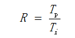

其中，Tp表示不使用改进组件时完成整个任务的时间，Ti表示使用改进组件时完成整个任务的时间。设改进部分在总执行时间中所占的比例为Fe（小于1），该组件的性能改进为Se（原有执行时间与使用改进组件后系统执行时间之比，大于1），在这种情况下：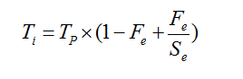 ，改进后整个系统的加速比为：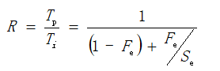

代入题设数据，则有：

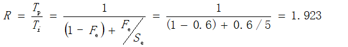

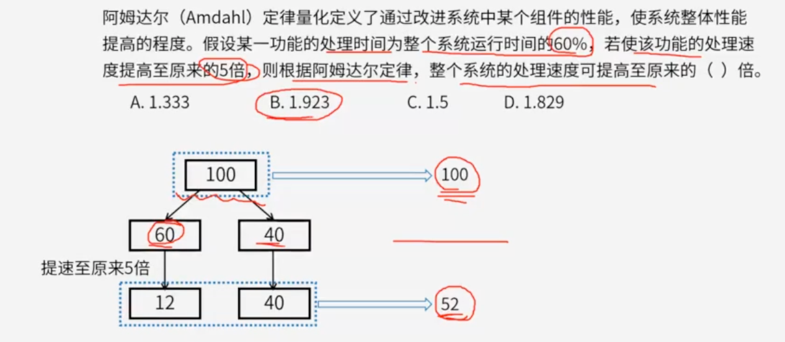

# 十一题目

假设单个CPU的性能为1，则由n个这种CPU组成的多处理机系统的性能P为：
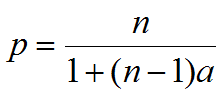
其中，a是一个表示开销的常数。

例如，a=0.1，n=4时，P约为3。也就是说，由4个这种CPU组成的多处理机系统的性能约为3。该公式表明，多处理机系统的性能有一个上限，不管n如何增加，P都不会超过某个值。当a=0.1时，这个上限是（ )。

问题1选项
A.5
B.10
C.15
D.20

## 答案

B

## 解析

https://hls.videocc.net/060fd1513e/8/060fd1513ee18638f5adc97bf2b626e8.m3u8?device=desktop&pid=1696233707945X1296245

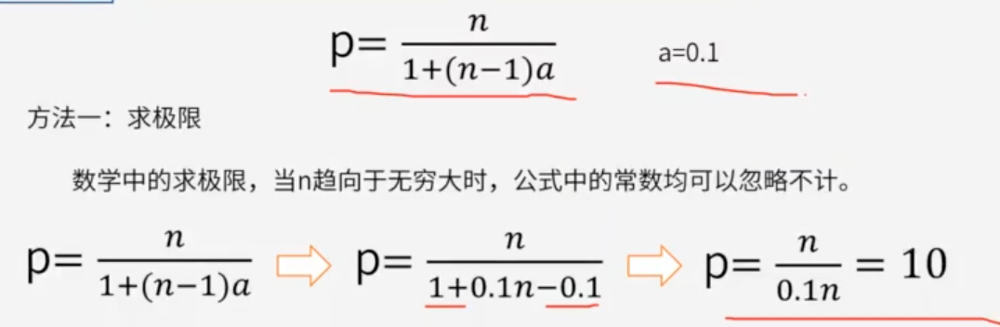

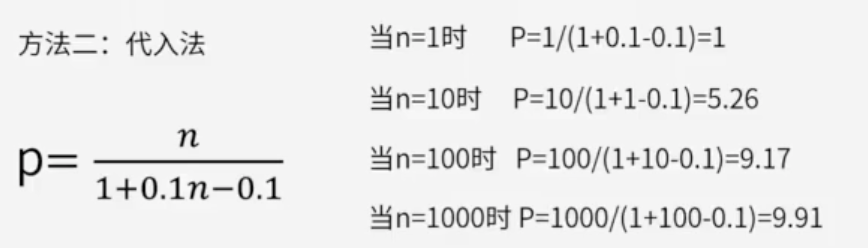