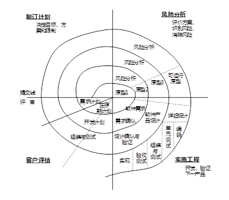
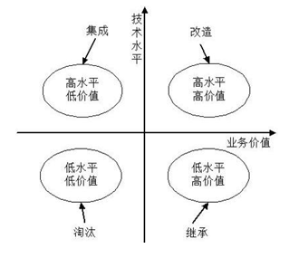

# 软件开发方法

## 结构化方法

自顶向下，逐步分解求精。

严格分阶段、阶段产出标准化

应变能力差

## 面向对象方法

自底向上

阶段界限不明确

更好应变、更好复用

符合人们的思维习惯

## 面向服务方法

粗力度、松耦合

标准化和构件化

抽象级别：操作低，服务中，业务流程高

## 原型开发方法

## 形式化方法

## 统一过程方法UP

## 敏捷方法

## 基于架构的开发方法（ABSD）

# 软件开发模型

软件生命周期模型又称软件开发模型（software develop model）或软件过程模型（software process model）。软件过程模型是软件开发实际过程的抽象与概括，它应该包括构成软件过程的各种活动，也就是对软件开发过程各阶段之间关系的一个描述和表示。

软件活动主要有如下一些：

1、软件描述。必须定义软件功能以及使用的限制。
2、软件开发。也就是软件的设计和实现，软件工程人员制作出能满足描述的软件。
3、软件有效性验证。软件必须经过严格的验证，以保证能够满足客户的需求。
4、软件演化。改进软件以适应不断变化的需求。


## 瀑布模型和原型模型的关系


## 原型模型

由原型开发阶段和目标软件开发阶段构成。

## 瀑布模型

适用于需求明确的场景。分阶段，每个阶段都有产出物。

瀑布模型的特点是因果关系紧密相连，前一个阶段工作的结果是后一个阶段工作的输入。或者说，每一个阶段都是建筑在前一个阶段正确结果之上，前一个阶段的错漏会隐蔽地带到后一个阶段。这种错误有时甚至可能是灾难性的。因此每一个阶段工作完成后，都要进行审查和确认，这是非常重要的。历史上，瀑布模型起到了重要作用，它的出现有利于人员的组织管理，有利于软件开发方法和工具的研究。

### 定义阶段

### 开发阶段

### 维护阶段


## 增量模型与螺旋模型

螺旋模型已 原型为基础 + 瀑布模型 逐步的达到期望的结果。同时螺旋模型引入了风险分析。


## V模型 和 喷泉模型

V模型重视测试，在每个阶段都有需要测试的内容。

喷泉模型是早期的面向对象模型


## 构件组装模型（CBSD）

模块化的思想，使用构件进行拼装


## 快速应用开发模型（RAD）

瀑布模型（SDLC）和构件组装模型（CBSD） 两个组合就是快速应用开发模型


## 统一过程模型（UP）


## 敏捷方法

轻量级、减轻流程和文档

有四大价值观和12条过程实践规则

敏捷方法是一种以人为核心、迭代、循序渐进的开发方法。在敏捷方法中，软件项目的构建被切分成多个子项目，各个子项目成果都经过测试，具备集成和可运行的特征。在敏捷方法中，从开发者的角度来看，主要的关注点有短平快的会议、小版本发布、较少的文档、合作为重、客户直接参与、自动化测试、适应性计划调整和结对编程；从管理者的角度来看，主要的关注点有测试驱动开发、持续集成和重构。 

敏捷方法是以人为本，而非以过程为本。

### 四大价值观

- 沟通：加强面对面沟通
- 简单：不过度设计
- 反馈：及时反馈
- 勇气：接受变更的勇气


### 具体的敏捷开发方法

- XP （Extreme Programming，极限编程）：在所有的敏捷型方法中，XP是最引人瞩目的。它源于Smalltalk圈子，特别是Kent Beck和Ward Cunningham在20世纪80年代末的密切合作。XP在一些对费用控制严格的公司中的使用，已经被证明是非常有效的。
-  Cockburn 水晶系列方法：它与XP方法一样，都有以人为中心的理念，但在实践上有所不同。Alistair考虑到人们一般很难严格遵循一个纪律约束很强的过程，因此，与XP的高度纪律性不同，Alistair探索了用最少纪律约束而仍能成功的方法，从而在产出效率与易于运作上达到一种平衡。
-  开放式源码：开放式源码项目有一个特别之处，就是程序开发人员在地域上分布很广，这使得它和其他敏捷方法不同，因为一般的敏捷方法都强调项目组成员在同一地点工作。开放源码的一个突出特点就是查错排障（debug）的高度并行性，任何人发现了错误都可将改正源码的“补丁”文件发给维护者。然后由维护者将这些“补丁”或是新增的代码并入源码库。
- SCRUM：明确定义了的可重复的方法过程只限于在明确定义了的可重复的环境中，为明确定义了的可重复的人员所用，去解决明确定义了的可重复的问题。
- 功用驱动开发方法（FDD-Feature Driven Development）：它致力于短时的迭代阶段和可见可用的功能。在FDD中，一个迭代周期一般是两周。在FDD中，编程开发人员分成两类：首席程序员和“类”程序员（class owner）。
  - 首席程序员是最富有经验的开发人员，他们是项目的协调者、设计者和指导者
  - “类”程序员则主要做源码编写
- ASD方法：其核心是三个非线性的、重叠的开发阶段：猜测、合作与学习。


# 需求工程

软件需求是指用户对系统在功能、行为、性能、设计约束等方面的期望

## 需求开发（技术维度）

- 需求获取
- 需求分析
- 需求定义
  - 产品需求规格说明书SRS
- 需求验证
  - 对SRS进行评审验证，最终确认得到需求基线

---

### 需求开发 - 需求获取

#### 获取方法

- 收集资料
- 联合讨论会（Joint Requirement Planning，JRP 联合需求计划）
  - 成本较高
- 用户访谈
- 书面调查
- 现场观摩
- 参加业务实践
- 阅读历史文档
- 抽样调查

#### 分类

- 业务需求（整体全局）
- 用户需求（用户视角）
- 系统需求（计算机化）
  - 功能需求
  - 性能需求
  - 设计约束

#### QFD

- 基本需求（明示，常规需求）
- 期望需求（隐含）
- 兴奋需求（多余）

### 需求开发 - 需求分析 （SA）

#### 结构化开发的需求分析

三种模型 和 一个数据字典

在结构化分析中，主要进行三个方面的建模：功能建模、行为建模、数据建模

行为建模一般采用：状态转换图

功能建模一般采用：数据流图（DFD）

数据建模一般采用：ER图


- 功能模型：数据流图（DFD），用于对功能建模
  - 数据流图的四大构成要素：数据流、加工、数据存储、外部实体
  - 
- 行为模型：状态转换图
  - 
- 数据模型：ER图
  - ER图有实体和联系
  - 

#### 面向对象开发的需求分析（OOA）

面向对象相关概念

面向对象设计的类分别为：实体类、控制类、边界类


## 需求管理（管理维度）

- 变更控制

  需求的变更是受严格管控的，其流程为：

  - 问题分析和变更描述
    - 这是识别和分析需求问题或者一份明确的变更提议，以检查它的有效性，从而产生一个更明确的需求变更提议。
  - 变更分析和成本计算
    - 使用可追溯性信息和系统需求的一般知识，对需求变更提议进行影响分析和评估。变更成本计算应该包括对需求文档的修改、系统修改的设计和实现的成本。一旦分析完成并且确认，应该进行是否执行这一变更的决策。
  - 变更实现
    - 这要求需求文档和系统设计以及实现都要同时修改。如果先对系统的程序做变更，然后再修改需求文档，这几乎不可避免地会出现需求文档和程序的不一致。

- 版本控制

  - 跟踪需求随时间的变化

- 需求跟踪

  - 需求跟踪是将单个需求和其他系统元素之间的依赖关系和逻辑联系建立跟踪，这些元素包括各种类型的需求、业务规则、系统架构和构件、源代码、测试用例、以及帮助文件。需求跟踪一般采用需求跟踪矩阵做跟进工作，跟踪矩阵将从需求源头一直跟进到最终的软件产品

- 需求状态跟踪

  - 识别需求的变化和更新状态

# 业务流程建模：

业务流程建模方法主要有六种：

- 流程图(flow chart)：是最早用于业务流程的一种图形化描述方法，易学习、好理解，但存在无法清楚界定流程界限、不支持层次化描述业务流程等问题
- 角色活动图(Role Activity Diagram，RAD)和角色交互图(Role Interaction Diagram，RID)：擅长描述角色与活动、角色与角色的交互关系，但不支持层次化描述业务流程
- IDEF0和1DEF3：IDEF0描述业务流程做什么，但没指明谁做；IDEF3回答了怎么做，但描述复杂业务流程难度大；
- Petri-Net：高级Petri网有很强的数学基础，可以计算／仿真分析业务流程性能，但用户的学习难度大；
- 统一建模语言(Uniform Modeling Language，UML)活动图：易学习和使用，但模型的仿真和分析能力差
- BPMN：是一种以业务流程图的形式表示业务流程的图形方法，可以用其定义的一系列业务组件，组成业务流程图

# 逆向工程与重构工程

逆向工程与重构工程是目前预防性维护釆用的主要技术。所谓软件的逆向工程就是分析已有的程序，寻求比源代码更髙级的抽象表现形式。与之相关的概念是：

- 重组（restructuring）：指在同一抽象级别上转换系统描述形式
- 设计恢复（design recovery）：指借助工具从已有程序中抽象出有关数据设计、总体结构设计和过程设计的信息
- 重构/再工程（re-engineering）：也称修复和改造工程，它是在逆向工程所获信息的基础上修改或重构已有的系统，产生系统加一个新版本。

## 恢复信息的级别

逆向工程导出的信息可分为如下4个抽象层次

- 实现级：包括程序的抽象语法树、符号表等信息
- 结构级：包括反映程序分量之间相互依赖关系的信息，例如调用图、结构图等
- 功能级：包括反映程序段功能及程序段之间关系的信息
- 领域级：包括反映程序分量或程序诸实体与应用领域概念之间对应关系的信息

上述信息的抽象级别越髙，它与代码的距离就越远，通过逆向工程恢复的难度亦越大，而自动工具支持的可能性相对变小，要求人参与判断和推理的工作增多。

## 恢复信息的方法

在逆向工程中用于恢复信息的方法有4类

- 用户指导下的搜索与变换：用于导出实现级和结构级信息
- 变换式方法：除领域级外所有抽象级别上的信息都可用此类方法推导
- 基于领域知识：主要用于恢复功能级和领域级信息
- 铅板恢复法：适用于推导实现级和结构级信息

# 设计模式

## 按照目的分类

- 创建型：主要用于创建对象
  - 有工厂方法模式（Factory Method）、抽象工厂模式（Abstract Factory）、建造者模式（Builder）、原型模式（Prototype）、单例模式（Singleton）共5种
- 结构型：主要用于处理类和对象的组合
  - 适配器模式（Adapter）、桥接模式（Bridge）、组合模式（Composite）、装饰模式（Decorator）、外观模式（Facade）、享元模式（Flyweight）、代理模式（Proxy）共7种。
- 行为型：主要用于描述类或对象怎样交互和怎样分配职责
  - 有职责链模式（Chain of Responsibility）、命令模式（Command）、解释器模式（Interpreter）、迭代器模式（Iterator）、中介者模式（Mediator）、备忘录模式（Memento）、观察者模式（Observer）、状态模式（State）、策略模式（Stratege）、模板方法模式（Template Method）、访问者模式（Visitor）共11种

## 按照作用范围分类

- 类模式
  - 用于处理类和子类的关系，这种关系通过继承建立，在编译时就确定了，是一种静态关系

- 对象模式
  - 处理对象间的关系，具有动态关系

## 特点

- Prototype（原型模式）：用原型实例指定创建对象的类型，并且通过拷贝这个原型来创建新的对象。允许对象在不了解创建对象的确切类以及如何创建细节的情况下创建自定义对象。
- Abstract Factory（抽象工厂模式）：提供一个创建一系列相关或相互依赖对象的接口，而无需指定它们具体的类。
- Builder（构建器模式）：将一个复杂类的表示与其构造相分离，使得相同的构建过程能够得出不同的表示。
- Singleton（单例模式）：保证一个类只有一个实例，并提供一个访问它的全局访问点。
- 桥接模式（Bridge）：可以将类的抽象部分与实现分离，从而实现独立变化的模式
- 适配器模式（Adapter）：将一个类的接口转换成客户希望的另外一个接口，属于结构型模式
- 装饰模式（Decorator）：在不改变现有对象结构的情况下，动态地给该对象增加一些职责（即增加其额外功能）的模式，做比静态继承具有更大的灵活性。
- 组合模式（Composite）：组合多个对象形成树形结构以表示具有“整体—部分”关系的层次结构
- 命令模式（Command）：可以封装请求为对象，支持可撤销操作，参数化客户端请求的模式
- 解释器（Interpreter）模式：描述了如何为语言定义一个文法，如何在该语言中表示一个句子，以及如何解释这些句子，这里的“语言”是使用规定格式和语法的代码。解释器模式主要用在编译器中，在应用系统开发中很少用到。
- 策略（Strategy）模式：策略模式是一种对象的行为型模式，定义一系列算法，并将每一个算法封装起来，并让它们可以相互替换。策略模式让算法独立于使用它的客户而变化，其目的是将行为和环境分隔，当出现新的行为时，只需要实现新的策略类。
- 中介者（Mediator）模式：中介者模式是一种对象的行为型模式，通过一个中介对象来封装一系列的对象交互。中介者使得各对象不需要显式地相互引用，从而使其耦合松散，而且可以独立地改变它们之间的交互。中介者对象的存在保证了对象结构上的稳定，也就是说，系统的结构不会因为新对象的引入带来大量的修改工作。
- 迭代器（Iterator）模式：迭代器模式是一种对象的行为型模式，提供了一种方法来访问聚合对象，而不用暴露这个对象的内部表示。迭代器模式支持以不同的方式遍历一个聚合对象，复杂的聚合可用多种方法来进行遍历；允许在同一个聚合上可以有多个遍历，每个迭代器保持它自己的遍历状态，因此，可以同时进行多个遍历操作。

# UML

统一建模语言由三部分组成：

- 构造块
  - 事物
    - 结构事物：最静态的部分，包括类、接口、用例
    - 行为事物
    - 分组事物：包、构件
    - 注释事物
  - 关系
  - 图
- 规则
- 公共机制


## UML图

- 静态图
- 动态图


## UML 4+1视图

UML对系统架构的定义是系统的组织结构，包括系统分解的组成部分，以及它们的关联性、交互机制和指导原则等提供系统设计的信息。具体来说，就是指以下5个系统视图：

- 逻辑视图：也称为设计视图，表示了设计模型中在架构方面具有重要意义的部分。即类、子系统、包和用例实现的子集。
- 进程视图：进程视图是可执行线程和进程作为活动类的建模，它是逻辑视图的一次执行实例，描述了并发与同步结构。
- 实现视图：实现视图对组成基于系统的物理代码的文件和构件进行建模。
- 部署视图：部署视图把构件部署到一组物理节点上，表示软件到硬件的映射和分布结构。
- 用例视图。用例视图是最基本的需求分析模型。


# 测试

## 静态测试和动态测试

静态测试是指被测试程序不在机器上运行，而采用人工检测和计算机辅助静态分析的手段对程序进行检测。静态测试包括对文档的静态测试和对代码的静态测试。对文档的静态测试主要以检查单的形式进行，而对代码的静态测试一般采用桌前检查（Desk Checking）、代码审查和代码走查。经验表明，使用这种方法能够有效地发现30%～70%的逻辑设计和编码错误。

与之对应的动态测试是利用计算机运行得到测试结果的方式进行测试。

动态测试是指通过运行程序发现错误，分为黑盒测试法、白盒测试法和灰盒测试法。

常用的黑盒测试用例的设计方法有等价类划分、边界值分析等等；常用的白盒测试用例设计方法有基本路径测试、循环覆盖测试、逻辑覆盖测试。

### 静态分析

静态分析（static analysis）是一种对代码的机械性的、程式化的特性分析方法。静态分析一般常用软件工具进行，包括控制流分析、数据流分析、接口分析、表达式分析。

- 数据流图分析：分析数据处理的异常现象（数据异常），这些异常包括初始化、赋值、或引用数据等的序列的异常。
- 控制流图分析：系统地检查程序的控制结构。按照结构化程序规则和程序结构的基本要求进行程序结构检查。控制流图描述了程序元素和它们的执行顺序之间的联系。一个程序元素通常是一个条件、一个简单的语句，或者一块语句（多个连续语句）。
- 接口分析：接口分析涉及子程序以及函数之间的接口一致性，包括检查形参与实参类型、个数、维数、顺序的一致性。当子程序之间的数据或控制传递使用公共变量块或全局变量时，也应检查它们的一致性。
- 表达式分析：括号不匹配、数组引用越界、除数为零

## 白盒测试

白盒测试根据软件的内部逻辑设计测试用例，常用的技术是逻辑覆盖，即考察用测试数据运行被测程序时对程序逻辑的覆盖程度。

主要的覆盖标准有6种：语句覆盖、判定覆盖、条件覆盖、判定/条件覆盖、组合条件覆盖和路径覆盖。

- 语句覆盖。语句覆盖是指选择足够多的测试用例，使得运行这些测试用例时，被测程序的每个语句至少执行一次。很显然，语句覆盖是一种很弱的覆盖标准。
- 判定覆盖。判定覆盖又称分支覆盖，它的含义是，不仅每个语句至少执行一次，而且每个判定的每种可能的结果（分支）都至少执行一次。判定覆盖比语句覆盖强，但对程序逻辑的覆盖程度仍然不高。 
- 条件覆盖。条件覆盖的含义是，不仅每个语句至少执行一次，而且使判定表达式中的每个条件都取得各种可能的结果。条件覆盖不一定包含判定覆盖，判定覆盖也不一定包含条件覆盖。
- 判定/条件覆盖。同时满足判定覆盖和条件覆盖的逻辑覆盖称为判定/条件覆盖。它的含义是，选取足够的测试用例，使得判定表达式中每个条件的所有可能结果至少出现一次，而且每个判定本身的所有可能结果也至少出现一次。 
- 条件组合覆盖。条件组合覆盖的含义是，选取足够的测试用例，使得每个判定表达式中条件结果的所有可能组合至少出现一次。显然，满足条件组合覆盖的测试用例，也一定满足判定/条件覆盖。因此，条件组合覆盖是上述5种覆盖标准中最强的一种。然而，条件组合覆盖还不能保证程序中所有可能的路径都至少经过一次。
- 路径覆盖。路径覆盖的含义是，选取足够的测试用例，使得程序的每条可能执行到的路径都至少经过一次（如果程序中有环路，则要求每条环路路径至少经过一次）。 路径覆盖实际上考虑了程序中各种判定结果的所有可能组合，因此是一种较强的覆盖标准

## 黑盒测试

黑盒测试基于产品功能规格说明书，从用户角度针对产品特定的功能和特性进行验证活动，确认每个功能是否得到完整实现，用户能否正常使用这些功能。主要用于集成测试、确认测试和系统测试阶段。

黑盒测试在不知道系统或组件内部结构的情况下进行，不考虑内部逻辑结构，着眼于程序外部结构，在软件接口处进行测试。试图发现的错误：功能不正确或遗漏；界面错误；数据库访问错误；性能错误；初始化和终止错误等
主要的方法有：等价类划分法、边界值分析法、因果图法、判定表驱动法、错误推测法。


## 确认测试

确认测试又称合格性测试，用来验证软件与用户需求的一致性。确认测试包括：内部确认测试、Alpha测试、Beta测试等。

其中Alpha测试和Beta测试一般是针对产品型的软件。

- 内部测试：即软件开发组织内部按软件需求说明书进行测试。

- Alpha测试：是在开发环境下进行的测试，由用户/内部用户模拟实际操作环境下进行的受控测试。
- Beta测试：是用户在实际使用环境下进行的测试。 验收测试的目的是确保软件准备就绪，并且可以让最终用户将其用于执行软件的既定功能和任务。 

验收测试是向未来的用户表明系统能够像预定要求那样工作。 

## 回归测试

回归测试的目的是测试软件变更之后，变更部分的正确性和对变更需求的符合性，以及软件原有的、正确的功能、性能和其它规定的要求的不损害性。

## 自动化测试

自动化测试工具主要使用脚本技术来生成测试用例，测试脚本不仅可以在功能测试上模拟用户的操作，比较分析，而且可以用在性能测试、负载测试上。虚拟用户可以同时进行相同的、不同的操作，给被测软件施加足够的数据和操作，检查系统的响应速度和数据吞吐能力。

- 线性脚本：是录制手工执行的测试用例得到的脚本，这种脚本包含所有的击键、移动、输入数据等，所有录制的测试用例都可以得到完整的回放。
- 结构化脚本：类似于结构化程序设计，具有各种逻辑结构、函数调用功能。
- 共享脚本：共享脚本是指可以被多个测试用例使用的脚本，也允许其他脚本调用。共享脚本可以在不同主机、不同系统之间共享，也可以在同一主机、同一系统之间共享。
- 数据驱动脚本：将测试输入存储在独立的（数据）文件中，而不是存储在脚本中。可以针对不同数据输入实现多个测试用例。
- 关键字驱动脚本，关键字驱动脚本是数据驱动脚本的逻辑扩展。它将数据文件变成测试用例的描述，采用一些关键字指定要执行的任务。

## 性能测试

性能测试主要包括压力测试、负载测试、并发测试（容量测试）和可靠性测试等。

- 强度测试：是在系统资源特别低的情况下考查软件系统极限运行情况。

- 负载测试：用于测试超负荷环境中程序是否能够承担，确定在各种工作负载下系统的性能，测试当负载逐渐增加时，系统各项性能指标的变化情况。

- 压力测试：通过确定系统的瓶颈或不能接收的性能点，来获得系统能够提供的最大服务级别的测试。负载测试和压力测试可以结合进行，统称为负载压力测试。

- 容量测试：并发测试也称为容量测试，主要用于测试系统可同时处理的在线最大用户数量。

## 集成测试

集成测试的目的是检查模块之间，以及模块和已集成的软件之间的接口关系，并验证已集成的软件是否符合设计要求。集成测试的技术依据是软件概要设计文档。

软件集成测试将已通过单元测试的模块集成在一起，主要测试模块之间的协作性。从组装策略而言，可以分为一次性组装和增量式组装。集成测试计划通常是在软件概要设计阶段完成，集成测试一般采用黑盒测试方法。

## 单元测试

单元测试也称为模块测试，测试的对象是可独立编译或汇编的程序模块、软件构件或OO软件中的类（统称为模块），其目的是检查每个模块能否正确地实现设计说明中的功能、性能、接口和其他设计约束等条件，发现模块内可能存在的各种差错。单元测试的技术依据是软件详细设计说明书。

## 系统测试

系统测试的对象是完整的、集成的计算机系统，系统测试的目的是在真实系统工作环境下，验证完整的软件配置项能否和系统正确连接，并满足系统/子系统设计文档和软件开发合同规定的要求。系统测试的技术依据是用户需求或开发合同，除应满足一般测试的准入条件外，在进行系统测试前，还应确认被测系统的所有配置项已通过测试，对需要固化运行的软件还应提供固件。

# 软件开发环境

软件开发环境应支持多种集成机制，例如，平台集成、数据集成、界面集成、控制集成和过程集成等。

软件开发环境具有集成性、开放性、可裁减性、数据格式一致性、风格统一的用户界面等特性。

集成机制根据功能的不同，可划分为环境信息库、过程控制与消息服务器、环境用户界面三个部分：

- 环境信息库：环境信息库是软件开发环境的核心，用以存储与系统开发有关的信息，并支持信息的交流与共享
- 过程控制与消息服务器：过程控制与消息服务器是实现过程集成和控制集成的基础。过程集成是按照具体软件开发过程的要求进行工具的选择与组合，控制集成使各工具之间进行并行通信和协同工作。
- 环境用户界面：环境用户界面包括环境总界面和由它实行统一控制的各环境部件及工具的界面。

# 模块之间的耦合性和内部的内聚性

## 耦合性

从低到高有：
非直接耦合、数据耦合、标记耦合、控制耦合、外部耦合、公共耦合、内部耦合

## 内聚性

从低到高有：

偶然内聚、逻辑内聚、瞬时内聚、过程内聚、通信内聚、顺序内聚、功能内聚

# 软件设计

## 活动

软件设计包括四个既独立又相互联系的活动：

- 数据设计
  - 高质量的数据设计将改善程序结构和模块划分，降低过程复杂性
- 软件结构设计
  - 主要目标是开发一个模块化的程序结构，并表示出模块间的控制关系
- 人机界面设计
  - 描述了软件与用户之间的交互关系
- 过程设计

## 任务

软件设计阶段的四个任务

- 体系结构设计
  - 定义部件之间的关系
- 接口设计
  - 软件内部、软件和操作系统之间以及软件和人之间的通信
- 数据设计
  - 将模型转化为数据结构
- 过程设计
  - 系统结构部件转化为软件的过程，确定各个组成部件内的数据结构和算法

## 结构化设计方法

结构化程序设计的三种基本控制结构是：顺序、循环、分支

传统软件工程方法采用结构化设计方法，将软件开发分为概要设计和详细设计两个步骤。

- 概要设计将软件需求转化为数据结构和系统结构
  - 会使用模块结构图、层次图和HIPO图
- 详细设计则通过结构细化得出软件的详细数据结构和算法
  - 程序流程图、伪代码、盒图

# 一题目

（ ）通常为一个迭代过程，其中的活动包括需求发现、需求分类和组织、需求协商、需求文档化。

问题1选项
A.需求确认
B.需求管理
C.需求抽取
D.需求规格说明

## 答案

C

## 解析

需求抽取和分析的过程主要分为以下四个步骤：1.需求发现和理解；2.需求分类和组织；3.需求优先级排序和协商；4.需求文档化。

需求抽取有两个基本的方法：1.访谈，开发者和其他人谈论他们做的事情。2.观察或人种学调查，观察人们做自己的工作来了解他们使用哪些制品、他们如何使用这些制品等。

# 二题目

需求管理的主要活动包括（ ）。

问题1选项
A.变更控制、版本控制、需求跟踪、需求状态跟踪
B.需求获取、变更控制、版本控制、需求跟踪
C.需求获取、需求建模、变更控制、版本控制
D.需求获取、需求建模、需求评审、需求跟踪

## 答案

A

## 解析

需求工程包括需求开发和需求管理两大类活动。

需求开发包括：需求获取，需求分析，需求定义，需求验证这些主要活动；

需求管理包括：变更控制、版本控制、需求跟踪和需求状态跟踪这些活动。

# 三题目

（ ）包括编制每个需求与系统元素之间的联系文档，这些元素包括其它需求、体系结构、设计部件、源代码模块、测试、帮助文件和文档等。

问题1选项
A.需求描述
B.需求分析
C.需求获取
D.需求跟踪

## 答案

D

# 四题目

软件需求开发的最终文档经过评审批准后，就定义了开发工作的（），它在客户和开发者之间构筑了产品功能需求和非功能需求的一个（）， 是需求开发和需求管理之间的桥梁。

问题1选项
A.需求基线
B.需求标准
C.需求用例
D.需求分析

问题2选项
A.需求用例
B.需求管理标准
C.需求约定
D.需求变更

## 答案

第1题:A

第2题:C

## 解析

需求开发的结果应该有项目视图和范围文档、用例文档和SRS，以及相关的分析模型。经评审批准，这些文档就定义了开发工作的需求基线。

这个基线在用户和开发人员之间就构成了软件需求的一个约定，它是需求开发和需求管理之间的桥梁

# 五题目

https://www.educity.cn/tiku/20994415.html

需求变更管理是需求管理的重要内容。需求变更管理的过程主要包括问题分析和变更描述、（ ）、变更实现。具体来说，在关于需求变更管理的描述中，（ ）是不正确的 。

问题1选项
A.变更调研
B.变更判定
C.变更定义
D.变更分析和成本计算

问题2选项
A.需求变更要进行控制，严格防止因失控而导致项目混乱，出现重大风险
B.需求变更对软件项目开发有利无弊
C.需求变更通常按特定的流程进行
D.在需求变更中，变更审批由CCB负责审批

## 答案

第1题:D

第2题:B

# 六题目

以下关于需求陈述的描述中，（ ）是不正确的。

问题1选项
A.每一项需求都必须完整、准确地描述即将要开发的功能
B.需求必须能够在系统及其运行环境的能力和约束条件内实现
C.每一项需求记录的功能都必须是用户的真正的需要
D.在良好的需求陈述中，所有需求都应被视为同等重要

## 答案

D

## 解析

https://www.educity.cn/tiku/352098.html

需求是应该分优先等级的，不能把所有需求都视为同等重要。

# 七题目

一个好的变更控制过程，给项目风险承担者提供了正式的建议变更机制。如下图所示的需求变更管理过程中，①②③处对应的内容应分别是（ ）。


问题1选项
A.问题分析与变更描述、变更分析与成本计算、变更实现
B.变更描述与成本计算、变更分析、变更实现
C.问题分析与变更分析、成本计算、变更实现
D.变更描述、变更分析与变更实现、成本计算

## 答案

A

## 解析

https://www.educity.cn/tiku/351863.html

需求变更的过程：

识别问题、问题分析与变更描述、变更分析与成本计算、变更实现、修改后的需求

# 八题目

（ ）是关于需求管理正确的说法。

问题1选项
A.为达到过程能力成熟度模型第二级，组织机构必须具有3个关键过程域
B.需求的稳定性不属于需求属性
C.需求变更的管理过程遵循变更分析和成本计算、问题分析和变更描述、变更实现的顺序
D.变更控制委员会对项目中任何基线工作产品的变更都可以做出决定

## 答案

D

## 解析

https://www.educity.cn/tiku/89444.html

```tex
软件能力成熟度模型（CMM）在软件开发机构中被广泛用来指导软件过程改进。该模型描述了软件处理能力的 5个成熟级别。
为了达到过程能力成熟度模型的第二级，组织机构必须具有 6 个关键过程域 KPA（Key Process Areas）
```

```tex
除了文本，每一个功能需求应该有一些相关的信息与它联系，我们把这些信息称为需求属性。
对于一个大型的复杂项目来说，丰富的属性类别显得尤为重要。例如，在文档中考虑和明确如下属性：创建需求的时间、需求的版本号、创建需求的作者、负责认可该软件需求的人员、需求状态、需求的原因和根据、需求涉及的子系统、需求涉及的产品版本号、使用的验证方法或者接受的测试标准、产品的优先级或者重要程度、需求的稳定性。
```

# 九题目

一个大型软件系统的需求总是有变化的。为了降低项目开发的风险，需要一个好的变更控制过程。如下图所示的需求变更管理过程中，①②③处对应的内容应是__(1)__；自动化工具能够帮助变更控制过程更有效地运作，__(2)__是这类工具应具有的特性之一。


问题1

A、问题分析与变更描述、变更分析与成本计算、变更实现 

B、变更描述 与变更分析、成本计算、变更实现 

C、问题分析与变更分析、变更分析、变更实现

 D、变更描述、变更分析、变更实现 

问题2

A、变更维护系统的不同版本 

B、支持系统文档的自动更新 

C、自动判定变更是否能够实施 

D、记录每一个状态变更的日期和做出这一变更的人

## 答案

A

D

## 解析

自动化工具能够帮助变更过程更有效的运作，记录每一个状态变更的日期及变更者是这类工具应具有的特征之一。

# 十题目

系统建议方案中不应该包含的内容是（）

A问题陈述

B项目范围

C候选方案及其可行性分析

D系统详细设计方案

## 答案

D

## 解析

系统方案可以单独形成文档或合并到可行性研究报告中，包含：

- 前置部分（摘要部分）
  - 提供重要信息，方便高层管理人员了解报告主要内容
- 系统概述
- 系统研究方法
- 候选系统方案及其可行性分析
- 建议方案
- 结论和附录

# 十一题目

下列关于联合需求计划（Joint Requirement Planning，JRP）的叙述中，不正确的是（  ）。

问题1选项
A.在JRP实施之前，应制定详细的议程，并严格遵照议程进行
B.在讨论期间尽量避免使用专业术语
C.JRP是一种相对来说成本较高但十分有效的需求获取方法
D.JRP的主要目的是对需求进行分析和验证

## 答案

D

## 解析

https://www.educity.cn/tiku/77376.html

```tex
JRP是一种相对来说成本较高的需求获取方法（而非需求分析与验证的方法）

它通过联合各个关键用户代表、系统分析师、开发团队代表一起，通过有组织的会议来讨论需求。通常该会议的参与人数为6～18人，召开时间为1～5小时。
JRP的主要意图是收集需求，而不是对需求进行分析和验证。
```

# 十二题目

将系统需求模型转换为架构模型是软件系统需求分析阶段的一项重要工作，以下描述中，（  ）是在转换过程中需要关注的问题。

问题1选项
A.如何通过多视图模型描述软件系统的架构
B.如何确定架构模型中有哪些元素构成
C.如何采用表格或用例映射保证转换的可追踪性
D.如何通过模型转换技术，将高层架构模型逐步细化为细粒度架构模型

## 答案

C

## 解析

https://www.educity.cn/tiku/77388.html

需求和软件架构设计面临的是不同的对象：一个是问题空间；另一个是解空间。保持两者的可追踪性和转换，一直是软件工程领域追求的目标。从软件需求模型向SA模型的转换主要关注两个问题：

1、如何根据需求模型构建软件架构模型；

2、如何保证模型转换的可追踪性。

选项A与B是软件架构设计阶段需要考虑的问题，而选项D是软件架构实现阶段中需要考虑的问题。

# 十三题目

与瀑布模型相比，（ ）降低了实现需求变更的成本，更容易得到客户对于已完成开发工作的反馈意见，并且客户可以更早地使用软件并从中获得价值。

问题1选项
A.快速原型模型
B.敏捷开发
C.增量式开发
D.智能模型

## 答案

C

## 解析

https://www.educity.cn/tiku/60098225.html

增量模型降低了实现需求变更的成本。较瀑布模型而言，重新分析和修改文档的工作流要少很多。在开发过程中更容易得到客户对已完成的开发工作的反馈意见。

客户可以对软件的已有版本进行评价，并可以判断醒项目进度；客户通常会觉得从软件设计文档中评价项目、判断项目进度很困难。

使用增量模型即使并未实现所有功能，也可以在早期向客户交付有用的软件，相对瀑布模型而言，客户可以更早的使用软件。

# 十四题目

使用模型驱动的软件开发方法，软件系统被表示为一组可以被自动转换为可执行代码的模型。其中，（ ）在不涉及实现的情况下对软件系统进行建模。

问题1选项
A.平台无关模型
B.计算无关模型
C.平台相关模型
D.实现相关模型

## 答案

A

## 解析

https://www.educity.cn/tiku/60098229.html

模型驱动的体系结构是一种关注模型的软件设计和实现方法，使用了UML模型的一个子集来描述系统，其中会创建不同抽象层次上的模型。

模型驱动的体系结构（MDA）方法建议应当产生以下3种类型的抽象系统模型：

- 计算无关模型（Computation Independent Model, CIM）：CIM对系统中使用的重要的领域抽象进行建模，因此有时被称为领域模型
- 平台无关模型（Platform-Independent Model, PIM）：PIM在不涉及实现的情况下对系统的运转进行建模
- 平台相关模型（Platform-Specific Model, PSM）：PSM是对平台无关模型转换后得到的，对于每个应用平台都有一个单独的PSM

# 十五题目

工作流表示的是业务过程模型，通常使用图形形式来描述，以下不可用来描述工作流的是（ ）。

问题1选项
A.活动图
B.BPMN
C.用例图
D.Petri-Net

## 答案

C

## 解析

https://www.educity.cn/tiku/60098234.html?cid=131

业务流程建模方法主要有六种：

- 流程图(flow chart)：是最早用于业务流程的一种图形化描述方法，易学习、好理解，但存在无法清楚界定流程界限、不支持层次化描述业务流程等问题
- 角色活动图(Role Activity Diagram，RAD)和角色交互图(Role Interaction Diagram，RID)：擅长描述角色与活动、角色与角色的交互关系，但不支持层次化描述业务流程
- IDEF0和1DEF3：IDEF0描述业务流程做什么，但没指明谁做；IDEF3回答了怎么做，但描述复杂业务流程难度大；
- Petri-Net：高级Petri网有很强的数学基础，可以计算／仿真分析业务流程性能，但用户的学习难度大；
- 统一建模语言(Uniform Modeling Language，UML)活动图：易学习和使用，但模型的仿真和分析能力差
- BPMN：是一种以业务流程图的形式表示业务流程的图形方法，可以用其定义的一系列业务组件，组成业务流程图

# 十六题目

根据传统的软件生命周期方法学，可以把软件生命周期划分为（ ）。

问题1选项
A.软件定义、软件开发、软件测试、软件维护
B.软件定义、软件开发、软件运行、软件维护
C.软件分析、软件设计、软件开发、软件维护
D.需求获取、软件设计、软件开发、软件测试

## 答案

B

## 解析

https://www.educity.cn/tiku/21096645.html

按照传统的软件生命周期方法学，可以把软件生命周期划分为软件定义、软件开发、软件运行与维护3个阶段。

其主要活动阶段包括：可行性分析与计划制定、需求分析、软件设计（概要设计和详细设计）、软件实现（编码）、测试、维护等活动，其中软件开发阶段包括软件设计、实现与测试 。

# 十七题目

以下关于敏捷方法的描述中，不属于敏捷方法核心思想的是（ ）。

问题1选项
A.敏捷方法是适应型，而非可预测型
B.敏捷方法以过程为本
C.敏捷方法是以人为本，而非以过程为本
D.敏捷方法是迭代增量式的开发过程

## 答案

B

# 十八题目

https://www.educity.cn/tiku/60008721.html

软件过程是制作软件产品的一组活动及其结果。这些活动主要由软件人员来完成，软件活动主要包括软件描述、（） 、软件有效性验证和（）。 其中，（）定义了软件功能以及使用的限制。

问题1选项
A.软件模型
B.软件需求
C.软件分析
**D.软件开发**

问题2选项
A.软件分析
B.软件测试
**C.软件演化**
D.软件开发

问题3选项
A.软件分析
B.软件测试
**C.软件描述**
D.软件开发

## 答案

第1题:D

第2题:C

第3题:C

# 十九题目

软件开发过程模型中，（ ）主要由原型开发阶段和目标软件开发阶段构成。

问题1选项
A.原型模型
B.瀑布模型
C.螺旋模型
D.基于构件的模型

## 答案

A

## 解析

题目所述“由原型开发阶段和目标软件开发阶段构成”符合原型模型的特点。

因为原型模型先是使用原型获取需求，需求获取到之后有可能抛弃掉原型，然后根据原型获得的需求进行目标软件的开发。

# 二十题目

https://www.educity.cn/tiku/352040.html

软件过程是制作软件产品的一组活动以及结果，这些活动主要由软件人员来完成，主要包括（  ）。软件过程模型是软件开发实际过程的抽象与概括，它应该包括构成软件过程的各种活动。软件过程有各种各样的模型，其中，（  ）的活动之间存在因果关系，前一阶段工作的结果是后一阶段工作的输入描述。

问题1选项
A.软件描述、软件开发和软件测试
B.软件开发、软件有效性验证和软件测试
C.软件描述、软件设计、软件实现和软件测试
**D.软件描述、软件开发、软件有效性验证和软件进化**

问题2选项
**A.瀑布模型**
B.原型模型
C.螺旋模型
D.基于构建的模型

## 答案

第1题:D

第2题:A

# 二十一题目

以下关于敏捷方法的叙述中，（  ）是不正确的。

问题1选项
A.敏捷型方法的思考角度是"面向开发过程"的
B.极限编程是著名的敏捷开发方法
C.敏捷型方法是"适应性"而非"预设性"
D.敏捷开发方法是迭代增量式的开发方法

## 答案

A

## 解析

敏捷方法是面向对象的，以人为本的，而非面向开发过程。

# 二十二题目

螺旋模型在（  ）的基础上扩展而成。

问题1选项
A.瀑布模型
B.增量模型
C.快速模型
D.面向对象模型

## 答案

C

## 解析

螺旋模型是在快速原型的基础上扩展而成的。加瀑布模型，考虑了风险

# 二十三题目

https://www.educity.cn/tiku/89453.html

（ ）适用于程序开发人员在地域上分布很广的开发团队。（ ）中，编程开发人员分成首席程序员和“类”程序员。

问题1选项
A.水晶系列（Crystal）开发方法
B.开放式源码（Open source）开发方法
C.SCRUM开发方法
D.功用驱动开发方法（FDD）

问题2选项
A.自适应软件开发（ASD）
B.极限编程（XP）开发方法
C.开放统—过程开发方法（OpenUP）
D.功用驱动开发方法（FDD）

## 答案

第1题:B

第2题:D

# 二十四题目

以下关于自顶向下开发方法的叙述中，正确的是（ ）。

问题1选项
A.自顶向下过程因为单元测试而比较耗费时间
B.自顶向下过程可以更快地发现系统性能方面的问题
C.相对于自底向上方法，自顶向下方法可以更快地得到系统的演示原型
D.在自顶向下的设计中，如发现了一个错误，通常是因为底层模块没有满足其规格说明（因为高层模块已经被测试过了）

## 答案

C

## 解析

https://www.educity.cn/tiku/74370.html

自顶向下开发方法的优点是：
1、可为企业或机构的重要决策和任务实现提供信息。
2、支持企业信息系统的整体性规划，并对系统的各子系统的协调和通信提供保证。
3、方法的实践有利于提高企业人员整体观察问题的能力，从而有利于寻找到改进企业组织的途径。
自顶向下开发方法的缺点是：
1、对系统分析和设计人员的要求较高。
2、开发周期长，系统复杂，一般属于一种高成本、大投资的工程。
3、对于大系统而言自上而下的规划对于下层系统的实施往往缺乏约束力。
4、从经济角度来看，很难说自顶向下的做法在经济上是合算的。

# 二十五题目

下列关于敏捷方法的叙述中，错误的是（  ）。

问题1选项
A.与传统方法相比，敏捷方法比较适合需求变化大或者开发前期对需求不是很清晰的项目
B.敏捷方法尤其适合于开发团队比较庞大的项目
C.敏捷方法的思想是适应性，而不是预设性
D.敏捷方法以原型开发思想为基础，采用迭代式增量开发

## 答案

B

# 二十六题目

软件逆向工程就是分析已有的程序，寻求比源代码更高级的抽象表现形式。在逆向工程导出信息的四个抽象层次中，（  ）包括反映程序各部分之间相互依赖关系的信息；（  ）包括反映程序段功能及程序段之间关系的信息。

A.实现级   B.结构级    C.功能级    D.领域级

A.实现级   B.结构级    C.功能级    D.领域级

## 答案

B

C

# 二十七题目

（ ）是在逆向工程所获取信息的基础上修改或重构已有的系统，产生系统的一个新版本。

问题1选项
A.逆向分析（Reverse Analysis）
B.重组（Restructuring）
C.设计恢复（Design Recovery）
D.重构工程（Re-engineering）

## 答案

D

# 二十八题目

应用系统构建中可以采用多种不同的技术，（  ）可以将软件某种形式的描述转换为更高级的抽象表现形式，而利用这些获取的信息，（  ）能够对现有系统进行修改或重构，从而产生系统的一个新版本。

问题1选项
A.逆向工程（(Reverse Engineering）
B.系统改进（System Improvement）
C.设计恢复（DesignRecovery）
D.再工程（Re-engineering)

问题2选项
A.逆向工程（(Reverse Engineering）
B.系统改进（System Improvement）
C.设计恢复（Design Recovery）
D.再工程（Re-engineering）

## 答案

A

D

# 二十九题目

https://www.educity.cn/tiku/60008709.html

经典的设计模式共有23个，这些模式可以按两个准则来分类： 一是按设计模式的目的划分，可分为（）型、 结构型和行为型三种模式；二是按设计模式的范围划分，可以把设计模式分为类设计模式和（）设计模式。

问题1选项
A.创建
B.实例
C.代理
D.协同

问题2选项
A.包
B.模板
C.对象
D.架构

## 答案

第1题:A

第2题:C

# 三十题目

创建型模式支持对象的创建，该模式允许在系统中创建对象，而不需要在代码中标识特定类的类型，这样用户就不需要编写大量、复杂的代码来初始化对象。在不指定具体类的情况下，（）模式为创建一 系列相关或相互依赖的对象提供了一个接口。（）模式将复杂对象的构建与其表示相分离，这样相同的构造过程可以创建不同的对象。（）模式允许对象在不了解要创建对象的确切类以及如何创建等细节的情况下创建自定义对象。

问题1选项
A.Prototype
**B.Abstract Factory**
C.Builder
D.Singleton

问题2选项
A.Prototype
B.Abstract Factory
**C.Builder**
D.Singleton

问题3选项
**A.Prototype**
B.Abstract Factory
C.Builder
D.Singleton

## 答案

第1题:B

第2题:C

第3题:A

# 三十一题目

设计模式按照目的可以划分为三类 ，其中，（ ）模式是对对象实例化过程的抽象。例如（ ）模式确保一个类只有一个实例 ，并提供了全局访问入口；（ ）模式允许对象在不了解要创建对象的确切类以及如何创建等细节的情况下创建自定义对象 ；（ ）模式将一个复杂对象的构建与其表示分离。

问题1选项
**A.创建型**
B.结构型
C.行为型
D.功能型

问题2选项
A.Facade
B.Builder
C.Prototype
**D.Singleton**

问题3选项
A.Facade
B.Builder
**C.Prototype**
D.Singleton

问题4选项
A.Facade
**B.Builder**
C.Prototype
D.Singleton

## 答案

第1题:A

第2题:D

第3题:C

第4题:B

# 三十二题目

设计模式描述了一个出现在特定设计语境中的设计再现问题，并为它的解决方案提供了一个经过充分验证的通用方案，不同的设计模式关注解决不同的问题。例如，抽象工厂模式提供一个接口，可以创建一系列相关或相互依赖的对象， 而无需指定它们具体的类，它是一种（  ）模式；（  ）模式将类的抽象部分和它的实现部分分离出来，使它们可以独立变化，它属于（  ）模式；（  ）模式将一个请求封装为一个对象，从而可用不同的请求对客户进行参数化，将请求排队或记录请求日志，支持可撤销的操作。

选项1

A．组合型	B. 结构型	C.行为型	**D.创建型**

选项2

**A．Bridge**	B. Proxy	C. Prototype	D. Adapter

选项3

A．组合型	**B.结构型**	C.行为型	D.创建型

选项4

**A．Command**	B.Facade	C.Memento	D.Visitor

## 答案

D A B A

# 三十三题目

某软件公司欲开发一个绘图软件，要求使用不同的绘图程序绘制不同的图形。该绘图软件的扩展性要求将不断扩充新的图形和新的绘图程序。以绘制直线和图形为例，得到如下图所示的类图。该设计采用（ ）模式将抽象部分与其实现部分分离，使它们都可以独立地变化。其中（ ）定义了实现类接口，该模式适用于（ ）的情况，该模式属于（ ）模式。


问题1选项
A.适配器（Adapten）
B.装饰（Decorator）
**C.桥接（Bridge）**
D.组合（Composite）

问题2选项
A.Shape
B.Circle和Rectangle
C.V1Drawing和V2Drawing
**D.Drawing**

问题3选项
**A.不希望在抽象和它的实现部分之间有一个固定判定关系**
B.想表示对象的部分-整体层次结构
C.想使用一个已经存在的类，而它的接口不符合要求
D.在不影响其他对象的情况下，以动态、透明的方式给单个对象添加职责

问题4选项
A.创建型对象
**B.结构型对象**
C.行为型对象
D.结构型类

## 答案

第1题:C

第2题:D

第3题:A

第4题:B

## 解析

https://www.educity.cn/tiku/906900.html

根据桥接模式的结构，实现类接口，定义实现类的接口，这个接口不一定要与抽象类的接口完全一致，事实上这两个接口可以完全不同，一般的讲实现类接口仅仅给出基本操作，而抽象类接口则会给出很多更复杂的操作。

# 三十四题目

某系统中的文本显示类（TextView）和图片显示类（PictureView）都继承了组件类（Component），分别显示文本和图片内容，现需要构造带有滚动条或者带有黑色边框，或者既有滚动条又有黑色边框的文本显示控件和图片显示控件，但希望最多只增加3个类。
那么采用设计模式（ ）可实现该需求，其优点是（ ）。

问题1选项
A.外观
B.单体
C.装饰
D.模板方法

问题2选项
A.比静态继承具有更大的灵活性
B.提高已有功能的重复使用性
C.可以将接口与实现相分离
D.为复杂系统提供了简单接口

## 答案

第1题:C

第2题:A

# 三十五题目

一组对象以定义良好但是复杂的方式进行通信，产生的相互依赖关系结构混乱且难以理解。采用（  ）模式，用一个特定对象来封装一系列的对象交互，从而使各对象不需要显式地相互引用，使其耦合松散，而且可以独立地改变它们之间的交互。

问题1选项
A.解释器（Interpreter）
B.策略（Strategy）
**C.中介者（Mediator）**
D.迭代器（Iterator）

## 答案

C

# 三十六题目

某广告公司的宣传产品有宣传册、文章、传单等多种形式，宣传产品的出版方式包括纸质方式、CD、DVD、在线发布等。现要求为该广告公司设计一个管理这些宣传产品的应用，采用（  ）设计模式较为合适，该模式（  ）。

问题1选项
A.Decorator
B.Adapter
**C.Bridge**
D.Facade

问题2选项
A.将一系列复杂的类包装成一个简单的封闭接口
**B.将抽象部分与它的实现部分分离，使它们都可以独立地变化**
C.可在不影响其他对象的情况下，以动态、透明的方式给单个对象添加职责
D.将一个接口转换为客户希望的另一个接口

## 答案

第1题:C

第2题:B

## 解析

https://www.educity.cn/tiku/77382.html

# 三十七题目

与UML1.x不同，为了更清楚地表达UML的结构，从UML2开始，整个UML规范被划分为基础结构和上层结构两个相对独立的部分，基础结构是UML的（ ），它定义了构造UML模型的各种基本元素；而上层结构则定义了面向建模用户的各种UML模型的语法、语义和表示。

问题1选项
A.元元素
B.模型
**C.元模型**
D.元元模型

## 答案

C

## 解析

https://www.educity.cn/tiku/60098412.html

UML 2.0基础结构的设计目标是定义一个元语言的核心【InfrastructureLibrary】。

通过对此核心的复用，除了可以定义一个自展的UML元模型，也可以定义其他元模型。

# 三十八题目

在UML2.0（Unified Modeling Language）中，顺序图用来描述对象之间的消息交互，其中循环、选择等复杂交互使用（ ）表示，对象之间的消息类型包括（ ）。

问题1选项
A.嵌套
B.泳道
C.组合
**D.序列片段**

问题2选项
A.同步消息、异步消息、返回消息、动态消息、静态消息
B.同步消息、异步消息、动态消息、参与者创建消息、参与者销毁消息
C.同步消息，异步消息、静态消息、参与者创建消息、参与者销毁消息
**D.同步消息、异步消息、返回消息、参与者创建消息、参与者销毁消息**

## 答案

第1题:D

第2题:D

## 解析

序列图(顺序图)是用来显示参与者如何以一系列顺序的步骤与系统的对象交互的模型。顺序图可以用来展示对象之间是如何进行交互的。

顺序图将显示的重点放在消息序列上，即强调消息是如何在对象之间被发送和接收的，其中循环、选择等复杂交互使用序列片段表示。

对象之间的消息类型包括

同步消息：同步消息的发送者等待消息接收对象将消息处理完成后再继续

异步消息：异步消息的发送者在发送完消息后不等待接收方就继续自己的处理

返回消息：返回消息是指当一个对象将消息发送给另一个对象后，另一个对象返回的虚线有向边，表示原消息已处理的消息

参与者创建消息：表示对消息传递目标对象的创建

参与者销毁消息：表示对消息传递目标对象的删除

# 三十九题目

面向对象的分析模型主要由顶层架构图、用例与用例图和（ ）构成；设计模型则包含以（ ）表示的软件体系结构图、以交互图表示的用例实现图、完整精确的类图、描述复杂对象的（ ）和用以描述流程化处理过程的活动图等。

问题1选项
A.数据流模型
**B.领域概念模型**
C.功能分解图
D.功能需求模型

问题2选项
A.模型视图控制器
B.组件图
**C.包图**
D.2层、3层或N层

问题3选项
A.序列图
B.协作图
C.流程图
**D.状态图**

## 答案

第1题:B

第2题:C

第3题:D

## 解析

https://www.educity.cn/tiku/352039.html

面向对象的分析模型主要由顶层架构图、用例与用例图、领域概念模型构成；设计模型则包含以包图表示的软件体系结构图、以交互图表示的用例实现图、完整精确的类图、针对复杂对象的状态图和用以描述流程化处理过程的活动图等。

# 四十题目

用例（use case）用来描述系统对事件做出响应时所采取的行动。用例之间是具有相关性的。在一个会员管理系统中，会员注册时可以采用电话和邮件两种方式。用例“会员注册”和“电话注册”、“邮件注册”之间是（  ）关系。

问题1选项
A.包含（include）
B.扩展（extend）
C.泛化（generalize）
D.依赖（depends on）

## 答案

C

## 解析

https://www.educity.cn/tiku/85224.html

用例之间可以抽象出包含、扩展和泛化几种关系。

- 包含：比如我需要吃饭，那么吃面、喝汤和吃饭的关系就是包含，简单的理解就是：我要做事和我要具体做的事情就是包含关系，我要维护一台服务器，具体的话就是包括系统安全维护，备份数据等。
- 扩展：就是在以前有的东西上面，再扩展一些东西，比如举一反三就是扩展，解决了一个问题，可以用同一个思想去解决其他类似的问题，也就是说，扩展是有条件的，这个条件就是之前要有基础，只有之前有了一个思路，才能在这个思路之上扩展其他的思路。在系统中，比如我们要打印想要的信息，那么怎么办，就只能先查询，所以查询就是打印的扩展条件，也是打印的一个扩展功能。
- 泛化：简单的理解就是继承。无论是学生还是工人，我们都可以把它统一归纳为人，也可以理解为子用例是父用例的一个分类，但是具有父类的属性，这个不能脱离。再比如在系统中，假如有工资调整审批，请假审批，那么都属于审批，两者之间属于泛化关系。

# 四十一题目

https://www.educity.cn/tiku/77383.html

在UML提供的系统视图中，（  ）是逻辑视图的一次执行实例，描述了并发与同步结构；（  ）是最基本的需求分析模型。

问题1选项
**A.进程视图**
B.实现视图
C.部署视图
D.用例视图

问题2选项
A.进程视图
B.实现视图
C.部署视图
**D.用例视图**

## 答案

第1题:A

第2题:D

# 四十二题目

结构化设计是一种面向数据流的设计方法，以下不属于结构化设计工具的是（ ）。

问题1选项
A.盒图
B.HIPO图
**C.顺序图**
D.程序流程图

## 答案

C

## 解析

盒图、HIPO图、程序流程图均属于结构化设计工具。

顺序图属于面向对象分析与设计工具，而非结构化设计工具

# 四十三题目

软件设计过程中，可以用耦合和内聚两个定性标准来衡量模块的独立程度，耦合衡量不同模块彼此间互相依赖的紧密程度，应采用以下设计原则（ ） ，内聚衡量一个模块内部各个元素彼此结合的紧密程度，以下属于高内聚的是（）。

问题1选项
A.尽量使用内容耦合、少用控制耦合和特征耦合、限制公共环境耦合的范围、完全不用数据耦合
**B.尽量使用数据耦合、少用控制耦合和特征耦合、限制公共环境耦合的范围、完全不用内容耦合**
C.尽量使用控制耦合、少用数据耦合和特征耦合、限制公共环境耦合的范围、完全不用内容耦合
D.尽量使用特征耦合、少用数据耦合和控制耦合、限制公共环境耦合的范围、完全不用内容耦合

问题2选项
A.偶然内聚
B.时间内聚
**C.功能内聚**
D.逻辑内聚

## 答案

第1题:B

第2题:C

## 解析

https://www.educity.cn/tiku/21096722.html

```
软件模块之间的耦合性，从低到高为：非直接耦合>数据耦合>特征耦合>控制耦合>外部耦合>公共耦合>内容耦合

非直接耦合：两个模块之间没有直接关系，它们之间的联系完全是通过主模块的控制和调用来实现的。
数据耦合：一组模块借助参数表传递简单数据。
标记耦合（特征耦合）：一组模块通过参数表传递记录信息（数据结构）。
控制耦合：模块之间传递的信息中包含用于控制模块内部逻辑的信息。
外部耦合：一组模块都访问同一全局简单变量，而且不是通过参数表传递该全局变量的信息。
公共耦合：多个模块都访问同一个公共数据环境。
内部耦合（内容耦合）：指一个模块直接访问另一个模块的内部数据；一个模块不通过正常入口转到另一个模块的内部；两个模块有一部分程序代码重叠；一个模块有多个入口。
```

```
软件模块内聚按高到低排列为：

功能内聚：完成一个单一功能，各个部分协同工作，缺一不可。
顺序内聚：处理元素相关，而且必须顺序执行。
通信内聚：所有处理元素集中在一个数据结构的区域上。
过程内聚：处理元素相关，而且必须按特定的次序执行。
瞬时内聚（时间内聚）：所包含的任务必须在同一时间间隔内执行。
逻辑内聚：完成逻辑上相关的一组任务。
偶然内聚（巧合内聚）：完成一组没有关系或松散关系的任务。
```

# 四十四题目

使用McCabe方法可以计算程序流程图的环形复杂度，下图的环形复杂度为（ ）。


问题1选项
A.3
**B.4**
C.5
D.6

## 答案

B

## 解析

本题考查环路复杂度计算：

方法一：图G的环形复杂度V(G)=E-N+2，其中，E是流图中边的条数，N是结点数


本题中，E=14，N=12，所以V（G）=14-12+2=4。

方法二： 图G的环形复杂度V(G)=P+1， 其中，P是流图中判定结点的数目。

判定结点：1、3、6。

本题中，P=3，所以V（G）=3+1=4。

# 四十五题目

为实现对象重用，COM支持两种形式的对象组装，在（ ）重用形式下，一个外部对象拥有指向一个内部对象的唯—引用，外部对象只是把请求转发给内部对象；在（ ）重用形式下，直接把内部对象的接口引用传给外部对象的客户，而不再转发请求。

问题1选项
A.聚集
B.包含
C.链接
D.多态

问题2选项
A.引用
B.转发
C.包含
D.聚集

## 答案

第1题:B

第2题:D

## 解析

https://www.educity.cn/tiku/21096726.html

COM不支持任何形式的实现继承。

COM支持两种形式的对象组装：包含（Containment）和 聚集（Aggregation）。

- 包含：是一个对象拥有指向另一个对象的唯一引用。外部对象只是把请求转发给内部对象，所谓转发就是调用内部对象的方法。包含能重用内含于其他构件的实现，是完全透明的。如果包含层次较深，或者被转发的方法本身相对简单，包含会存在性能上的问题

- 聚集：聚集直接把内部对象接口引用传给外部对象的客户，而不是再转发请求。保持透明性是很重要的，因为外部对象的客户无法辨别哪个特定接口是从内部对象聚集而来的。

# 四十六题目

软件设计包括4个既独立又相互联系的活动，分别为（ ）、 体系结构设计、人机界面设计和（ ）。

问题1选项
A.用例设计
**B.数据设计**
C.程序设计
D.模块设计

问题2选项
A.接口设计
B.操作设计
C.输入输出设计
**D.过程设计**

## 答案

第1题:B

第2题:D

## 解析

https://www.educity.cn/tiku/20958427.html

软件设计包括 体系结构设计、接口设计（人机界面设计）、数据设计和过程设计。

体系结构设计：定义软件系统各主要部件之间的关系。

数据设计：将模型转换成数据结构的定义。好的数据设计将改善程序结构和模块划分，降低过程复杂性。

接口设计（人机界面设计）：软件内部，软件和操作系统之间以及软件和人之间如何通信。

过程设计：系统结构部件转换成软件的过程描述。确定软件各个组成部分内的算法及内部数据结构，并选定某种过程的表达形式来描述各种算法。 

# 四十七题目

软件概要设计将软件需求转化为（ ）和软件的（ ）。

问题1选项
A.算法流程
**B.数据结构**
C.交互原型
D.操作接口

问题2选项
**A.系统结构**
B.算法流程
C.控制结构
D.程序流程

## 答案

第1题:B

第2题:A

## 解析

https://www.educity.cn/tiku/906333.html

传统软件工程方法学采用结构化设计方法（SD），从工程管理角度，结构化设计分为两步：
①概要设计：将软件需求转化为数据结构和软件系统结构。
②详细设计：过程设计，通过对结构细化，得到软件详细数据结构和算法。

# 四十八题目

关于模块化设计，（ ）是错误的。

问题1选项
A.模块是指执行某一特定任务的数据结构和程序代码
B.模块的接口和功能定义属于其模块自身的内部特性
C.每个模块完成相对独立的特定子功能，与其他模块之间的关系最简单
D.模块设计的重要原则是高内聚、低耦合

## 答案

B

## 解析

https://www.educity.cn/tiku/20994419.html

模块的接口是模块与其他模块进行交互的部分，所以接口的定义不仅仅属于其模块自身的内部特性，与外部模块也具有相关性。

# 四十九题目

软件概要设计包括设计软件的结构、确定系统功能模块及其相互关系，主要采用（ ）描述程序的结构。
  A. 程序流程图、PAD图和伪代码
  B. 模块结构图、数据流图和盒图
  C. 模块结构图、层次图和HIPO图
  D. 程序流程图、数据流图和层次图

## 答案

C

## 解析

不同阶段软件开发中需要用到不同图示。

需求分析阶段：使用数据流图

概要设计阶段：模块结构图、层次图和HIPO图

详细设计阶段：程序流程图、伪代码图和盒图

# 五十题目

软件设计包括了四个既独立又相互联系的活动：高质量的（ ）将改善程序结构和模块划分，降低过程复杂性；（ ）的主要目标是开发一个模块化的程序结构，并表示出模块间的控制关系；（ ）描述了软件与用户之间的交互关系。

问题1选项
A.程序设计
**B.数据设计**
C.算法设计
D.过程设计

问题2选项
**A.软件结构设计**
B.数据结构设计
C.数据流设计
D.分布式设计

问题3选项
A.数据架构设计
B.模块化设计
C.性能设计
**D.人机界面设计**

## 答案

第1题:B

第2题:A

第3题:D

## 解析

软件设计包括体系结构设计、接口设计、数据设计和过程设计。
结构设计：定义软件系统各主要部件之间的关系。
数据设计：将模型转换成数据结构的定义。好的数据设计将改善程序结构和模块划分，降低过程复杂性。
接口设计（人机界面设计）：软件内部，软件和操作系统间以及软件和人之间如何通信。
过程设计：系统结构部件转换成软件的过程描述。

# 五十一题目

结构化程序设计采用自顶向下、逐步求精及模块化的程序设计方法，通过（ ）三种基本的控制结构可以构造出任何单入口单出口的程序。

问题1选项
A.顺序、选择和嵌套
B.顺序、分支和循环
C.分支、并发和循环
D.跳转、选择和并发

## 答案

B

## 解析

结构化程序设计的三种基本控制结构就是：顺序、分支和循环。

# 五十二题目

处理流程设计是系统设计的重要内容。以下关于处理流程设计工具的叙述中，不正确的是（  ）。

问题1选项
A.程序流程图（PFD）用于描述系统中每个模块的输入，输出和数据加工
B.N-S图容易表示嵌套关系和层次关系，并具有强烈的结构化特征
C.IPO图的主体是处理过程说明，可以采用流程图、判定树/表等来进行描述
D.问题分析图（PAD）包含5种基本控制结构，并允许递归使用

## 答案

A

## 解析

用于描述系统中每个模块的输入，输出和数据加工的图是IPO图，而非程序流程图。

# 五十三题目

在面向对象设计的原则中、（  ）原则是指抽象不应该依赖于细节，细节应该依赖于抽象，即应针对接口编程，而不是针对实现编程。

问题1选项
A.开闭
B.里氏替换
C.最少知识
**D.依赖倒置**

## 答案

D

## 解析

面向对象设计原则总共有六种：单一职责原则、开放-封闭原则、李氏（Liskov）替换原则、依赖倒置原则、接口隔离原则、组合重用原则

单一职责原则：设计目的单一的类。
开放-封闭原则：对扩展开放，对修改封闭。
李氏（Liskov）替换原则：子类可以替换父类。
依赖倒置原则：要依赖于抽象，而不是具体实现；针对接口编程，不要针对实现编程。
接口隔离原则：使用多个专门的接口比使用单一的总接口要好。
组合重用原则：要尽量使用组合，而不是继承关系达到重用目的。
迪米特（Demeter）原则（最少知识法则）：一个对象应当对其他对象有尽可能少的了解。

# 五十四题目

在面向对象设计中，（ ）可以实现界面控制、外部接口和环境隔离。（ ）作为完成用例业务的责任承担者，协调、控制其他类共同完成用例规定的功能或行为。

问题1选项
A.实体类
B.控制类
**C.边界类**
D.交互类

问题2选项
A.实体类
**B.控制类**
C.边界类
D.交互类

## 答案

第1题:C

第2题:B

## 解析

面向对象设计的累分别为：实体类、控制类、边界类

https://www.educity.cn/tiku/74366.html

# 五十五题目

在结构化分析方法中，用（  ）表示功能模型，用（  ）表示行为模型。

问题1选项
A.ER图
B.用例图
**C.DFD**
D.对象图

问题2选项
A.通信图
B.顺序图
C.活动图
**D.状态转换图**

## 答案

第1题:C

第2题:D

## 解析

在结构化分析中，主要进行三个方面的建模：功能建模、行为建模和数据建模。
功能建模一般采用DFD，行为建模一般采用状态转换图，数据建模一般采用ER图。

# 五十六题目

下列关于用户界面设计的叙述中，错误的是（  ）。 

问题1选项
A.界面交互模型应经常进行修改
B.界面的视觉布局应该尽量与真实世界保持一致
C.所有可视信息的组织需要按照统一的设计标准
D.确保用户界面操作和使用的一致性

## 答案

A

## 解析

用户界面设计的3条黄金规则为：
1、让用户拥有控制权；
2、减少用户的记忆负担；
3、保持界面一致。

# 五十七题目

https://www.educity.cn/tiku/60098368.html

在白盒测试中，测试强度最高的是（ ）。

问题1选项
A.语句覆盖
B.分支覆盖
C.判定覆盖
D.路径覆盖

## 答案

D

# 五十八题目

https://www.educity.cn/tiku/60098369.html

在黑盒测试方法中，（ ）方法最适合描述在多个逻辑条件取值组合所构成的复杂情况下，分别要执行哪些不同的动作。

问题1选项
A.等价类
B.边界值
**C.判定表**
D.因果图

## 答案

C

# 五十九题目

https://www.educity.cn/tiku/60098370.html

（ ）的目的是测试软件变更之后，变更部分的正确性和对变更需求的符合性，以及软件原有的、正确的功能、性能和其它规定的要求的不损害性。

问题1选项
A.验收测试
B.Alpha测试
C.Beta测试
**D.回归测试**

## 答案

D

# 六十题目

https://m.educity.cn/tiku/21096655.html

软件测试是保障软件质量的重要手段。（ ）是指被测试程序不在机器上运行，而采用人工监测和计算机辅助分析的手段对程序进行监测。（ ）也称为功能测试，不考虑程序的内部结构和处理算法，只检查软件功能是否能按照要求正常使用。

问题1选项
**A.静态测试**
B.动态测试
C.黑盒测试
D.白盒测试

问题2选项
A.系统测试
B.集成测试
**C.黑盒测试**
D.白盒测试

## 答案

第1题:A

第2题:C

# 六十一题目

https://www.educity.cn/tiku/60008713.html

自动化测试工具主要使用脚本技术来生成测试用例，其中，（）是录制手工测试的测试用例时得到的脚本；（）是将测试输入存储在独立的数据文件中，而不是在脚本中。

问题1选项
**A.线性脚本**
B.结构化脚本
C.数据驱动脚本
D.共享脚本.

问题2选项
A.线性脚本
B.结构化脚本
**C.数据驱动脚本**
D.共享脚本

## 答案

第1题:A

第2题:C

# 六十二题目

https://www.educity.cn/tiku/20994424.html

软件性能测试有多种不同类型的测试方法，其中，（ ）用于测试在限定的系统下考查软件系统极限运行的情况，（ ）可用于测试系统同时处理的在线最大用户数量。

问题1选项
**A.强度测试**
B.负载测试
C.压力测试
D.容量测试

问题2选项
A.强度测试
B.负载测试
C.压力测试
**D.容量测试**

## 答案

第1题:A

第2题:D

# 六十三题目

https://www.educity.cn/tiku/455244.html

软件测试一般分为两个大类:动态测试和静态测试。前者通过运行程序发现错误,包括（ ）等方法；后者采用人工和计算机辅助静态分析的手段对程序进行检测，包括（ ）等方法。

问题1选项
A.边界值分析、逻辑覆盖、基本路径
B.桌面检查、逻辑覆盖、错误推测
C.桌面检查、代码审查、代码走查
D.错误推测、代码审查、基本路径

问题2选项
A.边界值分析、逻辑覆盖、基本路径
B.桌面检查、逻辑覆盖、错误推测
C.桌面检查、代码审查、代码走查
D.错误推测、代码审查、基本路径

## 答案

第1题:A

第2题:C

# 六十四题目

https://www.educity.cn/tiku/352035.html

软件确认测试也称为有效性测试，主要验证（ ）。确认测试计划通常是在需求分析阶段完成的。根据用户的参与程度不同，软件确认测试通常包括（ ）。

问题1选项
A.系统中各个单元模块之间的协作性
B.软件与硬件在实际运行环境中能否有效集成
**C.软件功能、性能及其他特性是否与用户需求一致**
D.程序模块能否正确实现详细设计说明中的功能、性能和设计约束等要求

问题2选项
A.黑盒测试和白盒测试
B.一次性组装测试和增量式组装测试
**C.内部测试、Alpha、Beta和验收测试**
D.功能测试、性能测试、用户界面测试和安全性测试

## 答案

第1题:C

第2题:C

# 六十五题目

https://www.educity.cn/tiku/89725.html

软件集成测试将已通过单元测试的模块集成在一起，主要测试模块之间的协作性。从组装策略而言，可以分为（ ）集成测试计划通常是在（ ）阶段完成，集成测试一般采用黑盒测试方法。

问题1选项
A.批量式组装和增量式组装
B.自顶向下和自底向上组装
**C.一次性组装和增量式组装**
D.整体性组装和混合式组装

问题2选项
A.软件方案建议
**B.软件概要设计**
C.软件详细设计
D.软件模块集成

## 答案

第1题:C

第2题:B

# 六十六题目

https://www.educity.cn/tiku/85202.html

（  ）的目的是检查模块之间，以及模块和已集成的软件之间的接口关系，并验证已集成的软件是否符合设计要求。其测试的技术依据是（  ）。

问题1选项
A.单元测试
B.集成测试
C.系统测试
D.回归测试

问题2选项
A.软件详细设计说明书
B.技术开发合同
C.软件概要设计文档
D.软件配置文档

## 答案

第1题:B

第2题:C

# 六十七题目

https://www.educity.cn/tiku/74371.html

以下关于白盒测试方法的叙述中，错误的是（ ）。

问题1选项
A.语句覆盖要求设计足够多的测试用例，使程序中每条语句至少被执行一次
B.与判定覆盖相比，条件覆盖增加对符合判定情况的测试，增加了测试路径
C.判定/条件覆盖准则的缺点是未考虑条件的组合情况
D.组合覆盖要求设计足够多的测试用例，使得每个判定中条件结果的所有可能组合最多出现一次

## 答案

D

# 六十八题目

https://www.educity.cn/tiku/77384.html

在静态测试中，主要是对程序代码进行静态分析。“数据初始化、赋值或引用过程中的异常”属于静态分析中的（  ）。

问题1选项
A.控制流分析
**B.数据流分析**
C.接口分析
D.表达式分析

## 答案

B

# 六十九题目

https://www.educity.cn/tiku/77385.html

下列关于软件调试与软件测试的叙述中，正确的是（  ）。

问题1选项
A.软件测试的目的是找出存在的错误，软件调试的目的是定位错误并修正错误
B.软件测试的结束过程不可预计，软件调试使用预先定义的过程
C.软件调试的过程可以实现设计
D.软件测试不能描述过程或持续时间

## 答案

A

## 解析

测试是为了发现软件中存在的错误；调试是为了是定位并修正错误。

测试以已知条件开始，使用预先定义的程序，且有预知的结果；调试一般是以不可知的内部条件开始，没有预先定义的过程，除统计性调试外，结果是不可预见的。

测试是有计划的，需要进行测试设计；调试是一个推理的过程，需要调试者去解释、去发现产生的原因， 没有实现设计。

软件测试可以描述过程或持续时间，软件测试过程主要有：分析需求文档、测试用例设计、测试执行过程、测试结果分析、形成测试报告。而软件测试周期并行与软件生命周期，存在于软件生命周期的各个阶段。

# 七十题目

https://www.educity.cn/tiku/77386.html

在单元测试中，（  ）。

问题1选项
A.驱动模块用来调用被测模块，自顶向下的单元测试中不需要另外编写驱动模块
B.桩模块用来模拟被测模块所调用的子模块，自顶向下的单元测试中不需要另外编写桩模块
C.驱动模块用来模拟被测模块所调用的子模块，自底向上的单元测试中不需要另外编写驱动模块
D.桩模块用来调用被测模块，自底向上的单元测试中不需要另外编写桩模块

## 答案

A

## 解析

驱动模块是用来模拟被测试模块的上一级模块，相当于被测模块的主程序。它接收数据，将相关数据传送给被测模块，启用被测模块，并打印出相应的结果。

桩模块（Stub）是指模拟被测试的模块所调用的模块，而不是软件产品的组成的部分。主模块作为驱动模块，与之直接相连的模块用桩模块代替。在集成测试前要为被测模块编制一些模拟其下级模块功能的“替身”模块，以代替被测模块的接口，接收或传递被测模块的数据，这些专供测试用的“假”模块称为被测模块的桩模块。

# 七十一题目

https://www.educity.cn/tiku/455052.html

软件开发环境应支持多种集成机制。其中，（ ）用于存储与系统开发有关的信息，并支持信息的交流与共享； （ ）是实现过程集成和控制集成的基础。

问题1选项
A.算法模型库
**B.环境信息库**
C.信息模型库
D.用户界面库

问题2选项
A.工作流与日志服务器
B.进程通信与数据共享服务器
**C.过程控制与消息服务器**
D.同步控制与恢复服务器

## 答案

第1题:B

第2题:C

# 七十二题目

在软件开发和维护过程中，一个软件会有多个版本，（ ）工具用来存储、更新、恢复和管理一个软件的多个版本。

问题1选项
A.软件测试
**B.版本控制**
C.UML建模
D.逆向工程

## 答案

B

## 解析

https://www.educity.cn/tiku/21096648.html

版本控制就是用来管理多个版本变迁的工具。

软件测试是描述一种用来促进鉴定软件的正确性、完整性、安全性和质量的过程。

UML 是一种软件工程中常用的标准化建模语言，用于描述和可视化软件系统的结构、行为和交互。UML建模的主要目的是帮助开发者、设计师和利益相关者更好地理解和沟通系统的设计和功能。

逆向工程是分析程序，力图在比源代码更高抽象层次上建立程序的表示过程，逆向工程是设计的恢复过程。

# 七十三题目

软件的维护并不只是修正错误。为了满足用户提出的修改现有功能、增加新功能以及一般性的改进要求和建议，需要进行（），它是软件维护工作的主要部分；软件测试不可能发现系统中所有潜在的错误，所以这些程序在使用过程中还可能发生错误，诊断和更正这些错误的过程称为（）；为了改进软件未来的可维护性或可靠性，或者为了给未来的改进提供更好的基础而对软件进行修改，这类活动称为（）。 

问题1选项
A.完善性维护
B.适应性维护
C.预防性维护
D.改正性维护

问题2选项
A.完善性维护
B.适应性维护
C.预防性维护
D.改正性维护

问题3选项
A.完善性维护
B.适应性维护
C.预防性维护
D.改正性维护

## 答案

第1题:A

第2题:D

第3题:C

## 解析

https://www.educity.cn/tiku/5485.html

软件的维护活动可以分为改正性维护、适应性维护、完善性维护和预防性维护4类：

- 改正性维护是在软件投入运行一段时间后，可能会暴露出一部分在测试阶段没有发现的错误，为改正这些错误而对软件进行的修改活动
- 适应性维护是由于软件运行的外部环境（例如软件，硬件）和数据环境等的发生了变化而修改软件，使之适应这些变化的活动。
- 完善性维护是因为用户需求是经常变化的，在软件使用过程中，用户会对软件提出新的功能和性能要求，为了满足这些新的要求而对软件进行修改，使之功能和性能得到完善和增强的活动。
- 预防性维护是不等用户提出维护申请，采用先进的软件工程方法对需要维护的软件或部分软件重新进行设计、编码和测试，以提高软件的可维护性和可靠性等目标，为以后进一步改进软件打下基础的活动。

# 七十四题目

（ ）的常见功能包括版本控制、变更管理、配置状态管理、访问控制和安全控制等。

问题1选项
A.软件测试工具
B.版本控制工具
C.软件维护工具
**D.配置管理工具**

## 答案

D

## 解析

https://www.educity.cn/tiku/60098399.html?cid=131

配置管理工具的常见功能包括版本控制、变更管理、配置状态管理，访问控制和安全控制等。

配置管理工具是包含了版本控制工具的。

版本控制工具用来存储、更新、恢复和管理有个软件的多个版本

# 七十五题目

对应软件开发过程的各种活动，软件开发工具有需求分析工具、（）、编码与排错工具、测试工具等。按描述需求定义的方法可将需求分析工具分为基于自然语言或图形描述的工具和基于（）的工具。

问题1选项
**A.设计工具**
B.分析工具
C.耦合工具
D.监控工具

问题2选项
A.用例
B.形式化需求定义语言
C.UML
D.需求描述

## 答案

第1题:A

第2题:B

## 解析

https://www.educity.cn/tiku/60008720.html

软件开发工具用来辅助开发人员进行软件开发活动，对应软件开发过程的各种活动，软件开发工具包括需求分析工具、设计工具、编码与排错工具、测试工具、建模工具等。

- 需求分析工具：用以辅助软件需求分析活动，辅助系统分析员从需求定义出发，生成完成的、清晰的、一致的功能规范。按描述需求定义的方法可以将需求分析工具分为基于自然语言或图像描述的工具和基于形式化需求定义语言的工具。
  - 基于自然语言或图形描述的工具：这类工具采用分解与抽象等基本手段，对用户问题逐步求精，并在检测机制的辅助下，发现其中可能存在的问题（如一致性），通过对问题描述的修改，逐步形成能正确反映用户需求的功能规范。比如结构化分析方法采用的数据流图。
  - 基于形式化需求定义语言的工具：基于形式化需求定义语言的工具大多以基于知识的需求智能助手的形式出现，并把人工智能技术运用于软件工程。这类工具通常具有一个知识库和一个推理机制。
- 设计工具：设计工具用以辅助软件设计活动，辅助设计人员从软件功能规范出发，得到相应的设计规范。
- 编码与排错工具：编码工具和排错工具用以辅助程序员进行编码活动

# 七十六题目

软件开发工具是指用于辅助软件开发过程活动的各种软件，其中，（ ）是辅助建立软件系统的抽象模型的，例如Rose、Together、WinA&D 、（ ）等。

问题1选项
A.编程工具
B.设计工具
C.测试工具
**D.建模工具**

问题2选项
A.LoadRunner
**B.QuickUML**
C.Delphi
D.WinRunner

## 答案

第1题:D

第2题:B

## 解析

软件建模工具可以辅助建立软件系统的抽象模型。

常见的软件建模工具包括Rational Rose、Together、WinA&D、QuickUML、EclipseUML等。

# 七十七题目

软件系统工具的种类繁多，通常可以按照软件过程活动将软件工具分为（ ） 。

问题1选项
A.需求分析工具、设计工具和软件实现工具
B.软件开发工具、软件维护工具、软件管理工具和软件支持工具
C.需求分析工具、设计工具、编码与排错工具和测试工具
D.设计规范工具、编码工具和验证工具

## 答案

B

## 解析

https://www.educity.cn/tiku/352096.html

软件系统工具的种类繁多，很难有统一的分类方法。

按照软件过程活动将软件工具分为软件开发工具、软件维护工具 、软件管理工具和软件支持工具。

- 软件开发工具：需求分析工具、设计工具、编码与排错工具。 
- 软件维护工具：版本控制工具、文档分析工具、开发信息库工具、逆向工程工具、再工程工具。 
  - 软件维护工具辅助软件维护过程中的活动，辅助维护人员对软件代码及其文档进行各种维护活动。
- 软件管理工具和软件支持工具：项目管理工具、配置管理工具、软件评价工具、软件开发工具的评价和选择。
  - 软件管理过程和软件支持过程往往要涉及软件生存周期中的多个活动，软件管理和软件支持工具用来辅助管理人员和软件支持人员的管理活动和支持活动，以确保软件高质高效地完成。其中常用的工具有项目管理工具、配置管理工具、软件评价工具等。

# 七十八题目

UNIX的源代码控制工具（Source Code control System, SCCS）是软件项目开发中常用的（ ）。

问题1选项
A.源代码静态分析工具
B.文档分析工具
**C.版本控制工具**
D.再工程工具

## 答案

C

# 七十九题目

https://www.educity.cn/tiku/352087.html

系统移植也是系统构建的一种实现方法，在移植工作中，（ ）需要最终确定移植方法。

问题1选项
**A.计划阶段**
B.准备阶段
C.转换阶段
D.验证阶段

## 答案

移植工作大体上分为计划阶段、准备阶段、转换阶段、测试阶段、验证阶段。

1、计划阶段，在计划阶段，要进行现有系统的调查整理，从移植技术、系统内容（是否进行系统提炼等）、系统运行三个方面，探讨如何转换成新系统，决定移植方法，确立移植工作体制及移植日程。 

2、准备阶段，在准备阶段要进行移植方面的研究，准备转换所需的资料。该阶段的作业质量将对以后的生产效率产生很大的影响。 

3、转换阶段，这一阶段是将程序设计和数据转换成新机器能根据需要工作的阶段。提高转换工作的精度，减轻下一阶段的测试负担是提高移植工作效率的基本内容。 

4、测试阶段，这一阶段是进行程序单元、工作单元测试的阶段。在本阶段要核实程序能否在新系统中准确地工作。所以，当有不能准确工作的程序时，就要回到转换阶段重新工作。 

5、验证阶段，这是测试完的程序使新系统工作，最后核实系统，准备正式运行的阶段。

# 八十题目

https://www.educity.cn/tiku/89457.html

在软件系统工具中，版本控制工具属于（  ），软件评价工具属于（ ）。

问题1选项
A.软件开发工具
**B.软件维护工具**
C.编码与排错工具
D.软件管理和软件支持工具

问题2选项
A.逆向工程工具
B.开发信息库工具
C.编码与排错工具
**D.软件管理和软件支持工具**

## 答案

第1题:B

第2题:D

# 八十一题目

以下有关构件特性的描述中，说法不正确的是（ ）。

问题1选项
A.构件是独立部署单元
B.构件可作为第三方的组装单元
C.构件没有外部的可见状态
**D.构件作为部署单元，是可拆分的**

## 答案

D

## 解析

https://www.educity.cn/tiku/60098361.html

构件的定义：

定义1：软件构件是一种组装单元，它具有规范的接口规约和显式的语境依赖。软件 构件可以被独立地部署并由第三方任意地组装。

定义2：构件是某系统中有价值的、几乎独立的并可替换的一个部分，它在良好定义 的体系构语境内满足某清晰的功能。 

定义3：构件是一个独立发布的功能部分，可以通过其接口访问它的服务。

构件的特性 1、独立部署单元； 2、作为第三方的组装单元； 3、没有（外部的）可见状态。

# 八十二题目

在构件的定义中，（ ）是一个已命名的一组操作的集合。

问题1选项
A.接口
B.对象
C.函数
D.模块

## 答案

A

## 解析

https://www.educity.cn/tiku/60098362.html

接口是一个已命名的一组操作的集合。

构件的客户（通常是其他构件）通过这些访问点 来使用构件提供的服务。通常来说，构件在不同的访问点有多个不同的接口。每一个访问 点会提供不同的服务，以迎合不同的客户需求。强调构件接口规范的合约性非常重要，因 为构件和它的客户是在互不知情的情况下分别独立开发的，是合约提供了保证两者成功交 互的公共中间层。

# 八十三题目

在服务端构件模型的典型解决方案中，（ ）较为适用于应用服务器。

问题1选项
**A.EJB和COM+模型**
B.EJB和servlet模型
C.COM+和ASP模型
D.COM+和servlet模型

## 答案

A

## 解析

https://www.educity.cn/tiku/60098363.html

服务端构件模型的典型解决方案：

- 适用于应用服务器的EJB模型（Sun公司J2EE的一部分）和COM+模型（微软公司）
- 适用于Web服务器的servlet模型（基于Sun公司JSP技术）和Visual Basic及其他技术（基于微软公司ASP技术）微软的
- NET框架还引入了一种新的同时适用于客户端和服务端的基于CLl（Command Line lnterface）的构件模型

# 八十四题目

以下有关构件演化的叙述中，说法不正确的是（ ）。

问题1选项
A.安装新版本构件可能会与现有系统发生冲突
B.构件通常也会经历一般软件产品具有的演化过程
C.解决“遗留系统移植”问题还需要通过使用包裹器构件来适配旧版软件
**D.为安装新版本的构件，必须终止系统中所有现有版本构件的运行**

## 答案

D

## 解析

https://www.educity.cn/tiku/60098365.html

构件技术体现了一种后期组装的思想。构件的逐渐成熟会进一步推后组装（或绑定）时间，但随之而来的是整个系统将变得越来越脆弱。

构件通常也会经历一般软件产品具有的演化过程。安装新版本的构件将会与期望使用旧版本构件的现有系统发生冲突，甚至直接与现存的旧版本构件实例发生冲突。相对于已经实例化的构件，一个构件从构件库中被获取并实例化的时间越晚，潜在的版本冲突问题就会越严重。

在分布式系统中，为安装新版本的构件实例而终止所有现有构件的运行是不现实的。

在实际配置中，必须考虑构件的不同版本实例共存于一个系统的情况。系统的升级就是一个重要的例子。除采用多版本共存技术之外，解决"遗留系统移植"问题还需要 通过使用包裹器构件来适配旧版软件或解决系统不兼容性。

# 八十五题目

以下关于软件构件的叙述中，错误的是（ ）。

问题1选项
A.构件的部署必须能跟它所在的环境及其他构件完全分离
B.构件作为一个部署单元是不可拆分的
C.在一个特定进程中可能会存在多个特定构件的拷贝
D.对于不影响构件功能的某些属性可以对外部可见

## 答案

D

## 解析

https://www.educity.cn/tiku/21096652.html

软件构件有3个核心特点：
1、独立部署单元；
2、作为第三方的组装单元；
3、没有（外部的）可见状态。

D选项的描述与第3个特点冲突

# 八十六题目

面向构件的编程目前缺乏完善的方法学支持，构件交互的复杂性带来了很多问题，其中（ ）问题会产生数据竞争和死锁现象。

问题1选项
A.多线程
B.异步
C.封装
D.多语言支持

## 答案

A

## 解析

面向构件的编程一般会涉及以下构件交互问题：

- 异步：当前的构件互连标准大都使用某种形式的事件传播机制作为实现构件实例装配的手段。其思想是相对简单的：构件实例在被期望监听的状态发生变化时发布出特定的事件对象；事件分发机制负责接收这些事件对象，并把它们发送给对其感兴趣的其他构件实例；构件实例则需要对它们感兴趣的事件进行注册，因为它们可能需根据事件对象所标志的变化改变其自身的状态。
- 多线程：多线程是指在同一个状态空间内支持并发地进行多个顺序活动的概念。相对于顺序编程，多线程的引入为编程带来了相当大的复杂性。特别是，需要避免对多个线程共享的变量进行并发的读写操作可能造成的冲突。这种冲突也被称做数据竞争，因为两个或多个线程去竞争对共享变量的操作。线程的同步使用某种形式的加锁机制来解决此类问题，但这又带来了一个新的问题：过于保守的加锁或者错误的加锁顺序都可能导致死锁。
- 多语言支持：面向构件编程会涉及多语言问题，在进行不同语言环境涉及互通，最佳状态是编程语言直接支持转发类的构造，则很多问题都能解决，编程的开销也将是最小的，但目前还没有主流的编程语言支持。
- 调用者封装：语言支持带来的另外一个好处是接口定义。当构件对外提供一个接口时，可能会涉及两种不同的意图。一方面，构件外部的代码可能会调用这个接口中的操作。另一方面，构件内部的代码可能需要调用实现这个接口的一些操作。

# 八十七题目

按照外部形态，构成一个软件系统的构件可以分为五类，其中，（）是指可以进行版本替换并增加构件新功能。

问题1选项
A.装配的构件
B.可修改的构件
C.有限制的构件
D.适应性构件

## 答案

B

## 解析

https://www.educity.cn/tiku/60008717.html

如果把软件系统看成是构件的集合，那么从构件的外部形态来看，构成一个系统的构件可分为5类：

（1）独立而成熟的构件。独立而成熟的构件得到了实际运行环境的多次检验，该类构件隐藏了所有接口，用户只需用规定好的命令进行使用。例如，数据库管理系统和操作系统等。
（2）有限制的构件。有限制的构件提供了接口，指出了使用的条件和前提，这种构件在装配时，会产生资源冲突、覆盖等影响，在使用时需要加以测试。例如，各种面向对象程序设计语言中的基础类库等。
（3）适应性构件。适应性构件进行了包装或使用了接口技术，把不兼容性、资源冲突等进行了处理，可以直接使用。这种构件可以不加修改地使用在各种环境中。例如ActiveX等。
（4）装配的构件。装配（assemble）的构件在安装时，已经装配在操作系统、数据库管理系统或信息系统不同层次上，使用胶水代码（glue code）就可以进行连接使用。目前一些软件商提供的大多数软件产品都属这一类。
（5）可修改的构件。可修改的构件可以进行版本替换。如果对原构件修改错误、增加新功能，可以利用重新“包装”或写接口来实现构件的替换。这种构件在应用系统开发中使用得比较多。

# 八十八题目

基于构件的软件开发中，构件分类方法可以归纳为三大类：（  ）根据领域分析的结果将应用领域的概念按照从抽象到具体的顺序逐次分解为树形或有向无回路图结构；（  ）利用Facet描述构件执行的功能、被操作的数据、构件应用的语境或任意其他特征；（  ）使得检索者在阅读文档过程中可以按照人类的联想思维方式任意跳转到包含相关概念或构件的文档。

A.关键字分类法    B.刻面分类法   C.语义匹配法   D.超文本方法

A.关键字分类法    B.刻面分类法   C.语义匹配法   D.超文本方法

A.关键字分类法    B.刻面分类法   C.语义匹配法   D.超文本方法

## 答案

A

B

D

## 解析

常见的构件分类方法包括：

- 关键字分类法：
  - 将应用领域的概念按照从抽象到具体的顺序逐次分解为树状或有向无回路图
- 刻面分类法
  - 定义若干用于刻画构件特征的“面”，每个面包含若干概念，这些概念表述构件在面上的特征
- 超文本方法
  - 基于全文检索技术，要求所有构件必须辅以详尽的功能或行为说明文档，说明中出现的重要概念或构件以网状连接方式相互连接，用户在阅读文档过程中可以按照人类的联想思维方式任意跳转到包含相关概念或构件的文档。

# 八十九题目

构件组装是指将库中的构件经适当修改后相互连接构成新的目标软件。（ ）不属于构件组装技术。

问题1选项
A.基于功能的构件组装技术
B.基于数据的构件组装技术
C.基于实现的构件组装技术
D.面向对象的构件组装技术

## 答案

C

## 解析

https://www.educity.cn/tiku/20994421.html

构件组装是指将构件库中的构件经过适当修改后相互连接，或者将它们与当前开发项目中的构件元素相连接，最终构成新的目标软件。

构件组装技术大致可分为基于功能的组装技术、基于数据的组装技术和面向对象的组装技术。

# 九十题目

EJB是企业级Java构件，用于开发和部署多层结构的、分布式的、面向对象的Java应用系统。其中，（ ）负责完成服务端与客户端的交互；（ ）用于数据持久化来简化数据库开发工作；（ ）主要用来处理并发和异步访问操作。

问题1选项
A.会话型构件	B.实体型构件	C.COM构件	D.消息驱动构件

问题2选项
A.会话型构件	B.实体型构件	C.COM构件	D.消息驱动构件

问题3选项
A.会话型构件	B.实体型构件	C.COM构件	D.消息驱动构件

## 答案

第1题:A	第2题:B	第3题:D

## 解析

https://m.educity.cn/tiku/455057.html

EJB分为会话Bean、实体Bean和消息驱动Bean。
1、会话Bean：用于实现业务逻辑，它可以是有状态的，也可以是无状态的。每当客户端请求时，容器就会选择一个会话Bean来为客户端服务。会话Bean可以直接访问数据库，但更多时候，它会通过实体Bean实现数据访问。
2、实体Bean：用于实现O/R映射，负责将数据库中的表记录映射为内存中的实体对象，事实上，创建一个实体Bean对象相当于新建一条记录，删除一个实体Bean会同时从数据库中删除对应记录，修改一个实体Bean时，容器会自动将实体Bean的状态和数据库同步。
3、消息驱动Bean：是EJB3.0中引入的新的企业Bean，它基于JMS消息，只能接收客户端发送的JMS消息然后处理。MDB实际上是一个异步的无状态会话Bean，客户端调用MDB后无需等待，立刻返回，MDB将异步处理客户请求。这适合于需要异步处理请求的场合，比如订单处理，这样就能避免客户端长时间的等待一个方法调用直到返回结果。

# 九十一题目

构件组装成软件系统的过程可以分为三个不同的层次：（ ）。

问题1选项
A.初始化、互连和集成
B.连接、集成和演化
C.定制、集成和扩展
D.集成、扩展和演化

## 答案

C

## 解析

https://www.educity.cn/tiku/455058.html

系统构件组装分为三个不同的层次：定制（Customization）、集成（Integration）、扩展（Extension）。这三个层次对应于构件组装过程中的不同任务。

# 九十二题目

CORBA服务端构件模型中，（ ）是CORBA对象的真正实现，负责完成客户端请求。

问题1选项
A.伺服对象（Servant）
B.对象适配器（Object Adapter）
C.对象请求代理（Object Request Broker）
D.适配器激活器（Adapter Activator）

## 答案

A

## 解析

https://www.educity.cn/tiku/455059.html

伺服对象（Servant）：CORBA对象的真正实现，负责完成客户端请求。

对象适配器（Object Adapter）：用于屏蔽ORB内核的实现细节，为服务器对象的实现者提供抽象接口，以便他们使用ORB内部的某些功能。

对象请求代理（Object Request Broker）：解释调用并负责查找实现该请求的对象，将参数传给找到的对象，并调用方法返回结果。客户方不需要了解服务对象的位置、通信方式、实现、激活或存储机制。

# 九十三题目

CORBA构件模型中，（  ）的作用是在底层传输平台与接收调用并返回结果的对象实现之间进行协调，（ ）是最终完成客户请求的服务对象实现。

问题1选项
A.伺服对象激活器
B.适配器激活器
C.伺服对象定位器
D.可移植对象适配器POA

问题2选项
A.CORBA对象
B.分布式对象标识
C.伺服对象Servant
D.活动对象映射表

## 答案

第1题:D

第2题:C

## 解析

POA是对象实现与ORB其他组件之间的中介，它将客户请求传送到伺服对象，按需创建子POA，提供管理伺服对象的策略。

CORBA对象可看作是一个具有对象标识、对象接口及对象实现的抽象实体。之所以称为抽象的，是因为并没有硬性规定CORBA对象的实现机制。由于独立于程序设计语言和特定ORB产品，一个CORBA对象的引用又称可互操作的对象引用（Interoperable Object Reference）。从客户程序的角度看，IOR中包含了对象的标识、接口类型及其他信息以查找对象实现。

伺服对象（Servant）是指具体程序设计语言的对象或实体，通常存在于一个服务程序进程之中。

对象标识（Object ID）是一个用于在POA中标识一个CORBA对象的字符串。它既可由程序员指派，也可由对象适配器自动分配，这两种方式都要求对象标识在创建它的对象适配器中必须具有唯一性。

# 九十四题目

J2EE应用系统支持五种不同类型的构件模型，包括（ ）。

问题1选项
A.Applet、JFC、JSP、Servlet、EJB
B.JNDI、IIOP、RMI、EJB、JSP/Servlet
C.JDBC、EJB、JSP、Servlet、JCA
D.Applet、Servlet、JSP、EJB、Application Client

## 答案

D

## 解析

https://www.educity.cn/tiku/455060.html

J2EE 核心组成：
容器：Applet Container、Application Container、Web Container、EJB Container。
组件：Applet、Application、JSP/Servlet、EJB。

# 九十五题目

软件构件是一个独立可部署的软件单元，与程序设计中的对象不同，构件（ ）。

问题1选项
A.是一个实例单元，具有唯一的标志
B.可以利用容器管理自身对外的可见状态
C.利用工厂方法（如构造函数）来创建自己的实例
D.之间可以共享一个类元素

## 答案

B

## 解析

https://www.educity.cn/tiku/352092.html

构件的特性是：（1）独立部署单元； （2）作为第三方的组装单元； （3）没有（外部的）可见状态，但可以利用容器管理自身对外的课件状态。

一个构件可以包含多个类元素，但是一个类元素只能属于一个构件。将一个类拆分进行部署通常没什么意义。

对象的特性是： （1）一个实例单元，具有唯一的标志。 （2）可能具有状态，此状态外部可见。 （3）封装了自己的状态和行为。

# 九十六题目

OMG接口定义语言IDL文件包含了六种不同的元素，（ ）是一个IDL文件最核心的内容，（ ）将映射为Java语言中的包（Package）或C++语言中的命名空间（Namespace）。

问题1选项
A.模块定义
B.消息结构
**C.接口描述**
D.值类型

问题2选项
**A.模块定义**
B.消息结构
C.接口描述
D.值类型

## 答案

第1题:C

第2题:A

## 解析

https://www.educity.cn/tiku/352038.html

IDL是一种接口定义语言，具体的定义会涉及接口以及相关部分。文件包含的主要元素有：接口描述、模块定义、类型定义、常量定义、异常、值类型。接口描述是IDL文件中最核心的内容。

由于IDL只是一种接口定义语言，最终还是要落地与语言对接的，所以IDL的数据类型要与实现语言进行映射。以Java为例，IDL接口映射为Java类，而该接口的操作映射为相应的成员函数。模块定义映射为Java语言中的包（Package）或C++中的Namespace。

# 九十七题目

面向构件的编程（Component Oriented Programming, COP）关注于如何支持建立面向构件的解决方案。面向构件的编程所需要的基本支持包括（  ）。

问题1选项
A.继承性、构件管理和绑定、构件标识、访问控制
B.封装性、信息隐藏、独立部署、模块安全性
C.多态性、模块封装性、后期绑定和装载、安全性
D.构件抽象、可替代性、类型安全性、事务管理

## 答案

C

## 解析

https://www.educity.cn/tiku/89470.html

面向构件的编程需要下列基本的支持：
——多态性（可替代性）；
——模块封装性（高层次信息的隐藏）；
——后期的绑定和装载（部署独立性）；
——安全性（类型和模块安全性）。

# 九十八题目

关于构件的描述，正确的是（ ）。

问题1选项
A.构件包含了一组需要同时部署的原子构件
B.构件可以单独部署，原子构件不能被单独部署
C.一个原子构件可以同时在多个构件家族中共享
D.一个模块可以看作带有单独资源的原子构件

## 答案

A

## 解析

https://www.educity.cn/tiku/89478.html

构件是一组通常需要同时部署的原子构件。

构件和原子构件之间的区别在于，大多数原子构件永远都不会被单独部署，尽管它们可以被单独部署。相反，大多数原子构件都属于一个构件家族，一次部署往往涉及整个家族。

一个原子构件是一个模块和一组资源。

原子构件是部署、版本控制和替换的基本单位。原子构件通常成组地部署，但是它也能够被单独部署。一个模块是不带单独资源的原子构件（在这个严格定义下，Java 包不是模块——在 Java 中部署的原子单元是类文件。一个单独的包被编译成多个单独的类文件——每个公共类都有一个）。
模块是一组类和可能的非面向对象的结构体，比如过程或者函数。

# 九十九题目

在构件组装过程中需要检测并解决架构失配问题。其中（42）失配主要包括由于系统对构件基础设施、控制模型和数据模型的假设存在冲突引起的失配。（43）失配包括由手系统对构件交互协议、构件连接时数据格式的假设存在冲突引起的失配。

选项1	A．构件	B．模型	C．协议	D．连接子

选项2	A．构件	B．模型	C．协议	D．连接子

## 答案

A

D

## 解析

- 在构件组装过程中需要检测并解决架构失配问题
  - 其中【构件】失配主要包括由于系统对构件基础设施、控制模型和数据模型的假设存在冲突引起的失配
  - 【连接子】失配包括由于系统对构件交互协议、构件连接时数据格式的假设存在冲突弓|起的失配

# 100题目

关于敏捷开发方法的特点，不正确的是（）。

问题1选项
A.敏捷开发方法是适应性而非预设性
B.敏捷开发方法是面向过程的而非面向人的
C.采用迭代增量式的开发过程，发行版本小型化
D.敏捷开发中强调开发过程中相关人员之间的信息交流

## 答案

B

# 101题目

软件方法学是以软件开发方法为研究对象的学科。其中，（ ）是先对最高层次中的问题进行定义、设计、编程和测试，而将其中未解决的问题作为一个子任务放到下一层次中去解决。（ ）是根据系统功能要求，从具体的器件、逻辑部件或者相似系统开始，通过对其进行相互连接、修改和扩大，构成所要求的系统。（ ）是建立在严格数学基础上的软件开发方法。

问题1选项
A.面向对象开发方法
B.形式化开发方法
C.非形式化开发方法
**D.自顶向下开发方法**

问题2选项
**A.自底向上开发方法**
B.形式化开发方法
C.非形式化开发方法
D.原型开发方法

问题3选项
A.自底向上开发方法
**B.形式化开发方法**
C.非形式化开发方法
D.自顶向下开发方法

## 答案

第1题:D

第2题:A

第3题:B

## 解析

https://www.educity.cn/tiku/20994439.html?cid=131

软件开发方法是指软件开发过程所遵循的办法和步骤，从不同的角度可以对软件开发方法进行不同的分类。

从开发风范上看，可分为自顶向下的开发方法和自底向上的开发方法。（在实际软件开发中，大都是两种方法结合，只不过是应用于开发的不同阶段以何者为主而已）

- 自顶向下：先对最高层次中的问题进行定义、设计、编程和测试，而将其中未解决的问题作为一个子任务放到下一层次中去解决
- 自底向上：根据系统功能要求，从具体的器件、逻辑部件或者相似系统开始，通过对其进行相互连接、修改和扩大，构成所要求的系统

从性质上看，可分为形式化方法和非形式化方法。

- 形式化方法是一种具有坚实数学基础的方法，从而允许对系统和开发过程做严格处理和论证，适用于那些系统安全级别要求极高的软件的开发。
- 非形式化方法则不把严格性作为其主要着眼点，通常以各种开发模型的形式得以体现。

从适应范围来看，可分为整体性方法与局部性方法。

- 整体性方法：适用于软件开发全过程的方法
- 局部性方法：适用于开发过程某个具体阶段的软件方法

# 102题目

系统模块化程度较高时，更适合于采用（ ）方法，该方法通过使用基于构件的开发方法获得快速开发。（ ）把整个软件开发流程分成多个阶段， 每一个阶段都由目标设定、风险分析、开发和有效性验证以及评审构成。

问题1选项
A.快速应用开发	B.瀑布模型	C.螺旋模型	D.原型模型

问题2选项
A.原型模型	B.瀑布模型	C.螺旋模型	D.V模型

## 答案

第1题:A

第2题:C

## 解析

https://m.educity.cn/tiku/455048.html

快速应用开发利用了基本构件开发方法的思想，大量采用现成的构件进行系统的开发，所以速度很快。但这种开发，要求系统模块化程度高，因为只有这样，才能更好利用现有的构件。

螺旋模型的图示如下：



# 103题目

为了使一个接口的规范和实现该接口的构件得到广泛应用，需要实现接口的标准化。接口标准化是对（ ）的标准化。

问题1选项
A.保证接口唯一性的命名方案
**B.接口中消息模式、格式和协议**
C.接口中所接收的数据格式
D.接口消息适用语境

## 答案

B

## 解析

https://www.educity.cn/tiku/352090.html

接口标准化是对接口中消息的格式、模式和协议的标准化。

# 104题目

面向服务系统构建过程中，（ ）用于实现Web服务的远程调用，（  ）用来将分散的、功能单一的Web服务组织成一个复杂的有机应用。

问题1选项
A.UDDI（Universal Description，Discovery and Integration）
B.WSDL（Web Service Description Language）
**C.SOAP（Simple Object Access Protocol）**
D.BPEL（Business Process Execution Language）

问题2选项
A.UDDI（Universal Description，Discovery and Integration）
B.WSDL（Web Service Description Language）
C.SOAP（Simple Object Access Protocol）
**D.BPEL（Business Process Execution Language）**

## 答案

第1题:C

第2题:D

## 解析

https://www.educity.cn/tiku/89482.html

UDDI（Universal Description，Discovery＆Integration），UDDI用于Web服务注册和服务查找；
WSDL（Web Service Description Language），WSDL用于描述Web服务的接口和操作功能；
SOAP（Simple Object Access Protocol），SOAP为建立Web服务和服务请求之间的通信提供支持。
BPEL（Business Process Execution Language For Web Services）翻译成中文的意思是面向Web 服务的业务流程执行语言，也有的文献简写成BPEL4WS，它是一种使用 Web 服务定义和执行业务流程的语言。使用BPEL，用户可以通过组合、编排和协调 Web 服务自上而下地实现面向服务的体系结构（SOA）。BPEL 提供了一种相对简单易懂的方法，可将多个 Web 服务组合到一个新的复合服务（称作业务流程）中。

# 105题目

在对遗留系统进行评估时，对于技术含量较高、业务价值较低且仅能完成某个部门的业务管理的遗留系统，一般采用的遗留系统演化策略是（ ）策略。

问题1选项
A.淘汰
B.继承
C.集成
D.改造

## 答案

C

## 解析

https://www.educity.cn/tiku/60098371.html

在坐标的四个象限内。对处在不同象限的遗留系统采取不同的演化策略：
1、改造策略
第一象限为高水平、高价值区，即遗留系统的技术含量较高且具有较高的商业价值，本身还有极大的生命力。改造策略在遗留系统的基础上，新增功能或做改进使用。
2、集成策略
第二象限 为高水平、低价值区，即遗留系统的技术含量较高，但其业务价值较低。形成了一个个信息孤岛，对这种遗留系统的演化策略为集成。
3、淘汰策略
第三象限为低水平、低价值区，即遗留系统的技术含量较低，且具有较低的业务价值。对这种遗留系统的演化策略为淘汰，即全面重新开发新的系统以代替遗留系统。
4、继承策略

第四象限 为低水平、高价值区，即遗留系统的技术含量较低，但具有较高的商业价值，对这种遗留系统的演化策略为继承。



# 106题目

RUP(Rational Unified Process)软件开发生命周期是一个二维的软件开发模型，其中，RUP的9个核心工作流中不包括（ ）。

问题1选项
A.业务建模
B.配置与变更管理
C.成本
D.环境

## 答案

C

## 解析

https://www.educity.cn/tiku/21096647.html

RUP中有9个核心工作流，分为6个核心过程工作流(Core Process Workflows)和3个核心支持工作流(Core Supporting Workflows)。

1、商业建模(Business Modeling)：商业建模工作流描述了如何为新的目标组织开发一个构想，并基于这个构想在商业用例模型和商业对象模型中定义组织的过程、角色和责任。
2、需求(Requirements)：需求工作流的目标是描述系统应该做什么，并使开发人员和用户就这一描述达成共识。为了达到该目标，要对需要的功能和约束进行提取、组织、文档化；最重要的是理解系统所解决问题的定义和范围。
3、分析和设计(Analysis & Design)：分析和设计工作流将需求转化成未来系统的设计，为系统开发一个健壮的结构并调整设计使其与实现环境相匹配，优化其性能。
4、实现(Implementation)：实现工作流的目的包括以层次化的子系统形式定义代码的组织结构；以组件的形式(源文件、二进制文件、可执行文件)实现类和对象；将开发出的组件作为单元进行测试以及集成由单个开发者（或小组）所产生的结果，使其成为可执行的系统。
5、测试(Test)：测试工作流要验证对象间的交互作用，验证软件中所有组件的正确集成，检验所有的需求已被正确的实现，识别并确认缺陷在软件部署之前被提出并处理。
6、部署(Deployment)：部署工作流的目的是成功的生成版本并将软件分发给最终用户。
7、配置和变更管理(Configuration & Change Management)：配置和变更管理工作流描绘了如何在多个成员组成的项目中控制大量的产物。
8、项目管理(Project Management)：软件项目管理平衡各种可能产生冲突的目标、管理风险，克服各种约束并成功交付使用户满意的产品。其目标包括：为项目的管理提供框架，为计划、人员配备、执行和监控项目提供实用的准则，为管理风险提供框架等。
9、环境(Environment)：环境工作流的目的是向软件开发组织提供软件开发环境，包括过程和工具。

# 107题目

RUP强调采用（  ）的方式来开发软件，这样做的好处是（  ）。

问题1选项
A.原型和螺旋
B.螺旋和增量
**C.迭代和增量**
D.快速和迭代

问题2选项
**A.在软件开发的早期就可以对关键的，影响大的风险进行处理**
B.可以避免需求的变更
C.能够非常快速地实现系统的所有需求
D.能够更好地控制软件的质量

## 答案

第1题:C

第2题:A

## 解析

RUP的三个核心特点是：以架构为中心，用例驱动，增量与迭代。其中增量与迭代的好处是：
1、降低了在一个增量上的开支风险。如果开发人员重复某个迭代，那么损失只是这一个开发有误的迭代的花费。
2、降低了产品无法按照既定进度进入市场的风险。通过在开发早期就确定风险，可以尽早来解决而不至于在开发后期匆匆忙忙。
3、加快了整个开发工作的进度。因为开发人员清楚问题的焦点所在，他们的工作会更有效率。
4、由于用户的需求并不能在一开始就作出完全的界定，它们通常是在后续阶段中不断细化的。因此，迭代过程这种模式使适应需求的变化会更容易些。

# 108题目

基于RUP的软件过程是一个迭代过程。一个开发周期包括初始、细化、构建和交付四个阶段，每次通过这四个阶段就会产生一代软件，其中建立完善的架构是（ ）阶段的任务。采用迭代式开发，（ ）。

问题1选项
A.初始
**B.细化**
C.构建
D.移交

问题2选项
**A.在每一轮迭代中都要进行测试与集成**
B.每一轮迭代的重点是对特定的用例进行部分实现
C.在后续迭代中强调用户的主动参与
D.通常以功能分解为基础

## 答案

第1题:B

第2题:A

## 解析

RUP包括四个阶段：初始阶段、细化阶段、构建阶段、交付阶段。

- 初始阶段的任务是为系统建立业务模型并确定项目的边界。在初始阶段，必须识别所有与系统交互的外部实体，定义系统与外部实体交互的特性。在这个阶段中，所关注的是整个项目的业务和需求方面的主要风险。
- 细化阶段的任务是分析问题领域，建立完善的架构，淘汰项目中最高风险的元素。在细化阶段，必须在理解整个系统的基础上，对架构作出决策，包括其范围、主要功能和诸如性能等非功能需求，同时为项目建立支持环境。

- 在构建阶段，要开发所有剩余的构件和应用程序功能，把这些构件集成为产品，并进行详细测试。从某种意义上说，构建阶段是一个制造过程，其重点放在管理资源及控制操作，以优化成本、进度和质量。构建阶段的主要任务是通过优化资源和避免不必要的报废和返工，使开发成本降到最低；完成所有所需功能的分析、开发和测试，快速完成可用的版本；确定软件、场地和用户是否已经为部署软件作好准备。
  当基线已经足够完善，可以安装到最终用户实际环境中时，则进入交付阶段。交付阶段的重点是确保软件对最终用户是可用的。
- 交付阶段的主要任务是进行β测试，制作产品发布版本；对最终用户支持文档定稿；按用户的需求确认新系统；培训用户和维护人员；获得用户对当前版本的反馈，基于反馈调整产品，例如，进行调试、性能或可用性的增强等。

RUP中的每个阶段可以进一步分解为迭代。一个迭代是一个完整的开发循环，产生一个可执行的产品版本，是最终产品的一个子集，它增量式的发展，从一个迭代过程到另一个迭代过程到成为最终的系统。 传统上的项目组织是顺序通过每个工作流，每个工作流只有一次，也就是我们熟悉的瀑布生命周期。这样做的结果是到实现末期产品完成并开始测试，在分析、设计和实现阶段所遗留的隐藏问题会大量出现，项目可能要停止并开始一个漫长的错误修正周期。
一种更灵活，风险更小的方法是多次通过不同的开发工作流，这样可以更好地理解需求，构造一个健壮的体系结构，并最终交付一系列逐步完成的版本。这叫作一个迭代生命周期。在工作流中的每一次顺序的通过称为一次迭代。软件生命周期是迭代的连续，通过它，软件是增量的开发。一次迭代包括了生成一个可执行版本的开发活动，还有使用这个版本所必需的其他辅助成分，如版本描述、用户文档等。因此一个开发迭代在某种意义上是在所有工作流中的一次完整的经过，这些工作流至少包括：需求工作流、分析和设计工作流、实现工作流、测试工作流。其本身就像一个小型的瀑布项目。

# 109题目

数据管理能力成熟度评估模型（DCMM）是我国首个数据管理领域的国家标准，DCMM提出了符合我国企业的数据管理框架，该框架将组织数据管理能力划分为8个能力域，分别为：数据战略、数据治理、数据架构、数据标准、数据质量、数据安全、（ ）。

问题1选项
**A.数据应用和数据生存周期**
B.数据应用和数据测试
C.数据维护和数据生存周期
D.数据维护和数据测试

## 答案

A

## 解析

https://www.educity.cn/tiku/60098219.html

DCMM定义了数据战略、数据治理、数据架构、数据应用、数据安全、数据质量、数据标准和数据生存周期等8个核心能力域，细分为28个过程域和445条能力等级标准，将企业数据管理能力成熟度划分为五个等级，自低向高依次为：初始级（1级）、受管理级（2级）、稳健级（3级）、量化管理级（4级）和优化级（5级）。

- 数据战略：数据战略规划、数据战略实施、数据战略评估 

- 数据治理：数据治理组织、数据制度建设、数据治理沟通 
- 数据架构：数据模型、数据分布、数据集成与共享、元数据管理 
- 数据应用：数据分析、数据开放共享、数据服务 
- 数据安全：数据安全策略、数据安全管理、数据安全审计 
- 数据质量：数据质量需求、数据质量检查、数据质量分析、数据质量提升 
- 数据标准：业务数据、参考数据和主数据、数据元、指标数据 
- 数据生存周期：数据需求、数据设计和开放、数据运维、数据退役

# 110题目

CMMI是软件企业进行多方面能力评价的、集成的成熟度模型，软件企业在实施过程中，为了达到本地化，应组织体系编写组，建立基于CMMI的软件质量管理体系文件，体系文件的层次结构一般分为四层，包括：
①顶层方针 ②模板类文件 ③过程文件 ④规程文件
按照自顶向下的塔型排列，以下顺序正确的是（ ）。

问题1选项
A.①④③②
B.①④②③
C.①②③④
D.①③④②

## 答案

D

## 解析

各个过程定义的负责人根据CMMI体系文件编写规范，完成相关文件的编写。 

相关文件自顶向下排列为： 

1)方针文件：过程文件及其他相关文件都应遵循方针文件 

2)过程文件：根据过程文件模板编制各PA过程文件，并对流程进行描述。 

3）指南/规范文件：结合相应模板清晰说明如何完成这项工作，并说明对应的标准和需求。 

4)模板文件：模板分为两类，一类是word文档模板，一类是excel表格模板。 

Word文档：尽量利用公司现有的模板来制作，对需要填写替换的部分，给出具体解释或举例说明； Excel表格：主要用于需要自动计算数据的模板，对需要填写替换的部分，给出具体解释或举例说明。

# 111题目

某软件企业在项目开发过程中目标明确，实施过程遵守既定的计划与流程，资源准备充分，权责到人，对整个流程进行严格的监测、控制与审查，符合企业管理体系与流程制度。因此，该企业达到了CMMI评估的（ ）。

问题1选项
A.可重复级
**B.已定义级**
C.量化级
D.优化级

## 答案

B

## 解析

CMMI分为五个成熟度等级，包括初始级、可重复级、已定义级、量化级和优化级。

- 初始级：软件开发过程是无序的，成功全靠个人。被动
- 可重复级：可重复级是规则化的，具有一定的项目管理过程，可用于跟踪成本、进度和功能特性
- 已定义级：已定义级是标准的、一致的过程，软件组织形成了标准软件过程并适当修改
- 量化级：已管理级是可预测的过程，软件过程和产品质量得到了定量的认识和控制
- 优化级：优化级是持续改进的过程，能够通过对信息进行定量分析来不断、持续的改进过程。

# 112题目

（ ）在软件开发机构中被广泛用来指导软件过程改进。
 问题1选项
A.能力成熟度模型（Capacity Maturity Model）
B.关键过程领域（Key Process Areas）
C.需求跟踪能力链（Traceability Link）
D.工作分解结构（Work Breakdown、Structure）

## 答案

A

## 解析

软件能力成熟度模型是一种对软件组织在定义、实施、度量、控制和改善其软件过程的实践中各个发展阶段的描述形成的标准。

# 113题目

信息建模方法是从数据的角度对现实世界建立模型，模型是现实系统的一个抽象，信息建模方法的基本工具是（ ）。

问题1选项
A.流程图
**B.实体联系图**
C.数据流图
D.数据字典

## 答案

B

## 解析

https://www.educity.cn/tiku/60098227.html?cid=131

常见的几种信息系统建模方法： 

（1）结构化建模方法： 结构化建模方法是以过程为中心的技术，可用于分析一个现有的系统以及定义新系统的业务需求。结构化建模方法的基本工具是数据流图（DFD）。 

（2）信息建模方法： 信息建模方法是从数据的角度对现实世界建立模型，模型是现实系统的一个抽象，它强调在分析和研究过程需求之前，首先研究和分析数据需求。信息建模方法的基本工具是实体联系图（ERD）。 

（3）面向对象建模方法： 面向对象建模方法将“数据”和“过程”集成到被称为“对象”的结构中，消除了数据和过程的人为分离现象。面向对象建模方法所创建的模型被称为对象模型。随着面向对象技术的不断发展和应用，形成了面向对象的建模标准，即UML（统一建模语言）。UML定义了这些模型图以对象的形式共建一个信息系统或应用系统。

# 114题目

领域驱动设计提出围绕（ ）进行软件设计和开发，该模型是由开发人员与领域专家协作构建出的一个反映深层次领域知识的模型。

问题1选项
A.行为模型
**B.领域模型**
C.专家模型
D.知识库模型

## 答案

B

## 解析

https://www.educity.cn/tiku/60098354.html

领域驱动设计强调领域模型的重要性，并通过模型驱动设计来保障领域模型与程序设计的一致。从业务需求中提炼出统一语言（Ubiquitous Language），再基于统一语言建立领域模型；这个领域模型会指导着程序设计以及编码实现；最后，又通过重构来发现隐式概念，并运用设计模式改进设计与开发质量。领域模型是由开发人员与领域专家协作构建出的一个反映深层次领域知识的模型。

# 115题目

软件重用可以分为垂直式重用和水平式重用，（ ）是一种典型的水平式重用。

问题1选项
A.医学词汇表
**B.标准函数库**
C.电子商务标准
D.网银支付接口

## 答案

B

## 解析

软件重用分垂直式重用与水平式重用，垂直式重用是指局限于某一垂直领域的重用，如只在电力系统中用到的构件；而水平式重用是指通用领域的重用，如标准函数库，任何软件都能用，所以是水平式重用。

# 116题目

软件重用是指在两次或多次不同的软件开发过程中重复使用相同或相似软件元素的过程。软件元素包括（ ）、测试用例和领域知识等。

问题1选项
A.项目范围定义、需求分析文档、设计文档
**B.需求分析文档、设计文档、程序代码**
C.设计文档、程序代码、界面原型
D.程序代码、界面原型、数据表结构

## 答案

B

## 解析

软件重用是指在两次或多次不同的软件开发过程中重复使用相同或相似软件元素的过程。软件元素包括需求分析文档、设计过程、设计文档、程序代码、测试用例、领域知识等。对于新的软件开发项目而言，它们或者是构成整个目标软件系统的部件，或者在软件开发过程中发挥某种作用。通常将这些软件元素称为软部件。