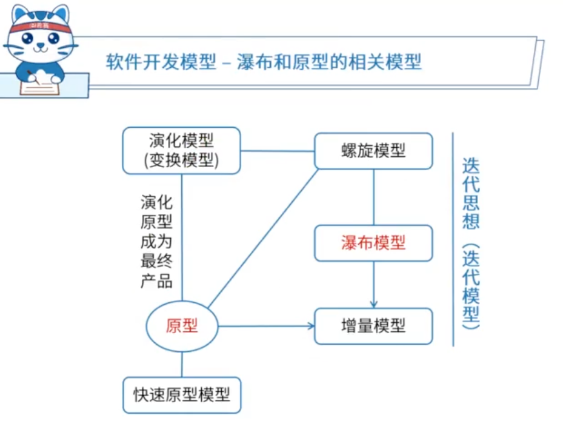

# 软件开发方法

## 结构化方法

自顶向下，逐步分解求精。

严格分阶段、阶段产出标准化

应变能力差

## 面向对象方法

自底向上

阶段界限不明确

更好应变、更好复用

符合人们的思维习惯

## 面向服务方法

粗力度、松耦合

标准化和构件化

抽象级别：操作低，服务中，业务流程高

## 原型开发方法

## 形式化方法

## 统一过程方法UP

## 敏捷方法

## 基于架构的开发方法（ABSD）

# 软件开发模型

软件生命周期模型又称软件开发模型（software develop model）或软件过程模型（software process model）。软件过程模型是软件开发实际过程的抽象与概括，它应该包括构成软件过程的各种活动，也就是对软件开发过程各阶段之间关系的一个描述和表示。

软件活动主要有如下一些：

1、软件描述。必须定义软件功能以及使用的限制。
2、软件开发。也就是软件的设计和实现，软件工程人员制作出能满足描述的软件。
3、软件有效性验证。软件必须经过严格的验证，以保证能够满足客户的需求。
4、软件演化。改进软件以适应不断变化的需求。


## 瀑布模型和原型模型的关系



## 原型模型

由原型开发阶段和目标软件开发阶段构成。

## 瀑布模型

适用于需求明确的场景。分阶段，每个阶段都有产出物。

瀑布模型的特点是因果关系紧密相连，前一个阶段工作的结果是后一个阶段工作的输入。或者说，每一个阶段都是建筑在前一个阶段正确结果之上，前一个阶段的错漏会隐蔽地带到后一个阶段。这种错误有时甚至可能是灾难性的。因此每一个阶段工作完成后，都要进行审查和确认，这是非常重要的。历史上，瀑布模型起到了重要作用，它的出现有利于人员的组织管理，有利于软件开发方法和工具的研究。

### 定义阶段

### 开发阶段

### 维护阶段


## 增量模型与螺旋模型

螺旋模型已 原型为基础 + 瀑布模型 逐步的达到期望的结果。同时螺旋模型引入了风险分析。


## V模型 和 喷泉模型

V模型重视测试，在每个阶段都有需要测试的内容。

喷泉模型是早期的面向对象模型


## 构件组装模型（CBSD）

模块化的思想，使用构件进行拼装


## 快速应用开发模型（RAD）

瀑布模型（SDLC）和构件组装模型（CBSD） 两个组合就是快速应用开发模型


## 统一通过模型（UP）


## 敏捷方法

轻量级、减轻流程和文档

有四大价值观和12条过程实践规则

敏捷方法是一种以人为核心、迭代、循序渐进的开发方法。在敏捷方法中，软件项目的构建被切分成多个子项目，各个子项目成果都经过测试，具备集成和可运行的特征。在敏捷方法中，从开发者的角度来看，主要的关注点有短平快的会议、小版本发布、较少的文档、合作为重、客户直接参与、自动化测试、适应性计划调整和结对编程；从管理者的角度来看，主要的关注点有测试驱动开发、持续集成和重构。 

敏捷方法是以人为本，而非以过程为本。

### 四大价值观

- 沟通：加强面对面沟通
- 简单：不过度设计
- 反馈：及时反馈
- 勇气：接受变更的勇气


### 具体的敏捷开发方法

- XP （Extreme Programming，极限编程）：在所有的敏捷型方法中，XP是最引人瞩目的。它源于Smalltalk圈子，特别是Kent Beck和Ward Cunningham在20世纪80年代末的密切合作。XP在一些对费用控制严格的公司中的使用，已经被证明是非常有效的。
-  Cockburn 水晶系列方法：它与XP方法一样，都有以人为中心的理念，但在实践上有所不同。Alistair考虑到人们一般很难严格遵循一个纪律约束很强的过程，因此，与XP的高度纪律性不同，Alistair探索了用最少纪律约束而仍能成功的方法，从而在产出效率与易于运作上达到一种平衡。
-  开放式源码：开放式源码项目有一个特别之处，就是程序开发人员在地域上分布很广，这使得它和其他敏捷方法不同，因为一般的敏捷方法都强调项目组成员在同一地点工作。开放源码的一个突出特点就是查错排障（debug）的高度并行性，任何人发现了错误都可将改正源码的“补丁”文件发给维护者。然后由维护者将这些“补丁”或是新增的代码并入源码库。
- SCRUM：明确定义了的可重复的方法过程只限于在明确定义了的可重复的环境中，为明确定义了的可重复的人员所用，去解决明确定义了的可重复的问题。
- 功用驱动开发方法（FDD-Feature Driven Development）：它致力于短时的迭代阶段和可见可用的功能。在FDD中，一个迭代周期一般是两周。在FDD中，编程开发人员分成两类：首席程序员和“类”程序员（class owner）。
  - 首席程序员是最富有经验的开发人员，他们是项目的协调者、设计者和指导者
  - “类”程序员则主要做源码编写
- ASD方法：其核心是三个非线性的、重叠的开发阶段：猜测、合作与学习。


# 需求工程

软件需求是指用户对系统在功能、行为、性能、设计约束等方面的期望

## 需求开发（技术维度）

- 需求获取
- 需求分析
- 需求定义
  - 产品需求规格说明书SRS
- 需求验证
  - 对SRS进行评审验证，最终确认得到需求基线

---

### 需求开发 - 需求获取

#### 获取方法

- 收集资料
- 联合讨论会（Joint Requirement Planning，JRP 联合需求计划）
  - 成本较高
- 用户访谈
- 书面调查
- 现场观摩
- 参加业务实践
- 阅读历史文档
- 抽样调查

#### 分类

- 业务需求（整体全局）
- 用户需求（用户视角）
- 系统需求（计算机化）
  - 功能需求
  - 性能需求
  - 设计约束

#### QFD

- 基本需求（明示，常规需求）
- 期望需求（隐含）
- 兴奋需求（多余）

### 需求开发 - 需求分析 （SA）

#### 结构化开发的需求分析

三种模型 和 一个数据字典


- 功能模型：数据流图（DFD），用于对功能建模
  - 数据流图的四大构成要素：数据流、加工、数据存储、外部实体
  - 
- 行为模型：状态转换图
  - 
- 数据模型：ER图
  - ER图有实体和联系
  - 

#### 面向对象开发的需求分析（OOA）

面向对象相关概念


## 需求管理（管理维度）

- 变更控制

  需求的变更时受严格管控的，其流程为：

  - 问题分析和变更描述
    - 这是识别和分析需求问题或者一份明确的变更提议，以检查它的有效性，从而产生一个更明确的需求变更提议。
  - 变更分析和成本计算
    - 使用可追溯性信息和系统需求的一般知识，对需求变更提议进行影响分析和评估。变更成本计算应该包括对需求文档的修改、系统修改的设计和实现的成本。一旦分析完成并且确认，应该进行是否执行这一变更的决策。
  - 变更实现
    - 这要求需求文档和系统设计以及实现都要同时修改。如果先对系统的程序做变更，然后再修改需求文档，这几乎不可避免地会出现需求文档和程序的不一致。

- 版本控制

  - 跟踪需求随时间的变化

- 需求跟踪

  - 需求跟踪是将单个需求和其他系统元素之间的依赖关系和逻辑联系建立跟踪，这些元素包括各种类型的需求、业务规则、系统架构和构件、源代码、测试用例、以及帮助文件。需求跟踪一般采用需求跟踪矩阵做跟进工作，跟踪矩阵将从需求源头一直跟进到最终的软件产品

- 需求状态跟踪

  - 识别需求的变化和更新状态

# 业务流程建模：

业务流程建模方法主要有六种：

- 流程图(flow chart)：是最早用于业务流程的一种图形化描述方法，易学习、好理解，但存在无法清楚界定流程界限、不支持层次化描述业务流程等问题
- 角色活动图(Role Activity Diagram，RAD)和角色交互图(Role Interaction Diagram，RID)：擅长描述角色与活动、角色与角色的交互关系，但不支持层次化描述业务流程
- IDEF0和1DEF3：IDEF0描述业务流程做什么，但没指明谁做；IDEF3回答了怎么做，但描述复杂业务流程难度大；
- Petri-Net：高级Petri网有很强的数学基础，可以计算／仿真分析业务流程性能，但用户的学习难度大；
- 统一建模语言(Uniform Modeling Language，UML)活动图：易学习和使用，但模型的仿真和分析能力差
- BPMN：是一种以业务流程图的形式表示业务流程的图形方法，可以用其定义的一系列业务组件，组成业务流程图

# 逆向工程与重构工程

逆向工程与重构工程是目前预防性维护釆用的主要技术。所谓软件的逆向工程就是分析已有的程序，寻求比源代码更髙级的抽象表现形式。与之相关的概念是：

- 重组（restructuring）：指在同一抽象级别上转换系统描述形式
- 设计恢复（design recovery）：指借助工具从已有程序中抽象出有关数据设计、总体结构设计和过程设计的信息
- 重构/再工程（re-engineering）：也称修复和改造工程，它是在逆向工程所获信息的基础上修改或重构已有的系统，产生系统加一个新版本。

## 恢复信息的级别

逆向工程导出的信息可分为如下4个抽象层次

- 实现级：包括程序的抽象语法树、符号表等信息
- 结构级：包括反映程序分量之间相互依赖关系的信息，例如调用图、结构图等
- 功能级：包括反映程序段功能及程序段之间关系的信息
- 领域级：包括反映程序分量或程序诸实体与应用领域概念之间对应关系的信息

上述信息的抽象级别越髙，它与代码的距离就越远，通过逆向工程恢复的难度亦越大，而自动工具支持的可能性相对变小，要求人参与判断和推理的工作增多。

## 恢复信息的方法

在逆向工程中用于恢复信息的方法有4类

- 用户指导下的搜索与变换：用于导出实现级和结构级信息
- 变换式方法：除领域级外所有抽象级别上的信息都可用此类方法推导
- 基于领域知识：主要用于恢复功能级和领域级信息
- 铅板恢复法：适用于推导实现级和结构级信息

# 设计模式

## 按照目的分类

- 创建型：主要用于创建对象
  - 有工厂方法模式（Factory Method）、抽象工厂模式（Abstract Factory）、建造者模式（Builder）、原型模式（Prototype）、单例模式（Singleton）共5种
- 结构型：主要用于处理类和对象的组合
  - 适配器模式（Adapter）、桥接模式（Bridge）、组合模式（Composite）、装饰模式（Decorator）、外观模式（Facade）、享元模式（Flyweight）、代理模式（Proxy）共7种。
- 行为型：主要用于描述类或对象怎样交互和怎样分配职责
  - 有职责链模式（Chain of Responsibility）、命令模式（Command）、解释器模式（Interpreter）、迭代器模式（Iterator）、中介者模式（Mediator）、备忘录模式（Memento）、观察者模式（Observer）、状态模式（State）、策略模式（Stratege）、模板方法模式（Template Method）、访问者模式（Visitor）共11种

## 按照作用范围分类

- 类模式
  - 用于处理类和子类的关系，这种关系通过继承建立，在编译时就确定了，是一种静态关系

- 对象模式
  - 处理对象间的关系，具有动态关系

## 特点

- Prototype（原型模式）：用原型实例指定创建对象的类型，并且通过拷贝这个原型来创建新的对象。允许对象在不了解创建对象的确切类以及如何创建细节的情况下创建自定义对象。
- Abstract Factory（抽象工厂模式）：提供一个创建一系列相关或相互依赖对象的接口，而无需指定它们具体的类。
- Builder（构建器模式）：将一个复杂类的表示与其构造相分离，使得相同的构建过程能够得出不同的表示。
- Singleton（单例模式）：保证一个类只有一个实例，并提供一个访问它的全局访问点。
- 桥接模式（Bridge）：可以将类的抽象部分与实现分离，从而实现独立变化的模式
- 适配器模式（Adapter）：将一个类的接口转换成客户希望的另外一个接口，属于结构型模式
- 装饰模式（Decorator）：在不改变现有对象结构的情况下，动态地给该对象增加一些职责（即增加其额外功能）的模式，做比静态继承具有更大的灵活性。
- 组合模式（Composite）：组合多个对象形成树形结构以表示具有“整体—部分”关系的层次结构
- 命令模式（Command）：可以封装请求为对象，支持可撤销操作，参数化客户端请求的模式
- 解释器（Interpreter）模式：描述了如何为语言定义一个文法，如何在该语言中表示一个句子，以及如何解释这些句子，这里的“语言”是使用规定格式和语法的代码。解释器模式主要用在编译器中，在应用系统开发中很少用到。
- 策略（Strategy）模式：策略模式是一种对象的行为型模式，定义一系列算法，并将每一个算法封装起来，并让它们可以相互替换。策略模式让算法独立于使用它的客户而变化，其目的是将行为和环境分隔，当出现新的行为时，只需要实现新的策略类。
- 中介者（Mediator）模式：中介者模式是一种对象的行为型模式，通过一个中介对象来封装一系列的对象交互。中介者使得各对象不需要显式地相互引用，从而使其耦合松散，而且可以独立地改变它们之间的交互。中介者对象的存在保证了对象结构上的稳定，也就是说，系统的结构不会因为新对象的引入带来大量的修改工作。
- 迭代器（Iterator）模式：迭代器模式是一种对象的行为型模式，提供了一种方法来访问聚合对象，而不用暴露这个对象的内部表示。迭代器模式支持以不同的方式遍历一个聚合对象，复杂的聚合可用多种方法来进行遍历；允许在同一个聚合上可以有多个遍历，每个迭代器保持它自己的遍历状态，因此，可以同时进行多个遍历操作。

# UML

统一建模语言由三部分组成：

- 构造块
  - 事物
    - 结构事物：最静态的部分，包括类、接口、用例
    - 行为事物
    - 分组事物：包、构件
    - 注释事物
  - 关系
  - 图
- 规则
- 公共机制


## UML图

- 静态图
- 动态图


## UML 4+1视图


# 一题目

（ ）通常为一个迭代过程，其中的活动包括需求发现、需求分类和组织、需求协商、需求文档化。

问题1选项
A.需求确认
B.需求管理
C.需求抽取
D.需求规格说明

## 答案

C

## 解析

需求抽取和分析的过程主要分为以下四个步骤：1.需求发现和理解；2.需求分类和组织；3.需求优先级排序和协商；4.需求文档化。

需求抽取有两个基本的方法：1.访谈，开发者和其他人谈论他们做的事情。2.观察或人种学调查，观察人们做自己的工作来了解他们使用哪些制品、他们如何使用这些制品等。

# 二题目

需求管理的主要活动包括（ ）。

问题1选项
A.变更控制、版本控制、需求跟踪、需求状态跟踪
B.需求获取、变更控制、版本控制、需求跟踪
C.需求获取、需求建模、变更控制、版本控制
D.需求获取、需求建模、需求评审、需求跟踪

## 答案

A

## 解析

需求工程包括需求开发和需求管理两大类活动。

需求开发包括：需求获取，需求分析，需求定义，需求验证这些主要活动；

需求管理包括：变更控制、版本控制、需求跟踪和需求状态跟踪这些活动。

# 三题目

（ ）包括编制每个需求与系统元素之间的联系文档，这些元素包括其它需求、体系结构、设计部件、源代码模块、测试、帮助文件和文档等。

问题1选项
A.需求描述
B.需求分析
C.需求获取
D.需求跟踪

## 答案

D

# 四题目

软件需求开发的最终文档经过评审批准后，就定义了开发工作的（），它在客户和开发者之间构筑了产品功能需求和非功能需求的一个（）， 是需求开发和需求管理之间的桥梁。

问题1选项
A.需求基线
B.需求标准
C.需求用例
D.需求分析

问题2选项
A.需求用例
B.需求管理标准
C.需求约定
D.需求变更

## 答案

第1题:A

第2题:C

## 解析

需求开发的结果应该有项目视图和范围文档、用例文档和SRS，以及相关的分析模型。经评审批准，这些文档就定义了开发工作的需求基线。

这个基线在用户和开发人员之间就构成了软件需求的一个约定，它是需求开发和需求管理之间的桥梁

# 五题目

https://www.educity.cn/tiku/20994415.html

需求变更管理是需求管理的重要内容。需求变更管理的过程主要包括问题分析和变更描述、（ ）、变更实现。具体来说，在关于需求变更管理的描述中，（ ）是不正确的 。

问题1选项
A.变更调研
B.变更判定
C.变更定义
D.变更分析和成本计算

问题2选项
A.需求变更要进行控制，严格防止因失控而导致项目混乱，出现重大风险
B.需求变更对软件项目开发有利无弊
C.需求变更通常按特定的流程进行
D.在需求变更中，变更审批由CCB负责审批

## 答案

第1题:D

第2题:B

# 六题目

以下关于需求陈述的描述中，（ ）是不正确的。

问题1选项
A.每一项需求都必须完整、准确地描述即将要开发的功能
B.需求必须能够在系统及其运行环境的能力和约束条件内实现
C.每一项需求记录的功能都必须是用户的真正的需要
D.在良好的需求陈述中，所有需求都应被视为同等重要

## 答案

D

## 解析

https://www.educity.cn/tiku/352098.html

需求是应该分优先等级的，不能把所有需求都视为同等重要。

# 七题目

一个好的变更控制过程，给项目风险承担者提供了正式的建议变更机制。如下图所示的需求变更管理过程中，①②③处对应的内容应分别是（ ）。


问题1选项
A.问题分析与变更描述、变更分析与成本计算、变更实现
B.变更描述与成本计算、变更分析、变更实现
C.问题分析与变更分析、成本计算、变更实现
D.变更描述、变更分析与变更实现、成本计算

## 答案

A

## 解析

https://www.educity.cn/tiku/351863.html

需求变更的过程：

识别问题、问题分析与变更描述、变更分析与成本计算、变更实现、修改后的需求

# 八题目

（ ）是关于需求管理正确的说法。

问题1选项
A.为达到过程能力成熟度模型第二级，组织机构必须具有3个关键过程域
B.需求的稳定性不属于需求属性
C.需求变更的管理过程遵循变更分析和成本计算、问题分析和变更描述、变更实现的顺序
D.变更控制委员会对项目中任何基线工作产品的变更都可以做出决定

## 答案

D

## 解析

https://www.educity.cn/tiku/89444.html

```tex
软件能力成熟度模型（CMM）在软件开发机构中被广泛用来指导软件过程改进。该模型描述了软件处理能力的 5个成熟级别。
为了达到过程能力成熟度模型的第二级，组织机构必须具有 6 个关键过程域 KPA（Key Process Areas）
```

```tex
除了文本，每一个功能需求应该有一些相关的信息与它联系，我们把这些信息称为需求属性。
对于一个大型的复杂项目来说，丰富的属性类别显得尤为重要。例如，在文档中考虑和明确如下属性：创建需求的时间、需求的版本号、创建需求的作者、负责认可该软件需求的人员、需求状态、需求的原因和根据、需求涉及的子系统、需求涉及的产品版本号、使用的验证方法或者接受的测试标准、产品的优先级或者重要程度、需求的稳定性。
```

# 九题目

一个大型软件系统的需求总是有变化的。为了降低项目开发的风险，需要一个好的变更控制过程。如下图所示的需求变更管理过程中，①②③处对应的内容应是__(1)__；自动化工具能够帮助变更控制过程更有效地运作，__(2)__是这类工具应具有的特性之一。


问题1

A、问题分析与变更描述、变更分析与成本计算、变更实现 

B、变更描述 与变更分析、成本计算、变更实现 

C、问题分析与变更分析、变更分析、变更实现

 D、变更描述、变更分析、变更实现 

问题2

A、变更维护系统的不同版本 

B、支持系统文档的自动更新 

C、自动判定变更是否能够实施 

D、记录每一个状态变更的日期和做出这一变更的人

## 答案

A

D

## 解析

自动化工具能够帮助变更过程更有效的运作，记录每一个状态变更的日期及变更者是这类工具应具有的特征之一。

# 十题目

系统建议方案中不应该包含的内容是（）

A问题陈述

B项目范围

C候选方案及其可行性分析

D系统详细设计方案

## 答案

D

## 解析

系统方案可以单独形成文档或合并到可行性研究报告中，包含：

- 前置部分（摘要部分）
  - 提供重要信息，方便高层管理人员了解报告主要内容
- 系统概述
- 系统研究方法
- 候选系统方案及其可行性分析
- 建议方案
- 结论和附录

# 十一题目

下列关于联合需求计划（Joint Requirement Planning，JRP）的叙述中，不正确的是（  ）。

问题1选项
A.在JRP实施之前，应制定详细的议程，并严格遵照议程进行
B.在讨论期间尽量避免使用专业术语
C.JRP是一种相对来说成本较高但十分有效的需求获取方法
D.JRP的主要目的是对需求进行分析和验证

## 答案

D

## 解析

https://www.educity.cn/tiku/77376.html

```tex
JRP是一种相对来说成本较高的需求获取方法（而非需求分析与验证的方法）

它通过联合各个关键用户代表、系统分析师、开发团队代表一起，通过有组织的会议来讨论需求。通常该会议的参与人数为6～18人，召开时间为1～5小时。
JRP的主要意图是收集需求，而不是对需求进行分析和验证。
```

# 十二题目

将系统需求模型转换为架构模型是软件系统需求分析阶段的一项重要工作，以下描述中，（  ）是在转换过程中需要关注的问题。

问题1选项
A.如何通过多视图模型描述软件系统的架构
B.如何确定架构模型中有哪些元素构成
C.如何采用表格或用例映射保证转换的可追踪性
D.如何通过模型转换技术，将高层架构模型逐步细化为细粒度架构模型

## 答案

C

## 解析

https://www.educity.cn/tiku/77388.html

需求和软件架构设计面临的是不同的对象：一个是问题空间；另一个是解空间。保持两者的可追踪性和转换，一直是软件工程领域追求的目标。从软件需求模型向SA模型的转换主要关注两个问题：

1、如何根据需求模型构建软件架构模型；

2、如何保证模型转换的可追踪性。

选项A与B是软件架构设计阶段需要考虑的问题，而选项D是软件架构实现阶段中需要考虑的问题。

# 十三题目

与瀑布模型相比，（ ）降低了实现需求变更的成本，更容易得到客户对于已完成开发工作的反馈意见，并且客户可以更早地使用软件并从中获得价值。

问题1选项
A.快速原型模型
B.敏捷开发
C.增量式开发
D.智能模型

## 答案

C

## 解析

https://www.educity.cn/tiku/60098225.html

增量模型降低了实现需求变更的成本。较瀑布模型而言，重新分析和修改文档的工作流要少很多。在开发过程中更容易得到客户对已完成的开发工作的反馈意见。

客户可以对软件的已有版本进行评价，并可以判断醒项目进度；客户通常会觉得从软件设计文档中评价项目、判断项目进度很困难。

使用增量模型即使并未实现所有功能，也可以在早期向客户交付有用的软件，相对瀑布模型而言，客户可以更早的使用软件。

# 十四题目

使用模型驱动的软件开发方法，软件系统被表示为一组可以被自动转换为可执行代码的模型。其中，（ ）在不涉及实现的情况下对软件系统进行建模。

问题1选项
A.平台无关模型
B.计算无关模型
C.平台相关模型
D.实现相关模型

## 答案

A

## 解析

https://www.educity.cn/tiku/60098229.html

模型驱动的体系结构是一种关注模型的软件设计和实现方法，使用了UML模型的一个子集来描述系统，其中会创建不同抽象层次上的模型。

模型驱动的体系结构（MDA）方法建议应当产生以下3种类型的抽象系统模型：

- 计算无关模型（Computation Independent Model, CIM）：CIM对系统中使用的重要的领域抽象进行建模，因此有时被称为领域模型
- 平台无关模型（Platform-Independent Model, PIM）：PIM在不涉及实现的情况下对系统的运转进行建模
- 平台相关模型（Platform-Specific Model, PSM）：PSM是对平台无关模型转换后得到的，对于每个应用平台都有一个单独的PSM

# 十五题目

工作流表示的是业务过程模型，通常使用图形形式来描述，以下不可用来描述工作流的是（ ）。

问题1选项
A.活动图
B.BPMN
C.用例图
D.Petri-Net

## 答案

C

## 解析

https://www.educity.cn/tiku/60098234.html?cid=131

业务流程建模方法主要有六种：

- 流程图(flow chart)：是最早用于业务流程的一种图形化描述方法，易学习、好理解，但存在无法清楚界定流程界限、不支持层次化描述业务流程等问题
- 角色活动图(Role Activity Diagram，RAD)和角色交互图(Role Interaction Diagram，RID)：擅长描述角色与活动、角色与角色的交互关系，但不支持层次化描述业务流程
- IDEF0和1DEF3：IDEF0描述业务流程做什么，但没指明谁做；IDEF3回答了怎么做，但描述复杂业务流程难度大；
- Petri-Net：高级Petri网有很强的数学基础，可以计算／仿真分析业务流程性能，但用户的学习难度大；
- 统一建模语言(Uniform Modeling Language，UML)活动图：易学习和使用，但模型的仿真和分析能力差
- BPMN：是一种以业务流程图的形式表示业务流程的图形方法，可以用其定义的一系列业务组件，组成业务流程图

# 十六题目

根据传统的软件生命周期方法学，可以把软件生命周期划分为（ ）。

问题1选项
A.软件定义、软件开发、软件测试、软件维护
B.软件定义、软件开发、软件运行、软件维护
C.软件分析、软件设计、软件开发、软件维护
D.需求获取、软件设计、软件开发、软件测试

## 答案

B

## 解析

https://www.educity.cn/tiku/21096645.html

按照传统的软件生命周期方法学，可以把软件生命周期划分为软件定义、软件开发、软件运行与维护3个阶段。

其主要活动阶段包括：可行性分析与计划制定、需求分析、软件设计（概要设计和详细设计）、软件实现（编码）、测试、维护等活动，其中软件开发阶段包括软件设计、实现与测试 。

# 十七题目

以下关于敏捷方法的描述中，不属于敏捷方法核心思想的是（ ）。

问题1选项
A.敏捷方法是适应型，而非可预测型
B.敏捷方法以过程为本
C.敏捷方法是以人为本，而非以过程为本
D.敏捷方法是迭代增量式的开发过程

## 答案

B

# 十八题目

https://www.educity.cn/tiku/60008721.html

软件过程是制作软件产品的一组活动及其结果。这些活动主要由软件人员来完成，软件活动主要包括软件描述、（） 、软件有效性验证和（）。 其中，（）定义了软件功能以及使用的限制。

问题1选项
A.软件模型
B.软件需求
C.软件分析
**D.软件开发**

问题2选项
A.软件分析
B.软件测试
**C.软件演化**
D.软件开发

问题3选项
A.软件分析
B.软件测试
**C.软件描述**
D.软件开发

## 答案

第1题:D

第2题:C

第3题:C

# 十九题目

软件开发过程模型中，（ ）主要由原型开发阶段和目标软件开发阶段构成。

问题1选项
A.原型模型
B.瀑布模型
C.螺旋模型
D.基于构件的模型

## 答案

A

## 解析

题目所述“由原型开发阶段和目标软件开发阶段构成”符合原型模型的特点。

因为原型模型先是使用原型获取需求，需求获取到之后有可能抛弃掉原型，然后根据原型获得的需求进行目标软件的开发。

# 二十题目

https://www.educity.cn/tiku/352040.html

软件过程是制作软件产品的一组活动以及结果，这些活动主要由软件人员来完成，主要包括（  ）。软件过程模型是软件开发实际过程的抽象与概括，它应该包括构成软件过程的各种活动。软件过程有各种各样的模型，其中，（  ）的活动之间存在因果关系，前一阶段工作的结果是后一阶段工作的输入描述。

问题1选项
A.软件描述、软件开发和软件测试
B.软件开发、软件有效性验证和软件测试
C.软件描述、软件设计、软件实现和软件测试
**D.软件描述、软件开发、软件有效性验证和软件进化**

问题2选项
**A.瀑布模型**
B.原型模型
C.螺旋模型
D.基于构建的模型

## 答案

第1题:D

第2题:A

# 二十一题目

以下关于敏捷方法的叙述中，（  ）是不正确的。

问题1选项
A.敏捷型方法的思考角度是"面向开发过程"的
B.极限编程是著名的敏捷开发方法
C.敏捷型方法是"适应性"而非"预设性"
D.敏捷开发方法是迭代增量式的开发方法

## 答案

A

## 解析

敏捷方法是面向对象的，以人为本的，而非面向开发过程。

# 二十二题目

螺旋模型在（  ）的基础上扩展而成。

问题1选项
A.瀑布模型
B.增量模型
C.快速模型
D.面向对象模型

## 答案

C

## 解析

螺旋模型是在快速原型的基础上扩展而成的。加瀑布模型，考虑了风险

# 二十三题目

https://www.educity.cn/tiku/89453.html

（ ）适用于程序开发人员在地域上分布很广的开发团队。（ ）中，编程开发人员分成首席程序员和“类”程序员。

问题1选项
A.水晶系列（Crystal）开发方法
B.开放式源码（Open source）开发方法
C.SCRUM开发方法
D.功用驱动开发方法（FDD）

问题2选项
A.自适应软件开发（ASD）
B.极限编程（XP）开发方法
C.开放统—过程开发方法（OpenUP）
D.功用驱动开发方法（FDD）

## 答案

第1题:B

第2题:D

# 二十四题目

以下关于自顶向下开发方法的叙述中，正确的是（ ）。

问题1选项
A.自顶向下过程因为单元测试而比较耗费时间
B.自顶向下过程可以更快地发现系统性能方面的问题
C.相对于自底向上方法，自顶向下方法可以更快地得到系统的演示原型
D.在自顶向下的设计中，如发现了一个错误，通常是因为底层模块没有满足其规格说明（因为高层模块已经被测试过了）

## 答案

C

## 解析

https://www.educity.cn/tiku/74370.html

自顶向下开发方法的优点是：
1、可为企业或机构的重要决策和任务实现提供信息。
2、支持企业信息系统的整体性规划，并对系统的各子系统的协调和通信提供保证。
3、方法的实践有利于提高企业人员整体观察问题的能力，从而有利于寻找到改进企业组织的途径。
自顶向下开发方法的缺点是：
1、对系统分析和设计人员的要求较高。
2、开发周期长，系统复杂，一般属于一种高成本、大投资的工程。
3、对于大系统而言自上而下的规划对于下层系统的实施往往缺乏约束力。
4、从经济角度来看，很难说自顶向下的做法在经济上是合算的。

# 二十五题目

下列关于敏捷方法的叙述中，错误的是（  ）。

问题1选项
A.与传统方法相比，敏捷方法比较适合需求变化大或者开发前期对需求不是很清晰的项目
B.敏捷方法尤其适合于开发团队比较庞大的项目
C.敏捷方法的思想是适应性，而不是预设性
D.敏捷方法以原型开发思想为基础，采用迭代式增量开发

## 答案

B

# 二十六题目

软件逆向工程就是分析已有的程序，寻求比源代码更高级的抽象表现形式。在逆向工程导出信息的四个抽象层次中，（  ）包括反映程序各部分之间相互依赖关系的信息；（  ）包括反映程序段功能及程序段之间关系的信息。

A.实现级   B.结构级    C.功能级    D.领域级

A.实现级   B.结构级    C.功能级    D.领域级

## 答案

B

C

# 二十七题目

（ ）是在逆向工程所获取信息的基础上修改或重构已有的系统，产生系统的一个新版本。

问题1选项
A.逆向分析（Reverse Analysis）
B.重组（Restructuring）
C.设计恢复（Design Recovery）
D.重构工程（Re-engineering）

## 答案

D

# 二十八题目

应用系统构建中可以采用多种不同的技术，（  ）可以将软件某种形式的描述转换为更高级的抽象表现形式，而利用这些获取的信息，（  ）能够对现有系统进行修改或重构，从而产生系统的一个新版本。

问题1选项
A.逆向工程（(Reverse Engineering）
B.系统改进（System Improvement）
C.设计恢复（DesignRecovery）
D.再工程（Re-engineering)

问题2选项
A.逆向工程（(Reverse Engineering）
B.系统改进（System Improvement）
C.设计恢复（Design Recovery）
D.再工程（Re-engineering）

## 答案

A

D

# 二十九题目

https://www.educity.cn/tiku/60008709.html

经典的设计模式共有23个，这些模式可以按两个准则来分类： 一是按设计模式的目的划分，可分为（）型、 结构型和行为型三种模式；二是按设计模式的范围划分，可以把设计模式分为类设计模式和（）设计模式。

问题1选项
A.创建
B.实例
C.代理
D.协同

问题2选项
A.包
B.模板
C.对象
D.架构

## 答案

第1题:A

第2题:C

# 三十题目

创建型模式支持对象的创建，该模式允许在系统中创建对象，而不需要在代码中标识特定类的类型，这样用户就不需要编写大量、复杂的代码来初始化对象。在不指定具体类的情况下，（）模式为创建一 系列相关或相互依赖的对象提供了一个接口。（）模式将复杂对象的构建与其表示相分离，这样相同的构造过程可以创建不同的对象。（）模式允许对象在不了解要创建对象的确切类以及如何创建等细节的情况下创建自定义对象。

问题1选项
A.Prototype
**B.Abstract Factory**
C.Builder
D.Singleton

问题2选项
A.Prototype
B.Abstract Factory
**C.Builder**
D.Singleton

问题3选项
**A.Prototype**
B.Abstract Factory
C.Builder
D.Singleton

## 答案

第1题:B

第2题:C

第3题:A

# 三十一题目

设计模式按照目的可以划分为三类 ，其中，（ ）模式是对对象实例化过程的抽象。例如（ ）模式确保一个类只有一个实例 ，并提供了全局访问入口；（ ）模式允许对象在不了解要创建对象的确切类以及如何创建等细节的情况下创建自定义对象 ；（ ）模式将一个复杂对象的构建与其表示分离。

问题1选项
**A.创建型**
B.结构型
C.行为型
D.功能型

问题2选项
A.Facade
B.Builder
C.Prototype
**D.Singleton**

问题3选项
A.Facade
B.Builder
**C.Prototype**
D.Singleton

问题4选项
A.Facade
**B.Builder**
C.Prototype
D.Singleton

## 答案

第1题:A

第2题:D

第3题:C

第4题:B

# 三十二题目

设计模式描述了一个出现在特定设计语境中的设计再现问题，并为它的解决方案提供了一个经过充分验证的通用方案，不同的设计模式关注解决不同的问题。例如，抽象工厂模式提供一个接口，可以创建一系列相关或相互依赖的对象， 而无需指定它们具体的类，它是一种（  ）模式；（  ）模式将类的抽象部分和它的实现部分分离出来，使它们可以独立变化，它属于（  ）模式；（  ）模式将一个请求封装为一个对象，从而可用不同的请求对客户进行参数化，将请求排队或记录请求日志，支持可撤销的操作。

选项1

A．组合型	B. 结构型	C.行为型	**D.创建型**

选项2

**A．Bridge**	B. Proxy	C. Prototype	D. Adapter

选项3

A．组合型	**B.结构型**	C.行为型	D.创建型

选项4

**A．Command**	B.Facade	C.Memento	D.Visitor

## 答案

D A B A

# 三十三题目

某软件公司欲开发一个绘图软件，要求使用不同的绘图程序绘制不同的图形。该绘图软件的扩展性要求将不断扩充新的图形和新的绘图程序。以绘制直线和图形为例，得到如下图所示的类图。该设计采用（ ）模式将抽象部分与其实现部分分离，使它们都可以独立地变化。其中（ ）定义了实现类接口，该模式适用于（ ）的情况，该模式属于（ ）模式。


问题1选项
A.适配器（Adapten）
B.装饰（Decorator）
**C.桥接（Bridge）**
D.组合（Composite）

问题2选项
A.Shape
B.Circle和Rectangle
C.V1Drawing和V2Drawing
**D.Drawing**

问题3选项
**A.不希望在抽象和它的实现部分之间有一个固定判定关系**
B.想表示对象的部分-整体层次结构
C.想使用一个已经存在的类，而它的接口不符合要求
D.在不影响其他对象的情况下，以动态、透明的方式给单个对象添加职责

问题4选项
A.创建型对象
**B.结构型对象**
C.行为型对象
D.结构型类

## 答案

第1题:C

第2题:D

第3题:A

第4题:B

## 解析

https://www.educity.cn/tiku/906900.html

根据桥接模式的结构，实现类接口，定义实现类的接口，这个接口不一定要与抽象类的接口完全一致，事实上这两个接口可以完全不同，一般的讲实现类接口仅仅给出基本操作，而抽象类接口则会给出很多更复杂的操作。

# 三十四题目

某系统中的文本显示类（TextView）和图片显示类（PictureView）都继承了组件类（Component），分别显示文本和图片内容，现需要构造带有滚动条或者带有黑色边框，或者既有滚动条又有黑色边框的文本显示控件和图片显示控件，但希望最多只增加3个类。
那么采用设计模式（ ）可实现该需求，其优点是（ ）。

问题1选项
A.外观
B.单体
C.装饰
D.模板方法

问题2选项
A.比静态继承具有更大的灵活性
B.提高已有功能的重复使用性
C.可以将接口与实现相分离
D.为复杂系统提供了简单接口

## 答案

第1题:C

第2题:A

# 三十五题目

一组对象以定义良好但是复杂的方式进行通信，产生的相互依赖关系结构混乱且难以理解。采用（  ）模式，用一个特定对象来封装一系列的对象交互，从而使各对象不需要显式地相互引用，使其耦合松散，而且可以独立地改变它们之间的交互。

问题1选项
A.解释器（Interpreter）
B.策略（Strategy）
**C.中介者（Mediator）**
D.迭代器（Iterator）

## 答案

C

# 三十六题目

某广告公司的宣传产品有宣传册、文章、传单等多种形式，宣传产品的出版方式包括纸质方式、CD、DVD、在线发布等。现要求为该广告公司设计一个管理这些宣传产品的应用，采用（  ）设计模式较为合适，该模式（  ）。

问题1选项
A.Decorator
B.Adapter
**C.Bridge**
D.Facade

问题2选项
A.将一系列复杂的类包装成一个简单的封闭接口
**B.将抽象部分与它的实现部分分离，使它们都可以独立地变化**
C.可在不影响其他对象的情况下，以动态、透明的方式给单个对象添加职责
D.将一个接口转换为客户希望的另一个接口

## 答案

第1题:C

第2题:B

## 解析

https://www.educity.cn/tiku/77382.html

# 三十七题目

与UML1.x不同，为了更清楚地表达UML的结构，从UML2开始，整个UML规范被划分为基础结构和上层结构两个相对独立的部分，基础结构是UML的（ ），它定义了构造UML模型的各种基本元素；而上层结构则定义了面向建模用户的各种UML模型的语法、语义和表示。

问题1选项
A.元元素
B.模型
**C.元模型**
D.元元模型

## 答案

C

## 解析

https://www.educity.cn/tiku/60098412.html

UML 2.0基础结构的设计目标是定义一个元语言的核心【InfrastructureLibrary】。

通过对此核心的复用，除了可以定义一个自展的UML元模型，也可以定义其他元模型。

# 三十八题目

在UML2.0（Unified Modeling Language）中，顺序图用来描述对象之间的消息交互，其中循环、选择等复杂交互使用（ ）表示，对象之间的消息类型包括（ ）。

问题1选项
A.嵌套
B.泳道
C.组合
**D.序列片段**

问题2选项
A.同步消息、异步消息、返回消息、动态消息、静态消息
B.同步消息、异步消息、动态消息、参与者创建消息、参与者销毁消息
C.同步消息，异步消息、静态消息、参与者创建消息、参与者销毁消息
**D.同步消息、异步消息、返回消息、参与者创建消息、参与者销毁消息**

## 答案

第1题:D

第2题:D

## 解析

序列图(顺序图)是用来显示参与者如何以一系列顺序的步骤与系统的对象交互的模型。顺序图可以用来展示对象之间是如何进行交互的。

顺序图将显示的重点放在消息序列上，即强调消息是如何在对象之间被发送和接收的，其中循环、选择等复杂交互使用序列片段表示。

对象之间的消息类型包括

同步消息：同步消息的发送者等待消息接收对象将消息处理完成后再继续

异步消息：异步消息的发送者在发送完消息后不等待接收方就继续自己的处理

返回消息：返回消息是指当一个对象将消息发送给另一个对象后，另一个对象返回的虚线有向边，表示原消息已处理的消息

参与者创建消息：表示对消息传递目标对象的创建

参与者销毁消息：表示对消息传递目标对象的删除