# 范围管理

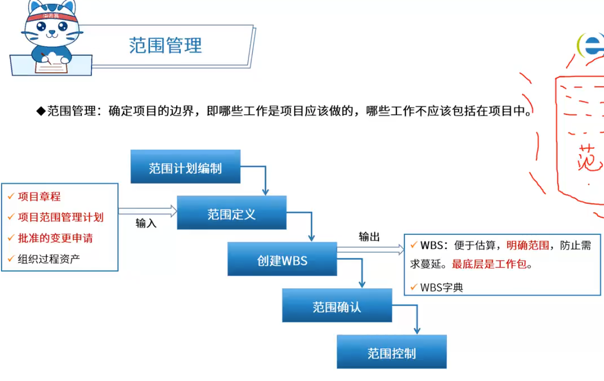

## 范围定义

范围定义的输入包括以下内容：
① 项目章程。如果项目章程或初始的范围说明书没有在项目执行组织中使用，同样的信息需要进一步收集和开发，以产生详细的项目范围说明书。
② 项目范围管理计划。
③ 组织过程资产。
④ 批准的变更申请。

# 时间管理

时间管理的六个步骤：

- 明确活动
- 排序活动
- 资源估算
- 历时估算
- 制定计划
- 进度控制

# 一题目

产品配置是指一个产品在其生命周期各个阶段所产生的各种形式（机器可读或人工可读）和各种版本的（ ）的集合。

问题1选项
A.需求规格说明、设计说明、测试报告
B.需求规格说明、设计说明、计算机程序
C.设计说明、用户手册、计算机程序
D.文档、计算机程序、部件及数据

## 答案

D

## 解析

https://www.educity.cn/tiku/21096642.html

产品配置是指一个产品在其生命周期各个阶段所产生的各种形式（机器可读或人工可读）和各种版本的文档、计算机程序、部件及数据的集合。

该集合中的每一个元素称为该产品配置的一个配置项。注意选项中的需求规格说明、设计说明等均可归属于文档。

# 二题目

下面关于变更控制的描述中，（ ）是不正确的。

问题1选项
A.变更控制委员会只可以由一个小组担任
B.控制需求变更与项目的其他配置管理决策有着密切的联系
C.变更控制过程中可以使用相应的自动辅助工具
D.变更的过程中，允许拒绝变更

## 答案

A

## 解析

https://www.educity.cn/tiku/455043.html

变更控制委员会可以由一个小组担任，也可以由多个不同的组担任。变更控制委员会的成员应能代表变更涉及的团体。变更控制委员会可能包括如下方面的代表：
（1）产品或计划管理部门；
（2）项目管理部门；
（3）开发部门；
（4）测试或质量保证部门；
（5）市场部或客户代表；
（6）制作用户文档的部门；
（7）技术支持部门；
（8）帮助桌面或用户支持热线部门；
（9）配置管理部门。

# 三题目

项目配置管理中，产品配置是指一个产品在其生命周期各个阶段所产生的各种形式和各种版本的文档、计算机程序、部件及数据的集合。该集合中的每一个元素称为该产品配置中的一个配置项，（ ）不属于产品组成部分工作成果的配置项。

问题1选项
A.需求文档
B.设计文档
**C.工作计划**
D.源代码

## 答案

C

## 解析

https://www.educity.cn/tiku/352100.html

配置项是构成产品配置的主要元素，配置项主要有以下两大类：

（1）属于产品组成部分的工作成果：如需求文档、设计文档、源代码和测试用例等；

（2）属于项目管理和机构支撑过程域产生的文档：如工作计划、项目质量报告和项目跟踪报告等。 这些文档虽然不是产品的组成部分，但是值得保存。

# 四题目

项目配置管理中，配置项的状态通常包括（  ）。

问题1选项
A.草稿、正式发布和正在修改
B.草稿、技术评审和正式发布
C.草稿、评审或审批、正式发布
D.草稿、正式发布和版本变更

## 答案

A

## 解析

https://www.educity.cn/tiku/85193.html

配置项的状态有3种：“草稿”（Draft）、“正式发布”（Released）和“正在修改”（Changing）。

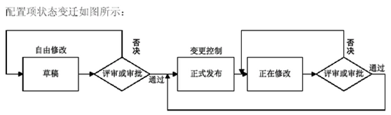

# 五题目

项目范围管理中，范围定义的输入包括（）。

A项目章程、项目范围管理计划、产品范围说明书和变更申请

B项目范围描述、产品范围说明书、生产项目计划和组织过程资产

C项目章程、项目范围管理计划、组织过程资产和批准的变更申请

D生产项目计划、项目可交付物说明、信息系统要求说明和项目质量标准

## 答案

C

## 解析

为了让项目成功，需要在初步的项目范围说明书的基础上写出详细的项目范围说明书，其中包括了主要的可交付物、假设和约束条件。

在范围定义的过程中，需要收集和开发项目章程、项目范围管理计划、组织过程资产以及批准的变更申请。

# 六题目

https://www.educity.cn/tiku/12296.html

详细的项目范围说明书是项目成功的关键。（ ）不应该属于范围定义的输入。

问题1选项
A.项目章程
B.项目范围管理计划
C.批准的变更申请
**D.项目文档管理方案**

## 答案

D

# 七题目

文档是影响软件可维护性的决定因素。软件系统的文档可以分为用户文档和系统文档两类。其中，（ ）不属于用户文档包括的内容。

问题1选项
**A.系统设计**
B.版本说明
C.安装手册
D.参考手册

## 答案

A

## 解析

用户文档主要描述所交付系统的功能和使用方法，并不关心这些功能是怎样实现的。用户文档是了解系统的第一步，它可以让用户获得对系统准确的初步印象。

用户文档至少应该包括下述5方面的内容。
① 功能描述：说明系统能做什么。
② 安装文档：说明怎样安装这个系统以及怎样使系统适应特定的硬件配置。
③ 使用手册：简要说明如何着手使用这个系统（通过丰富的例子说明怎样使用常用的系统功能，并说明用户操作错误是怎样恢复和重新启动的）。
④ 参考手册：详尽描述用户可以使用的所有系统设施以及它们的使用方法，并解释系统可能产生的各种出错信息的含义（对参考手册最主要的要求是完整，因此通常使用形式化的描述技术）。
⑤ 操作员指南（如果需要有系统操作员的话）：说明操作员应如何处理使用中出现的各种情况。

系统文档是从问题定义、需求说明到验收测试计划这样一系列和系统实现有关的文档。描述系统设计、实现和测试的文档对于理解程序和维护程序来说是非常重要的。

# 八题目

某项目包括A、B、C、D四道工序，各道工序之间的衔接关系。正常进度下各工序所需的时间和直接费用、赶工进度下所需的时间和直接费用如下表所示。该项目每天需要的间接费用为4.5万元。根据此表，以最低成本完成该项目需要（ ）天。
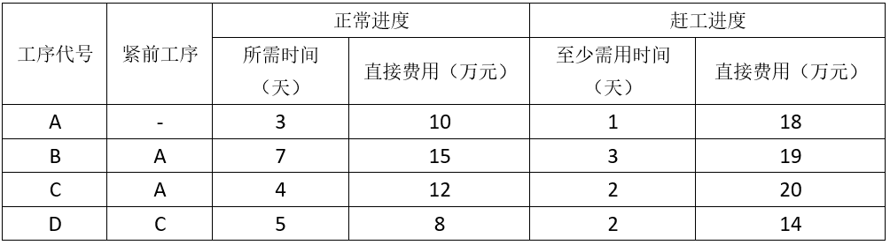

问题1选项
A.7
B.9
C.10
D.5

## 答案

A

## 解析

https://www.educity.cn/tiku/60098393.html

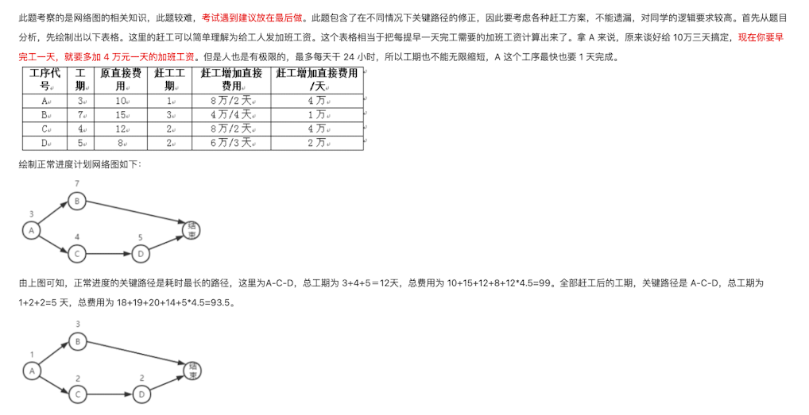

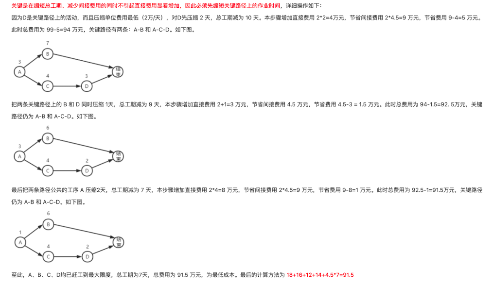

# 九题目

某项目包括A~G七个作业，各作业之间的衔接关系和所需时间如下表：
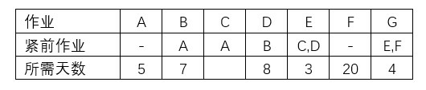

其中，作业C所需的时间，乐观估计为5天，最可能为14天，保守估计为17天。假设其他作业都按计划进度实施，为使该项目按进度计划如期全部完成。作业C（ )。

问题1选项
A.必须在期望时间内完成
B.必须在14天内完成
C.比期望时间最多可拖延1天
**D.比期望时间最多可拖延2天**

## 答案

D

## 解析

https://www.educity.cn/tiku/21096762.html

首先使用3点估算法计算出C的所需天数：（5+14*4+17）/6=13。

然后构造网络图，计算关键路径，关键路径为：ABDEG，长度27，C不在关键路径上。进一步计算C的总时差，会发现C的总时差为2，所以C可以比期望时间最多拖延2天。

三点估算法：实际上预期活动天数=（最小+4*最可能+最大）/6

# 十题目

某工程包括A、B、C、D四个作业，其衔接关系、正常进度下所需天数和所需直接费用、赶工进度下所需的最少天数和每天需要增加的直接费用见下表。该工程的间接费用为每天5万元。据此，可以估算出完成该工程最少需要费用（  ）万元，以此最低费用完成该工程需要（  ）天。

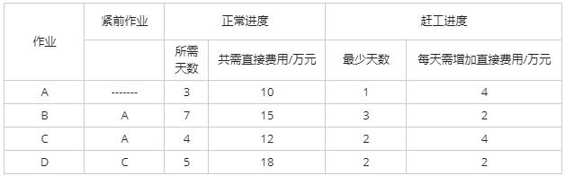

 

问题1选项
A.106
B.108
C.109
D.115

问题2选项
A.7
B.9
C.10
D.12

## 答案

第1题:A

第2题:A

## 解析

https://www.educity.cn/tiku/351945.html

本题是项目管理中，时间管理的关键路径问题。先将题目中的各个结点依赖关系画出来，如图所示：

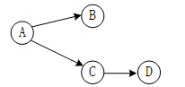    

通过结点依赖图，结合题目正常进度所需天数很容易看出ACD为关键路径。关键路径长度为12天。但这样得到的就是最短工期与最少花费吗？不是。因为题目指出间接花费是每天5万元，而赶工每天的费用仅2-4万。此时赶工完成部分任务，既能缩短工期，又能降低费用，是合适的解决方案，经过分析，赶工方案为：
A赶工2天，B赶工1天，D赶工3天。此时关键路径长度为7天，总花费为106万。

分析过程如下：
（1）总成本=直接成本+间接成本。
赶工处理之前，项目的直接成本是各个作业的直接费用10+15+12+18=55万元；
间接费用，根据题干“该工程的间接费用为每天5万元”，项目工期为12天，所以间接成本是12×5=60万元；
总成本=55+60=115万元。

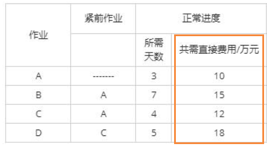

（2）赶工的必要性：每压缩一天工期，可以**节约间接成本5万元**，而赶工每天会增加直接成本，**只要赶工增加的成本不超过5万元**，那么就可以安排赶工，节约项目总成本。

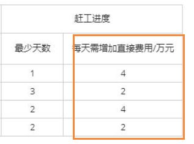

（3）确定赶工方案：赶工必定是节约了间接成本，也就是压缩了项目工期，只有关键路径才能影响项目工期。
根据关键路径A-C-D（12天），选择代价最小的作业进行压缩，也就是D活动，当D活动压缩2天之后，A-C-D工期为10天，与A-B工期一样；

此时关键路径发生了改变，有2条关键路径，分别是A-C-D和A-B，此时若要压缩工期，必须2条路径同时压缩，那么此时的压缩方案有多种：

- 压缩相交结点A，每天增加直接成本4万元；

- 同时压缩B和D，每天增加成本2+2=4万。

由于A原本需要3天最少需要1天，可压缩的空间是2天，B活动原本需要7天最少需要3天，可压缩空间4天，D活动原本需要5天最少需要2天，可压缩空间是3天，之前已经对D压缩了2天，也就是说B和D同时压缩的方案，由于D的限制，还有1天可压缩。
此时可压缩方案分别是A压缩2天，B和D同时压缩1天，项目工期为10-2-1=7天。

综上：赶工的全部过程如下，（1）D压缩2天；（2）A压缩2天；（3）B和D压缩1天。（其中（2）和（3）顺序可交换）。
也就是A压缩2天，B压缩1天，D压缩3天。

（4）确定最终的花费：
间接成本：7×5=35万元
直接成本：原直接费用10+15+12+18=55万元，赶工费用，A：4×2=8；B：2×1=2；D：2×3=6；总直接成本：55+8+2+6=71万元
总成本：35+71=106万元。

# 十一题目

某工程项目包括六个作业A~F，各个作业的衔接关系以及所需时间见下表。作业D最多能拖延（ ）天，而不会影响该项目的总工期。

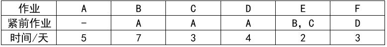

问题1选项
A.0
B.1
**C.2**
D.3

## 答案

C

## 解析

https://www.educity.cn/tiku/20994437.html

根据题干给出的依赖关系，可以画出单代号进度网络图，并分析其各活动的最早开始和完成时间、最晚开始和完成时间，以及总时差。结果如下：

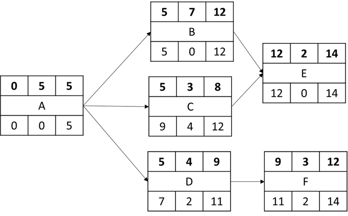

# 十二题目

项目时间管理中的过程包括（ ）。

问题1选项
A.活动定义、活动排序、活动的资源估算和工作进度分解
B.活动定义、活动排序、活动的资源估算、活动历时估算、制定计划和进度控制
C.项目章程、项目范围管理计划、组织过程资产和批准的变更申请
D.生产项目计划、项目可交付物说明、信息系统要求说明和项目度量标准

## 答案

B

## 解析

时间管理的六个步骤
1、活动定义
2、活动排序
3、活动的资源估算
4、活动历时估算
5、制定计划
6、进度控制

# 十三题目

（ ）是关于项目开发管理正确的说法。 

A．需求分档、设计文档属于项目管理和机构支撑过程域产生的文档

B．配置管理是指一个产品在其生命周期各个阶段所产生的各种形式和各种版本的文档、计算机程序、部件及数据的集合 

C．项目时间管理中的过程包括活动定义、活动排序、活动的资源估算、活动历时估算、制定进度计划以及进度控制 

D．操作员指南属于系统文档

## 答案

C

## 解析

C项目时间管理的六个步骤。

项目管理和机构支撑过程域产生的文档：工作文档、项目质量报告、项目跟踪报告，

产品组成部分的工作成果：如需求文档、设计文档、源代码和测试用例

产品配置是指一个产品在其生命周期各个阶段所产生的各种形式和各种版本的文档、计算机程序、部件及数据的集合。

操作员指南属于交付文档。

# 十四题目

活动定义是项目时间管理中的过程之一，（ ）是进行活动定义时通常使用的一种工具。

问题1选项
A.Gantt图
B.活动图
**C.工作分解结构（WBS）**
D.PERT图

## 答案

C

## 解析

https://www.educity.cn/tiku/74362.html

活动定义的常用工具包括：

1．分解
采用分解技术来定义活动，就是要把项目工作包分解成更小的、更易于管理的组成部分，即活动——为完成工作包而必须开展的工作。定义活动过程最终输出的是活动，而非可交付成果。可交付成果是创建工作分解结构过程的输出。
WBS、WBS 词典与活动清单，既可依次编制，也可同时编制。WBS和WBS 词典是制定最终活动清单的依据。WBS 中的每个工作包都需分解成活动，以便通过这些活动来完成相应的可交付成果。让团队成员参与分解，有助于得到更好、更准确的结果。
2．滚动式规划
滚动式规划是一种渐进明细的规划方式，即对近期要完成的工作进行详细规划，而对远期工作则暂时只在WBS 的较高层次上进行粗略规划。因此，在项目生命周期的不同阶段，工作分解的详细程度会有所不同。例如，在早期的战略规划阶段，信息尚不够明确，工作包也许只能分解到里程碑的水平；而后，随着了解到更多的信息，近期即将实施的工作包就可以分解成具体的活动。
3．模板
标准活动清单或以往项目的部分活动清单，经常可用作新项目的模板。模板中的活动属性信息，也有助于定义活动。模板还可用来识别典型的进度里程碑。
4．专家判断
富有经验并擅长制定详细项目范围说明书、工作分解结构和项目进度计划的项目团队成员或其他专家，可以为定义活动提供专业知识。

# 十五题目

项目的成本管理中，（ ）将总的成本估算分配到各项活动和工作包上，来建立一个成本的基线。

问题1选项
A.成本估算
**B.成本预算**
C.成本跟踪
D.成本控制

## 答案

B

## 解析

https://www.educity.cn/tiku/89722.html

项目的成本管理中，成本预算将总的成本估算分配到各项活动和工作包上，来建立一个成本的基线。