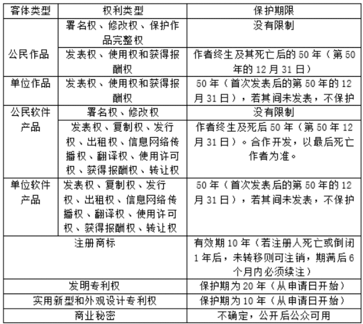
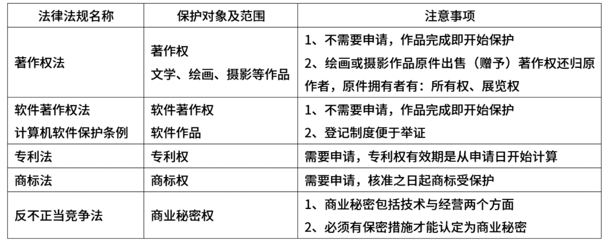
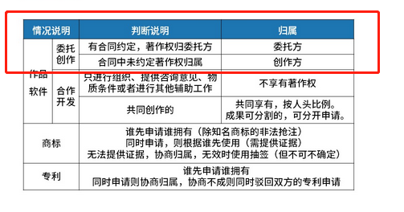
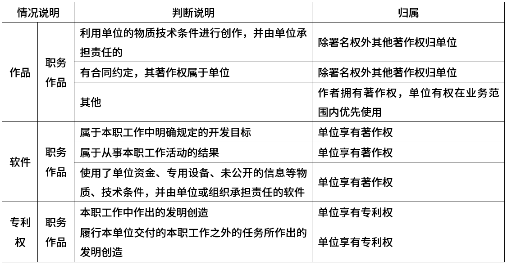

# 一题目

以下关于软件著作权产生时间的叙述中，正确的是（ ）。

问题1选项
A.软件著作权产生自软件首次公开发表时
B.软件著作权产生自开发者有开发意图时
**C.软件著作权产生自软件开发完成之日起**
D.软件著作权产生自软件著作权登记时

## 答案

C

## 解析

软件著作权自软件开发完成之日起产生。

自然人的软件著作权，保护期为自然人终生及其死亡后50年，截止于自然人死亡后第50年的12月31日;

软件是合作开发的，截止于最后死亡的自然人死亡后第50年的12月31日。

法人或者其他组织的软件著作权，保护期为50年，截止于软件首次发表后第50年的12月31日。

# 二题目

按照《中华人民共和国著作权法》的权利保护期（ ）受到永久保护。

问题1选项
A.发表权
**B.修改权**
C.复制权
D.发行权

## 答案

B

# 三题目

著作权中，（ ）的保护期不受期限限制。

问题1选项
A.发表权
B.发行权
C.展览权
**D.署名权**

## 答案

D

# 四题目

软件著作权受法律保护的期限是（ ）。一旦保护期满，权利将自行终止，成为社会公众可以自由使用的知识。

问题1选项
A.10年
B.25年
**C.50年**
D.不确定

## 答案

C

# 五题目

以下著作权权利中，（ ）的保护期受时间限制。

问题1选项
A.署名权
**B.发表权**
C.修改权
D.保护作品完整权

## 答案

B

# 六题目

为了加强软件产品管理，促进我国软件产业的发展，原信息产业部颁布了《软件产品管理办法》，“办法”规定，软件产品的开发、生产、销售、进出口等活动遵守我国有关法律、法规和标准规范，任何单位和个人不得开发、生产、销售、进出口含有以下内容的软件产品（ ）。
①侵犯他人的知识产权
②含有计算机病毒
③可能危害计算机系统安全
④含有国家规定禁止传播的内容
⑤不符合我国软件标准规范
⑥未经国家正式批准

问题1选项
A.123
B.1234
C.12345
D.123456

## 答案

C

## 解析

根据软件产品管理办法第一章第四条：软件产品的开发、生产、销售、进出口等活动应遵守我国有关法律、法规和标准规范。任何单位和个人不得开发、生产、销售、进出口含有以下内容的软件产品：
(一)侵犯他人知识产权的；
(二)含有计算机病毒的；
(三)可能危害计算机系统安全的；
(四)含有国家规定禁止传播的内容的；
(五)不符合我国软件标准规范的。
可以开发未经国家正式批准的软件。
其中进口软件，是指在我国境外开发，以各种形式在我国生产、经营的软件产品。

# 七题目

甲、乙软件公司于2013年9月12日就其财务软件产品分别申请“大堂”和“大唐”商标注册。两财务软件相似，且经协商双方均不同意放弃使用其申请注册的商标标识。此情形下，（ ）获准注册。

问题1选项
A.“大堂”
B.“大堂”与“大唐”都能
C.“大唐”
**D.由甲、乙抽签结果确定谁能**

## 答案

D

## 解析

商标构成要素应具备显著性，易于区别，且不应与已注册商标相同或相似。商标注册原则是谁先申请谁拥有，如果申请日相同，则看谁先使用，如果无法判断则可以通过协商或抽签等方式进行解决

# 八题目

甲、乙两软件公司于2012年7月12日就其财务软件产品分别申请“用友”和 “用有”商标注册。两财务软件相似，且甲乙第一次使用均为2015年7月12日。此情形下，（ ）能获准注册。

问题1选项
A.“用友”
B.“用友”和 “用有”都能
C.“用有”
**D.由甲、乙抽签结果确定谁能**

## 答案

D

# 九题目

甲、乙两软件公司于2012年7月12日就其财务软件产品分别申请“用友”和 “用有”商标注册。两财务软件相似，甲第一次使用时间为2009年7月，乙第一次使用时间为2009年5月。此情形下，（ ）能获准注册。

问题1选项
A.“用友”
B.“用友”与“用有”都
**C.“用有”**
D.由甲、乙抽签结果确定

## 答案

C

# 十题目

软件著作权保护的对象不包括（ ）。

问题1选项
A.源程序
B.目标程序
C.用户手册
**D.处理过程**

## 答案

D

## 解析

软件著作权中规定：开发软件所用的思想、处理过程、操作方法或者数学概念不受保护。

# 十一题目

为说明某一问题，在学术论文中需要引用某些资料。以下叙述中，（  ）是不正确的。

问题1选项
A.既可引用发表的作品，也可引用未发表的作品
B.只能限于介绍、评论作品
C.只要不构成自己作品的主要部分，可适当引用资料
D.不必征得原作者的同意，不需要向他支付报酬

## 答案

A

## 解析

根据《著作权法》的规定，符合法定许可条件的都是“已发表作品”，由此推知，引用未发表作品，必须征得作者同意，因为这涉及到作者的发表权问题。

合理使用是不必征得原作者的同意，不需要向他支付报酬，其使用的范围和具体方式，具体而言可以从以下几个方面理解：

（1）引用的目的是为了介绍、评论某一作品或者说明某一问题。

（2）引用的比例必须适当。一般说来，引用不应当比评论、介绍或者说明还长。

（3）引用的作品必须是已经发表的作品。

（4）引用他人的作品，应当指明作者的姓名，作品的名称，并且不得侵犯著作权人按照著作权法享有的其他权利。

# 十二题目

以下作品中，不适用或不受著作权法保护的是（  ）。

问题1选项
A.某教师在课堂上的讲课
B.某作家的作品《红河谷》
C.最高人民法院组织编写的《行政诉讼案例选编》
**D.国务院颁布的《计算机软件保护条例》**

## 答案

D

## 解析

根据我国《著作权法》的规定，有三种类型的作品不受法律保护。 第一种是依法禁止出版、传播的作品。 第二种是不适用于《著作权法》的作品。它们包括下列作品：

（1）法律、法规，国家的决议、决定、命令和其他具有立法、行政、司法性质的文件，极其官方正式译文；

（2）时事新闻；

（3）历法、通用数表、通用表格和公式。

国务院颁布的《计算机软件保护条例》属于法律法规，所以不受著作权法保护。

# 十三题目

软件商标权的保护对象是指（  ）。

问题1选项
A.商业软件
B.软件商标
**C.软件注册商标**
D.已使用的软件商标

## 答案

C

## 解析

软件商标权是软件商标所有人依法对其商标（软件产品专用标识）所享有的专有使用权。在我国，商标权的取得实行的是注册原则，即商标所有人只有依法将自己的商标注册后，商标注册人才能取得商标权，其商标才能得到法律的保护。对其软件产品已经冠以商品专用标识，但未进行商标注册，没有取得商标专用权，此时该软件产品专用标识就不能得到商标法的保护，即不属于软件商标权的保护对象。未注册商标可以自行在商业经营活动中使用，但不受法律保护。未注册商标不受法律保护，不等于对使用未注册商标行为放任自流。为了更好地保护注册商标的专用权和维护商标使用的秩序，需要对未注册商标的使用加以规范。所以《商标法》第四十八条专门对使用未注册商标行为做了规定。未注册商标使用人不能违反此条规定，否则商标行政主管机关将依法予以查处。

# 十四题目

程序员甲与同事乙在乙家探讨甲近期编写的程序，甲表示对该程序极不满意，要弃之重写，并将程序手稿扔到乙家垃圾筒。后来乙将甲这一程序稍加修改，并署乙发表。以下说法正确的是（）。

问题1选项
A.乙的行为侵犯了甲的软件著作权
B.乙的行为没有侵犯甲的软件著作权，因为甲已将程序手稿丢弃
C.乙的行为没有侵犯甲的著作权，因为乙已将程序修改
D.甲没有发表该程序并弃之，而乙将程序修改后发表，故乙应享有著作权

## 答案

A

## 解析

https://www.educity.cn/tiku/9923.html

著作权因作品的完成而自动产生，不必履行任何形式的登记或注册手续，也不论其是否己经发表，所以甲对该软件作品享有著作权。乙未经甲的许可擅自使用甲的软件作品的行为，侵犯了甲的软件著作权。

# 十五题目

M公司将其开发的某软件产品注册商标为S，为确保公司在市场竞争中占据优势地位，M公司对员工进行了保密约束，此情形下，该公司不享有（ ）。

问题1选项
A.软件著作权
**B.专利权**
C.商业秘密权
D.商标权

## 答案

B

## 解析

软件著作权在作品完成之时就已经存在，所以M公司享有软件著作权。

专利权和商标权都需要申请，本题已注册商标S，但是没有提到专利权申请，所以M公司享有商标权不享有专利权，本题选择B选项。

商业秘密权需要有保密措施才能保护，本题已有保密约束，所以M公司享有商业秘密权。

# 十六题目

赵某购买了一款有注册商标的应用App，擅自复制成光盘出售，其行为是侵犯（ ）的行为。

问题1选项
A.注册商标专用权
B.软件著作权
C.光盘所有权
D.软件专利权

## 答案

B

## 解析

赵某的行为是未经允许私自制作并出售盗版光盘的行为，此时侵犯的是版权，即著作权。

# 十七题目

下列关于著作权归属的表述，正确的是（ ）。

问题1选项
**A.改编作品的著作权归属于改编人**
B.职务作品的著作权都归属于企业法人
C.委托作品的著作权都归属于委托人
D.合作作品的著作权归属于所有参与和组织创作的人

## 答案

A

## 解析

改编、翻译、注释、整理已有作品而产生的作品，其著作权由改编、翻译、注释、整理人享有，但行使著作权时不得侵犯原作品的著作权。

职务作品的著作权不一定归属于企业法人，有可能归属于个人，企业有优先使用权。

委托作品的著作权可以由合同约定归属人，不一定都归属于委托人。

合作作品的著作权归属于所有参与人不含组织创作的人。

# 十八题目

X公司接受Y公司的委托开发了一款应用软件，双方没有订立任何书面合同。在此情形下，（ ）享有该软件的著作权。

问题1选项
A.X、Y公司共同
**B.X公司**
C.Y公司
D.X、Y公司均不

## 答案

B

## 解析

委托创作中，没有约定著作权归属，则默认由创作方获得著作权。

# 十九题目

某软件公司根据客户需求，组织研发出一套应用软件，并与本公司的职工签订了保密协议，但是本公司某研发人员将该软件中的算法和部分程序代码公开发表。该软件研发人员（），该软件公司丧失了这套应用软件的（）。

问题1选项
A.与公司共同享有该软件的著作权，是正常行使发表权
B.与公司共同享有该软件的著作权，是正常行使信息网络传播权
C.不享有该软件的著作权，其行为涉嫌侵犯公司的专利权
**D.不享有该软件的著作权，其行为涉嫌侵犯公司的软件著作权**

问题2选项
A.计算机软件著作权
B.发表权
C.专利权
**D.商业秘密**

## 答案

第1题:D

第2题:D

## 解析

该软件公司的研发人员参与开发的该软件是职务作品，因此该软件著作权属于公司，且该研发人员将该软件中的算法和部分程序代码公开发表的行为涉嫌侵犯公司的软件著作权。

根据《合同法》的诚实信用原则和劳动者对单位的忠实义务，保守商业秘密的义务属于法定的义务，权利人与义务人即使没有约定保密期限，只要该项商业秘密未被公开，仍然具有经济价值，且权利人对其采取了合理的保密措施，属于法律意义上的商业秘密，则知悉该商业秘密的单位和个人就应当继续履行保密义务，直到该项商业秘密公开为止，即当事人保密义务的期限与商业秘密的存续期限相同。但当事人另有约定的，依约定。无论什么原因导致商业秘密被公之于众，其“秘密性”不复存在，也就不能作为商业秘密继续保护。因为该研发人员将该软件中的算法和部分程序代码公开发表了，其“秘密性”不复存在，也就丧失了这套应用软件的商业秘密权。

# 二十题目

以下关于计算机软件著作权的叙述中，正确的是（ ）。

问题1选项
A.软件著作权自软件开发完成之日生效
B.非法进行拷贝、发布或更改软件的人被称为软件盗版者
C.开发者在单位或组织中任职期间所开发软件的著作权应归个人所有
D.用户购买了具有版权的软件，则具有对该软件的使用权和复制权

## 答案

A

## 解析

本题考查的是知识产权相关内容。

A选项的描述是正确的。软件著作权自作品完成即开始保护。本题选择A选项。

B选项中软件盗版行为是指任何未经软件著作权人许可，擅自对软件进行复制、传播，或以其他方式超出许可范围传播、销售和使用的行为，软件盗版者不仅仅是非法拷贝、发布的人，还有传播等其他盗版行为的人也被称为软件盗版者。同时，更改软件的人也不能称之为盗版者。所以B选项说法错误。

C选项描述的职务作品知识产权人应该是公司而不是归个人所有，C选项描述错误。

D选项中用户购买软件后只有使用权，没有复制权，D选项描述也是错误的。

# 二十一题目

如果 A 公司购买了一个软件的源程序， A 公司将该软件源程序中的所有标识符做了全面修改后，作为该公司的产品销售，这种行为（ ）。

问题1选项
A.尚不构成侵权
**B.侵犯了著作权**
C.侵犯了专利权
D.属于不正当竞争

## 答案

B

## 解析

https://www.educity.cn/tiku/20994435.html

著作权包括著作人身权和著作财产权。著作人身权包括：发表权；署名权；修改权；保护作品完整权。著作财产权包括：复制权；发行权；出租权；展览权；表演权；放映权；广播权；改编权；翻译权；汇编权；以及应当由著作权人享有的其他权利。这里侵犯了修改权和署名权等著作权。

# 二十二题目

某软件程序员接受X公司（软件著作权人）委托开发一个软件，三个月后又接受Y公司委托开发功能类似的软件，该程序员仅将受X公司委托开发的软件略作修改即完成提交给Y公司，此种行为（ ）。

问题1选项
A.属于开发者的特权
B.属于正常使用著作权
C.不构成侵权
**D.构成侵权**

## 答案

D

## 解析

本题的情况属于委托开发，题目已明确了著作权归属于X公司，所以软件程序员并没有著作权，把没有著作权的作品修改并售卖，这是侵权的行为。

# 二十三题目

谭某是CZB物流公司的科技系统管理员。任职期间，谭某根据公司的业务要求开发了“报关业务系统”，并由公司使用，随后谭某向国家版权局申请了计算机软件著作权登记，并取得了《计算机软件著作登记证书》。证书明确软件名称为“报关业务系统V1.0”，著作权人为谭某。以下说法正确的是（ ）。

问题1选项
A.报关业务系统V1.0的著作权属于谭某
B.报关业务系统V1.0的著作权属于CZB物流公司
C.报关业务系统V1.0的著作权属于谭某和CZB物流公司
D.谭某获取的软件著作权登记证是不可以撤销的

## 答案

B

## 解析

本题考查职务作品界定问题。题目提到“任职期间，谭某根据公司的业务要求开发了‘报关业务系统’”，这个系统应属于职务作品，所以著作权属于CZB物流公司。

# 二十四题目

王某买了一幅美术作品原件，则他享有该美术作品的（ ）。

问题1选项
A.著作权
B.所有权
C.展览权
**D.所有权与展览权**

## 答案

D

## 解析

著作权法规定，美术作品著作权不由原件的转移而转移，原件卖出或赠出后，原作者仍有该画的著作权，原件持有人仅有所有权与展览权。

# 二十五题目

某人持有盗版软件，但不知道该软件是盗版的，该软件的提供者不能证明其提供的复制品有合法来源。此情况下，则该软件的（ ）应承担法律责任。

问题1选项
A.持有者
**B.持有者和提供者均**
C.提供者
D.持有者和提供者均不

## 答案

B

## 解析

https://www.educity.cn/tiku/352086.html

 “盗版软件”即侵权的软件复制品。
《计算机软件保护条例》使用了软件侵权复制品持有人主观上知道或者应当知道所持软件是否为侵权复制品为标准。知道软件是侵权复制品而使用运行，持有人主观上应当属于故意，即明知故犯；有合理理由推论或者认定持有人应当知道其所使用运行的软件为侵权复制品，如主观上存有疏忽大意等过失，而使用运行了侵权复制品，应当承担法律责任。主观上不知或者没有合理理由应知的持有人，对该软件的使用运行等行为不承担民事赔偿责任。但是当其一旦知道了所使用的软件为侵权复制品时，应当履行停止使用、销毁该软件的法律义务。
《计算机软件保护条例》第28条规定，软件复制品的出版者、制作者不能证明其出版、制作有合法授权的，或者软件复制品的发行者、出租者不能证明其发行、出租的复制品有合法来源的，应当承担法律责任。

本题说明了“该软件的提供者不能证明其提供的复制品有合法来源”，有合理理由推论或者认定持有人应当知道其所使用运行的软件为侵权复制品，应当承担法律责任。

# 二十六题目

M公司购买了N画家创作的一幅美术作品原件。M公司未经N画家的许可，擅自将这幅美术作品作为商标注册，并大量复制用于该公司的产品上。M公司的行为侵犯了N画家的（ ）。

问题1选项
**A.著作权**
B.发表权
C.商标权
D.展览权

## 答案

A

## 解析

著作权法规定：美术作品的著作权不随原作品所有权的转变而发生变化。所以M公司购买N画家的美术作品，著作权不归M公司，而归N画家。M公司将美术作品注册为商标，是侵犯了N画家著作权的。

# 二十七题目

M软件公司的软件产品注册商标为N，为确保公司在市场竞争中占据优势，对员工进行了保密约束。此情形下，（  ）的说法是错误的。

问题1选项
A.公司享有商业秘密权
B.公司享有软件著作权
**C.公司享有专利权**
D.公司享有商标权

## 答案

C

## 解析

在题目的描述中，未体现出有申请专利的行为，所以不享有专利权。

# 二十八题目

用户提出需求并提供经费，委托软件公司开发软件。但在双方商定的协议中未涉及软件著作权的归属，则软件著作权属于（） 所有。 

A．用户 

B．用户与软件公司共同 

C.   软件公司

D．经裁决所确认的一方

## 答案

C

## 解析

在委托创作中，著作权的归属由委托人与受托人签订书面合同约定。无书面合同或者合同未作明确约定的，其著作权由受托人享有。

# 二十九题目

某摄影家创作一件摄影作品出版后，将原件出售给了某软件设计师。软件设计师不慎将原件毁坏，则该件摄影作品的著作权（  ）享有。

问题1选项
**A.仍然由摄影家**
B.由摄影家和软件设计师共同
C.由软件设计师
D.由摄影家或软件设计师申请的一方

## 答案

A

## 解析

著作权法第十八条关于美术作品原件所有权的转移不视作作品著作权的转移的规定适用于任何原件所有权可能转移的作品。作品原件的合法所有人如不是著作权人，他要想将作品发表，必须经过著作权人的许可。
摄影作品属于美术作品的一类，这种作品的著作权不会因为原件所有权的转移而转移，所以由始至终，著作权一直由摄影家享有

# 三十题目

软件设计师王某在其公司的某一综合信息管理系统软件开发项目中、承担了大部分程序设计工作。该系统交付用户，投入试运行后，王某辞职离开公司，并带走了该综合信息管理系统的源程序，拒不交还公司。王某认为综合信息管理系统源是他独立完成的，他是综合信息管理系统源程序的软件著作权人。王某的行为（  ）。

问题1选项
**A.侵犯了公司的软件著作权**
B.未侵犯公司的软件著作权
C.侵犯了公司的商业秘密权
D.不涉及侵犯公司的软件著作权

## 答案

A

## 解析

王某完成的软件由于是公司安排的任务，在公司完成的，所以会被界定为职务作品，这个作品的软件著作权归公司拥有。