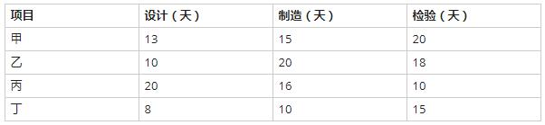

# 一题目

为近似计算XYZ三维空间内由三个圆柱x2+y2≤1，y2+z2≤1，x2+z2≤1相交部分V的体积，以下四种方案中，（）最容易理解，最容易编程实现。

问题1选项
A.在z=0平面中的圆x 2+y 2≤1上，近似计算二重积分
B.画出V的形状，将其分解成多个简单形状，分别计算体积后，再求和
C.将V看作多个区域的交集，利用有关并集、差集的体积计算交集体积
D.V位于某正立方体M内，利用M内均匀分布的随机点落在V中的比例进行计算

## 答案

D

## 解析

https://www.educity.cn/tiku/60008702.html

本题考查的是应用数学中随机模拟相关应用。

由于3个圆柱相交部分很难画图，并且构造出其图形也很难想象，因此A、B、C三个选项计算难度都比较大。

D选项利用随机函数进行计算，比较好实现。对比抽象的3个圆柱相交的图形，在它的外围圈出一个比之较大一些的三维立方体【x∈[-1，1]，y∈[-1，1]，z∈[-1，1]】更容易。构造出立方体后，在计算机上利用伪随机函数，很容易统计出该立方体的随机点位于V【取随机数判断是否满足3个圆柱的公式】的比例。

此时立方体体积为（1-（-1））3=8，假设概率值即比例值记作P，由几何概型公式可知：P=V的体积/立方体的体积，也就是说V的体积近似等于该比例值的8倍。

# 二题目

数学模型常带有多个参数，而参数会随环境因素而变化。根据数学模型求出最优解或满意解后，还需要进行（ ），对计算结果进行检验，分析计算结果对参数变化的反应程度 。

问题1选项
A.一致性分析
B.准确性分析
C.灵敏性分析
D.似然性分析

## 答案

C

## 解析

https://www.educity.cn/tiku/20994436.html

本题是对数学建模相关知识的考查。

灵敏度分析：通常在决策模型中，自然状态的概率和损益值往往由估计或预测得到，不可能十分准确，此外实际情况也是在不断发生变化的，因此需要分析为决策所用的数据可在多大范围内变动，原最优决策方案继续有效，这就是灵敏度分析。即变量数据是否敏感，在最优方案不变的条件下，这些变量允许变化的范围。

# 三题目

以下关于数学建模的叙述中，不正确的是（ ）。

问题1选项
A.数学模型是对现实世界的一种简化的抽象描述
B.数学建模时需要在简单性和准确性之间求得平衡
C.数学模型应该用统一的、普适的标准对其进行评价
D.数学建模需要从失败和用户的反馈中学习和改进

## 答案

C

## 解析

数学建模是利用数学方法解决实际问题的一种实践。即通过抽象、简化、假设、引进变量等处理过程后，将实际问题用数学方式表达，建立起数学模型，然后运用先进的数学方法及计算机技术进行求解。 这是A和B的原因，数学模型是对于现实世界的一个特定对象，一个特定目的，根据特有的内在规律，作出一些必要的假设，运用适当的数学工具，得到一个数学结构。对不同的问题，有不同的评价标准，数学模型难有统一的普适标准来评价。

# 四题目

小王需要从①地开车到⑦地，可供选择的路线如下图所示。图中，各条箭线表示路段及其行驶方向，箭线旁标注的数字表示该路段的拥堵率（描述堵车的情况，即堵车概率）。拥堵率=1-畅通率，拥堵率=0时表示完全畅通，拥堵率=1时表示无法行驶。根据该图，小王选择拥堵情况最少（畅通情况最好）的路线是（  ）。

问题1选项
A.①②③④⑤⑦
B.①②③④⑥⑦
C.①②③⑤⑦
D.①②④⑥⑦

## 答案

C

## 解析

# 五题目

某企业准备将四个工人甲、乙、丙、丁分配在A、B、C、D四个岗位。每个工人由于技术水平不同，在不同岗位上每天完成任务所需的工时见下表。适当安排岗位，可使四个工人以最短的总工时（  ）全部完成每天的任务。

A．13

B.14

C.15

D.16

## 答案

B

## 解析

# 六题目

甲、乙、丙、丁四个任务分配在A、B、C. D四台机器上执行，每台机器执行一个任务，所需的成本（单位:百元）如下表所示。适当分配使总成本最低的最优方案中，任务乙应由机器（）执行。

问题1选项
A.A
B.B
C.C
D.D

## 答案

C

## 解析

https://www.educity.cn/tiku/60008651.html

根据任一行，任一列各元素都减或加一常数后，并不会影响最优解的位置，只是目标值（分配方案的各项和）也减或加了这一常数这一性质。

首先，用每一行的值减去该行的最小值得到如下图结果：

此时第3列仍没有出现0元素，所以第三列列的数值，减去第三列的最小值得到如下图结果：

可以看出不存在全0分配，所以我们来看总和是不是有1的。显然存在总和为1的分配，如图所示：

 所以把甲任务分配给A机器，乙任务分配给C机器，丙任务分配给B机器，丁任务分配给D机器时等达到最低成本为1+10+5+5=21，所以答案选C。

# 七题目

企业从部门中选择四个部门下月做甲、乙、丙、丁四项工作，每个部门做一项工作。已知每个部门做每项工作所需的成本(单位:万元)

在总成本最低的方案中，( )。

问题1选项
A.选择部门A、B、C、D做工作，安排部门A做工作甲
B.选择部门A、B、D、E做工作，安排部门A做工作乙
C.选择部门A、B、C、E做工作，安排部门A做工作丙
D.选择部门B、C、D、E做工作，安排部门B做工作甲

## 答案

B

## 解析

A：安排A做甲工作，那么甲的成本为4，剩下的乙丙丁由B、C、D三个部门来做，对照表格可知B做丙工作、C做乙工作、D做丁工作对应的成本最低。总成本：4+6+9+10=29。

B：安排A做乙工作，那么乙的成本为7，剩下的甲丙丁由B、D、E三个部门来做，对照表格可知B做丙工作、C做甲工作、E做丁工作对应的成本最低。总成本：7+6+2+7=22。

C：安排A做丙工作，那么丙的成本为5，剩下的甲乙丁由B、C、E三个部门来做，对照表格可知B做甲工作、C做乙工作、E做丁工作对应的成本最低。总成本：5+5+9+7=26。

D：安排B做甲工作，那么甲的成本为5，剩下的乙丙丁由C、D、E三个部门来做，对照表格可知C做乙工作、D做丁工作、E做丙工作对应的成本最低。总成本：5+9+10+9=33。

综上所述，B选项方案的总成本最低。

# 八题目

某公司有4百万元资金用于甲、乙、丙三厂追加投资。各厂获得不同投资款后的效益见下表。适当分配投资（以百万元为单位）可以获得的最大的总效益为（  ）百万元。

 

问题1选项
A.15.1
B.15.6
C.16.4
D.16.9

## 答案

C

## 解析

枚举 https://www.educity.cn/tiku/89568.html

# 九题目

某公司拟将5百万元资金投放下属A、B、C三个子公司（以百万元的倍数分配投资），各子公司获得部分投资后的收益如下表所示（以百万元为单位）。该公司投资的总收益至多为（  ）百万元。

问题1选项
A.4.8
B.5
C.5.2
D.5.5

## 答案

D

## 解析

使用穷举法，把每一种投资方式都列出来，然后选择 收益 最大的方案。

# 十题目

甲、乙、丙、丁4人加工A、B 、C、D四种工件所需工时如下表所示。指派每人加工一种工件，四人加工四种工件其总工时最短的最优方案中，工件B应由（  ）加工。

问题1选项
A.甲
B.乙
C.丙
D.丁

## 答案

D

## 解析

先将矩阵进行化简，化简的方法是每行的元素减去这一行的最小值，然后每列的元素减去这一列的最小值，确保每行，每列都有0。得到：

然后找出一种方案，方案组成元素都是0，而这些元素不同行，也不同列。即为解决方案。如下：

# 十一题目

某服装店有甲、乙、丙、丁四个缝制小组。甲组每天能缝制5件上衣或6条裤子；乙组每天能缝制6件上衣或7条裤子；丙组每天能缝制7件上衣或8条裤子；丁组每天能缝制8件上衣或9条裤子。每组每天要么缝制上衣，要么缝制裤子，不能弄混。订单要求上衣和裤子必须配套（每套衣服包括一件上衣和一条裤子）。只要做好合理安排，该服装店15天最多能缝制（ ）套衣服。

问题1选项
A.208
B.209
C.210
D.211

## 答案

D

## 解析

https://www.educity.cn/tiku/77407.html

根据题意，甲、乙、丙、丁四组做上衣和裤子的效率之比分别为5/6、6/7、7/8、8/9，所以丁做上衣最快。

然后裤子和上衣的比率6/5，7/6，8/7，9/8，所以甲做裤子最快

因此，丁组做上衣的相对效率更高，甲组做裤子的相对效率更高。为此，安排甲组15天全做裤子，丁组15天全做上衣。
设乙组用x天做上衣，15-x天做裤子；丙组用y天做上衣，15-y天做裤子，为使上衣和裤子配套，则有
0+6x+7y+8×15=6×15+7（15-x）+8（15-y）+0
所以，13x+15y=13×15，y=13-13x/15
15天共做套数6x+7y+8×15=6x+7（13-13x/15）+120=211-x/15
只有在x=0时，最多可做211套。
此时，y=13，即甲乙丙丁四组分别用0、0、13、15天做上衣，用15、15、2、0天做裤子。

# 十二题目

某厂生产的某种电视机，销售价为每台2500元，去年的总销售量为25000台，固定成本总额为250万元，可变成本总额为4000万元，税率为16%，则该产品年销售量的盈亏平衡点为（）台(只有在年销售量超过它时才能盈利)。

问题1选项
A.5000
B.10000
C.15000
D.20000

## 答案

A

## 解析

https://www.educity.cn/tiku/60008701.html

盈亏平衡点也称为零利润点或保本点，是全部销售收入等于全部成本时的产量。当销售收入高于盈亏平衡点时，表示企业是盈利的状态；当销售收入低于盈亏平衡点时，表示企业是亏损的状态。
去年卖了25000台电视机，每台售价2500元，固定成本250万，可变成本4000万，税率16%。
总营收：25000 \* 2500=6250万
固定成本：250万
可变成本：4000万，占营收比例：64%（4000万/6250万=64%）。
税不属于成本，但与可变成本性质相似，会随销量变化。
设盈亏平衡时的销售量为X台。则有：
2500000+X\*2500\*64%+X\*2500\*16%=X*2500
500X=2500000
解得：X=5000

# 十三题目

某企业拟生产甲、乙、丙、丁四个产品。每个产品必须依次由设计部门、制造部门和检验部门进行设计、制造和检验，每个部门生产产品的顺序是相同的。各产品各工序所需的时间如下表：

只要适当安排好项目实施顺序，企业最快可以在（  ）天全部完成这四个项目。

问题1选项
A.84
B.86
C.91
D.93

## 答案

A

## 解析

https://www.educity.cn/tiku/31651.html

做这种试题有一个基本原则：设计时间最短的产品应排在最终顺序中的第一位，检验时间最短的产品应排在最终顺序中的最后一位，这样才能使得窝工的时间最少。
根据以上原则，只有两种可能的排列顺序，其一是丁乙甲丙，其二是丁甲乙丙。  
前者需要的总工作时间是86天，后者需要的总工作时间是84天。如图。所以选A。

# 十四题目

生产某种产品有两个建厂方案：（1）建大厂，需要初期投资500万元。如果产品销路好，每年可以获利200万元；如果销路不好，每年会亏损20万元。（2）建小厂，需要初期投资200万元。如果产品销路好，每年可以获利100万元；如果销路不好，每年只能获利20万元。
市场调研表明，未来2年，这种产品销路好的概率为70%。如果这2年销路好，则后续5年销路好的概率上升为80%；如果这2年销路不好，则后续5年销路好的概率仅为10%。为取得7年最大总收益，决策者应（  ）。

问题1选项
A.建大厂，总收益超500万元
B.建大厂，总收益略多于300万元
C.建小厂，总收益超500万元
D.建小厂，总收益略多于300万元

## 答案

B

## 解析

节点④：{200×0.8+（-20）×0.2}×5=780

节点⑤：{200×0.1+（-20}×0.9）×5=10
节点⑥：{100×0.8+20×0.2}×5=420
接点⑦：{100×0.1+20×0.9}×5=140
再在②、③节点处按如下算式计算2年的期望值（扣除投资额），并将结果（7年总收益）写在节点处。
节点②：{200×0.7+（-20）×0.3}×2+{780×0.7+10×0.3}-500=317
节点③：{100×0.7+20×0.3}×2+{420×0.7+140×0.3}-200=288

# 十五题目

非负整数变量x和y，在x≤4，y≤3和x+2y≤8的约束条件下，目标函数2x+3y的最大值为（  ）。

问题1选项
A.13
B.14
C.15
D.16

## 答案

B

## 解析

本题为数学方面的线性规划问题。注意为整数

根据题意可得到不等式方程组：

x<=4

y<=3

x+2y<=8

解方程组，得到两组可行解：

（1）x=4，y=2 ，此时2x+3y=14（2）x=2，y=3，此时2x+3y=13

所以2x+3y最大值是：14。

# 十六题目

在如下线性约束条件下：2x+3y≤30；x+2y≥10；x≥y；x≥5；y≥0，目标函数2x+3y的极小值为（ ）。

问题1选项
A.16.5
B.17.5
C.20
D.25

## 答案

B

## 解析

将题中的约束条件取等号作为直线，获得可行域，然后将顶点带入2x+3y中来求得最值。本题的解题图示如下：

# 十七题目

计算机产生的随机数大体上能在（0，1）区间内均匀分布。假设某初等函数f(x)在（0，1）区间内取值也在（0，1）区间内，如果由计算机产生的大量的（M个）随机数对（r1，r2）中，符合r2≤f（r1）条件的有N个，则N/M可作为（ ）的近似计算结果。

问题1选项
A.求解方程f(x)=x
B.求f(x)的极大值
C.求f(x)的极小值
D.求积分 

## 答案

D

## 解析

https://www.educity.cn/tiku/60098396.html

我们知道定积分其实就是一个面积，将其设为1，现在我们就是要求出这个1。通过在包含 定积分的面积为的区域（通常为矩形）内随机产生一些随机数，其数量为M，再统计在积分 区域内的随机数，其数量为N，则产生的随机数在积分区域内的概率为N/M，这与积分区域面积与总区域面积1的比值就是N/M（也就是定积分1所求面积的近似值）。答案选择D选项。

# 十八题目

1路和2路公交车都将在10分钟内均匀随机地到达同一车站，则它们相隔4分钟内到达该站的概率为（ ）。

问题1选项
A.0.36
B.0.48
C.0.64
D.0.76

## 答案

C

## 解析

https://www.educity.cn/tiku/74386.html

设1路和2路公交车将分别在x和y分钟内到达该站，则x和y是在[0，10]内独立均匀分布的随机变量。本题需要计算|x-y|≤4的概率。
平面上的点（x,y）必然在正方形[0,10;0,10]内均匀分布。|x-y|≤4的概率应当等于该正方形中|x-y|≤4的部分面积的比例。
该正方形的面积为100，其中|x-y|≤4部分的面积为64（如下图），因此，|x-y|≤4的概率为0.64。

