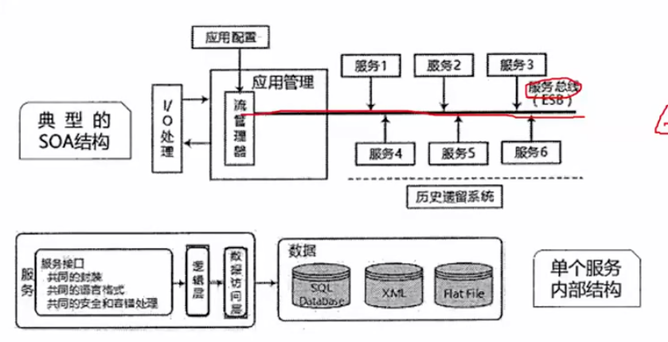

# 软件架构设计

## 质量属性效用树、质量属性判断

### 性能

指系统的响应能力，即要经过多长时间才能对某个事件做出响应，或者在某段时间内系统所能处理事件的个数。如：响应时间、吞吐量。

设计策略：优先级队列、增加计算资源、减少计算开销、引入兵法机制、采用资源调度等。

### 可靠性

是软件系统在应用或系统错误面前，在意外或错误使用的情况下维持软件系统的功能特性的基本能力。

如：MTTF、MTBF。

设计策略：心跳、冗余、选举

### 可用性

是系统能够正常运行的时间比例，经常用两次故障之间的时间长度或在出现故障时系统能够回复正常的速度来表示。

如：故障时间间隔。

设计策略：心跳、冗余、选举

### 安全性

是指系统在向合法用户提供服务的同时能够阻止非授权用户使用的企图或拒绝服务的能力。

如：保密性、完整性、不可抵抗型、可控性

设计策略：入侵检测、用户认证、用户授权、追踪审计

### 可修改性

指能够快速的以较高的性能价格比对系统进行变更的能力。通常以某些具体的变更为基准，通过考察这些变量的代价衡量。

设计策略：接口-实现分类、抽象、信息隐藏

### 功能性

是系统所能完成所期望的工作的能力。一项任务的完成需要系统中许多或大多数构件的相互协作。

### 可变性

指体系结构经扩充或变更而成为新体系结构的能力。这种新体系结构应该符合预先定义的规则，在某些具体方面不同于原有的体系结构。当要将某个体系结构作为一系列相关产品的基础时，可变性是很重要的。

### 互操作性

作为系统组成部分的软件不是独立存在的，经常与其他系统或资深环境相互作用。为了支持互操作性，软件体系结构必须为外部可视的功能特性和数据结构提供精心设计的软件入口。程序和用其他编程语言编写的软件系统的交互作用就是互操作性的问题，也影响应用的软件体系结构。

## 必背概念

### 软件架构风格

五大类架构风格。

是指描述特定软件系统组织方式的惯用模式。组织方式描述了系统的组成构件和这些构件的组织方式，惯用模式则反应众多系统共有的结构和语义。

### 架构风险

是指架构设计中潜在的、存在问题的架构决策所带来的隐患。

### 风险点与非风险点

不是以标准专业术语形式出现的，只是一个常规概念，即可能引起风险的因素，可称为风险点。

某个做法如果有隐患，有可能导致一些问题，则为风险点；而如果某件事是可行的可接受的，则为非风险点。

### 敏感点

是指为了实现某种特定的质量属性，一个或多个构件所具有的特性。

### 权衡点

是影响多个质量属性的特性，是多个质量属性的敏感点。

## 架构风格对比

### 数据流

### 调用返回

### 独立构件

### 虚拟机

### 仓库

## MVC架构

MVC强制性的把一个应用的输入、处理、输出流程按照视图、控制、模型的方式进行分离，形成了三个核心模块：控制器、模型、视图。

是一种分层架构。

优点：有助于管理复杂的应用程序，因为您可以在一个时间内专门关注一个方面。例如可以在不依赖业务逻辑的情况下专注于视图开发。同时也简化了分组开发。不同的开发人员可同时开发视图、控制器逻辑和业务逻辑。

### 控制器

是应用程序中处理用户交互的部分。通常控制器负责从视图读取数据，控制用户输入、并向模型发送数据。

### 模型

是应用程序中用于处理应用程序数据逻辑的部分。通常模型对象负责在数据中存取数据。模型表示业务数据和业务逻辑。

### 视图

是应用程序中处理数据显示的部分。通常视图是依据模型数据创建的。是用户看到并与之交互的界面。视图向用户显示相关的数据，并能接收用户的输入数据，但是它并不进行任何实际的业务处理。

## J2EE四层架构

- 客户层组件
  - J2EE应用程序可以是基于web方式的，也可以是基于传统方式的静态的HTML页面
- web层组件
  - J2EE web层组件可以是JSP页面或Servlet
- 业务层组件
  - 业务层代码的逻辑用来满足特定领域的业务逻辑处理
- 信息系统层
  - 企业信息系统层处理企业信息系统软件包括企业基础建设系统例如企业资源计划（ERP），大型机事务处理，数据系统

## 面向服务的架构 SOA

面向服务的架构SOA：SOA是一种设计理念，其中包含多个服务，服务之间通过相互依赖最终提供一系列完整的功能。各个服务通常以独立的形式部署运行，服务之间通过网络进行调用。

企业服务总线ESB：简单来说是一根管道，用来连接各个服务节点。ESB的存在是为了集成不同协议的不同服务，ESB做了消息的转化、解释以及路由的工作，以此来让不同的服务互联互通。

ESB特点：

- SOA的一种实现方式，ESB在面向服务的架构中起到的是总线作用，将各种服务进行连接与整合
- 描述服务的元数据和服务注册管理
- 在服务请求着和提供者之间传递数据，以及对这些数据进行转化的能力，并支持由实践中总结出来的一些模式如同同步模式、异步模式等
- 发现、路由、匹配和选择的能力，以支持服务之间的动态交互，解耦服务请求着和服务提供者。高级的一些能力包括对安全的支持、服务质量保证、可管理性和负载均衡等

ESB的主要功能：

- 服务位置透明性
- 传输协议转换
- 消息格式转换
- 消息路由
- 消息增强
- 安全性
- 监控与管理

# 系统开发

对应软件工程、面向对象、结构化需求分析 等内容

# web应用

云计算、边缘计算、云平台智能家居

# 数据库

同步和异步、缓存分片、布隆过滤器、redis