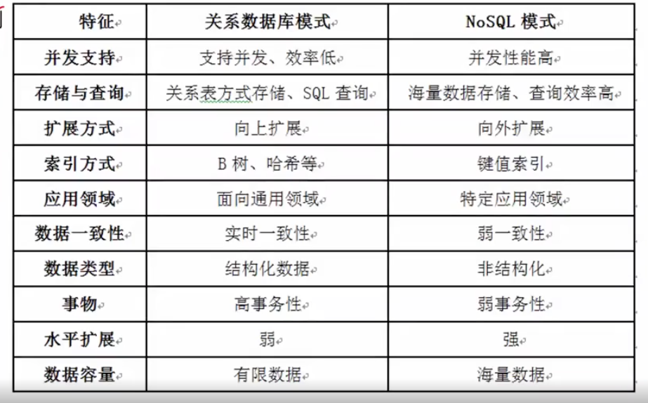
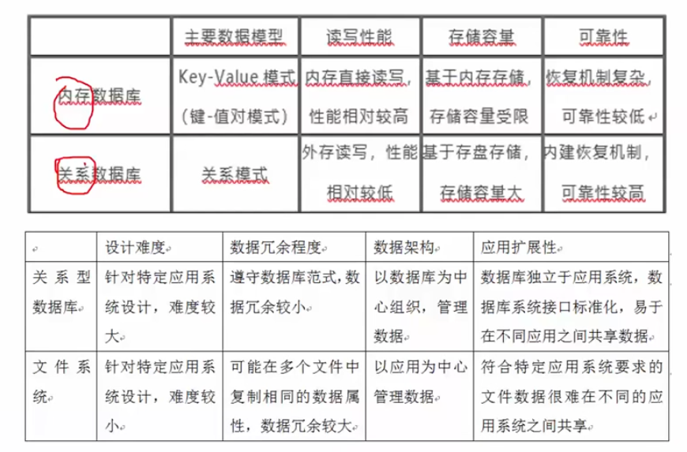
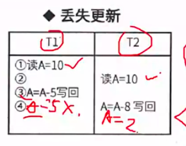
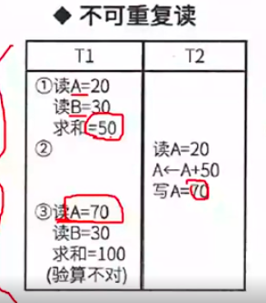
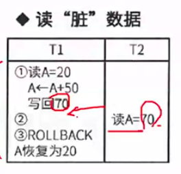
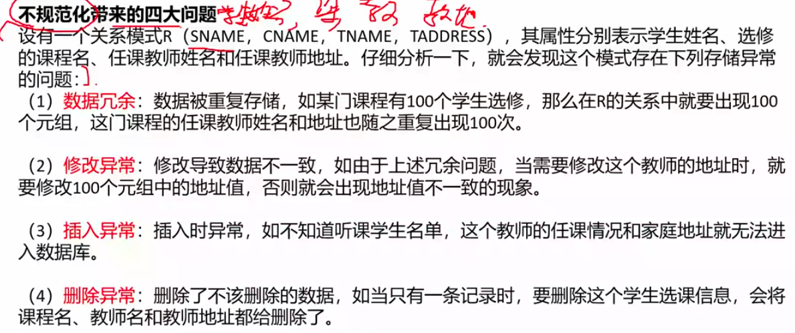

# ORM

即 object relational mapping，它在关系型数据库和对象之间作一个映射，这样我们在具体的操作数据库的时候就不需要再去和复杂的SQL语句打交道，只要像平时操作对象一样操作即可。

面向对象编程把所有实体看成对象，关系型数据库则是采用实体之间的关系连接数据。

ORM和对象的映射关系：

- 数据库的表映射为类
- 数据库的记录映射为对象
- 数据库的字段映射为对象属性

使用ORM的优点：

- 降低学习和开发成本
- 不用在编写sql来进行数据库操作
- 减少程序代码量
- 降低由于sql代码质量差而带来的影响

ORM缺点：

- 不太容易处理复杂查询语句
- 性能较直接使用sql差

# 数据库分类

## 关系型数据库

建立在关系模型基础上的数据库

## NoSQL

泛指非关系型的数据库。key-value形式。

NoSQL数据库的产生为了解决大规模数据集合多重数据种类带来的挑战，尤其是大数据库应用难题，包括超大规模数据的存储。

## 内存数据库

大多属于NoSQL

将数据库整体存储在内存中，提高性能。

### 缓存技术

- MemCache：MemCache是一个高性能的分布式的内存对象缓存系统，用于动态web应用以减轻数据库负载。MemCache通过在内存里维护一个统一的巨大的hash表。它能够用来存储各种格式的数据，包括图像、视频、文件以及数据库检索的结果等。
- Redis：Redis是一个开源的使用ANSI C语言编写、支持网络、可基于内存也可持久化的日志型key-value数据库，并提供多种语言的API

MemCache和Redis的对比：

- Redis和MemCache都是将数据放在内存中，都是内存数据库。他们都支持key-value数据类型。同时MemCache还可用于缓存其他东西，例如图片、视频等等，Redis还支持list、set、hash等数据结构的存储
- 在Redis中，并不是所有的数据都一直存储在内存中。这是和MemCache相比一个最大的区别。Redis可以将数据持久化到磁盘上
- Redis在很多方面支持数据库的特性，可以这样说他就是一个数据库系统，而MemCache只是简单的key-value缓存。

## 关系型数据库和NoSQL的对比

## 内存数据库和关系数据对比

# 并发控制

## 丢失更新

事务1对数据A进行了修改并写回，事务2也对A进行了修改并写回，此时事务2写回的数据会覆盖事务1写回的数据，就丢失了事务1对A的更新。即对数据A的更新会被覆盖。

## 不可重复读

在同一个事务中，两次读取到的值不一样。

事务1先读区A，，而后事务2也读区A同时对A进行了修改并写回。接着事务1再次读区A时发现数据和原来不一样。即一个事务重复读取A两次，但是数据不一样

## 读脏数据

事务1对数据A进行了修改后，事务2读取到了数据A，而后事务1进行了回滚，即数据A恢复了原来的值，但是事务2对读取到的A

值还是原来的即读到了脏数据。

## 读写锁

读锁可以重复添加，写锁不能。

读写锁不能同时存在。

上面的三种情况：

- T1先添加写锁，T2也是需要添加写锁，但是发现添加不上等待T1执行完成
- T1添加读锁，T2添加写锁但是发现添加不上，等待T1执行完成
- T1添加写锁，T2添加读锁添加不上，等待T1执行完毕

# 规范化

## 不规范化带来的四大问题

- 数据冗余
- 修改异常
- 插入异常
- 删除异常

## 反规范化技术

规范化设计后，解决了数据冗余、修改异常、插入异常、删除异常，但是查询的效率会有一定程度的降低。所以有了反规范化技术。

反规范化技术的益处：降低连接的需求、降低外码和索引的数据，还可能减少表的数据，能够提升查询效率。

可能带来的问题：数据重复存储，浪费了磁盘空间；可能出现数据的完整性问题，为了保证数据的一致性，增加了数据维护的复杂性，会降低修改速度。

具体方法：

- 增加冗余列
  - 在多个表中保留相同的列，增加数据冗余以减少或避免查询时的连接操作
- 增加派生列
  - 在表中增加由其他字段计算而来的数据列，比如年龄列可以由生日列计算而来，在查询时避免计算或使用函数
- 重新组表
  - 对于频繁需要查看的连接后的数据，可以把两个表重新组成一个新的表来减少连接提高性能
- 水平分割表
  - 把数据放到多个独立的表中，主要用于表数据规模很大、表中数据相对独立或者数据需要存放到多个介质上时使用
- 垂直分割表
  - 将主键与部分列放到一个表中，主键与其他列放到另一个表中，在查询时减少IO次数

# 分布式数据库

分布式数据库是由一组数据组成的，这组数据分布在计算机网络的不同计算机上，网络中的每个节点具有独立处理的能力（场地自治），同时每个节点也能通过网络通信子系统执行全局应用。分布式数据库系统是在集中式数据库系统技术的基础上发展起来的，具有如下特点：

- 数据独立性。在分布式数据库系统中，数据独立性这一特性更加重要，并具有更多的内容。除了数据的逻辑独立性与物理独立性外，还有数据分布独立性（分布透明性）
- 集中与自治共享结合的控制结构。各局部的DBMS可以独立地管理局部数据库，具有资质的功能。同时系统又设有集中控制机制，协调各局部DBMS的工作，执行全局应用
- 适当增加数据冗余度。在不同的场地存储同一数据的多个副本，这样，可以提高系统的可靠性和可用性，同时也能提高系统性能。
- 全局的一致性、可串行性和可复制性

## 分布式数据库优点

- 分布式数据库可以解决企业部分分散而数据需要相互联系的问题
- 如果企业需要增加新的相对自主的部门来扩充机构，则分布式数据库系统可以在对当前机构影响最小的情况下进行扩充
- 分布式数据库可以满足负载均衡的需要
- 当企业已存在几个数据库系统，而且实现全局应用的必要性增加时，就可以由这些数据库自下而上构成分布式数据库系统
- 相等规模的分布式数据库系统在出现故障的概率上不会比集中式数据库系统低，但由于其故障的影响仅局限于局部数据应用，因此就整个系统来说，它的可靠性是比较高的

# 数据仓库

数据仓库集成是把多种来源的数据集中在一起，建立数据仓库，所有数据都驻留在单个数据库服务器上，配置大型处理器和存储容量。数据仓库主要用于决策支持，在数据处理过程中强调分析。

## 特点

- 集成的数据
- 面向主题
- 数据相对稳定
- 包含历史信息

## 四个层次

- 数据源
  - 是数据仓库系统的基础，是整个系统的数据源泉
- 数据的存储与管理
  - 整个数据仓库系统的核心
- OLAP（联机分析处理）服务器
  - 对分析需要的数据进行有效集成，按多维模型组织，以便进行多角度、多层次的分析，并发现趋势
- 前端工具
  - 主要包括各种报表工具、查询工具、数据分析工具、数据挖掘工具以及各种基于数据仓库或数据集市的应用开发工具

## 商业智能

BI系统主要包括：数据预处理、建立数据仓库、数据分析和数据表现四个主要阶段