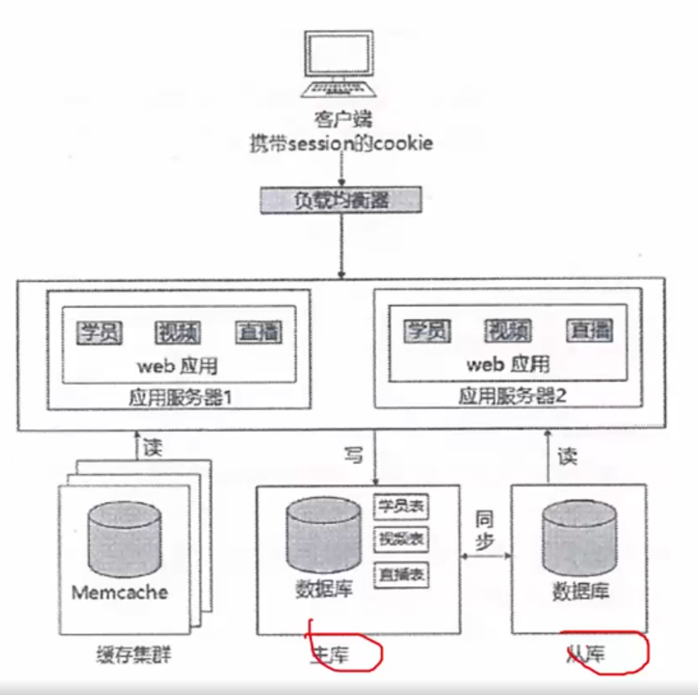

# 技术分类

#### 架构角度

MVC、MVP、MVVM、REST、Webservice、微服务

#### 缓存

MemCache、Redis

#### 并发分流

集群（负载均衡）、CDN

#### 数据库

主从（主从复制）、内存数据库、反规范化技术、NoSQL、分区（分表）技术、视图

#### 持久化

Hibernate、Mybatis

#### 分布式存储

Hadoop、FastDFS、区块链

#### 数据编码

XMl、JSOn

#### web应用服务器

Apache、Tomcat、JBOSS、IIS

#### 其他

有状态与无状态、响应式web设计

# WEB技术演变

## 从单台机器到数据库与web服务器分离

## 应用服务器集群

存在的问题：

- 用户的请求由谁来转发到具体的应用服务器
  - 使用负载均衡技术
    - http重定向、反向代理
    - CDN

- 用户如果每次访问到的服务器不一样，那么如何维护session的一致性。
  - 使用cookie

## 数据库集群

主从数据库

## 使用缓存缓解读取压力

# CDN

内容分发网络（Content Delivery Network）

CDN是构建网络之上的内容分发网络，依靠部署在各地的边缘服务器，通过中心平台的负载均衡、内容分发、调度等功能模块，使用户就近获取所需内容，降低网络拥塞，提高用户访问响应速度和命中率。CDN的关键技术主要有内容存储和分发技术。

CDN的基本原理是广泛采用各种缓存服务器，将这些缓存服务器分布到用户访问相对集中的地区或网络中，在用户访问网络时，利用全局负载技术将用户的访问指向距离最近的工作正常的缓存服务器上，由缓存服务器直接响应用户请求。

# REST

REST（Representational State Transfer，表述性状态转移）是一种只使用HTTP和XML进行基于Web通信的技术，可以降低开发的复杂度，提高系统的可伸缩性。

## 五个原则

- 网络上的所有事物都被抽象为资源
- 每个资源对应一个唯一的资源标识
- 通过通用的连接件接口对资源进行操作
- 对资源的各种操作不会改变资源标识
- 所有的操作都是无状态的

# 微服务

将大型复杂的单体架构应用划分为一组微小的服务，每个微服务根据其负责的具体业务职责提炼为单一的业务功能；每个服务可以很容器的部署并发布到生产环境里隔离和独立的进程内部，它可以很容易的扩展和变更；对于一个具体的服务来说可以采用任何适用的语言和工具来快速实现；服务之间基于基础设施互相协同工作。

## 优势

- 解决了复杂性问题。
  - 把庞大的单一模块应用分解为一系列的服务，同时保持总体功能不变
- 让每个服务能够独立开发
  - 开发者能够自由选择可行的技术，让服务来决定API约定
- 每个微服务都能独立配置
  - 开发者不必协调对于本地服务配置上的变化，这种变化一旦测试完成就被配置了
- 每个服务都可以独立调整
  - 可以给每个服务配置正好满足容量和可用性限制的实例数

## 带来的挑战

- 并非所有的系统都能转换为微服务
  - 例如一些底层操作是不推荐服务化的
- 部署较以往架构更加复杂
  - 众多微服务需要单独部署，从而增加部署的复杂度，容器技术能够解决这一问题
- 性能问题
  - 由于微服务注重独立性，互相通信时通过标准接口，可能产生延迟或调用出错。例如一个服务需要访问另一个服务的数据，只能通过服务间接口来进行数据传输，如果是频繁访问，则可能带来较大的延迟
- 数据一致性问题
  - 作为分布式部署的微服务，在保持数据一致性方面需要比传统架构更加困难