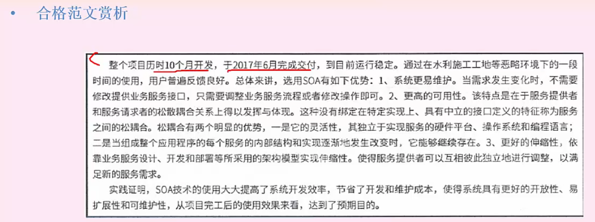
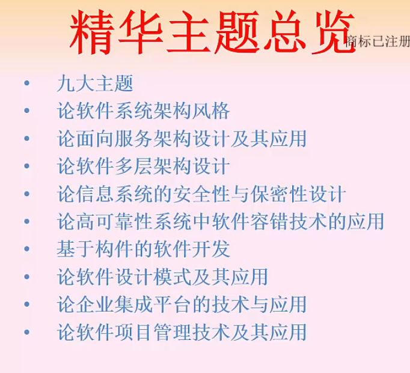

# 写作原则

共2600字，可以按照下面的块进行拆分。四选一 120分钟。

## 题目类型：

- 系统建模
- **软件架构设计**
  - 软件架构风格
  - 面向服务的架构
  - ABSD
  - 架构评估
    - 质量属性
  - SOA
- 系统分析与设计
- 系统可靠性分析与设计
  - 容错
  - 冗余
- 系统安全性和保密性设计
  - 对称加密和非对称加密
  - 数字签名认证
- 项目管理
  - 质量管理
  - 风险管理

## 模块拆分

摘要 300字

- 复用
- 具体技术

项目背景 400-500字

- 两段式

正文 1500字

- 问题1 300-400字
- 问题2 1100字

结尾 300-400字

# 写论文

选择中大型商业项目，金额在200w以上，研发周期在十个月以上的项目。

政府或大型信息系统项目：国企、事业单位、军方、医院、银行、股份公司大企业的ERP、OA等；云计算、大数据等各种软件及信息系统。

## 摘要

项目背景：

岗位职责：我在该系统中担任系统架构师岗位并承担系统架构设计工作。

总概：

## 正文

### 背景介绍

两段式：

- 背景、开发原因、时间周期、金额、自己的岗位职责做了什么事情
- 自己项目的模块简要介绍

### 相关问题回应

回答子问题1，回答纯理论东西。比如架构风格：介绍有哪些架构风格及其特点引出主体内容（核心内容）

### 主体内容

结合自己实际项目说明如何应用这个技术的

### 论文结尾

两段式

- 项目上线了。运行效果、用户反馈
- 项目不足总结及其如何解决迭代

# 真题分析

## 系统架构风格

### 摘要

### 项目背景

两段式

#### 通用背景信息模版

#### 项目子系统简要介绍

### 正文

提前写写，这样可以梳理好自己项目要准备的技术点，可以应用在不同题目中。

### 结尾

## 架构设计及其应用

# 九大论文主题

